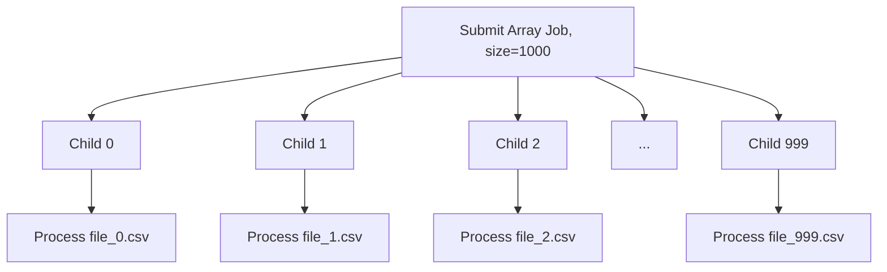

# How to Use AWS Batch Array Jobs for Parallel Processing

Author: [nawazdhandala](https://github.com/nawazdhandala)

Tags: AWS, Batch, Array Jobs, Parallel Processing, Distributed Computing, HPC

Description: Learn how to use AWS Batch array jobs to run thousands of parallel tasks efficiently with a single job submission and dynamic index-based work distribution.

---

When you have thousands of independent tasks to run - processing files, running parameter sweeps, rendering frames, or transforming datasets - submitting each one as a separate job is slow and cumbersome. AWS Batch array jobs let you submit a single job that fans out into thousands of child tasks, each identified by a unique index. Your container code uses that index to figure out which chunk of work to handle.

This is one of the most powerful features of AWS Batch, and surprisingly underused.

## What Are Array Jobs?

An array job is a single job submission that creates multiple child jobs. Each child job runs the same container image but gets a unique environment variable called `AWS_BATCH_JOB_ARRAY_INDEX` (ranging from 0 to N-1, where N is the array size). Your code reads this index and uses it to determine which slice of work to process.



Each child job runs independently. They can run in parallel (limited only by your compute environment capacity) or sequentially if resources are constrained.

## When to Use Array Jobs

Array jobs are perfect when:

- You have a list of items to process independently (files, records, parameters)
- Each task uses the same code but different input
- Tasks do not need to communicate with each other
- You want to track progress across all tasks as a group

They are not the right fit when tasks need to communicate (use multi-node parallel jobs instead) or when each task needs a completely different configuration.

## Step 1: Set Up the Job Definition

The job definition for an array job looks the same as any other Batch job definition. The array-specific configuration happens at submission time.

```bash
# Register a job definition for parallel file processing
aws batch register-job-definition \
  --job-definition-name file-processor \
  --type container \
  --container-properties '{
    "image": "123456789012.dkr.ecr.us-east-1.amazonaws.com/file-processor:latest",
    "resourceRequirements": [
      {"type": "VCPU", "value": "2"},
      {"type": "MEMORY", "value": "4096"}
    ],
    "environment": [
      {"name": "S3_BUCKET", "value": "my-data-bucket"},
      {"name": "S3_PREFIX", "value": "input/"}
    ],
    "logConfiguration": {
      "logDriver": "awslogs",
      "options": {
        "awslogs-group": "/aws/batch/file-processor",
        "awslogs-stream-prefix": "array"
      }
    }
  }'
```

## Step 2: Submit an Array Job

Use the `--array-properties` flag to specify the array size.

```bash
# Submit an array job with 1000 child tasks
aws batch submit-job \
  --job-name process-daily-files \
  --job-queue my-job-queue \
  --job-definition file-processor \
  --array-properties size=1000
```

That is it. One command creates 1000 child jobs. The maximum array size is 10,000.

## Step 3: Write Index-Aware Container Code

Your container needs to read the `AWS_BATCH_JOB_ARRAY_INDEX` environment variable and use it to select its work.

```python
import os
import boto3
import json

def main():
    # Get the array index for this child job
    array_index = int(os.environ.get('AWS_BATCH_JOB_ARRAY_INDEX', 0))

    # Configuration
    bucket = os.environ['S3_BUCKET']
    prefix = os.environ['S3_PREFIX']

    s3 = boto3.client('s3')

    # Strategy 1: Use the index to pick a specific file
    # If files are named sequentially (file_000.csv, file_001.csv, etc.)
    file_key = f"{prefix}file_{array_index:04d}.csv"

    print(f"Array index {array_index}: Processing {file_key}")

    # Download and process the file
    local_path = f"/tmp/input_{array_index}.csv"
    s3.download_file(bucket, file_key, local_path)

    result = process_file(local_path)

    # Upload results
    output_key = f"output/result_{array_index:04d}.json"
    s3.put_object(
        Bucket=bucket,
        Key=output_key,
        Body=json.dumps(result)
    )

    print(f"Array index {array_index}: Done. Output at {output_key}")


def process_file(path):
    """Your actual processing logic here"""
    # Read CSV, transform data, run calculations, etc.
    import csv
    row_count = 0
    with open(path, 'r') as f:
        reader = csv.reader(f)
        for row in reader:
            row_count += 1
    return {"rows_processed": row_count}


if __name__ == '__main__':
    main()
```

## Strategy: Manifest-Based Work Distribution

If your files are not named sequentially, use a manifest file that maps array indices to actual work items.

```python
import os
import boto3
import json

def main():
    array_index = int(os.environ.get('AWS_BATCH_JOB_ARRAY_INDEX', 0))
    bucket = os.environ['S3_BUCKET']

    s3 = boto3.client('s3')

    # Download the manifest that lists all files to process
    manifest_obj = s3.get_object(Bucket=bucket, Key='manifests/job-manifest.json')
    manifest = json.loads(manifest_obj['Body'].read())

    # Each entry in the manifest corresponds to an array index
    if array_index >= len(manifest):
        print(f"Index {array_index} exceeds manifest length {len(manifest)}. Nothing to do.")
        return

    work_item = manifest[array_index]
    file_key = work_item['file_key']
    parameters = work_item.get('parameters', {})

    print(f"Index {array_index}: Processing {file_key} with params {parameters}")

    # Process the work item
    process_work_item(s3, bucket, file_key, parameters)
```

Create the manifest before submitting the array job:

```python
import boto3
import json

def create_manifest_and_submit():
    s3 = boto3.client('s3')
    batch = boto3.client('batch')

    # List all files to process
    paginator = s3.get_paginator('list_objects_v2')
    files = []
    for page in paginator.paginate(Bucket='my-data-bucket', Prefix='input/'):
        for obj in page.get('Contents', []):
            files.append({
                'file_key': obj['Key'],
                'parameters': {'threshold': 0.5}
            })

    # Upload the manifest
    s3.put_object(
        Bucket='my-data-bucket',
        Key='manifests/job-manifest.json',
        Body=json.dumps(files)
    )

    # Submit array job with size matching the manifest
    response = batch.submit_job(
        jobName='manifest-processing',
        jobQueue='my-job-queue',
        jobDefinition='file-processor',
        arrayProperties={'size': len(files)}
    )

    print(f"Submitted array job {response['jobId']} with {len(files)} tasks")
```

## Handling Failures with Retry Strategies

Array jobs support per-child retry strategies. If one child fails, only that child retries, not the entire array.

```bash
# Submit with retry strategy - each child retries up to 3 times
aws batch submit-job \
  --job-name resilient-processing \
  --job-queue my-job-queue \
  --job-definition file-processor \
  --array-properties size=1000 \
  --retry-strategy '{
    "attempts": 3,
    "evaluateOnExit": [
      {
        "onStatusReason": "Host EC2*",
        "action": "RETRY"
      },
      {
        "onExitCode": "1",
        "action": "RETRY"
      },
      {
        "onExitCode": "0",
        "action": "EXIT"
      }
    ]
  }'
```

## Combining Array Jobs with Dependencies

You can chain array jobs with dependencies. For example, run all processing tasks first, then run an aggregation job when every child completes.

```bash
# Step 1: Submit the array processing job
PROCESSING_JOB_ID=$(aws batch submit-job \
  --job-name process-step \
  --job-queue my-job-queue \
  --job-definition file-processor \
  --array-properties size=1000 \
  --query 'jobId' --output text)

# Step 2: Submit an aggregation job that depends on all array children completing
aws batch submit-job \
  --job-name aggregate-step \
  --job-queue my-job-queue \
  --job-definition aggregator \
  --depends-on "jobId=$PROCESSING_JOB_ID,type=N_TO_N"
```

The `type=N_TO_N` dependency means the aggregation job waits for all children of the array to complete. For more on job dependencies, see our post on [configuring AWS Batch job dependencies](https://oneuptime.com/blog/post/2026-02-12-configure-aws-batch-job-dependencies/view).

## Monitoring Array Job Progress

```bash
# List all child jobs and their statuses
aws batch list-jobs \
  --array-job-id <parent-job-id> \
  --job-status SUCCEEDED \
  --query 'jobSummaryList | length(@)'

# Get a summary of all states
for status in SUBMITTED PENDING RUNNABLE STARTING RUNNING SUCCEEDED FAILED; do
  count=$(aws batch list-jobs --array-job-id <parent-job-id> --job-status $status --query 'jobSummaryList | length(@)' --output text)
  echo "$status: $count"
done
```

For comprehensive monitoring, see [monitoring AWS Batch jobs with CloudWatch](https://oneuptime.com/blog/post/2026-02-12-monitor-aws-batch-jobs-with-cloudwatch/view).

## Performance Tips

- **Right-size your compute environment** - Set maxvCpus high enough to run many children in parallel. If your array has 1000 tasks and each needs 2 vCPUs, you want at least a few hundred vCPUs available.
- **Use BEST_FIT_PROGRESSIVE allocation** - This packs multiple small containers onto larger instances, reducing per-job overhead.
- **Pre-stage data** - If all children need access to common reference data, download it once to a shared filesystem rather than having each child download it from S3.
- **Keep child tasks between 5 minutes and 2 hours** - Too short and you spend more time launching than working. Too long and a failure wastes significant compute.

## Wrapping Up

Array jobs are the simplest way to run embarrassingly parallel workloads on AWS. One submission, thousands of parallel tasks, automatic scaling, and per-child retry handling. Whether you are processing files, running simulations with different parameters, or rendering video frames, array jobs should be your first choice before reaching for more complex orchestration tools.
