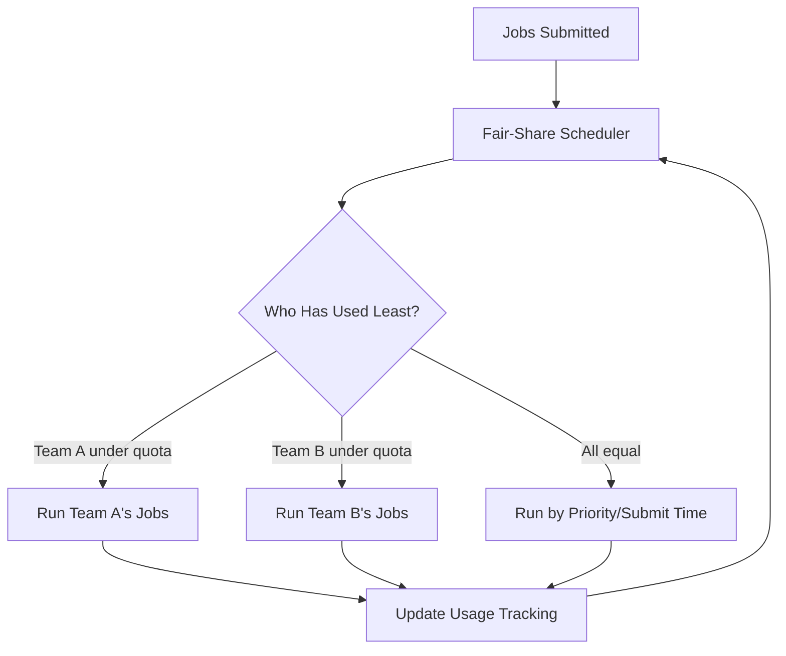

# How to Use AWS Batch Fair-Share Scheduling

Author: [nawazdhandala](https://github.com/nawazdhandala)

Tags: AWS, Batch, Fair-Share Scheduling, Job Scheduling, Multi-Tenant, Resource Management

Description: Learn how to configure AWS Batch fair-share scheduling policies to distribute compute resources equitably across teams, projects, and workload priorities.

---

When multiple teams or projects share an AWS Batch compute environment, whoever submits jobs first gets all the resources. That is fine when usage is light, but when the queue fills up, one team can easily monopolize the entire cluster while others wait. Fair-share scheduling fixes this by distributing compute resources based on policies you define.

With fair-share scheduling, you can guarantee that Team A gets at least 40% of resources, Team B gets 30%, and Team C gets 30%, regardless of who submits jobs first. If one team is not using their share, others can use the surplus.

## How Fair-Share Scheduling Works

AWS Batch fair-share scheduling replaces the default FIFO (first-in, first-out) job ordering with a policy-based approach. Instead of running jobs in the order they were submitted, Batch looks at how much compute each "share identifier" (team, project, user) has consumed recently and prioritizes jobs from under-served groups.



The scheduler tracks compute usage over a configurable time window (the "share decay seconds") and adjusts priorities accordingly. Recent usage counts more than older usage, so the system naturally balances over time.

## Step 1: Create a Scheduling Policy

```bash
# Create a fair-share scheduling policy
aws batch create-scheduling-policy \
  --name multi-team-policy \
  --fairshare-policy '{
    "shareDecaySeconds": 3600,
    "computeReservation": 10,
    "shareDistribution": [
      {
        "shareIdentifier": "team-ml",
        "weightFactor": 0.4
      },
      {
        "shareIdentifier": "team-analytics",
        "weightFactor": 0.3
      },
      {
        "shareIdentifier": "team-research",
        "weightFactor": 0.3
      }
    ]
  }'
```

Let me break down each parameter:

- **shareDecaySeconds: 3600** - The time window over which usage is tracked. After 3600 seconds (1 hour), past usage decays by half. This means the scheduler "forgets" old usage gradually. Set it longer for more stable sharing, shorter for more responsive balancing.

- **computeReservation: 10** - Reserves 10% of compute capacity for share identifiers that have not recently used any resources. This ensures that even if the cluster is fully loaded by one team, a new team can get capacity quickly without waiting for the full decay cycle.

- **shareDistribution** - Defines the share identifiers and their weight. A weight of 0.4 means that identifier should get 40% of resources when all groups are active.

## Step 2: Create a Job Queue with the Scheduling Policy

```bash
# Create a job queue that uses the fair-share policy
aws batch create-job-queue \
  --job-queue-name shared-queue \
  --state ENABLED \
  --priority 10 \
  --scheduling-policy-arn arn:aws:batch:us-east-1:123456789012:scheduling-policy/multi-team-policy \
  --compute-environment-order '[
    {"order": 1, "computeEnvironment": "shared-compute-env"}
  ]'
```

## Step 3: Submit Jobs with Share Identifiers

When submitting jobs, each team uses their share identifier.

```bash
# Team ML submits a training job
aws batch submit-job \
  --job-name ml-training-001 \
  --job-queue shared-queue \
  --job-definition ml-training-def \
  --share-identifier team-ml \
  --scheduling-priority-override 50

# Team Analytics submits a data processing job
aws batch submit-job \
  --job-name analytics-etl-001 \
  --job-queue shared-queue \
  --job-definition etl-def \
  --share-identifier team-analytics \
  --scheduling-priority-override 50

# Team Research submits a simulation job
aws batch submit-job \
  --job-name research-sim-001 \
  --job-queue shared-queue \
  --job-definition simulation-def \
  --share-identifier team-research \
  --scheduling-priority-override 50
```

The `--scheduling-priority-override` is an additional priority within the same share identifier. Higher values run first within the same team's jobs.

## Priority Within Share Groups

Within each share identifier, you can use the scheduling priority to differentiate between urgent and background jobs.

```bash
# High-priority production job for team-analytics
aws batch submit-job \
  --job-name prod-report \
  --job-queue shared-queue \
  --job-definition report-def \
  --share-identifier team-analytics \
  --scheduling-priority-override 100

# Low-priority experimental job for team-analytics
aws batch submit-job \
  --job-name experiment-42 \
  --job-queue shared-queue \
  --job-definition experiment-def \
  --share-identifier team-analytics \
  --scheduling-priority-override 10
```

The production report runs before the experiment, but both jobs share the same team-analytics allocation.

## Real-World Example: ML Platform

Here is a more realistic setup for an ML platform serving multiple teams.

```bash
# Create a scheduling policy for an ML platform
aws batch create-scheduling-policy \
  --name ml-platform-policy \
  --fairshare-policy '{
    "shareDecaySeconds": 7200,
    "computeReservation": 15,
    "shareDistribution": [
      {
        "shareIdentifier": "production",
        "weightFactor": 0.5
      },
      {
        "shareIdentifier": "development",
        "weightFactor": 0.3
      },
      {
        "shareIdentifier": "experimentation",
        "weightFactor": 0.2
      }
    ]
  }'
```

In this setup:
- **Production** (50%) - Scheduled training runs, model retraining pipelines, inference batch jobs
- **Development** (30%) - Developers testing new models, debugging training code
- **Experimentation** (20%) - Hyperparameter sweeps, architecture exploration, research

When production is not running (like overnight), development and experimentation can use all the resources. When production ramps up, it gets priority up to its 50% share.

## Programmatic Job Submission with Team Routing

Build a wrapper that automatically sets the share identifier based on who is submitting.

```python
import boto3
import os

batch = boto3.client('batch')

# Map users/teams to share identifiers
TEAM_MAPPING = {
    'ml-team': 'team-ml',
    'analytics': 'team-analytics',
    'research': 'team-research',
}

PRIORITY_MAPPING = {
    'critical': 100,
    'high': 75,
    'normal': 50,
    'low': 25,
    'background': 1,
}

def submit_job(job_name, job_definition, team, priority='normal', **kwargs):
    """Submit a job with automatic fair-share routing"""
    share_id = TEAM_MAPPING.get(team)
    if not share_id:
        raise ValueError(f"Unknown team: {team}. Valid teams: {list(TEAM_MAPPING.keys())}")

    sched_priority = PRIORITY_MAPPING.get(priority, 50)

    params = {
        'jobName': job_name,
        'jobQueue': 'shared-queue',
        'jobDefinition': job_definition,
        'shareIdentifier': share_id,
        'schedulingPriorityOverride': sched_priority,
    }

    if kwargs.get('environment'):
        params['containerOverrides'] = {
            'environment': [{'name': k, 'value': v} for k, v in kwargs['environment'].items()]
        }

    if kwargs.get('array_size'):
        params['arrayProperties'] = {'size': kwargs['array_size']}

    response = batch.submit_job(**params)
    print(f"Submitted {job_name} for {team} (priority: {priority}): {response['jobId']}")
    return response['jobId']


# Usage
submit_job('daily-etl', 'etl-def', team='analytics', priority='high',
           environment={'DATE': '2026-02-12'})

submit_job('hp-sweep', 'training-def', team='ml-team', priority='normal',
           array_size=100,
           environment={'SWEEP_ID': 'sweep-42'})
```

## Monitoring Fair-Share Behavior

Check how resources are being distributed across share identifiers.

```bash
# See all jobs in the queue grouped by share identifier
for sid in team-ml team-analytics team-research; do
  echo "=== $sid ==="
  running=$(aws batch list-jobs --job-queue shared-queue --job-status RUNNING \
    --query "jobSummaryList[?shareIdentifier=='$sid'] | length(@)" --output text 2>/dev/null || echo "0")
  pending=$(aws batch list-jobs --job-queue shared-queue --job-status RUNNABLE \
    --query "jobSummaryList[?shareIdentifier=='$sid'] | length(@)" --output text 2>/dev/null || echo "0")
  echo "  Running: $running, Pending: $pending"
done
```

For broader monitoring, see our guide on [monitoring AWS Batch with CloudWatch](https://oneuptime.com/blog/post/2026-02-12-monitor-aws-batch-jobs-with-cloudwatch/view).

## Tuning the Scheduling Policy

### Share Decay Seconds

- **Short (600-1800)** - Responsive balancing. If one team bursts, they quickly lose priority. Good for latency-sensitive workloads.
- **Medium (3600-7200)** - Balanced approach. Good for most mixed workloads.
- **Long (14400-86400)** - Stable, long-term fair sharing. Good when teams have consistent daily patterns.

### Compute Reservation

- **0%** - No reservation. New share identifiers have to wait for the decay cycle.
- **10-20%** - Small reservation ensures new or idle teams can start jobs quickly.
- **30%+** - Large reservation. Use if rapid response for idle teams is critical.

## Limits and Considerations

- A single scheduling policy can have up to 500 share identifiers
- A job queue can have at most one scheduling policy
- Fair-share scheduling works across all compute environments in the queue
- Share identifiers are strings. You can use any naming convention (team names, project IDs, user emails)
- Jobs without a share identifier use a "default" identifier

## Wrapping Up

Fair-share scheduling transforms AWS Batch from a simple job queue into a multi-tenant compute platform. Instead of first-come-first-served, resources are distributed based on defined policies that respect team allocations while allowing surplus sharing. For any organization where multiple teams share Batch compute, this is the right way to prevent resource monopolization and ensure everyone gets their fair share of GPU and CPU time.
