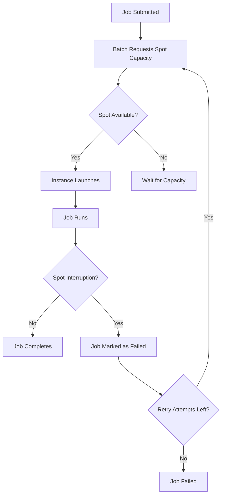

# How to Use AWS Batch with Spot Instances for Cost Savings

Author: [nawazdhandala](https://github.com/nawazdhandala)

Tags: AWS, Batch, Spot Instances, Cost Optimization, EC2, Cloud Computing

Description: A practical guide to using AWS Batch with EC2 Spot Instances to reduce compute costs by up to 90% for fault-tolerant batch processing workloads.

---

If you are running batch workloads on AWS and not using Spot Instances, you are probably overpaying by 60-90%. Spot Instances let you use spare EC2 capacity at a fraction of the On-Demand price. The catch is that AWS can reclaim them with two minutes notice. But for batch jobs that can handle interruption - and most can - the savings are massive.

AWS Batch makes Spot integration straightforward. You configure it at the compute environment level and Batch handles the rest: requesting Spot capacity, running your jobs, and dealing with interruptions.

## How Spot Instances Work with Batch

When you create a Spot compute environment in AWS Batch, the service uses EC2 Spot Fleet or EC2 Fleet under the hood to request instances. When jobs are submitted, Batch scales up by requesting Spot capacity. When a Spot Instance is reclaimed, Batch detects it, marks the affected job for retry (if configured), and requests replacement capacity.



## Step 1: Create a Spot Compute Environment

```bash
# Create a managed Spot compute environment
aws batch create-compute-environment \
  --compute-environment-name spot-compute-env \
  --type MANAGED \
  --compute-resources '{
    "type": "SPOT",
    "allocationStrategy": "SPOT_CAPACITY_OPTIMIZED",
    "minvCpus": 0,
    "maxvCpus": 1024,
    "instanceTypes": [
      "m5.xlarge", "m5.2xlarge", "m5.4xlarge",
      "m5a.xlarge", "m5a.2xlarge", "m5a.4xlarge",
      "m6i.xlarge", "m6i.2xlarge", "m6i.4xlarge",
      "c5.xlarge", "c5.2xlarge", "c5.4xlarge",
      "c5a.xlarge", "c5a.2xlarge", "c5a.4xlarge",
      "r5.xlarge", "r5.2xlarge", "r5.4xlarge"
    ],
    "subnets": ["subnet-0abc123", "subnet-0def456", "subnet-0ghi789"],
    "securityGroupIds": ["sg-0abc123"],
    "instanceRole": "arn:aws:iam::123456789012:instance-profile/ecsInstanceRole",
    "spotIamFleetRole": "arn:aws:iam::123456789012:role/AmazonEC2SpotFleetRole",
    "bidPercentage": 100
  }' \
  --service-role arn:aws:iam::123456789012:role/AWSBatchServiceRole \
  --state ENABLED
```

Several things are intentional here:

- **allocationStrategy: SPOT_CAPACITY_OPTIMIZED** - This is the most important setting. It tells Batch to pick instance types from the pools with the most available capacity, which reduces the chance of interruption. Do not use BEST_FIT for Spot - it picks the cheapest instance but that pool is often the most contested.
- **Wide instance type selection** - The more instance types you list, the more Spot pools Batch can draw from. This dramatically reduces interruption rates.
- **Multiple subnets** - Each subnet is in a different AZ, giving Batch access to capacity across the region.
- **bidPercentage: 100** - This means you are willing to pay up to 100% of On-Demand price. In practice, Spot prices are usually 60-90% below On-Demand, but setting this ensures you never miss capacity because of a price cap.

## Step 2: Create a Mixed Job Queue

For production pipelines, use both Spot and On-Demand compute environments in the same queue. Batch tries Spot first and falls back to On-Demand.

```bash
# Create an On-Demand compute environment as fallback
aws batch create-compute-environment \
  --compute-environment-name ondemand-compute-env \
  --type MANAGED \
  --compute-resources '{
    "type": "EC2",
    "allocationStrategy": "BEST_FIT_PROGRESSIVE",
    "minvCpus": 0,
    "maxvCpus": 256,
    "instanceTypes": ["m5", "m6i", "c5", "c6i"],
    "subnets": ["subnet-0abc123", "subnet-0def456"],
    "securityGroupIds": ["sg-0abc123"],
    "instanceRole": "arn:aws:iam::123456789012:instance-profile/ecsInstanceRole"
  }' \
  --service-role arn:aws:iam::123456789012:role/AWSBatchServiceRole \
  --state ENABLED

# Create a job queue that prefers Spot but falls back to On-Demand
aws batch create-job-queue \
  --job-queue-name cost-optimized-queue \
  --state ENABLED \
  --priority 10 \
  --compute-environment-order '[
    {"order": 1, "computeEnvironment": "spot-compute-env"},
    {"order": 2, "computeEnvironment": "ondemand-compute-env"}
  ]'
```

Batch tries compute environments in order. It only moves to order 2 if order 1 cannot provide the required capacity.

## Step 3: Configure Retry Strategies for Interruptions

When a Spot Instance gets reclaimed, the job running on it fails with a specific status reason. Configure retries to handle this automatically.

```bash
# Register a job definition with Spot-aware retry strategy
aws batch register-job-definition \
  --job-definition-name spot-resilient-job \
  --type container \
  --container-properties '{
    "image": "123456789012.dkr.ecr.us-east-1.amazonaws.com/processor:latest",
    "resourceRequirements": [
      {"type": "VCPU", "value": "4"},
      {"type": "MEMORY", "value": "8192"}
    ]
  }' \
  --retry-strategy '{
    "attempts": 5,
    "evaluateOnExit": [
      {
        "onStatusReason": "Host EC2*",
        "action": "RETRY"
      },
      {
        "onStatusReason": "Cannot pull container*",
        "action": "RETRY"
      },
      {
        "onReason": "*spot*",
        "action": "RETRY"
      },
      {
        "onExitCode": "0",
        "action": "EXIT"
      },
      {
        "action": "EXIT"
      }
    ]
  }'
```

The `Host EC2*` status reason matches Spot interruptions and other host-level failures. The retry strategy gives the job 5 attempts, so even if it gets interrupted multiple times, it keeps trying.

## Step 4: Make Your Jobs Interruption-Tolerant

The best Spot strategy is not just about AWS configuration. Your job code needs to handle interruptions gracefully.

```python
import os
import json
import boto3
import signal
import sys

s3 = boto3.client('s3')
CHECKPOINT_BUCKET = os.environ.get('CHECKPOINT_BUCKET', 'my-checkpoint-bucket')
JOB_ID = os.environ.get('AWS_BATCH_JOB_ID', 'local')

def save_checkpoint(state):
    """Save processing state to S3 so we can resume after interruption"""
    s3.put_object(
        Bucket=CHECKPOINT_BUCKET,
        Key=f'checkpoints/{JOB_ID}.json',
        Body=json.dumps(state)
    )
    print(f"Checkpoint saved: processed {state['items_processed']} items")

def load_checkpoint():
    """Try to load a checkpoint from a previous run"""
    try:
        obj = s3.get_object(
            Bucket=CHECKPOINT_BUCKET,
            Key=f'checkpoints/{JOB_ID}.json'
        )
        state = json.loads(obj['Body'].read())
        print(f"Resuming from checkpoint: {state['items_processed']} items already done")
        return state
    except s3.exceptions.NoSuchKey:
        return {'items_processed': 0, 'last_offset': 0}

def handle_sigterm(signum, frame):
    """Handle SIGTERM gracefully - save checkpoint before exit"""
    print("Received SIGTERM (likely Spot interruption). Saving checkpoint...")
    save_checkpoint(current_state)
    sys.exit(0)

# Register signal handler for graceful shutdown
signal.signal(signal.SIGTERM, handle_sigterm)

# Main processing loop
current_state = load_checkpoint()
items = load_work_items()

for i in range(current_state['items_processed'], len(items)):
    process_item(items[i])
    current_state['items_processed'] = i + 1
    current_state['last_offset'] = i

    # Checkpoint every 100 items
    if (i + 1) % 100 == 0:
        save_checkpoint(current_state)

print(f"Done! Processed {current_state['items_processed']} items total")
```

Key patterns here:

- **Checkpointing to S3** - Save progress periodically so you can resume after interruption instead of starting over
- **SIGTERM handler** - AWS sends SIGTERM before terminating Spot Instances. Use this signal to save your state
- **Idempotent processing** - Make sure reprocessing an item does not cause duplicates or errors

## Cost Comparison

Here is what typical savings look like for a batch processing workload:

| Configuration | Monthly Cost | Savings |
|---|---|---|
| On-Demand only (m5.2xlarge) | $5,000 | Baseline |
| Spot only (mixed instances) | $800 | 84% |
| Mixed (Spot primary, On-Demand fallback) | $1,200 | 76% |

The mixed approach costs slightly more but gives you guaranteed capacity for time-sensitive jobs.

## Spot Instance Best Practices for Batch

1. **Use SPOT_CAPACITY_OPTIMIZED** - Always. It picks from the deepest pools.
2. **Diversify instance types** - List at least 10-15 types across multiple families and sizes.
3. **Use multiple AZs** - More AZs means more capacity pools.
4. **Set bidPercentage to 100** - Spot prices rarely approach On-Demand, and a low cap just means you lose capacity.
5. **Implement checkpointing** - For jobs longer than 10 minutes, save progress so interruptions cost minutes, not hours.
6. **Use retry strategies** - At least 3 attempts for any Spot workload.
7. **Keep jobs short** - Break long-running work into smaller chunks. A 10-minute job has much less to lose than a 10-hour job.

## Monitoring Spot Usage

Track your Spot savings and interruption rates.

```bash
# Check Spot Instance interruption notices in the last 24 hours
aws ec2 describe-spot-instance-requests \
  --filters "Name=state,Values=closed" "Name=status-code,Values=instance-terminated-by-price,instance-terminated-by-service,instance-terminated-no-capacity" \
  --query 'SpotInstanceRequests[?CreateTime>=`2026-02-11`].{Id:InstanceId,Status:Status.Code,Time:Status.UpdateTime}'
```

For comprehensive job monitoring, see [monitoring AWS Batch with CloudWatch](https://oneuptime.com/blog/post/2026-02-12-monitor-aws-batch-jobs-with-cloudwatch/view).

## Wrapping Up

Using Spot Instances with AWS Batch is one of the easiest wins for reducing cloud costs. The setup is minimal - specify SPOT as your compute type, diversify your instance types, add retry strategies, and make your code checkpoint-friendly. For most batch workloads, you will see 60-90% cost reduction with minimal impact on job completion times.
