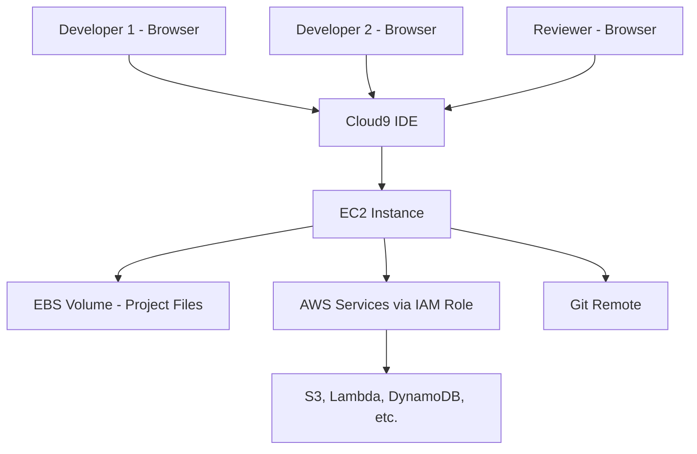

# How to Use AWS Cloud9 IDE for Collaborative Development

Author: [nawazdhandala](https://github.com/nawazdhandala)

Tags: AWS, Cloud9, IDE, Development, Collaboration, Remote Development

Description: Learn how to set up and use AWS Cloud9 IDE for collaborative cloud development with shared environments, real-time editing, and built-in terminal access.

---

Setting up local development environments is one of those time sinks that every team deals with but nobody enjoys. Different operating systems, different versions of tools, dependency conflicts, and the classic "it works on my machine" problem. AWS Cloud9 sidesteps all of this by giving you a cloud-based IDE that runs in your browser, backed by an EC2 instance or your own server. Everyone on the team gets the same environment, and you can even share environments for real-time pair programming.

This guide covers setting up Cloud9 environments, configuring them for your workflow, and using the collaboration features effectively.

## What Is AWS Cloud9?

Cloud9 is a cloud-based integrated development environment (IDE) that provides:

- A code editor with syntax highlighting, code completion, and debugging
- A built-in terminal with AWS CLI pre-installed and configured
- Real-time collaborative editing (like Google Docs for code)
- Direct integration with AWS services
- Support for 40+ programming languages

The IDE runs in your browser, and the actual compute and storage happen on an EC2 instance in your AWS account. You can choose the instance size based on your workload needs.

## Prerequisites

- An AWS account
- IAM user or SSO access with permissions for Cloud9 and EC2
- A modern web browser (Chrome, Firefox, Safari, or Edge)

## Step 1: Create a Cloud9 Environment

You can create environments through the console or CLI:

```bash
# Create a Cloud9 environment with a t3.small instance
aws cloud9 create-environment-ec2 \
  --name "team-dev-environment" \
  --description "Shared development environment for the backend team" \
  --instance-type t3.small \
  --image-id amazonlinux-2023-x86_64 \
  --subnet-id subnet-abc123 \
  --automatic-stop-time-minutes 30 \
  --owner-arn arn:aws:iam::123456789012:user/developer1 \
  --tags Key=Team,Value=backend,Key=Environment,Value=development
```

Key parameters:

- **instance-type**: Choose based on your workload. t3.small works for most development. Use larger instances for builds or data processing.
- **automatic-stop-time-minutes**: The instance stops after this many minutes of IDE inactivity. This saves costs. 30 minutes is a good default.
- **image-id**: The base AMI. amazonlinux-2023 comes with most development tools pre-installed.

## Step 2: Configure the Environment

Once the environment is created, open it in your browser. Cloud9 gives you a familiar IDE layout with a file tree, editor panes, and a terminal at the bottom.

First, customize the environment settings. In the Cloud9 menu, go to AWS Cloud9 > Preferences and configure:

- **Soft tabs**: Set to your team's preferred indentation (2 or 4 spaces)
- **Theme**: Dark or light theme based on preference
- **Key bindings**: Choose Vim, Emacs, Sublime, or default
- **Auto-save**: Enable to avoid losing work

Next, install your project's dependencies:

```bash
# Update the system packages
sudo yum update -y

# Install Node.js LTS (if not already present)
nvm install --lts
nvm use --lts

# Install Python virtual environment tools
python3 -m pip install --user virtualenv

# Install Docker (Cloud9 on Amazon Linux 2023 has Docker available)
sudo systemctl start docker
sudo usermod -aG docker ec2-user
```

## Step 3: Set Up Shared Environments for Collaboration

Cloud9's killer feature is real-time collaboration. You can invite other IAM users to your environment:

```bash
# Add a collaborator with read-write access
aws cloud9 create-environment-membership \
  --environment-id abc123def456 \
  --user-arn arn:aws:iam::123456789012:user/developer2 \
  --permissions read-write
```

You can also add read-only members for code review:

```bash
# Add a read-only collaborator
aws cloud9 create-environment-membership \
  --environment-id abc123def456 \
  --user-arn arn:aws:iam::123456789012:user/reviewer1 \
  --permissions read-only
```

When multiple users are in the same environment:
- Each user gets a colored cursor in the editor
- Changes appear in real time
- The terminal is shared (everyone sees the same session)
- Chat is available within the IDE

## Step 4: Connect to AWS Services

Cloud9 environments come with AWS credentials automatically configured through the instance's IAM role or temporary credentials. This means you can interact with AWS services directly from the terminal:

```bash
# List S3 buckets (works without configuring credentials)
aws s3 ls

# Deploy a CloudFormation stack directly from Cloud9
aws cloudformation deploy \
  --template-file template.yaml \
  --stack-name my-application \
  --capabilities CAPABILITY_IAM

# Invoke a Lambda function
aws lambda invoke \
  --function-name my-function \
  --payload '{"key": "value"}' \
  output.json
```

For Lambda development specifically, Cloud9 provides a local testing and debugging experience through AWS SAM integration:

```bash
# Install AWS SAM CLI
pip install aws-sam-cli

# Create a new SAM project
sam init --runtime python3.12 --name my-lambda-project

# Run the Lambda locally
cd my-lambda-project
sam local invoke HelloWorldFunction
```

## Step 5: Optimize Cloud9 for Your Workflow

### Increase Disk Space

The default EBS volume might be too small for large projects:

```bash
# Resize the EBS volume (Cloud9 provides a script for this)
# First, find the volume ID
INSTANCE_ID=$(curl -s http://169.254.169.254/latest/meta-data/instance-id)
VOLUME_ID=$(aws ec2 describe-volumes \
  --filters "Name=attachment.instance-id,Values=$INSTANCE_ID" \
  --query 'Volumes[0].VolumeId' \
  --output text)

# Resize to 30 GB
aws ec2 modify-volume \
  --volume-id $VOLUME_ID \
  --size 30

# Extend the filesystem
sudo growpart /dev/xvda 1
sudo resize2fs /dev/xvda1
```

### Configure Git

```bash
# Set up Git for your team workflow
git config --global user.name "Your Name"
git config --global user.email "your.email@company.com"
git config --global init.defaultBranch main

# Clone your project
git clone https://github.com/your-org/your-project.git
```

### Set Up Custom Build Tasks

Create a `.c9/runners` directory in your project for custom run configurations:

```json
{
    "cmd": ["npm", "run", "dev"],
    "info": "Starting development server...",
    "working_dir": "$project_path",
    "env": {
        "NODE_ENV": "development"
    }
}
```

## Architecture Overview



## Step 6: Set Up Development Environment Templates

For consistency across team members, create a setup script that configures new environments:

```bash
#!/bin/bash
# setup-dev-environment.sh
# Run this script in a new Cloud9 environment to set up all tools

set -e

echo "Installing development tools..."

# Node.js
nvm install 20
nvm alias default 20

# Python
python3 -m pip install --user pipenv black flake8

# Go
sudo yum install -y golang

# Docker Compose
sudo curl -L "https://github.com/docker/compose/releases/latest/download/docker-compose-$(uname -s)-$(uname -m)" \
  -o /usr/local/bin/docker-compose
sudo chmod +x /usr/local/bin/docker-compose

# Terraform
sudo yum install -y yum-utils
sudo yum-config-manager --add-repo https://rpm.releases.hashicorp.com/AmazonLinux/hashicorp.repo
sudo yum install -y terraform

# AWS CDK
npm install -g aws-cdk

# Project dependencies
cd ~/environment/your-project
npm install

echo "Development environment setup complete!"
```

## Cost Management

Cloud9 itself is free. You only pay for the underlying EC2 instance and EBS storage. To keep costs low:

- Use the auto-stop feature (30 minutes is reasonable)
- Choose the smallest instance that meets your needs
- Delete environments when projects are complete

```bash
# List all environments to find unused ones
aws cloud9 list-environments

# Delete an environment you no longer need
aws cloud9 delete-environment \
  --environment-id abc123def456
```

## Best Practices

1. **Set automatic stop times.** The biggest waste is leaving instances running when nobody is using the IDE. 30-minute auto-stop is a good balance.

2. **Use IAM roles, not access keys.** Cloud9 can use the instance's IAM role for AWS access. Never hardcode access keys in your environment.

3. **Share environments for pair programming.** Real-time collaboration is one of Cloud9's strongest features. Use it for code reviews and pair programming sessions.

4. **Version your setup scripts.** Keep environment setup scripts in your repository so new team members can get productive in minutes.

5. **Use larger instances only when needed.** Start with t3.small and scale up if you hit memory or CPU limits during builds.

## Wrapping Up

AWS Cloud9 removes the friction of local development environment setup and adds powerful collaboration features that most local IDEs lack. The ability to spin up consistent environments in minutes, share them for real-time collaboration, and access AWS services directly makes it particularly valuable for cloud-native development teams. Start with a single team environment, iterate on your setup scripts, and expand as your team gets comfortable with the browser-based workflow.
