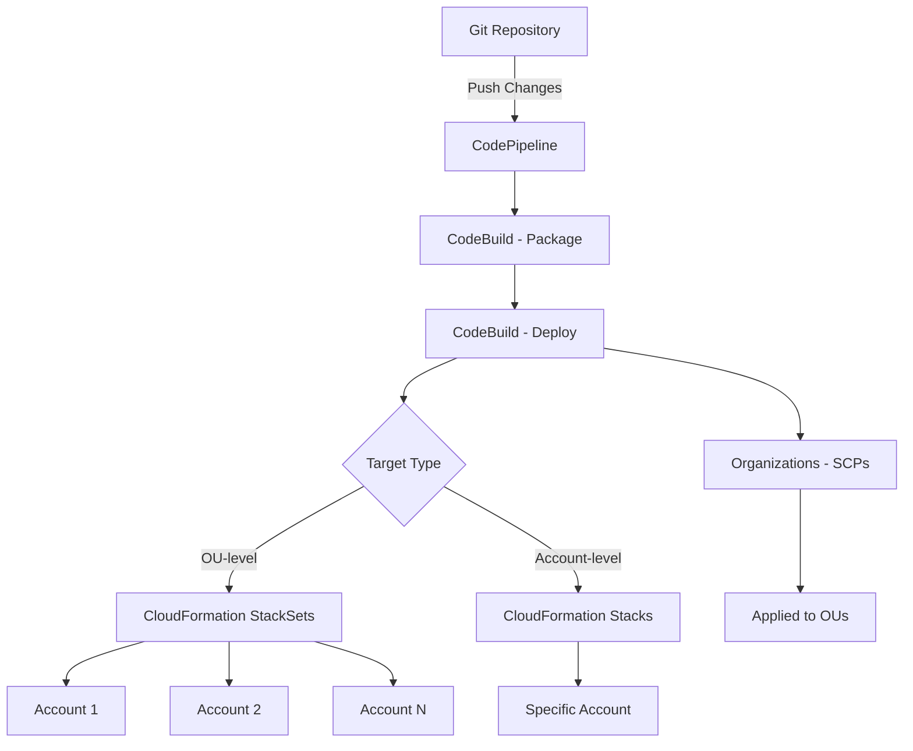

# How to Use AWS Control Tower Customizations (CfCT)

Author: [nawazdhandala](https://github.com/nawazdhandala)

Tags: AWS, Control Tower, CfCT, Multi-Account, CloudFormation, Landing Zone

Description: Learn how to use AWS Control Tower Customizations (CfCT) to apply custom CloudFormation templates and SCPs across your multi-account environment.

---

AWS Control Tower gives you a solid baseline for multi-account governance, but every organization has unique requirements that go beyond the defaults. Maybe you need custom security configurations, specific networking setups, or compliance controls that Control Tower does not include out of the box. That is where Customizations for AWS Control Tower (CfCT) comes in.

CfCT is a solution that lets you deploy custom CloudFormation templates and Service Control Policies (SCPs) to accounts managed by Control Tower, automatically and at scale.

## What Is CfCT?

CfCT is an AWS-provided solution (not a native service, but a reference architecture) that deploys as a pipeline in your management account. You define your customizations as CloudFormation templates and SCPs in a configuration file, and CfCT applies them to the accounts and OUs you specify.

When new accounts are created through Account Factory, CfCT automatically applies the relevant customizations based on the OU the account lands in. This means every account gets your full baseline without manual intervention.

## How CfCT Works



The pipeline watches an S3 bucket or CodeCommit repository for changes to your configuration. When you push updates, it packages your templates and deploys them through CloudFormation StackSets.

## Prerequisites

- AWS Control Tower deployed and in a healthy state
- Administrative access to the management account
- Familiarity with CloudFormation templates
- Git client for managing your customization repo

## Step 1: Deploy the CfCT Solution

CfCT is deployed via a CloudFormation template provided by AWS. You can launch it from the AWS Solutions Library.

```bash
# Download the CfCT CloudFormation template
aws cloudformation create-stack \
  --stack-name customizations-for-control-tower \
  --template-url https://s3.amazonaws.com/solutions-reference/customizations-for-aws-control-tower/latest/custom-control-tower-initiation.template \
  --parameters \
    ParameterKey=PipelineApprovalStage,ParameterValue=No \
    ParameterKey=PipelineApprovalEmail,ParameterValue=admin@yourcompany.com \
    ParameterKey=CodePipelineSource,ParameterValue=Amazon_S3 \
  --capabilities CAPABILITY_NAMED_IAM CAPABILITY_AUTO_EXPAND
```

This creates a CodePipeline, CodeBuild projects, an S3 bucket for your configuration, and the necessary IAM roles.

## Step 2: Understand the Configuration Structure

CfCT uses a manifest file (`manifest.yaml`) that defines what to deploy and where. The configuration package has this structure:

```
custom-control-tower-configuration/
  manifest.yaml
  templates/
    security-baseline.yaml
    networking-baseline.yaml
    monitoring-setup.yaml
  policies/
    deny-root-usage.json
    restrict-regions.json
```

## Step 3: Create the Manifest File

The manifest file is the heart of CfCT. It maps your templates and policies to targets (OUs or accounts).

```yaml
# manifest.yaml - CfCT configuration
---
region: us-east-1
version: 2021-03-15

resources:
  # Deploy security baseline to all accounts in the Workloads OU
  - name: SecurityBaseline
    description: Core security configuration for all workload accounts
    resource_file: templates/security-baseline.yaml
    deploy_method: stack_set
    deployment_targets:
      organizational_units:
        - Workloads
    parameters:
      - parameter_key: CentralSecurityAccountId
        parameter_value: "222222222222"
      - parameter_key: LoggingBucketName
        parameter_value: "central-security-logs"

  # Deploy networking only to production OU
  - name: ProductionNetworking
    description: VPC and networking for production accounts
    resource_file: templates/networking-baseline.yaml
    deploy_method: stack_set
    deployment_targets:
      organizational_units:
        - Production
    parameters:
      - parameter_key: VpcCidr
        parameter_value: "10.0.0.0/16"
      - parameter_key: TransitGatewayId
        parameter_value: "tgw-0123456789abcdef"

  # Deploy monitoring to a specific account
  - name: MonitoringSetup
    description: Enhanced monitoring for the shared services account
    resource_file: templates/monitoring-setup.yaml
    deploy_method: stack_set
    deployment_targets:
      accounts:
        - "333333333333"

  # Apply SCP to restrict regions
  - name: RestrictRegions
    description: Limit AWS usage to approved regions only
    resource_file: policies/restrict-regions.json
    deploy_method: scp
    deployment_targets:
      organizational_units:
        - Workloads
        - Sandbox
```

## Step 4: Create Custom CloudFormation Templates

Here is an example security baseline template:

```yaml
# templates/security-baseline.yaml
AWSTemplateFormatVersion: '2010-09-09'
Description: Security baseline for workload accounts

Parameters:
  CentralSecurityAccountId:
    Type: String
    Description: Account ID of the central security account
  LoggingBucketName:
    Type: String
    Description: Name of the central logging bucket

Resources:
  # Enable SecurityHub
  SecurityHub:
    Type: AWS::SecurityHub::Hub
    Properties:
      Tags:
        ManagedBy: CfCT

  # Configure IAM password policy
  IAMPasswordPolicy:
    Type: AWS::IAM::AccountPasswordPolicy
    Properties:
      MinimumPasswordLength: 14
      RequireSymbols: true
      RequireNumbers: true
      RequireUppercaseCharacters: true
      RequireLowercaseCharacters: true
      MaxPasswordAge: 90
      PasswordReusePrevention: 24

  # Create cross-account security audit role
  SecurityAuditRole:
    Type: AWS::IAM::Role
    Properties:
      RoleName: SecurityAuditRole
      AssumeRolePolicyDocument:
        Version: '2012-10-17'
        Statement:
          - Effect: Allow
            Principal:
              AWS: !Sub 'arn:aws:iam::${CentralSecurityAccountId}:root'
            Action: 'sts:AssumeRole'
      ManagedPolicyArns:
        - arn:aws:iam::aws:policy/SecurityAudit
        - arn:aws:iam::aws:policy/ReadOnlyAccess

  # SNS topic for security alerts
  SecurityAlertsTopic:
    Type: AWS::SNS::Topic
    Properties:
      TopicName: security-alerts
      KmsMasterKeyId: alias/aws/sns
```

## Step 5: Create Service Control Policies

SCPs restrict what actions can be performed in member accounts. Here is an example:

```json
{
  "Version": "2012-10-17",
  "Statement": [
    {
      "Sid": "DenyRootUserActions",
      "Effect": "Deny",
      "Action": "*",
      "Resource": "*",
      "Condition": {
        "StringLike": {
          "aws:PrincipalArn": "arn:aws:iam::*:root"
        }
      }
    },
    {
      "Sid": "RestrictToApprovedRegions",
      "Effect": "Deny",
      "NotAction": [
        "iam:*",
        "sts:*",
        "organizations:*",
        "support:*",
        "budgets:*"
      ],
      "Resource": "*",
      "Condition": {
        "StringNotEquals": {
          "aws:RequestedRegion": [
            "us-east-1",
            "us-west-2",
            "eu-west-1"
          ]
        }
      }
    }
  ]
}
```

## Step 6: Deploy Your Customizations

Package your configuration and upload it to the CfCT S3 bucket:

```bash
# Package the configuration
cd custom-control-tower-configuration
zip -r ../custom-control-tower-configuration.zip .

# Upload to the CfCT configuration bucket
aws s3 cp ../custom-control-tower-configuration.zip \
  s3://custom-control-tower-config-ACCOUNT_ID-REGION/custom-control-tower-configuration.zip
```

The upload triggers the CodePipeline, which processes your manifest and deploys the resources. You can monitor progress in the CodePipeline console.

## Step 7: Verify Deployments

After the pipeline completes, verify that your customizations were applied:

```bash
# Check StackSet instances across accounts
aws cloudformation list-stack-instances \
  --stack-set-name "CustomControlTower-SecurityBaseline" \
  --query 'Summaries[].{Account:Account,Region:Region,Status:StackInstanceStatus.DetailedStatus}'
```

## Lifecycle Management

CfCT integrates with Control Tower's lifecycle events. When a new account is created through Account Factory, Control Tower fires a lifecycle event. CfCT picks up this event and automatically applies the relevant customizations based on the OU the account was placed in.

This means you never need to manually apply baselines to new accounts. The automation handles it.

## Best Practices

1. **Start small.** Begin with one or two simple templates and expand gradually. Debugging StackSet deployment issues across many accounts is painful.

2. **Test in a sandbox OU first.** Create a test OU and deploy your customizations there before rolling them out to production.

3. **Use parameters for account-specific values.** Never hardcode account IDs or environment-specific values in your templates.

4. **Version your configuration in Git.** Even though CfCT uses S3, maintain your source of truth in a Git repository with proper code review.

5. **Monitor the pipeline.** Set up notifications for pipeline failures so you catch deployment issues quickly.

6. **Keep SCPs conservative.** Start with minimal restrictions and add more as you understand the impact. An overly restrictive SCP can break workloads.

## Troubleshooting

Common issues and solutions:

- **Pipeline fails at deployment**: Check the CodeBuild logs for CloudFormation errors. Usually it is a permission issue or a template syntax error.
- **StackSet instances stuck in OUTDATED**: This often means the stack failed in a specific account. Check the individual stack events in that account.
- **New accounts not getting customizations**: Verify that the CfCT lifecycle event rule is active in EventBridge and that the new account's OU is listed in your manifest.

## Wrapping Up

CfCT bridges the gap between Control Tower's built-in governance and your organization's unique requirements. By defining your baselines as code and letting the pipeline handle deployment, you ensure that every account in your organization meets your standards from day one. Start with a security baseline, add networking and monitoring configurations, and layer on SCPs as your governance maturity grows. The investment in setting up CfCT properly pays off every time a new account is provisioned automatically with your full stack of customizations.
