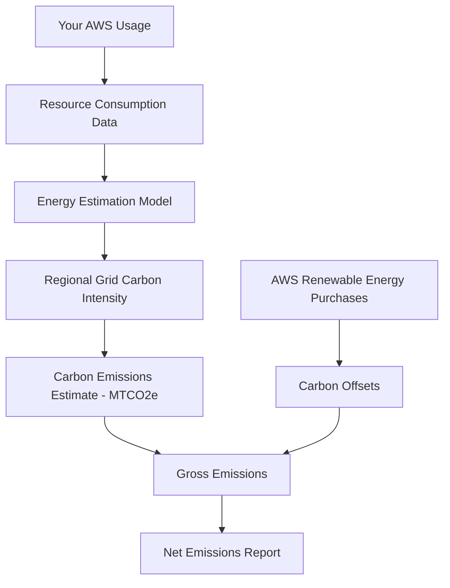

# How to Use AWS Customer Carbon Footprint Tool

Author: [nawazdhandala](https://github.com/nawazdhandala)

Tags: AWS, Sustainability, Carbon Footprint, Green Computing, Cloud Optimization, ESG

Description: Learn how to use the AWS Customer Carbon Footprint Tool to measure, track, and reduce the carbon emissions associated with your AWS workloads.

---

Every workload you run on AWS has a carbon footprint. The servers consume electricity, the cooling systems run around the clock, and the electricity itself may come from fossil fuels depending on the region. For organizations with sustainability goals or ESG reporting requirements, understanding this footprint is not optional anymore.

AWS provides the Customer Carbon Footprint Tool to give you visibility into the carbon emissions associated with your AWS usage. It is free, built into the console, and requires zero setup. But using it effectively takes some understanding of what the numbers mean and how to act on them.

## What the Tool Actually Measures

The AWS Customer Carbon Footprint Tool estimates your greenhouse gas emissions from AWS usage based on three factors:

1. **Your resource consumption** - The compute, storage, networking, and other services you use
2. **The energy needed to power those resources** - Varies by instance type and utilization
3. **The carbon intensity of the electricity** - Varies dramatically by region based on the local energy grid mix

The tool reports emissions in metric tons of carbon dioxide equivalent (MTCO2e), covering Scope 1, Scope 2, and Scope 3 emissions related to your AWS usage.



## Accessing the Tool

The Carbon Footprint Tool is available in the AWS Billing Console:

1. Sign in to the AWS Management Console
2. Navigate to **Billing and Cost Management**
3. Click **Carbon Footprint** in the left navigation
4. The dashboard loads with your emissions data

You need the `aws-portal:ViewBilling` permission to access this tool. If you are using AWS Organizations, the management account can see the aggregate footprint across all member accounts.

```json
// IAM policy to grant access to the Carbon Footprint Tool
{
  "Version": "2012-10-17",
  "Statement": [
    {
      "Effect": "Allow",
      "Action": [
        "aws-portal:ViewBilling",
        "sustainability:GetCarbonFootprintSummary"
      ],
      "Resource": "*"
    }
  ]
}
```

## Understanding the Dashboard

The dashboard shows several key visualizations:

### Emissions Over Time

A bar chart showing your monthly emissions in MTCO2e. This is your primary trend indicator. You want this line going down over time, or at least staying flat as your usage grows.

### Emissions by Service

A breakdown showing which AWS services contribute most to your footprint. Typically, EC2 dominates because compute is the most energy-intensive activity. Common breakdowns look like:

| Service | Typical Share |
|---------|--------------|
| Amazon EC2 | 50-70% |
| Amazon S3 | 5-15% |
| Amazon RDS | 5-15% |
| Data Transfer | 5-10% |
| Other Services | 5-15% |

### Emissions by Region

This is one of the most actionable views. Different regions have vastly different carbon intensities based on their local electricity grid. A workload running in a region powered primarily by renewable energy will have a fraction of the footprint compared to one running on coal-heavy grids.

### Avoided Emissions

AWS purchases renewable energy and invests in carbon offset projects. The "avoided emissions" figure shows how much your footprint would have been if AWS had not made these investments.

## Exporting and Automating Reports

For ESG reporting, you need to get the data out of the console. The tool supports CSV export:

1. Click the **Download** button on the dashboard
2. Choose your date range
3. Select CSV format

For automated reporting, use the AWS SDK:

```python
# Retrieve carbon footprint data programmatically
import boto3
from datetime import datetime, timedelta

client = boto3.client('billingconductor')

# Note: Carbon footprint data is also accessible via the
# Cost and Usage Report with sustainability columns enabled
# Here we use the sustainability API
sustainability = boto3.client('sustainability')

response = sustainability.get_carbon_footprint_summary(
    DateInterval={
        'Start': '2025-01-01',
        'End': '2025-12-31'
    }
)

print(f"Total emissions: {response['TotalEmissions']} MTCO2e")
print(f"Avoided emissions: {response['AvoidedEmissions']} MTCO2e")
```

For detailed per-service breakdowns, enable the sustainability columns in your AWS Cost and Usage Report (CUR):

```bash
# Create a CUR report with sustainability data included
aws cur put-report-definition \
  --report-definition '{
    "ReportName": "sustainability-report",
    "TimeUnit": "MONTHLY",
    "Format": "textORcsv",
    "Compression": "GZIP",
    "S3Bucket": "my-cur-reports-bucket",
    "S3Prefix": "sustainability",
    "S3Region": "us-east-1",
    "AdditionalSchemaElements": ["RESOURCES"],
    "RefreshClosedReports": true
  }'
```

## Interpreting Your Numbers

Raw MTCO2e numbers are hard to contextualize. Here are some reference points:

- 1 MTCO2e is roughly equivalent to driving a passenger car 2,500 miles
- A typical US household produces about 8 MTCO2e per year from electricity
- A small AWS workload (a few EC2 instances, some S3) might produce 1-5 MTCO2e per year
- Enterprise workloads with hundreds of instances can produce 100+ MTCO2e per year

The important thing is not the absolute number but the trend and the ratio of emissions to business value delivered.

## Taking Action: Reducing Your AWS Carbon Footprint

Once you understand your footprint, here are concrete steps to reduce it:

### 1. Right-Size Your Instances

Oversized instances waste energy. Use AWS Compute Optimizer to find instances that are larger than needed:

```bash
# Get right-sizing recommendations from Compute Optimizer
aws compute-optimizer get-ec2-instance-recommendations \
  --filters "Name=Finding,Values=OVER_PROVISIONED" \
  --query 'instanceRecommendations[*].{Instance:instanceArn,Current:currentInstanceType,Recommended:recommendationOptions[0].instanceType}'
```

### 2. Use Graviton Instances

AWS Graviton processors deliver better performance per watt than x86 alternatives. Switching to Graviton can reduce energy consumption by up to 60% for the same workload. See our detailed guide on [using Graviton instances to reduce energy consumption](https://oneuptime.com/blog/post/2026-02-12-use-graviton-instances-to-reduce-energy-consumption/view).

### 3. Choose Low-Carbon Regions

Move workloads that do not have strict latency requirements to regions with cleaner energy grids. We cover this in depth in our post on [choosing AWS regions for lower carbon footprint](https://oneuptime.com/blog/post/2026-02-12-choose-aws-regions-for-lower-carbon-footprint/view).

### 4. Shut Down Idle Resources

Development and staging environments that run 24/7 when they are only used during business hours waste energy. Use AWS Instance Scheduler or simple Lambda functions to stop them off-hours:

```python
# Lambda function to stop dev instances outside business hours
import boto3

def lambda_handler(event, context):
    ec2 = boto3.client('ec2')

    # Find running dev instances
    response = ec2.describe_instances(
        Filters=[
            {'Name': 'tag:Environment', 'Values': ['dev', 'staging']},
            {'Name': 'instance-state-name', 'Values': ['running']}
        ]
    )

    instance_ids = []
    for reservation in response['Reservations']:
        for instance in reservation['Instances']:
            instance_ids.append(instance['InstanceId'])

    if instance_ids:
        ec2.stop_instances(InstanceIds=instance_ids)
        print(f"Stopped {len(instance_ids)} dev/staging instances")
```

### 5. Use Spot and Serverless

Spot instances reuse spare capacity, which is more energy-efficient than provisioning dedicated capacity. Serverless services like Lambda only consume resources when actively processing requests, so there is zero waste during idle periods.

### 6. Optimize Storage

Move infrequently accessed data to S3 Glacier or S3 Glacier Deep Archive. These storage classes use less energy because the data does not need to be on spinning disks or SSDs that are always powered.

```bash
# Create an S3 lifecycle rule to move old data to Glacier
aws s3api put-bucket-lifecycle-configuration \
  --bucket my-data-bucket \
  --lifecycle-configuration '{
    "Rules": [
      {
        "ID": "MoveToGlacier",
        "Status": "Enabled",
        "Filter": {"Prefix": "archive/"},
        "Transitions": [
          {
            "Days": 90,
            "StorageClass": "GLACIER"
          },
          {
            "Days": 365,
            "StorageClass": "DEEP_ARCHIVE"
          }
        ]
      }
    ]
  }'
```

## Setting Up Carbon Footprint Alerts

You can create custom CloudWatch alarms based on carbon footprint trends. While there is no direct CloudWatch metric for carbon, you can build a pipeline:

1. Export CUR data with sustainability columns to S3
2. Process it with a Lambda function on a schedule
3. Publish a custom CloudWatch metric
4. Alert when emissions exceed a threshold

For broader monitoring of both your sustainability metrics and operational health, [OneUptime](https://oneuptime.com) provides unified dashboards that can track custom metrics alongside your standard infrastructure monitoring.

## Reporting for ESG Compliance

Many organizations need to include cloud carbon emissions in their ESG reports. The Carbon Footprint Tool provides data suitable for:

- **GHG Protocol** - The emissions map to Scope 2 (purchased electricity) and Scope 3 (supply chain) categories
- **CDP (Carbon Disclosure Project)** - Use the exported CSV data for your annual disclosure
- **Science Based Targets initiative (SBTi)** - Track progress toward reduction targets

When preparing reports, always note:
- The data has a 3-month lag (Q1 data is available in Q2)
- Historical data goes back to January 2020
- Numbers are estimates based on AWS's models, not direct measurements

## Wrapping Up

The AWS Customer Carbon Footprint Tool is your starting point for understanding and reducing the environmental impact of your cloud workloads. It is free, requires no setup, and provides the data you need for both operational optimization and ESG reporting.

The key actions are: access the tool regularly, export data for trend analysis, right-size your instances, choose low-carbon regions where possible, and shut down what you are not using. For a deeper dive into optimizing your AWS workloads for sustainability, check out our guide on [optimizing AWS workloads for sustainability](https://oneuptime.com/blog/post/2026-02-12-optimize-aws-workloads-for-sustainability/view).

Small changes across many workloads add up. And in most cases, reducing your carbon footprint also reduces your AWS bill - sustainability and cost optimization go hand in hand.
