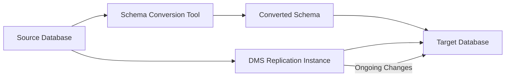

# How to Use AWS Database Migration Service for Schema Conversion

Author: [nawazdhandala](https://github.com/nawazdhandala)

Tags: AWS, DMS, Database Migration, Schema Conversion

Description: Guide to using AWS Database Migration Service and Schema Conversion Tool for migrating database schemas between engines, including stored procedures, triggers, and data type mapping.

---

Migrating a database to a different engine is one of the more complex tasks in cloud migration. Moving from Oracle to PostgreSQL, or SQL Server to Aurora MySQL, means dealing with incompatible data types, proprietary SQL syntax, stored procedures that need rewriting, and subtle behavioral differences that only show up at runtime. AWS Database Migration Service (DMS) handles the data movement, while the Schema Conversion Tool (SCT) handles the schema translation.

This guide covers using both tools together to migrate databases between different engines.

## How DMS and SCT Work Together

Schema Conversion Tool converts your database schema - tables, views, stored procedures, functions, and triggers - from the source engine's syntax to the target engine's syntax. DMS then migrates the actual data.



The workflow is:

1. Use SCT to convert the schema
2. Review and fix any conversion issues manually
3. Apply the converted schema to the target database
4. Set up DMS to migrate the data
5. Run DMS with CDC (Change Data Capture) for ongoing replication
6. Cut over when ready

## Setting Up Schema Conversion

### Installing SCT

Download the AWS Schema Conversion Tool from the AWS website. It's a desktop application that runs on Windows, macOS, and Linux.

After installation, configure database drivers.

```
# Download required JDBC drivers:
# Oracle: ojdbc8.jar
# SQL Server: mssql-jdbc-12.4.2.jre11.jar
# PostgreSQL: postgresql-42.7.1.jar
# MySQL: mysql-connector-j-8.2.0.jar

# Place drivers in the SCT drivers directory
# macOS: ~/AWS Schema Conversion Tool/drivers/
# Windows: C:\Program Files\AWS Schema Conversion Tool\drivers\
```

### Creating a Migration Project

Create an SCT project and connect to your source and target databases.

```python
# You can also use SCT via CLI for automation
# sct-cli.py - Automate schema conversion

# Step 1: Create the project
# sct-cli --create-project \
#   --project-name "oracle-to-postgres" \
#   --source-engine oracle \
#   --target-engine postgresql

# Step 2: Connect to source
# sct-cli --connect-source \
#   --server oracle-prod.example.com \
#   --port 1521 \
#   --database PRODDB \
#   --user migration_user \
#   --password <password>

# Step 3: Connect to target
# sct-cli --connect-target \
#   --server mydb.abc123.us-east-1.rds.amazonaws.com \
#   --port 5432 \
#   --database proddb \
#   --user admin \
#   --password <password>
```

## Running Schema Conversion

When you run the conversion, SCT analyzes every schema object and produces:

- **Automatically converted objects**: Objects that convert cleanly
- **Objects with action items**: Objects that need manual review or rewriting

### Common Conversion Challenges

**Data type mapping**: Not all data types have direct equivalents.

```sql
-- Oracle to PostgreSQL data type mapping examples

-- Oracle NUMBER(10) -> PostgreSQL BIGINT
-- Oracle VARCHAR2(100) -> PostgreSQL VARCHAR(100)
-- Oracle DATE -> PostgreSQL TIMESTAMP (Oracle DATE includes time)
-- Oracle CLOB -> PostgreSQL TEXT
-- Oracle BLOB -> PostgreSQL BYTEA
-- Oracle NUMBER(10,2) -> PostgreSQL NUMERIC(10,2)
-- Oracle RAW(16) -> PostgreSQL BYTEA
```

**Stored procedures**: This is where most manual work happens. Oracle PL/SQL and SQL Server T-SQL have features that don't translate directly to PostgreSQL's PL/pgSQL.

```sql
-- Oracle PL/SQL (source)
CREATE OR REPLACE PROCEDURE update_inventory(
    p_product_id IN NUMBER,
    p_quantity IN NUMBER
) AS
    v_current_stock NUMBER;
BEGIN
    SELECT stock_quantity INTO v_current_stock
    FROM inventory
    WHERE product_id = p_product_id
    FOR UPDATE;

    IF v_current_stock >= p_quantity THEN
        UPDATE inventory
        SET stock_quantity = stock_quantity - p_quantity,
            last_updated = SYSDATE
        WHERE product_id = p_product_id;

        DBMS_OUTPUT.PUT_LINE('Inventory updated');
    ELSE
        RAISE_APPLICATION_ERROR(-20001, 'Insufficient stock');
    END IF;

    COMMIT;
EXCEPTION
    WHEN NO_DATA_FOUND THEN
        RAISE_APPLICATION_ERROR(-20002, 'Product not found');
END update_inventory;
```

```sql
-- PostgreSQL PL/pgSQL (converted)
CREATE OR REPLACE PROCEDURE update_inventory(
    p_product_id BIGINT,
    p_quantity BIGINT
)
LANGUAGE plpgsql
AS $$
DECLARE
    v_current_stock BIGINT;
BEGIN
    SELECT stock_quantity INTO v_current_stock
    FROM inventory
    WHERE product_id = p_product_id
    FOR UPDATE;

    IF NOT FOUND THEN
        RAISE EXCEPTION 'Product not found'
            USING ERRCODE = 'P0002';
    END IF;

    IF v_current_stock >= p_quantity THEN
        UPDATE inventory
        SET stock_quantity = stock_quantity - p_quantity,
            last_updated = CURRENT_TIMESTAMP
        WHERE product_id = p_product_id;

        RAISE NOTICE 'Inventory updated';
    ELSE
        RAISE EXCEPTION 'Insufficient stock'
            USING ERRCODE = 'P0001';
    END IF;

    COMMIT;
END;
$$;
```

**Sequences**: Oracle sequences convert to PostgreSQL sequences, but the syntax differs.

```sql
-- Oracle
CREATE SEQUENCE order_seq START WITH 1 INCREMENT BY 1;
SELECT order_seq.NEXTVAL FROM DUAL;

-- PostgreSQL
CREATE SEQUENCE order_seq START WITH 1 INCREMENT BY 1;
SELECT nextval('order_seq');
```

**Synonyms**: PostgreSQL doesn't have synonyms. Use search_path or schema-qualified names instead.

## Applying the Converted Schema

After reviewing and fixing conversion issues, apply the schema to the target.

```bash
# Apply converted schema to target database
# This can be done through SCT's "Apply to database" button
# or by exporting the SQL and running it manually

# Export converted SQL
# sct-cli --export-converted-schema --output-file converted_schema.sql

# Apply to target
psql -h mydb.abc123.us-east-1.rds.amazonaws.com \
     -U admin -d proddb \
     -f converted_schema.sql
```

## Setting Up DMS for Data Migration

With the schema in place, set up DMS to migrate the data.

### Create a Replication Instance

```bash
# Create a DMS replication instance
aws dms create-replication-instance \
    --replication-instance-identifier "oracle-to-postgres-ri" \
    --replication-instance-class "dms.r5.xlarge" \
    --allocated-storage 100 \
    --vpc-security-group-ids "sg-abc123" \
    --replication-subnet-group-identifier "dms-subnet-group" \
    --multi-az
```

Size the replication instance based on your data volume and change rate. For large databases with high change rates, use dms.r5.xlarge or larger.

### Create Source and Target Endpoints

```bash
# Source endpoint (Oracle)
aws dms create-endpoint \
    --endpoint-identifier "oracle-source" \
    --endpoint-type "source" \
    --engine-name "oracle" \
    --server-name "oracle-prod.example.com" \
    --port 1521 \
    --database-name "PRODDB" \
    --username "dms_user" \
    --password "password"

# Target endpoint (PostgreSQL on RDS)
aws dms create-endpoint \
    --endpoint-identifier "postgres-target" \
    --endpoint-type "target" \
    --engine-name "postgres" \
    --server-name "mydb.abc123.us-east-1.rds.amazonaws.com" \
    --port 5432 \
    --database-name "proddb" \
    --username "admin" \
    --password "password"
```

### Test Endpoint Connections

```bash
# Test source connection
aws dms test-connection \
    --replication-instance-arn "arn:aws:dms:us-east-1:123456789:rep:abc123" \
    --endpoint-arn "arn:aws:dms:us-east-1:123456789:endpoint:source-abc"

# Test target connection
aws dms test-connection \
    --replication-instance-arn "arn:aws:dms:us-east-1:123456789:rep:abc123" \
    --endpoint-arn "arn:aws:dms:us-east-1:123456789:endpoint:target-abc"
```

### Create a Replication Task

```bash
# Create a migration task with full load + CDC
aws dms create-replication-task \
    --replication-task-identifier "oracle-to-postgres-migration" \
    --source-endpoint-arn "arn:aws:dms:us-east-1:123456789:endpoint:source-abc" \
    --target-endpoint-arn "arn:aws:dms:us-east-1:123456789:endpoint:target-abc" \
    --replication-instance-arn "arn:aws:dms:us-east-1:123456789:rep:abc123" \
    --migration-type "full-load-and-cdc" \
    --table-mappings file://table-mappings.json \
    --replication-task-settings file://task-settings.json
```

The table mappings define what to migrate.

```json
{
    "rules": [
        {
            "rule-type": "selection",
            "rule-id": "1",
            "rule-name": "migrate-all-tables",
            "object-locator": {
                "schema-name": "PRODSCHEMA",
                "table-name": "%"
            },
            "rule-action": "include"
        },
        {
            "rule-type": "transformation",
            "rule-id": "2",
            "rule-name": "lowercase-schema",
            "rule-action": "convert-lowercase",
            "rule-target": "schema",
            "object-locator": {
                "schema-name": "PRODSCHEMA"
            }
        },
        {
            "rule-type": "transformation",
            "rule-id": "3",
            "rule-name": "lowercase-tables",
            "rule-action": "convert-lowercase",
            "rule-target": "table",
            "object-locator": {
                "schema-name": "%",
                "table-name": "%"
            }
        }
    ]
}
```

## Monitoring the Migration

```bash
# Check task status
aws dms describe-replication-tasks \
    --filters "Name=replication-task-id,Values=oracle-to-postgres-migration"

# Get table statistics
aws dms describe-table-statistics \
    --replication-task-arn "arn:aws:dms:us-east-1:123456789:task:abc123"
```

Key metrics to monitor:

- **CDCLatencySource**: Lag between source changes and DMS reading them
- **CDCLatencyTarget**: Lag between DMS reading changes and applying them
- **FullLoadThroughputRowsSource**: Rows per second during full load

## Validation

DMS can validate that the data in the target matches the source.

```json
{
    "ValidationSettings": {
        "EnableValidation": true,
        "ThreadCount": 5,
        "ValidationOnly": false,
        "HandleCollationDiff": true,
        "RecordSuspendEnabled": false
    }
}
```

Add this to your task settings to enable row-level validation.

## Wrapping Up

Database migration between engines is inherently complex. SCT handles the bulk of the schema conversion, but plan for manual work on stored procedures, triggers, and engine-specific features. DMS handles data migration reliably, and the CDC feature means you can keep the target in sync during your testing period.

The most important advice: test thoroughly. Run your application's full test suite against the target database, compare query plans for critical queries, and validate data integrity. Don't rush the cutover - you only get one shot at production.

For tracking the overall migration including servers and databases, see our guide on [AWS Migration Hub](https://oneuptime.com/blog/post/2026-02-12-use-aws-migration-hub-for-application-migration/view).
