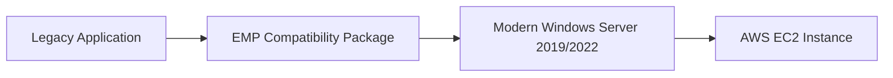

# How to Use AWS End-of-Support Migration Program

Author: [nawazdhandala](https://github.com/nawazdhandala)

Tags: AWS, Migration, EMP, Windows Server, Legacy Applications

Description: A practical guide to using AWS End-of-Support Migration Program (EMP) to move legacy Windows applications to supported operating systems without refactoring.

---

Running applications on end-of-life operating systems is a ticking time bomb. Security patches stop, compliance audits fail, and eventually something breaks in a way nobody can fix. AWS End-of-Support Migration Program (EMP) gives you a way out without rewriting your entire application.

## What is AWS EMP?

AWS EMP is a technology that packages legacy Windows applications so they can run on modern, supported versions of Windows Server. It does this by creating an application-specific compatibility layer that intercepts system calls and redirects them to work correctly on the new operating system.

Think of it as a shim layer between your old application and the new OS. Your application thinks it is running on Windows Server 2003 or 2008, but underneath, it is actually running on Windows Server 2019 or 2022.



## When Should You Use EMP?

EMP is not the right tool for every situation. It makes sense when:

- You have applications running on Windows Server 2003, 2008, or 2008 R2
- Rewriting or refactoring the application is too expensive or risky
- The application vendor no longer exists or provides support
- You need to maintain compliance but cannot upgrade the application
- You want to buy time while planning a proper modernization effort

If your application can be upgraded to run natively on a modern OS, that is always the better long-term choice. EMP is for situations where that is not feasible right now.

## Prerequisites

Before you start, you need a few things in place:

- An AWS account with appropriate IAM permissions
- The EMP toolkit installed on your packaging workstation
- A discovery phase completed to understand your application dependencies
- A target Windows Server AMI (2019 or 2022) ready in your AWS account

## Step 1: Discover Application Dependencies

The first step is understanding exactly what your application needs. EMP includes a discovery tool that monitors your running application and captures:

- File system access patterns
- Registry key reads and writes
- DLL dependencies
- COM object registrations
- Service configurations

Run the discovery tool on your existing server where the application is running.

```powershell
# Launch the EMP discovery tool against your application
emp-discovery.exe --application "C:\Program Files\LegacyApp\app.exe" --output "C:\emp-discovery\results"

# Review the captured dependencies
Get-Content "C:\emp-discovery\results\dependencies.json" | ConvertFrom-Json | Format-List
```

Let the discovery tool run while you exercise all the major features of your application. The more code paths you trigger, the more complete your dependency map will be.

## Step 2: Create the EMP Package

Once discovery is complete, you create a package that bundles the application with its compatibility layer.

```powershell
# Initialize a new EMP package from discovery results
emp-package.exe init --name "LegacyApp" --discovery-results "C:\emp-discovery\results" --target-os "WindowsServer2022"

# Build the package
emp-package.exe build --package-dir "C:\emp-packages\LegacyApp"
```

The packaging process creates a self-contained directory that includes your application, its dependencies, and the EMP runtime that handles OS compatibility.

## Step 3: Test the Package Locally

Before deploying to AWS, test the package on a local Windows Server 2022 machine or VM.

```powershell
# Install the EMP package on a test machine
emp-deploy.exe install --package "C:\emp-packages\LegacyApp\LegacyApp.emp" --install-dir "C:\EMP\LegacyApp"

# Verify the application starts correctly
emp-deploy.exe start --application "LegacyApp"

# Check the EMP runtime logs for any compatibility issues
Get-Content "C:\EMP\LegacyApp\logs\emp-runtime.log" -Tail 50
```

Pay attention to any warnings in the runtime logs. Common issues include missing DLLs, registry keys that were not captured during discovery, or COM objects that need additional configuration.

## Step 4: Deploy to AWS

With a tested package, deploy it to your target EC2 instances.

```powershell
# Upload the EMP package to S3
aws s3 cp "C:\emp-packages\LegacyApp\LegacyApp.emp" s3://my-emp-packages/LegacyApp/

# Launch a new EC2 instance with Windows Server 2022
aws ec2 run-instances `
    --image-id ami-0abcdef1234567890 `
    --instance-type m5.xlarge `
    --key-name my-key-pair `
    --security-group-ids sg-0123456789abcdef0 `
    --subnet-id subnet-0123456789abcdef0 `
    --tag-specifications 'ResourceType=instance,Tags=[{Key=Name,Value=LegacyApp-EMP}]'
```

Then use SSM Run Command or a User Data script to install the EMP package on the new instance.

```powershell
# SSM command to install EMP package from S3
aws ssm send-command `
    --document-name "AWS-RunPowerShellScript" `
    --targets "Key=tag:Name,Values=LegacyApp-EMP" `
    --parameters 'commands=["Read-S3Object -BucketName my-emp-packages -Key LegacyApp/LegacyApp.emp -File C:\temp\LegacyApp.emp","emp-deploy.exe install --package C:\temp\LegacyApp.emp --install-dir C:\EMP\LegacyApp","emp-deploy.exe start --application LegacyApp"]'
```

## Step 5: Validate and Monitor

After deployment, validate that the application works correctly on AWS. Set up monitoring to catch any issues early.

For monitoring the health of your migrated application, consider setting up proper observability. You can learn more about application monitoring in our post on [monitoring AWS infrastructure](https://oneuptime.com/blog/post/monitor-route-53-dns-query-logging/view).

```powershell
# Check EMP application status
emp-deploy.exe status --application "LegacyApp"

# Set up CloudWatch agent to ship EMP logs
# cloudwatch-config.json should include the EMP log paths
aws ssm send-command `
    --document-name "AmazonCloudWatch-ManageAgent" `
    --targets "Key=tag:Name,Values=LegacyApp-EMP" `
    --parameters '{"action":["configure"],"mode":["ec2"],"optionalConfigurationSource":["ssm"],"optionalConfigurationLocation":["AmazonCloudWatch-EMP-Config"]}'
```

## Common Pitfalls

**Incomplete discovery**: If you do not exercise all application features during discovery, you will miss dependencies. Run discovery for at least a full business cycle.

**Hardcoded paths**: Some legacy applications have hardcoded file paths. EMP handles many of these through its redirection layer, but some may need manual configuration in the package manifest.

**Licensing**: Moving to a new OS version may affect your software licensing. Check with your vendor before migrating.

**Network dependencies**: EMP handles OS-level compatibility, but it does not solve network-level issues. Make sure your VPC, security groups, and NACLs allow the same traffic patterns your application needs.

## Planning Your Exit Strategy

EMP buys you time, but it should not be your permanent solution. Use the breathing room it provides to plan a proper modernization:

1. Containerize the application if possible
2. Evaluate SaaS alternatives
3. Consider a rewrite using modern frameworks
4. Look at AWS App2Container for containerization paths

The goal is to use EMP as a bridge, not a destination. Set a timeline for your modernization effort and treat the EMP deployment as temporary infrastructure.

## Conclusion

AWS EMP solves a real problem for organizations stuck on end-of-life Windows Server versions. It is not magic, and it requires careful discovery and testing, but it is far less risky than running unsupported operating systems or attempting a hasty rewrite. Take the time to do discovery properly, test thoroughly, and plan your longer-term modernization while EMP keeps your applications running safely.
