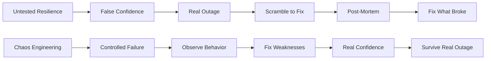

# How to Use AWS Fault Injection Simulator for Chaos Engineering

Author: [nawazdhandala](https://github.com/nawazdhandala)

Tags: AWS, FIS, Chaos Engineering, Resilience, Testing, Fault Injection

Description: Run controlled chaos engineering experiments with AWS Fault Injection Simulator to validate your system's resilience against real-world failure scenarios.

---

Your system looks great on the architecture diagram. Multi-AZ deployments, auto-scaling groups, health checks, retry logic. But does it actually work when things break? The only way to find out is to break things on purpose - in a controlled way. That is what chaos engineering is about, and AWS Fault Injection Simulator (FIS) makes it accessible without building your own chaos tooling.

FIS lets you create experiments that inject failures into your AWS resources - stopping EC2 instances, throttling API calls, disrupting network connectivity, increasing CPU load, and more. You define the blast radius, set stop conditions, and let it run. Then you observe whether your system handles the failure gracefully or falls over.

## Why Chaos Engineering Matters



The bottom path is much better. You find and fix weaknesses before your customers do.

## Core FIS Concepts

**Experiment template** - a reusable definition of a chaos experiment, including actions, targets, and stop conditions.

**Actions** - the faults you inject (stop an instance, throttle an API, add network latency).

**Targets** - which resources are affected (specific EC2 instances, a percentage of instances in an ASG, etc.).

**Stop conditions** - CloudWatch alarms that automatically halt the experiment if things go too wrong.

## Step 1: Set Up IAM Permissions

FIS needs an IAM role with permissions to perform the fault injection actions:

```bash
# Create the FIS experiment role
aws iam create-role \
  --role-name "FISExperimentRole" \
  --assume-role-policy-document '{
    "Version": "2012-10-17",
    "Statement": [
      {
        "Effect": "Allow",
        "Principal": {
          "Service": "fis.amazonaws.com"
        },
        "Action": "sts:AssumeRole"
      }
    ]
  }'

# Attach policies for the actions you plan to use
aws iam put-role-policy \
  --role-name "FISExperimentRole" \
  --policy-name "FISExperimentPolicy" \
  --policy-document '{
    "Version": "2012-10-17",
    "Statement": [
      {
        "Effect": "Allow",
        "Action": [
          "ec2:StopInstances",
          "ec2:StartInstances",
          "ec2:TerminateInstances",
          "ec2:DescribeInstances",
          "ec2:SendSpotInstanceInterruptions",
          "ecs:UpdateContainerInstancesState",
          "ecs:ListContainerInstances",
          "ecs:DescribeContainerInstances",
          "rds:FailoverDBCluster",
          "rds:RebootDBInstance",
          "ssm:SendCommand",
          "ssm:ListCommands",
          "ssm:CancelCommand"
        ],
        "Resource": "*"
      },
      {
        "Effect": "Allow",
        "Action": [
          "cloudwatch:DescribeAlarms"
        ],
        "Resource": "*"
      }
    ]
  }'
```

## Step 2: Create Stop Conditions

Stop conditions are your safety net. They are CloudWatch alarms that automatically halt the experiment if critical metrics breach thresholds:

```bash
# Create a CloudWatch alarm to serve as a stop condition
aws cloudwatch put-metric-alarm \
  --alarm-name "FIS-Stop-HighErrorRate" \
  --alarm-description "Stop FIS experiment if error rate exceeds 10%" \
  --namespace "AWS/ApplicationELB" \
  --metric-name "HTTPCode_Target_5XX_Count" \
  --dimensions '[{"Name": "LoadBalancer", "Value": "app/my-alb/abc123"}]' \
  --statistic "Sum" \
  --period 60 \
  --threshold 100 \
  --comparison-operator "GreaterThanThreshold" \
  --evaluation-periods 1

# Create another stop condition for response time
aws cloudwatch put-metric-alarm \
  --alarm-name "FIS-Stop-HighLatency" \
  --alarm-description "Stop FIS experiment if p99 latency exceeds 5 seconds" \
  --namespace "AWS/ApplicationELB" \
  --metric-name "TargetResponseTime" \
  --dimensions '[{"Name": "LoadBalancer", "Value": "app/my-alb/abc123"}]' \
  --extended-statistic "p99" \
  --period 60 \
  --threshold 5 \
  --comparison-operator "GreaterThanThreshold" \
  --evaluation-periods 2
```

## Step 3: Create Experiment Templates

### Experiment 1: EC2 Instance Failure

This experiment stops a percentage of EC2 instances in an auto-scaling group to validate that auto-scaling and health checks work correctly:

```bash
# Create an experiment that stops 30% of instances in an ASG
aws fis create-experiment-template \
  --description "Stop 30% of instances in web tier ASG" \
  --role-arn "arn:aws:iam::123456789012:role/FISExperimentRole" \
  --stop-conditions '[
    {
      "source": "aws:cloudwatch:alarm",
      "value": "arn:aws:cloudwatch:us-east-1:123456789012:alarm:FIS-Stop-HighErrorRate"
    },
    {
      "source": "aws:cloudwatch:alarm",
      "value": "arn:aws:cloudwatch:us-east-1:123456789012:alarm:FIS-Stop-HighLatency"
    }
  ]' \
  --targets '{
    "WebInstances": {
      "resourceType": "aws:ec2:instance",
      "resourceTags": {
        "Application": "web-tier"
      },
      "selectionMode": "PERCENT(30)",
      "filters": [
        {
          "path": "State.Name",
          "values": ["running"]
        }
      ]
    }
  }' \
  --actions '{
    "StopInstances": {
      "actionId": "aws:ec2:stop-instances",
      "parameters": {
        "startInstancesAfterDuration": "PT5M"
      },
      "targets": {
        "Instances": "WebInstances"
      }
    }
  }' \
  --tags '{"ExperimentType": "ec2-failure"}'
```

This experiment stops 30% of instances tagged with `Application: web-tier`, waits 5 minutes, then restarts them. The stop conditions halt everything if error rates or latency get too high.

### Experiment 2: Network Disruption

Inject network latency or packet loss into instances to simulate degraded network conditions:

```bash
# Create an experiment that adds network latency
aws fis create-experiment-template \
  --description "Add 200ms network latency to API servers" \
  --role-arn "arn:aws:iam::123456789012:role/FISExperimentRole" \
  --stop-conditions '[
    {
      "source": "aws:cloudwatch:alarm",
      "value": "arn:aws:cloudwatch:us-east-1:123456789012:alarm:FIS-Stop-HighLatency"
    }
  ]' \
  --targets '{
    "ApiInstances": {
      "resourceType": "aws:ec2:instance",
      "resourceTags": {
        "Application": "api-tier"
      },
      "selectionMode": "PERCENT(50)"
    }
  }' \
  --actions '{
    "NetworkLatency": {
      "actionId": "aws:ssm:send-command",
      "parameters": {
        "documentArn": "arn:aws:ssm:us-east-1::document/AWSFIS-Run-Network-Latency",
        "documentParameters": "{\"DurationSeconds\":\"300\",\"DelayMilliseconds\":\"200\",\"Interface\":\"eth0\"}",
        "duration": "PT5M"
      },
      "targets": {
        "Instances": "ApiInstances"
      }
    }
  }'
```

### Experiment 3: RDS Failover

Test your application's behavior during a database failover:

```bash
# Create an experiment that forces an RDS failover
aws fis create-experiment-template \
  --description "Force RDS Aurora failover to test application resilience" \
  --role-arn "arn:aws:iam::123456789012:role/FISExperimentRole" \
  --stop-conditions '[
    {
      "source": "aws:cloudwatch:alarm",
      "value": "arn:aws:cloudwatch:us-east-1:123456789012:alarm:FIS-Stop-HighErrorRate"
    }
  ]' \
  --targets '{
    "AuroraCluster": {
      "resourceType": "aws:rds:cluster",
      "resourceArns": [
        "arn:aws:rds:us-east-1:123456789012:cluster:my-app-db"
      ],
      "selectionMode": "ALL"
    }
  }' \
  --actions '{
    "FailoverDB": {
      "actionId": "aws:rds:failover-db-cluster",
      "targets": {
        "Clusters": "AuroraCluster"
      }
    }
  }'
```

### Experiment 4: CPU Stress

Increase CPU load to test auto-scaling behavior:

```bash
# Create an experiment that stresses CPU on instances
aws fis create-experiment-template \
  --description "CPU stress test on web tier to validate auto-scaling" \
  --role-arn "arn:aws:iam::123456789012:role/FISExperimentRole" \
  --stop-conditions '[
    {
      "source": "aws:cloudwatch:alarm",
      "value": "arn:aws:cloudwatch:us-east-1:123456789012:alarm:FIS-Stop-HighErrorRate"
    }
  ]' \
  --targets '{
    "WebInstances": {
      "resourceType": "aws:ec2:instance",
      "resourceTags": {
        "Application": "web-tier"
      },
      "selectionMode": "PERCENT(50)"
    }
  }' \
  --actions '{
    "CPUStress": {
      "actionId": "aws:ssm:send-command",
      "parameters": {
        "documentArn": "arn:aws:ssm:us-east-1::document/AWSFIS-Run-CPU-Stress",
        "documentParameters": "{\"DurationSeconds\":\"300\",\"InstallDependencies\":\"True\",\"CPU\":\"0\"}",
        "duration": "PT5M"
      },
      "targets": {
        "Instances": "WebInstances"
      }
    }
  }'
```

## Step 4: Run Experiments

```bash
# Start an experiment from a template
aws fis start-experiment \
  --experiment-template-id "EXT-abc123" \
  --tags '{"RunBy": "jsmith", "Ticket": "CHAOS-42"}'

# Monitor the experiment
aws fis get-experiment --id "EXP-abc123"

# Stop an experiment early if needed
aws fis stop-experiment --id "EXP-abc123"
```

## Step 5: Analyze Results

After each experiment, review:

```bash
# Get experiment details including action and target status
aws fis get-experiment --id "EXP-abc123"

# List all experiments with their outcomes
aws fis list-experiments --max-results 20
```

Check your monitoring dashboards during and after the experiment:

- Did error rates spike? How much and for how long?
- Did auto-scaling trigger? How fast?
- Did health checks detect the failure? How quickly?
- Did the application recover fully after the fault was cleared?
- Were users impacted? In what way?

## Best Practices

**Start small.** Your first experiment should target one instance, not 50% of your fleet. Build confidence gradually.

**Run in production.** Staging environments rarely match production behavior. The whole point of chaos engineering is to find weaknesses in your actual system. Use stop conditions and small blast radii to keep risk manageable.

**Always have stop conditions.** Never run an experiment without at least one stop condition tied to a meaningful business metric.

**Tag your experiments** with the team, ticket number, and hypothesis. This creates an audit trail and helps correlate experiments with any incidents.

**Make it a habit.** One-off experiments find one-off bugs. Regular chaos experiments build real resilience and a culture of reliability. Consider running them weekly as part of your operations cadence.

## Wrapping Up

AWS FIS makes chaos engineering accessible by providing pre-built fault injection actions and safety controls. You do not need to build your own chaos monkey or write custom fault injection scripts. Define what you want to break, set your safety limits, run the experiment, and learn from the results. The knowledge you gain about your system's actual behavior under failure is worth far more than any amount of theoretical resilience planning.
