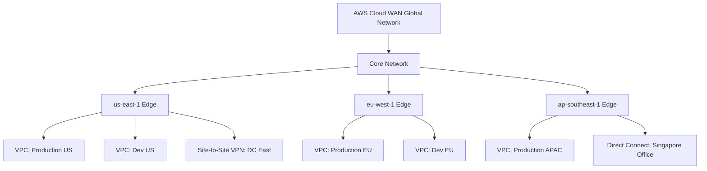
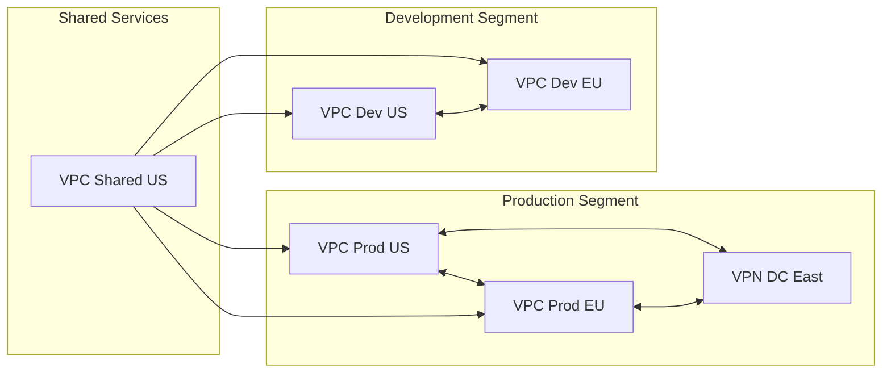

# How to Use AWS Global Networks (Cloud WAN) for Multi-Region

Author: [nawazdhandala](https://github.com/nawazdhandala)

Tags: AWS, Cloud WAN, Networking, Multi-Region, Global Networks, Transit Gateway

Description: A practical guide to setting up AWS Cloud WAN for multi-region networking including core network policies, segments, and attachment configuration.

---

Building multi-region networking on AWS used to mean stitching together Transit Gateways with peering connections, managing route tables manually, and hoping your architecture scaled. AWS Cloud WAN replaces that patchwork with a single, centrally managed global network.

## What is AWS Cloud WAN?

Cloud WAN is a managed service that lets you build, manage, and monitor a global wide-area network. It connects your VPCs across regions, your on-premises data centers, and your branch offices through a unified control plane.

Under the hood, Cloud WAN builds on Transit Gateway infrastructure, but it adds a policy-driven management layer that handles cross-region connectivity automatically.



## Key Concepts

**Global Network**: The top-level container. You have one global network that spans all regions.

**Core Network**: Defines the network topology through policies. This is where you specify which regions are included, how segments are configured, and what connectivity is allowed.

**Segments**: Logical groupings within your core network. You might have a "production" segment, a "development" segment, and a "shared-services" segment. Resources in the same segment can communicate. Cross-segment traffic is controlled by policy.

**Attachments**: Connections between your resources (VPCs, VPNs, Direct Connect gateways) and the core network.

## Step 1: Create the Global Network

```bash
# Create the global network - this is the top-level container
aws networkmanager create-global-network \
    --description "Company Global WAN" \
    --tags 'Key=Environment,Value=production'

# Note the GlobalNetworkId from the response
# Example: global-network-0123456789abcdef0
```

## Step 2: Define the Core Network Policy

The core network policy is a JSON document that describes your desired network topology. This is the most important part of Cloud WAN - get this right and the service handles the implementation.

```json
{
    "version": "2021.12",
    "core-network-configuration": {
        "vpn-ecmp-support": true,
        "asn-ranges": ["64512-65534"],
        "edge-locations": [
            {
                "location": "us-east-1",
                "asn": "64512"
            },
            {
                "location": "eu-west-1",
                "asn": "64513"
            },
            {
                "location": "ap-southeast-1",
                "asn": "64514"
            }
        ]
    },
    "segments": [
        {
            "name": "production",
            "description": "Production workloads",
            "require-attachment-acceptance": true,
            "isolate-attachments": false
        },
        {
            "name": "development",
            "description": "Development and testing",
            "require-attachment-acceptance": false,
            "isolate-attachments": true
        },
        {
            "name": "shared-services",
            "description": "DNS, monitoring, shared tools",
            "require-attachment-acceptance": true,
            "isolate-attachments": false
        }
    ],
    "segment-actions": [
        {
            "action": "share",
            "mode": "attachment-route",
            "segment": "shared-services",
            "share-with": ["production", "development"]
        }
    ],
    "attachment-policies": [
        {
            "rule-number": 100,
            "condition-logic": "or",
            "conditions": [
                {
                    "type": "tag-value",
                    "operator": "equals",
                    "key": "segment",
                    "value": "production"
                }
            ],
            "action": {
                "association-method": "constant",
                "segment": "production"
            }
        },
        {
            "rule-number": 200,
            "condition-logic": "or",
            "conditions": [
                {
                    "type": "tag-value",
                    "operator": "equals",
                    "key": "segment",
                    "value": "development"
                }
            ],
            "action": {
                "association-method": "constant",
                "segment": "development"
            }
        },
        {
            "rule-number": 300,
            "condition-logic": "or",
            "conditions": [
                {
                    "type": "tag-value",
                    "operator": "equals",
                    "key": "segment",
                    "value": "shared-services"
                }
            ],
            "action": {
                "association-method": "constant",
                "segment": "shared-services"
            }
        }
    ]
}
```

### Create the Core Network

```bash
# Create the core network with the policy
aws networkmanager create-core-network \
    --global-network-id global-network-0123456789abcdef0 \
    --policy-document file://core-network-policy.json \
    --description "Multi-region core network" \
    --tags 'Key=ManagedBy,Value=NetworkTeam'

# The core network takes a few minutes to create
# Check status
aws networkmanager get-core-network \
    --core-network-id core-network-0123456789abcdef0 \
    --query 'CoreNetwork.State'
```

## Step 3: Attach VPCs

Once the core network is active, attach your VPCs. The attachment policy you defined earlier automatically assigns VPCs to segments based on their tags.

```bash
# Attach a production VPC in us-east-1
aws networkmanager create-vpc-attachment \
    --core-network-id core-network-0123456789abcdef0 \
    --vpc-arn arn:aws:ec2:us-east-1:123456789012:vpc/vpc-prod-us \
    --subnet-arns \
        "arn:aws:ec2:us-east-1:123456789012:subnet/subnet-prod-1a" \
        "arn:aws:ec2:us-east-1:123456789012:subnet/subnet-prod-1b" \
    --tags 'Key=segment,Value=production'

# Attach a production VPC in eu-west-1
aws networkmanager create-vpc-attachment \
    --core-network-id core-network-0123456789abcdef0 \
    --vpc-arn arn:aws:ec2:eu-west-1:123456789012:vpc/vpc-prod-eu \
    --subnet-arns \
        "arn:aws:ec2:eu-west-1:123456789012:subnet/subnet-prod-eu-1a" \
        "arn:aws:ec2:eu-west-1:123456789012:subnet/subnet-prod-eu-1b" \
    --tags 'Key=segment,Value=production'
```

### Accept Attachments

If your segment requires attachment acceptance (like production), you need to accept them:

```bash
# List pending attachments
aws networkmanager list-attachments \
    --core-network-id core-network-0123456789abcdef0 \
    --attachment-type VPC \
    --state PENDING_ATTACHMENT_ACCEPTANCE

# Accept the attachment
aws networkmanager accept-attachment \
    --attachment-id attachment-0123456789abcdef0
```

## Step 4: Attach On-Premises Connectivity

Cloud WAN supports Site-to-Site VPN and Direct Connect attachments for hybrid connectivity.

```bash
# Create a Site-to-Site VPN attachment
aws networkmanager create-site-to-site-vpn-attachment \
    --core-network-id core-network-0123456789abcdef0 \
    --vpn-connection-arn arn:aws:ec2:us-east-1:123456789012:vpn-connection/vpn-0123456789abcdef0 \
    --tags 'Key=segment,Value=production' 'Key=Location,Value=DC-East'
```

## Step 5: Verify Connectivity

```bash
# Check the core network routing table
aws networkmanager get-core-network-policy \
    --core-network-id core-network-0123456789abcdef0

# List all attachments and their status
aws networkmanager list-attachments \
    --core-network-id core-network-0123456789abcdef0 \
    --query 'Attachments[].{
        Id:AttachmentId,
        Type:AttachmentType,
        Segment:SegmentName,
        State:State,
        EdgeLocation:EdgeLocation
    }' \
    --output table

# Check network routes
aws networkmanager get-network-routes \
    --core-network-id core-network-0123456789abcdef0 \
    --route-table-identifier '{
        "CoreNetworkSegmentEdge": {
            "CoreNetworkId": "core-network-0123456789abcdef0",
            "SegmentName": "production",
            "EdgeLocation": "us-east-1"
        }
    }'
```

## Segment Isolation and Sharing

The power of Cloud WAN segments is in controlling what can talk to what.



In this design:
- Production VPCs can talk to each other and to on-premises
- Development VPCs can talk to each other but NOT to production
- Shared services can reach both production and development
- Development cannot reach production directly

## Monitoring Your Global Network

Cloud WAN integrates with CloudWatch and Network Manager for monitoring.

```bash
# Enable CloudWatch metrics for the core network
# Metrics include bytes in/out, packets in/out, and drops per attachment

# View network telemetry
aws networkmanager get-network-telemetry \
    --global-network-id global-network-0123456789abcdef0 \
    --core-network-id core-network-0123456789abcdef0
```

For comprehensive monitoring of your DNS infrastructure across regions, see our post on [monitoring Route 53 DNS query logging](https://oneuptime.com/blog/post/monitor-route-53-dns-query-logging/view).

## Cost Considerations

Cloud WAN pricing includes:
- Core network edge per hour per region
- Data processing per GB
- VPC attachment per hour
- VPN attachment per hour
- Peering per hour for cross-region traffic

For a small deployment (3 regions, 6 VPCs, moderate traffic), expect costs in the range of $1,500-3,000/month. This compares favorably to managing individual Transit Gateways with peering in each region.

## Conclusion

AWS Cloud WAN brings order to multi-region networking. Instead of managing individual Transit Gateways and peering connections, you define your desired topology in a policy document and Cloud WAN implements it. The segment model gives you fine-grained control over connectivity without complex route table management. For any organization operating in more than two regions, Cloud WAN is worth evaluating as a replacement for DIY Transit Gateway architectures.
