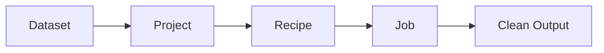

# How to Use AWS Glue DataBrew for Data Preparation

Author: [nawazdhandala](https://github.com/nawazdhandala)

Tags: AWS, Glue, DataBrew, Data Preparation, Data Quality

Description: A hands-on guide to using AWS Glue DataBrew for no-code data cleaning, profiling, and transformation with over 250 built-in operations.

---

Data preparation is the unglamorous but essential step before any analysis or machine learning project. Studies consistently show that data scientists spend 60-80% of their time cleaning and preparing data. AWS Glue DataBrew aims to reduce that by giving you a visual, no-code interface for data profiling, cleaning, and transformation.

Unlike Glue ETL (which requires PySpark) or Glue Studio (which is visual but still ETL-focused), DataBrew is purpose-built for data exploration and preparation. You get a spreadsheet-like interface where you can see your data, apply transformations, and build reusable recipes.

## Core Concepts

DataBrew has four main concepts:

- **Projects** - Interactive workspaces where you explore data and build recipes
- **Datasets** - Connections to your source data (S3, Data Catalog, database)
- **Recipes** - Ordered lists of transformation steps
- **Jobs** - Run recipes against full datasets at scale



## Creating a Dataset

Datasets define where your data lives and how to read it:

```python
# Create a DataBrew dataset pointing to S3 CSV data
import boto3

databrew = boto3.client('databrew', region_name='us-east-1')

response = databrew.create_dataset(
    Name='customer-transactions',
    Input={
        'S3InputDefinition': {
            'Bucket': 'my-data-lake',
            'Key': 'raw/transactions/'
        }
    },
    FormatOptions={
        'Csv': {
            'Delimiter': ',',
            'HeaderRow': True
        }
    },
    Format='CSV'
)
```

DataBrew supports multiple formats:

```python
# Dataset from Parquet files
databrew.create_dataset(
    Name='events-parquet',
    Input={
        'S3InputDefinition': {
            'Bucket': 'my-data-lake',
            'Key': 'processed/events/'
        }
    },
    Format='PARQUET'
)

# Dataset from the Glue Data Catalog
databrew.create_dataset(
    Name='catalog-orders',
    Input={
        'DataCatalogInputDefinition': {
            'DatabaseName': 'analytics',
            'TableName': 'orders'
        }
    }
)
```

## Data Profiling

Before transforming data, profile it to understand what you're working with. DataBrew generates a comprehensive profile that includes:

- Column-level statistics (min, max, mean, standard deviation)
- Data type analysis
- Missing value counts and percentages
- Unique value counts
- Value distributions
- Outlier detection
- Correlation analysis between columns

```python
# Create a profile job to analyze the dataset
databrew.create_profile_job(
    Name='customer-transactions-profile',
    DatasetName='customer-transactions',
    OutputLocation={
        'Bucket': 'my-databrew-output',
        'Key': 'profiles/customer-transactions/'
    },
    RoleArn='arn:aws:iam::YOUR_ACCOUNT_ID:role/DataBrewRole',
    Configuration={
        'DatasetStatisticsConfiguration': {
            'IncludedStatistics': [
                'CORRELATION',
                'DUPLICATE_ROWS_COUNT'
            ]
        },
        'ColumnStatisticsConfigurations': [
            {
                'Selectors': [{'Regex': '.*'}],
                'Statistics': {
                    'IncludedStatistics': [
                        'OUTLIER_DETECTION',
                        'UNIQUE_VALUES_COUNT'
                    ]
                }
            }
        ]
    }
)

# Run the profile job
databrew.start_job_run(Name='customer-transactions-profile')
```

The profile output is a JSON file in S3 that you can view in the DataBrew console or process programmatically. The visual report in the console is particularly useful - it shows histograms, box plots, and correlation heatmaps.

## Creating a Project

Projects give you an interactive session to explore data and build recipes:

```python
# Create a DataBrew project
databrew.create_project(
    Name='clean-customer-transactions',
    DatasetName='customer-transactions',
    RecipeName='customer-cleaning-recipe',
    RoleArn='arn:aws:iam::YOUR_ACCOUNT_ID:role/DataBrewRole',
    Sample={
        'Size': 500,
        'Type': 'FIRST_N'
    }
)
```

The sample configuration controls how much data is loaded into the interactive session. A sample of 500-1000 rows is usually enough for building your recipe. You'll run it against the full dataset later.

## Building Recipes

Recipes are the core of DataBrew. Each recipe is a list of transformation steps. In the console, you build recipes by clicking on columns and choosing transformations from a menu.

Programmatically, you can define recipes directly:

```python
# Create a recipe with multiple cleaning steps
databrew.create_recipe(
    Name='customer-cleaning-recipe',
    Steps=[
        {
            'Action': {
                'Operation': 'REMOVE_DUPLICATES',
                'Parameters': {}
            }
        },
        {
            'Action': {
                'Operation': 'UPPER_CASE',
                'Parameters': {
                    'sourceColumn': 'email'
                }
            }
        },
        {
            'Action': {
                'Operation': 'DELETE_MISSING_VALUES',
                'Parameters': {
                    'sourceColumn': 'customer_id'
                }
            }
        },
        {
            'Action': {
                'Operation': 'REPLACE_VALUE',
                'Parameters': {
                    'sourceColumn': 'state',
                    'value': 'California',
                    'targetValue': 'CA'
                }
            }
        },
        {
            'Action': {
                'Operation': 'CHANGE_DATA_TYPE',
                'Parameters': {
                    'sourceColumn': 'transaction_amount',
                    'targetDataType': 'DOUBLE'
                }
            }
        },
        {
            'Action': {
                'Operation': 'FLAG_COLUMN_FROM_CONDITION',
                'Parameters': {
                    'sourceColumn': 'transaction_amount',
                    'condition': 'IS_GREATER_THAN',
                    'value': '10000',
                    'targetColumn': 'high_value_flag'
                }
            }
        }
    ]
)
```

## Available Transformations

DataBrew has over 250 built-in transformations. Here are the most commonly used categories:

### Column Operations

```python
# Rename a column
{"Operation": "RENAME", "Parameters": {"sourceColumn": "cust_id", "targetColumn": "customer_id"}}

# Delete a column
{"Operation": "DELETE", "Parameters": {"sourceColumn": "temp_column"}}

# Duplicate a column
{"Operation": "DUPLICATE", "Parameters": {"sourceColumn": "email", "targetColumn": "email_backup"}}

# Move a column to a different position
{"Operation": "MOVE", "Parameters": {"sourceColumn": "customer_id", "targetIndex": "0"}}
```

### String Operations

```python
# Trim whitespace
{"Operation": "TRIM", "Parameters": {"sourceColumn": "name"}}

# Extract substring using regex
{"Operation": "EXTRACT_PATTERN", "Parameters": {
    "sourceColumn": "phone",
    "pattern": "\\d{3}",
    "targetColumn": "area_code"
}}

# Split column
{"Operation": "SPLIT_COLUMN_ON_DELIMITER", "Parameters": {
    "sourceColumn": "full_name",
    "delimiter": " ",
    "targetColumn1": "first_name",
    "targetColumn2": "last_name"
}}
```

### Date Operations

```python
# Parse dates
{"Operation": "FORMAT_DATE", "Parameters": {
    "sourceColumn": "date_str",
    "dateFormat": "yyyy-MM-dd"
}}

# Extract date parts
{"Operation": "EXTRACT_YEAR", "Parameters": {
    "sourceColumn": "order_date",
    "targetColumn": "order_year"
}}
```

### Aggregations

```python
# Group by with aggregation
{"Operation": "GROUP_BY", "Parameters": {
    "groupByColumns": "customer_id",
    "aggregations": {
        "transaction_amount": "SUM",
        "order_id": "COUNT"
    }
}}
```

### Data Quality

```python
# Replace missing values with a default
{"Operation": "FILL_MISSING_VALUES", "Parameters": {
    "sourceColumn": "category",
    "fillValue": "Unknown"
}}

# Remove outliers using IQR method
{"Operation": "REMOVE_OUTLIERS", "Parameters": {
    "sourceColumn": "price",
    "strategy": "IQR",
    "multiplier": "1.5"
}}
```

## Publishing Recipes

After building and testing your recipe in a project, publish it so it can be used in jobs:

```python
# Publish the recipe (create a version)
databrew.publish_recipe(
    Name='customer-cleaning-recipe',
    Description='Production-ready customer data cleaning recipe v1'
)
```

Published recipes are versioned. You can always roll back to a previous version if a new set of steps causes issues.

## Running Recipe Jobs

Jobs apply your recipe to the full dataset:

```python
# Create and run a recipe job
databrew.create_recipe_job(
    Name='clean-transactions-job',
    DatasetName='customer-transactions',
    RecipeReference={
        'Name': 'customer-cleaning-recipe',
        'RecipeVersion': '1.0'
    },
    Outputs=[
        {
            'Location': {
                'Bucket': 'my-data-lake',
                'Key': 'cleaned/transactions/'
            },
            'Format': 'PARQUET',
            'CompressionFormat': 'SNAPPY',
            'Overwrite': True,
            'FormatOptions': {
                'Csv': {
                    'Delimiter': ','
                }
            }
        }
    ],
    RoleArn='arn:aws:iam::YOUR_ACCOUNT_ID:role/DataBrewRole',
    MaxCapacity=5
)

# Run the job
databrew.start_job_run(Name='clean-transactions-job')
```

### Multiple Outputs

A single job can write to multiple destinations:

```python
# Job with multiple output formats
outputs = [
    {
        'Location': {'Bucket': 'my-data-lake', 'Key': 'cleaned/parquet/'},
        'Format': 'PARQUET',
        'CompressionFormat': 'SNAPPY'
    },
    {
        'Location': {'Bucket': 'my-data-lake', 'Key': 'cleaned/csv/'},
        'Format': 'CSV',
        'FormatOptions': {'Csv': {'Delimiter': ','}}
    }
]
```

## Scheduling Jobs

Run jobs on a schedule for continuous data cleaning:

```python
# Create a schedule for the cleaning job
databrew.create_schedule(
    Name='daily-cleaning-schedule',
    CronExpression='cron(0 6 * * ? *)',  # Daily at 6 AM
    JobNames=['clean-transactions-job']
)
```

## DataBrew vs. Glue ETL vs. Glue Studio

| Feature | DataBrew | Glue ETL | Glue Studio |
|---------|----------|----------|-------------|
| Interface | Spreadsheet-like | Code | Visual canvas |
| Audience | Analysts, data scientists | Data engineers | Data engineers |
| Profiling | Built-in | Manual | No |
| Transforms | 250+ no-code | Unlimited (code) | 15+ visual |
| Complex logic | Limited | Full PySpark | Custom code nodes |
| Joins | Limited | Full | Yes |
| Best for | Data cleaning | Complex ETL | Standard ETL |

Use DataBrew for data preparation and profiling. Use Glue ETL or Glue Studio for complex multi-source pipelines. They work well together - clean data with DataBrew, then transform and load with [Glue ETL](https://oneuptime.com/blog/post/2026-02-12-create-aws-glue-etl-jobs/view).

## Cost Considerations

DataBrew pricing:
- Interactive sessions: $1 per session per 30 minutes
- Profile jobs: $0.16 per node per hour
- Recipe jobs: $0.48 per node per hour

Keep costs manageable by:
- Using small samples in interactive sessions
- Profiling only the columns you need (use `ColumnStatisticsConfigurations`)
- Right-sizing job capacity
- Scheduling jobs during off-peak hours

## Wrapping Up

DataBrew fills a gap in the AWS analytics toolkit. It's the right tool when you need to explore, profile, and clean data without writing code. The 250+ built-in transformations cover most data quality scenarios, and the profiling capabilities give you deep insight into your data before you start transforming it.

Build your recipes interactively, publish them for production use, and schedule jobs to keep your data clean on an ongoing basis.
