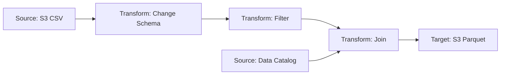

# How to Use AWS Glue Studio for Visual ETL

Author: [nawazdhandala](https://github.com/nawazdhandala)

Tags: AWS, Glue, ETL, Visual ETL, Data Engineering

Description: Learn how to build ETL pipelines visually with AWS Glue Studio's drag-and-drop interface, without writing code from scratch.

---

Not everyone who needs to build a data pipeline wants to write PySpark code from scratch. AWS Glue Studio provides a visual interface for building ETL jobs, letting you design data flows with a drag-and-drop canvas. You connect sources, transformations, and targets visually, and Glue Studio generates the Spark code behind the scenes.

It's genuinely useful for straightforward ETL workflows and for teams where the data engineers want to prototype quickly or the analysts need to build their own transforms.

## The Glue Studio Interface

When you open Glue Studio from the AWS console, you'll see options to create a job:

- **Visual with a source and target** - Pre-configured with a source and target node
- **Visual with a blank canvas** - Empty canvas, you build everything
- **Spark script editor** - Write code directly
- **Python shell script editor** - For lightweight Python jobs

Choose "Visual with a blank canvas" for maximum flexibility.

The canvas has three types of nodes:

1. **Sources** - Where data comes from (S3, Data Catalog, JDBC, Kinesis)
2. **Transforms** - Operations applied to the data
3. **Targets** - Where data goes (S3, Data Catalog, JDBC)



## Building Your First Visual ETL Job

Let's build a pipeline that reads CSV data from S3, cleans it, joins it with reference data, and writes the result as Parquet.

### Step 1: Add a Source

Click "Add source" and choose "S3":

- Set the S3 source type to "S3 location"
- Enter the path: `s3://my-data-lake/raw/orders/`
- Set the data format to CSV
- Check "First line is header"

The preview panel at the bottom shows sample data and the inferred schema.

### Step 2: Add Schema Changes

Click the source node and add a "Change Schema" transform:

- Rename columns (e.g., `cust_id` to `customer_id`)
- Change data types (e.g., `order_total` from string to double)
- Drop columns you don't need

You can also use the "ApplyMapping" transform, which is the same thing with a different UI.

### Step 3: Add Filters

Add a "Filter" transform to remove bad records:

- Set the filter condition: `order_total > 0`
- Add another condition: `customer_id is not null`

Conditions can be combined with AND or OR logic.

### Step 4: Add a Second Source for Joins

Add another source node for your customer reference data:

- Source: Data Catalog
- Database: `reference_data`
- Table: `customers`

### Step 5: Join the Data

Add a "Join" transform connected to both the filtered orders and the customer data:

- Join type: Inner join
- Join condition: `customer_id = customer_id`

The join output includes columns from both sources. Use "Change Schema" after the join to drop duplicate columns or rename conflicting ones.

### Step 6: Add the Target

Add an "S3" target:

- Path: `s3://my-data-lake/processed/orders_enriched/`
- Format: Parquet
- Compression: Snappy
- Partition keys: year, month

## Available Transforms

Glue Studio includes a solid set of built-in transforms:

| Transform | Description |
|-----------|-------------|
| ApplyMapping | Rename columns and change data types |
| Filter | Remove rows based on conditions |
| Join | Combine two datasets on matching keys |
| SelectFields | Pick specific columns |
| DropFields | Remove specific columns |
| DropNullFields | Remove columns that are entirely null |
| DropDuplicates | Remove duplicate rows |
| FillMissingValues | Replace nulls with default values |
| Union | Combine two datasets with the same schema |
| Split | Split a dataset into two based on a condition |
| Aggregate | Group by and aggregate (sum, count, avg, etc.) |
| Custom transform | Write your own SQL or PySpark code |
| SQL query | Write raw SQL against the data |

### Using the SQL Transform

For complex logic, the SQL transform lets you write SQL directly:

```sql
-- SQL transform within Glue Studio
SELECT
    customer_id,
    COUNT(*) as order_count,
    SUM(order_total) as total_spent,
    AVG(order_total) as avg_order_value,
    MAX(order_date) as last_order_date
FROM myDataSource
GROUP BY customer_id
HAVING COUNT(*) >= 3
```

The `myDataSource` name refers to the incoming data from the previous node. You can reference multiple inputs if the SQL node has multiple parents.

### Using Custom Code Transforms

When built-in transforms aren't enough, add a custom transform:

```python
# Custom transform: Parse JSON strings and extract nested fields
def MyTransform(glueContext, dfc) -> DynamicFrameCollection:
    from pyspark.sql.functions import from_json, col
    from pyspark.sql.types import StructType, StructField, StringType

    # Get the input frame
    df = dfc.select(list(dfc.keys())[0]).toDF()

    # Define the schema for the JSON column
    json_schema = StructType([
        StructField("product_name", StringType()),
        StructField("category", StringType()),
        StructField("brand", StringType())
    ])

    # Parse the JSON string column
    result = df.withColumn(
        "product_info_parsed",
        from_json(col("product_info"), json_schema)
    ).select(
        "*",
        col("product_info_parsed.product_name").alias("product_name"),
        col("product_info_parsed.category").alias("category"),
        col("product_info_parsed.brand").alias("brand")
    ).drop("product_info", "product_info_parsed")

    from awsglue.dynamicframe import DynamicFrame
    output = DynamicFrame.fromDF(result, glueContext, "output")
    return DynamicFrameCollection({"CustomTransform0": output}, glueContext)
```

## Job Configuration

Before running, configure the job settings:

### Basic Properties

- **Name**: Descriptive job name
- **IAM Role**: Role with access to your data sources and targets
- **Glue Version**: 4.0 (latest)
- **Worker Type**: G.1X for most jobs
- **Number of Workers**: Start with 5-10
- **Job timeout**: 60-120 minutes depending on data size

### Advanced Properties

- **Job bookmark**: Enable to track what's been processed
- **Monitoring**: Enable CloudWatch metrics and continuous logging
- **Connections**: Attach any database connections needed

## Viewing the Generated Code

One of the best features of Glue Studio is that it generates clean PySpark code. Click the "Script" tab to see the auto-generated code:

```python
# Auto-generated Glue Studio script (simplified example)
import sys
from awsglue.transforms import *
from awsglue.utils import getResolvedOptions
from awsglue.context import GlueContext
from awsglue.job import Job
from pyspark.context import SparkContext

args = getResolvedOptions(sys.argv, ['JOB_NAME'])
sc = SparkContext()
glueContext = GlueContext(sc)
spark = glueContext.spark_session
job = Job(glueContext)
job.init(args['JOB_NAME'], args)

# Source: S3 CSV
S3_source = glueContext.create_dynamic_frame.from_options(
    connection_type="s3",
    format="csv",
    connection_options={"paths": ["s3://my-data-lake/raw/orders/"]},
    format_options={"withHeader": True}
)

# Transform: Change Schema
mapped = ApplyMapping.apply(
    frame=S3_source,
    mappings=[
        ("cust_id", "string", "customer_id", "string"),
        ("order_total", "string", "order_total", "double"),
        ("order_date", "string", "order_date", "string")
    ]
)

# Transform: Filter
filtered = Filter.apply(
    frame=mapped,
    f=lambda row: row["order_total"] > 0 and row["customer_id"] is not None
)

# Target: S3 Parquet
glueContext.write_dynamic_frame.from_options(
    frame=filtered,
    connection_type="s3",
    connection_options={
        "path": "s3://my-data-lake/processed/orders/",
        "partitionKeys": ["year", "month"]
    },
    format="parquet"
)

job.commit()
```

You can edit this code directly, and changes will be reflected in the visual canvas. It's a two-way sync, which is nice for learning PySpark through the visual interface and then tweaking the code.

## Data Preview

Glue Studio lets you preview data at any node in the pipeline. Click a node and then click "Data preview" to see a sample of the data at that point in the transformation chain.

This is incredibly useful for debugging. If your output doesn't look right, preview the data at each step to find where things go wrong.

Note that data preview spins up a small development endpoint, which takes a minute to start and costs a small amount.

## Running and Monitoring

Click "Run" to execute the job. Monitor progress in the "Runs" tab:

- **Job status**: Starting, Running, Succeeded, Failed
- **Duration**: How long the job has been running
- **DPU hours**: Compute consumed (this drives cost)
- **Error logs**: Direct links to CloudWatch logs

Set up CloudWatch alarms for job failures:

```python
# Create an alarm for Glue job failures
import boto3

cloudwatch = boto3.client('cloudwatch')

cloudwatch.put_metric_alarm(
    AlarmName='glue-etl-job-failure',
    MetricName='glue.driver.aggregate.numFailedTasks',
    Namespace='Glue',
    Dimensions=[{'Name': 'JobName', 'Value': 'csv-to-parquet-transform'}],
    Statistic='Sum',
    Period=300,
    EvaluationPeriods=1,
    Threshold=1,
    ComparisonOperator='GreaterThanOrEqualToThreshold',
    AlarmActions=['arn:aws:sns:us-east-1:YOUR_ACCOUNT:glue-alerts']
)
```

## When to Use Glue Studio vs. Script Editor

**Use Glue Studio when:**
- Building straightforward ETL pipelines (source -> transform -> target)
- Prototyping quickly before optimizing
- Team members without PySpark experience need to build pipelines
- The built-in transforms cover your needs

**Use the script editor when:**
- You need complex custom logic
- Performance tuning requires specific Spark configurations
- You're working with advanced Spark features (broadcast joins, custom partitioners)
- The visual interface feels limiting

For more on scripted ETL jobs, check out our guide on [creating AWS Glue ETL jobs](https://oneuptime.com/blog/post/2026-02-12-create-aws-glue-etl-jobs/view). And once your jobs are built, learn how to [schedule them with workflows](https://oneuptime.com/blog/post/2026-02-12-schedule-glue-etl-jobs-with-workflows/view).

## Wrapping Up

Glue Studio lowers the barrier to building ETL pipelines on AWS. The visual canvas handles the common patterns well, and you can drop down to code whenever you need more control. The auto-generated code is clean and readable, so it's also a great learning tool if you're new to PySpark. Start with the visual interface, verify your logic with data preview, and optimize from there.
