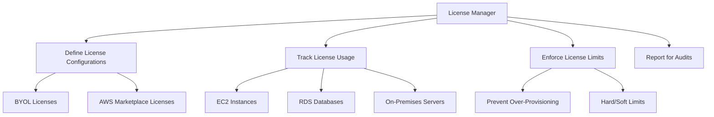

# How to Use AWS License Manager with EC2 and RDS

Author: [nawazdhandala](https://github.com/nawazdhandala)

Tags: AWS, License Manager, EC2, RDS, Compliance, Cost Management

Description: Manage software licenses across your AWS environment using AWS License Manager to track usage, enforce limits, and stay compliant with EC2 and RDS.

---

Software licensing in the cloud is a surprisingly painful problem. You have Windows Server licenses, SQL Server licenses, Oracle licenses, and a dozen other commercial software products running across your EC2 instances and RDS databases. Each vendor has different licensing models - per-core, per-socket, per-vCPU, per-instance - and the consequences of being out of compliance range from audit fees to legal action.

AWS License Manager helps you track, manage, and enforce software license usage across your AWS environment. It works with both AWS-provided licenses (like Windows Server included with EC2) and bring-your-own-license (BYOL) scenarios.

## What License Manager Does

At its core, License Manager lets you:



The most common use cases are:

1. **Tracking BYOL Windows and SQL Server licenses** on EC2 instances
2. **Enforcing license count limits** so teams cannot accidentally spin up more instances than you have licenses for
3. **Generating compliance reports** for software audits
4. **Managing AWS Marketplace license entitlements**

## Step 1: Set Up License Manager

First, enable License Manager and grant it the necessary permissions:

```bash
# Create the service-linked role for License Manager
aws license-manager create-service-linked-role

# Update License Manager settings
aws license-manager update-service-settings \
  --s3-resource-arn "arn:aws:s3:::my-license-manager-reports" \
  --enable-cross-accounts-discovery
```

The S3 bucket is where License Manager stores usage reports. Cross-account discovery lets you track licenses across your entire AWS Organization.

## Step 2: Create License Configurations

A license configuration defines the rules for a specific software license. Let us create configurations for common scenarios.

### Windows Server BYOL

```bash
# Create a license configuration for Windows Server Datacenter BYOL
aws license-manager create-license-configuration \
  --name "Windows-Server-Datacenter-BYOL" \
  --description "Windows Server 2022 Datacenter - Bring Your Own License" \
  --license-counting-type "Core" \
  --license-count 256 \
  --license-count-hard-limit \
  --license-rules '[
    "#minimumCores=8",
    "#allowedTenancy=EC2-DedicatedHost"
  ]' \
  --tags '[
    {"Key": "Vendor", "Value": "Microsoft"},
    {"Key": "Product", "Value": "WindowsServer"}
  ]'
```

Key points about this configuration:

- **license-counting-type** of `Core` means we track by vCPU/core count
- **license-count** of 256 means we have 256 cores worth of licenses
- **license-count-hard-limit** means License Manager will block new launches that would exceed the limit
- The **license-rules** require a minimum of 8 cores per instance and restrict to Dedicated Hosts (required for Windows BYOL)

### SQL Server Enterprise

```bash
# Create a license configuration for SQL Server Enterprise BYOL
aws license-manager create-license-configuration \
  --name "SQL-Server-Enterprise-BYOL" \
  --description "SQL Server 2022 Enterprise - Bring Your Own License" \
  --license-counting-type "Core" \
  --license-count 128 \
  --license-count-hard-limit \
  --license-rules '[
    "#minimumCores=4",
    "#allowedTenancy=EC2-DedicatedHost"
  ]'
```

### AWS-Provided License Tracking

Even for license-included instances, you might want to track usage:

```bash
# Track Windows Server license-included usage (no hard limit)
aws license-manager create-license-configuration \
  --name "Windows-Server-License-Included" \
  --description "Track AWS-provided Windows Server license usage for cost visibility" \
  --license-counting-type "Instance" \
  --no-license-count-hard-limit
```

## Step 3: Associate License Configurations with Resources

You can associate license configurations with EC2 instances manually or automatically through AMI associations.

### Associate with an AMI

The most effective approach is to associate the license configuration with your AMIs. Then every instance launched from that AMI automatically gets tracked:

```bash
# Associate a license configuration with a Windows Server AMI
aws license-manager create-license-configuration-association \
  --license-configuration-arn "arn:aws:license-manager:us-east-1:123456789012:license-configuration/lic-abc123" \
  --resource-arn "arn:aws:ec2:us-east-1::image/ami-0123456789abcdef0"
```

### Associate with Running Instances

For instances already running, you can associate them directly:

```bash
# Associate a license configuration with a specific EC2 instance
aws license-manager update-license-specifications-for-resource \
  --resource-arn "arn:aws:ec2:us-east-1:123456789012:instance/i-0abc123def456789" \
  --add-license-specifications '[
    {
      "LicenseConfigurationArn": "arn:aws:license-manager:us-east-1:123456789012:license-configuration/lic-abc123"
    }
  ]'
```

## Step 4: Using License Manager with RDS

For RDS, License Manager primarily helps with BYOL Oracle and SQL Server instances. When you create an RDS instance with the "bring-your-own-license" model, you need to ensure you have the appropriate licenses tracked.

```bash
# Create an RDS SQL Server instance with BYOL
aws rds create-db-instance \
  --db-instance-identifier "my-sql-server" \
  --db-instance-class "db.m5.xlarge" \
  --engine "sqlserver-ee" \
  --license-model "bring-your-own-license" \
  --master-username "admin" \
  --master-user-password "SecurePassword123!" \
  --allocated-storage 100
```

After creating the instance, associate it with your license configuration:

```bash
# Associate the RDS instance with the SQL Server license configuration
aws license-manager update-license-specifications-for-resource \
  --resource-arn "arn:aws:rds:us-east-1:123456789012:db:my-sql-server" \
  --add-license-specifications '[
    {
      "LicenseConfigurationArn": "arn:aws:license-manager:us-east-1:123456789012:license-configuration/lic-sql-enterprise"
    }
  ]'
```

## Step 5: Enforce License Limits

With hard limits enabled, License Manager integrates with EC2 to prevent launches that would violate your license terms.

To make enforcement work automatically, set up IAM policies that require license specifications at launch time:

```json
// IAM policy that requires license specification for Windows AMIs
{
  "Version": "2012-10-17",
  "Statement": [
    {
      "Sid": "RequireLicenseSpecification",
      "Effect": "Deny",
      "Action": "ec2:RunInstances",
      "Resource": "arn:aws:ec2:*:*:instance/*",
      "Condition": {
        "StringNotLike": {
          "ec2:ImageId": ["ami-linux-*"]
        },
        "ForAllValues:StringEquals": {
          "license-manager:LicenseConfigurationArn": ""
        }
      }
    }
  ]
}
```

When a user tries to launch an instance that would exceed the license count, they will get an error message explaining that the launch was blocked by License Manager.

## Step 6: Monitor and Report

License Manager provides built-in reporting for audit purposes:

```bash
# List all license configurations with usage summary
aws license-manager list-license-configurations

# Get detailed usage for a specific configuration
aws license-manager get-license-configuration \
  --license-configuration-arn "arn:aws:license-manager:us-east-1:123456789012:license-configuration/lic-abc123"

# List all resources associated with a license configuration
aws license-manager list-usage-for-license-configuration \
  --license-configuration-arn "arn:aws:license-manager:us-east-1:123456789012:license-configuration/lic-abc123"
```

For automated reporting, set up a scheduled export:

```bash
# Create an inventory report to S3
aws license-manager create-license-manager-report-generator \
  --report-generator-name "monthly-license-report" \
  --type "LicenseConfigurationSummaryReport" \
  --report-context '{
    "licenseConfigurationArns": [
      "arn:aws:license-manager:us-east-1:123456789012:license-configuration/lic-abc123",
      "arn:aws:license-manager:us-east-1:123456789012:license-configuration/lic-sql-enterprise"
    ]
  }' \
  --report-frequency '{
    "value": 1,
    "period": "MONTH"
  }'
```

## Step 7: Cross-Account License Management

For organizations with multiple AWS accounts, License Manager can track licenses across all accounts through AWS Organizations:

```bash
# Enable cross-account discovery in the management account
aws license-manager update-service-settings \
  --enable-cross-accounts-discovery

# Share a license configuration with member accounts
aws ram create-resource-share \
  --name "SharedLicenseConfigurations" \
  --resource-arns '[
    "arn:aws:license-manager:us-east-1:123456789012:license-configuration/lic-abc123"
  ]' \
  --principals '[
    "arn:aws:organizations::123456789012:ou/o-abc123/ou-def456"
  ]'
```

This ensures that license consumption is tracked across your entire organization, not just individual accounts. For more details on cross-account resource sharing, see our guide on [setting up AWS RAM for cross-account sharing](https://oneuptime.com/blog/post/set-up-aws-ram-resource-access-manager-for-cross-account-sharing/view).

## Best Practices

**Start with discovery mode** before enabling hard limits. Run License Manager in tracking-only mode for a few weeks to understand your actual usage patterns before turning on enforcement.

**Use AMI associations** instead of per-instance associations. This scales much better and ensures new instances are automatically tracked.

**Set up CloudWatch alarms** for license utilization. Get warned when you are approaching 80% of your license capacity so you can plan ahead.

**Keep configurations granular.** Separate configurations for different license editions (Standard vs. Enterprise) and licensing models (BYOL vs. license-included).

**Run regular compliance reports** and keep them archived. When a vendor audit comes, you will be glad you have historical data.

## Wrapping Up

License Manager is one of those AWS services that saves you money and keeps you out of trouble. Software audits are stressful and expensive, and being able to demonstrate real-time license tracking and enforcement goes a long way toward a smooth audit process. The initial setup takes a few hours, but it pays for itself the first time it prevents an accidental over-provisioning or provides clean data for an audit.
