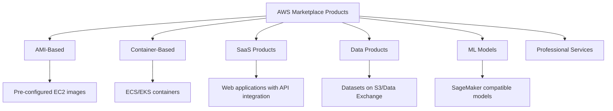

# How to Use AWS Marketplace to Buy and Sell Software

Author: [nawazdhandala](https://github.com/nawazdhandala)

Tags: AWS, Marketplace, SaaS, Software Procurement, ISV, Licensing

Description: Navigate AWS Marketplace as a buyer to discover and purchase software, and as a seller to list and monetize your products through the AWS ecosystem.

---

AWS Marketplace is a digital store with thousands of software products that run on or integrate with AWS. It handles everything from AMIs with pre-installed software to SaaS subscriptions to machine learning models. For buyers, it simplifies procurement by consolidating software spend on your AWS bill. For sellers, it provides access to millions of AWS customers with built-in billing and fulfillment.

Whether you are looking to buy software for your team or sell your own product, understanding how Marketplace works will save you time and potentially a lot of money.

## Marketplace as a Buyer

### Finding and Evaluating Products

The Marketplace catalog includes several product types:



You can search and filter the catalog from the CLI:

```bash
# Search for products in the Marketplace
aws marketplace-catalog list-entities \
  --catalog "AWSMarketplace" \
  --entity-type "AmiProduct" \
  --filter-list '[
    {
      "Name": "Visibility",
      "ValueList": ["Public"]
    }
  ]'
```

### Subscribing to Products

Different product types have different subscription flows.

**AMI products** are the simplest. You subscribe and then launch EC2 instances with the product's AMI:

```bash
# After subscribing in the Marketplace console, launch the AMI
aws ec2 run-instances \
  --image-id "ami-marketplace-product-id" \
  --instance-type "m5.xlarge" \
  --key-name "my-key" \
  --security-group-ids "sg-abc123" \
  --subnet-id "subnet-abc123" \
  --tag-specifications 'ResourceType=instance,Tags=[{Key=Name,Value=marketplace-product}]'
```

**SaaS products** redirect you to the seller's website for account setup, then bill through AWS:

```bash
# Check your current Marketplace subscriptions
aws license-manager list-received-licenses

# List your active entitlements
aws marketplace-entitlement get-entitlements \
  --product-code "product-code-here"
```

**Container products** can be deployed to ECS or EKS:

```bash
# Pull a container product image (after subscribing)
docker pull 123456789012.dkr.ecr.us-east-1.amazonaws.com/marketplace-product:latest

# Deploy to ECS
aws ecs create-service \
  --cluster "my-cluster" \
  --service-name "marketplace-product" \
  --task-definition "marketplace-product-task" \
  --desired-count 2
```

### Managing Spend with Private Marketplace

For organizations that need to control which products teams can subscribe to, Private Marketplace lets you create a curated catalog:

```bash
# Create a private marketplace experience
aws marketplace-catalog start-change-set \
  --catalog "AWSMarketplace" \
  --change-set '[
    {
      "ChangeType": "CreateExperience",
      "Entity": {
        "Type": "Experience@1.0"
      },
      "Details": "{\"Name\": \"Approved Software Catalog\", \"Description\": \"IT-approved software for our organization\"}"
    }
  ]'
```

Private Marketplace is enforced at the AWS Organizations level. Users in your organization can only subscribe to products that your IT team has approved.

### Procurement Integration

One of the biggest benefits of Marketplace for enterprise buyers is procurement simplification. All Marketplace charges appear on your AWS bill, which means:

- No separate POs or invoices for each software vendor
- Marketplace spend counts toward your Enterprise Discount Program (EDP) commitment
- You can use AWS credits for Marketplace purchases
- Finance gets a single consolidated view of all software spend

## Marketplace as a Seller

If you have built a product that runs on or integrates with AWS, Marketplace gives you distribution and billing infrastructure without building it yourself.

### Registering as a Seller

First, register your AWS account as a Marketplace seller:

```bash
# The registration process is primarily done through the AWS Marketplace
# Management Portal (AMMP), but you can check your seller status via CLI
aws marketplace-catalog list-entities \
  --catalog "AWSMarketplace" \
  --entity-type "AmiProduct" \
  --filter-list '[
    {
      "Name": "Visibility",
      "ValueList": ["Draft"]
    }
  ]'
```

You will need to provide business details, banking information for payouts, and tax documentation. AWS takes a percentage of each sale (typically 3-20% depending on product type and volume).

### Listing an AMI Product

To list an AMI product, you need to create a properly configured AMI and submit it for review:

```bash
# Create an AMI from your configured instance
aws ec2 create-image \
  --instance-id "i-abc123" \
  --name "MyProduct-v1.0.0" \
  --description "My awesome product ready for Marketplace" \
  --no-reboot

# Share the AMI with the Marketplace account for scanning
aws ec2 modify-image-attribute \
  --image-id "ami-abc123" \
  --launch-permission '{"Add": [{"UserId": "679593333241"}]}'
```

AWS scans the AMI for security vulnerabilities and compliance with Marketplace policies before approving it.

### Listing a SaaS Product

SaaS products are more involved. You need to integrate with the Marketplace Metering and Entitlement APIs:

```python
# saas_integration.py - Marketplace SaaS integration endpoints
import boto3
import json

metering = boto3.client('marketplace-metering')
entitlement = boto3.client('marketplace-entitlement')

def resolve_customer(registration_token):
    """Called when a customer subscribes through Marketplace."""
    response = metering.resolve_customer(
        RegistrationToken=registration_token
    )
    return {
        'customer_id': response['CustomerIdentifier'],
        'product_code': response['ProductCode'],
        'customer_account_id': response['CustomerAWSAccountId']
    }

def report_usage(customer_id, product_code, dimension, quantity):
    """Report metered usage for a customer."""
    response = metering.meter_usage(
        ProductCode=product_code,
        Timestamp=datetime.utcnow(),
        UsageDimension=dimension,
        UsageQuantity=quantity,
        DryRun=False
    )
    return response

def check_entitlement(product_code, customer_id):
    """Check if a customer has an active entitlement."""
    response = entitlement.get_entitlements(
        ProductCode=product_code,
        Filter={
            'CUSTOMER_IDENTIFIER': [customer_id]
        }
    )
    return len(response['Entitlements']) > 0
```

### Pricing Models

Marketplace supports several pricing models:

**Free** - no charge, great for open source projects or freemium models.

**Bring Your Own License (BYOL)** - customers use their existing licenses.

**Hourly/Annual** - fixed rate per hour or year the resource runs.

**Usage-based (metered)** - charge based on consumption (API calls, data processed, etc.).

**Contract** - customers commit to a fixed term with upfront or scheduled payments.

```json
// Example pricing configuration for a SaaS product
{
  "PricingModel": "Usage",
  "UsageDimensions": [
    {
      "Name": "api_calls",
      "Description": "Number of API calls",
      "Type": "Metered",
      "Unit": "Requests",
      "Rates": {
        "USD": "0.001"
      }
    },
    {
      "Name": "data_processed_gb",
      "Description": "Data processed in GB",
      "Type": "Metered",
      "Unit": "GB",
      "Rates": {
        "USD": "0.10"
      }
    }
  ]
}
```

### Channel Partner Private Offers

If you work with resellers or want to offer special pricing to specific customers, Private Offers let you create custom deals:

```bash
# Create a private offer for a specific customer (done through AMMP)
# The offer includes custom pricing, terms, and EULA
# Customers see the private offer in their Marketplace console
```

Private Offers are also how you handle enterprise negotiated pricing, multi-year deals, and custom payment schedules.

## Cost Management for Marketplace Purchases

Keep track of your Marketplace spending:

```bash
# View Marketplace costs using Cost Explorer
aws ce get-cost-and-usage \
  --time-period '{"Start": "2026-02-01", "End": "2026-02-12"}' \
  --granularity "MONTHLY" \
  --metrics '["UnblendedCost"]' \
  --filter '{
    "Dimensions": {
      "Key": "RECORD_TYPE",
      "Values": ["Marketplace"]
    }
  }'
```

Set up budgets specifically for Marketplace spending:

```bash
# Create a budget alert for Marketplace spending
aws budgets create-budget \
  --account-id "123456789012" \
  --budget '{
    "BudgetName": "Marketplace-Spend",
    "BudgetLimit": {"Amount": "5000", "Unit": "USD"},
    "BudgetType": "COST",
    "TimeUnit": "MONTHLY",
    "CostFilters": {
      "RecordType": ["Marketplace"]
    }
  }' \
  --notifications-with-subscribers '[
    {
      "Notification": {
        "NotificationType": "ACTUAL",
        "ComparisonOperator": "GREATER_THAN",
        "Threshold": 80,
        "ThresholdType": "PERCENTAGE"
      },
      "Subscribers": [
        {
          "SubscriptionType": "EMAIL",
          "Address": "finance@yourcompany.com"
        }
      ]
    }
  ]'
```

## Wrapping Up

AWS Marketplace streamlines software procurement for buyers and provides distribution infrastructure for sellers. As a buyer, the key benefits are consolidated billing, procurement simplification, and the ability to apply AWS credits and EDP commitments. As a seller, you get access to a massive customer base with built-in billing and fulfillment. Whether you are buying or selling, Marketplace reduces the friction in getting software into production on AWS.
