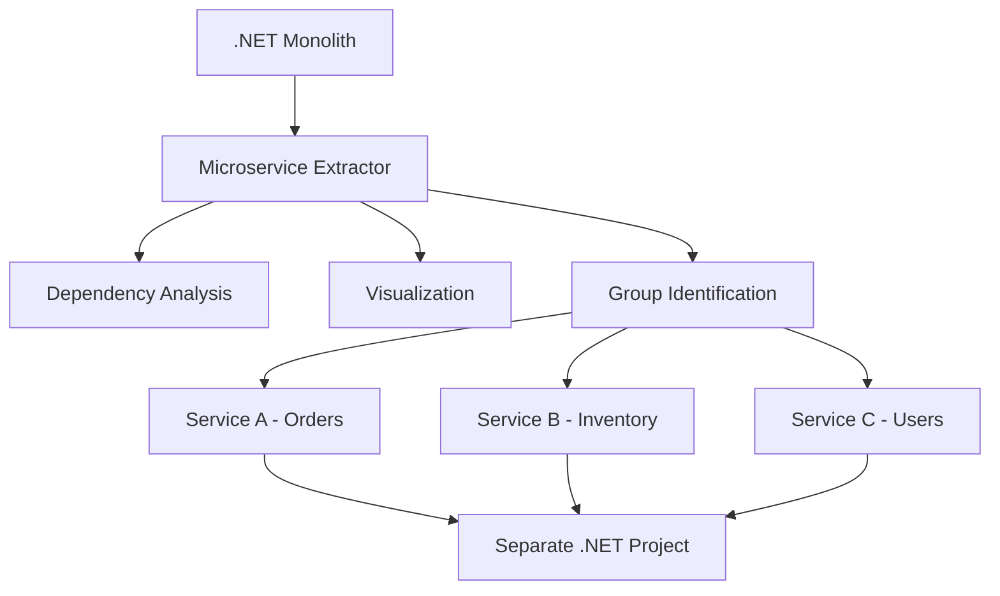
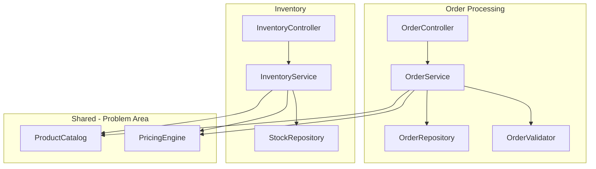

# How to Use AWS Microservice Extractor for .NET

Author: [nawazdhandala](https://github.com/nawazdhandala)

Tags: AWS, Microservice Extractor, .NET, Modernization, Microservice, Refactoring

Description: Learn how to use AWS Microservice Extractor for .NET to decompose monolithic .NET applications into microservices with automated analysis and refactoring.

---

Breaking a .NET monolith into microservices is one of those projects that sounds straightforward but gets complicated quickly. You need to understand the dependency graph, identify service boundaries, untangle shared state, and do all of this without breaking the application. AWS Microservice Extractor for .NET automates much of this analysis and provides tooling to help you extract microservices from your monolithic codebase.

AWS Microservice Extractor for .NET is no longer open to new customers. AWS documentation says customers needed to sign up before November 7, 2025; new modernization projects that do not already have access should evaluate AWS Transform instead.

This guide covers how to use Microservice Extractor to analyze your .NET application and execute a decomposition plan.

## What Microservice Extractor Does

Microservice Extractor is a desktop application that:

1. Analyzes your .NET application's source code and optional runtime profiling data
2. Visualizes class and namespace dependencies
3. Suggests service boundaries based on coupling analysis
4. Helps you extract selected classes into separate projects
5. Generates the scaffolding for independent microservices


```mermaid
graph TD
    A[.NET Monolith] --> B[Microservice Extractor]
    B --> C[Dependency Analysis]
    B --> D[Visualization]
    B --> E[Group Identification]
    E --> F[Service A - Orders]
    E --> G[Service B - Inventory]
    E --> H[Service C - Users]
    F --> I[Separate .NET Project]
    G --> I
    H --> I
```

It supports .NET Framework and .NET Core ASP.NET web service applications. Specifically, visualization supports .NET Framework 4.0 and later, .NET Core 3.1, and .NET 5.0 through .NET 7.0; extraction supports .NET Framework 4.5 and later, .NET Core 3.1, and .NET 5.0 through .NET 7.0. Extraction is supported only for ASP.NET MVC applications.

## Prerequisites

Before starting:
- Confirm that your AWS account already has access to AWS Microservice Extractor for .NET, because the tool is no longer open to new customers
- Download AWS Microservice Extractor as the `ServiceExtract.exe` installer
- Have your .NET solution source code accessible locally
- Ensure the solution builds successfully
- Configure a valid AWS CLI profile
- Optionally, collect runtime profiling data with the Microservice Extractor runtime profiler for more accurate call count data

## Step 1: Create a New Project

Launch Microservice Extractor and create a new extraction project:

1. Select your .NET solution (.sln) file
2. Choose the target projects within the solution to analyze
3. Configure the analysis settings

The tool will parse your source code and build an internal model of all classes, namespaces, method calls, and data dependencies.

## Step 2: Understand the Dependency Visualization

After analysis, Microservice Extractor presents a visual dependency graph. This is where you start understanding your monolith's structure.

The visualization shows:
- **Nodes**: Classes or namespaces (depending on zoom level)
- **Edges**: Dependencies between them (method calls, inheritance, shared data)
- **Clusters**: Groups of tightly coupled classes that naturally form boundaries


```mermaid
graph TD
    subgraph "Order Processing"
        A[OrderController]
        B[OrderService]
        C[OrderRepository]
        D[OrderValidator]
    end

    subgraph "Inventory"
        E[InventoryController]
        F[InventoryService]
        G[StockRepository]
    end

    subgraph "Shared - Problem Area"
        H[ProductCatalog]
        I[PricingEngine]
    end

    A --> B
    B --> C
    B --> D
    B --> H
    B --> I
    E --> F
    F --> G
    F --> H
    F --> I
```

The shared components (ProductCatalog, PricingEngine) are where things get interesting. These are the classes that multiple would-be services depend on, and they need careful handling.

## Step 3: Identify Service Boundaries

Microservice Extractor uses coupling metrics to suggest where to draw service boundaries. You can also manually group classes:

**Automated grouping** uses algorithms to find clusters of classes with high internal cohesion and low external coupling. The tool scores different grouping options and presents the best ones.

**Manual grouping** lets you drag and drop classes into groups based on your domain knowledge. Sometimes the business boundaries are obvious even if the code does not perfectly align.

Key principles for good service boundaries:
- Each service owns its data
- Services communicate through well-defined APIs
- Minimize synchronous dependencies between services
- Group by business capability, not by technical layer

## Step 4: Analyze the Extraction Impact

Before extracting, Microservice Extractor shows you the impact:

- **Cut dependencies**: Method calls that will cross service boundaries and need to become API calls
- **Shared types**: Data classes used by multiple services that need to be duplicated or moved to a shared package
- **Database access**: Tables and queries that will need to be split between services
- **Circular dependencies**: Groups that depend on each other bidirectionally (these need to be resolved before extraction)

```csharp
// Example: A dependency that will become an API call after extraction
// Before (direct method call within monolith)
public class OrderService
{
    private readonly InventoryService _inventoryService;

    public async Task<Order> PlaceOrder(OrderRequest request)
    {
        // This direct call will need to become an HTTP/gRPC call
        bool available = await _inventoryService.CheckAvailability(
            request.ProductId, request.Quantity);

        if (!available)
            throw new InsufficientStockException();

        // Process order...
    }
}

// After (API call to separate service)
public class OrderService
{
    private readonly IInventoryClient _inventoryClient;

    public async Task<Order> PlaceOrder(OrderRequest request)
    {
        // Now calls the inventory microservice via HTTP
        bool available = await _inventoryClient.CheckAvailabilityAsync(
            request.ProductId, request.Quantity);

        if (!available)
            throw new InsufficientStockException();

        // Process order...
    }
}
```

## Step 5: Execute the Extraction

Once you are satisfied with the grouping, Microservice Extractor extracts the grouped code into a separate solution:

Depending on the extraction options and application type, the tool can:
- Create a new .NET project with the extracted classes
- Extract the service with remote endpoints or as a library
- Refactor controller-level method calls from the original application to network calls, where supported
- Copy relevant MVC views for ASP.NET MVC applications

```text
Solution/
  OrderService/
    OrderService.csproj
    Controllers/
      OrderController.cs
    Services/
      OrderService.cs
    Repositories/
      OrderRepository.cs
  InventoryService/
    InventoryService.csproj
    Controllers/
      InventoryController.cs
    Services/
      InventoryService.cs
    Repositories/
      StockRepository.cs
  Shared/
    Shared.csproj
    Models/
      Product.cs                   # Shared data types
      PricingResult.cs
```

## Step 6: Handle the Database Split

The hardest part of microservice extraction is splitting the database. Each service should own its data, but a monolith typically uses one shared database.

Strategies:
1. **Start with a shared database**: Keep the same database initially and split later
2. **Schema-per-service**: Use separate schemas within the same database
3. **Database-per-service**: Full separation (the ideal end state)

```csharp
// Configure separate database contexts per service
// Order Service - only accesses order tables
public class OrderDbContext : DbContext
{
    private readonly IConfiguration _configuration;

    public OrderDbContext(IConfiguration configuration)
    {
        _configuration = configuration;
    }

    public DbSet<Order> Orders { get; set; }
    public DbSet<OrderItem> OrderItems { get; set; }

    protected override void OnConfiguring(DbContextOptionsBuilder options)
    {
        options.UseSqlServer(_configuration.GetConnectionString("OrdersDb"));
    }
}

// Inventory Service - only accesses inventory tables
public class InventoryDbContext : DbContext
{
    private readonly IConfiguration _configuration;

    public InventoryDbContext(IConfiguration configuration)
    {
        _configuration = configuration;
    }

    public DbSet<StockItem> StockItems { get; set; }
    public DbSet<Warehouse> Warehouses { get; set; }

    protected override void OnConfiguring(DbContextOptionsBuilder options)
    {
        options.UseSqlServer(_configuration.GetConnectionString("InventoryDb"));
    }
}
```

## Step 7: Implement Cross-Service Communication

Replace direct method calls with HTTP or event-based communication:

```csharp
// HTTP client for cross-service calls
public class InventoryClient : IInventoryClient
{
    private readonly HttpClient _httpClient;

    public InventoryClient(HttpClient httpClient)
    {
        _httpClient = httpClient;
    }

    public async Task<bool> CheckAvailabilityAsync(string productId, int quantity)
    {
        var response = await _httpClient.GetAsync(
            $"/api/inventory/{productId}/availability?quantity={quantity}");

        response.EnsureSuccessStatusCode();

        var result = await response.Content.ReadFromJsonAsync<AvailabilityResult>();
        return result?.IsAvailable ?? false;
    }
}

// Register in DI container
services.AddHttpClient<IInventoryClient, InventoryClient>(client =>
{
    client.BaseAddress = new Uri(Configuration["InventoryService:BaseUrl"]);
    client.Timeout = TimeSpan.FromSeconds(5);
});
```

For asynchronous communication, use SQS or SNS:

```csharp
// Publish domain events via SNS
public class OrderService
{
    private readonly IAmazonSimpleNotificationService _sns;

    public async Task<Order> PlaceOrder(OrderRequest request)
    {
        var order = CreateOrder(request);
        await SaveOrder(order);

        // Publish event for other services
        await _sns.PublishAsync(new PublishRequest
        {
            TopicArn = "arn:aws:sns:us-east-1:123456789:order-events",
            Message = JsonSerializer.Serialize(new OrderPlacedEvent
            {
                OrderId = order.Id,
                ProductId = order.ProductId,
                Quantity = order.Quantity
            }),
            MessageAttributes = new Dictionary<string, MessageAttributeValue>
            {
                ["EventType"] = new MessageAttributeValue
                {
                    DataType = "String",
                    StringValue = "OrderPlaced"
                }
            }
        });

        return order;
    }
}
```

## Step 8: Deploy to AWS

Deploy each extracted service independently. AWS documentation describes manually building a container image, pushing it to Amazon ECR, and deploying it to Amazon ECS:

```yaml
# CloudFormation for deploying extracted microservices

Resources:
  OrderService:
    Type: AWS::ECS::Service
    Properties:
      Cluster: !Ref ECSCluster
      TaskDefinition: !Ref OrderTaskDef
      DesiredCount: 2
      LaunchType: FARGATE
      NetworkConfiguration:
        AwsvpcConfiguration:
          AssignPublicIp: DISABLED
          SecurityGroups:
            - !Ref ServiceSecurityGroup
          Subnets:
            - !Ref PrivateSubnetA
            - !Ref PrivateSubnetB
      LoadBalancers:
        - ContainerName: order-service
          ContainerPort: 80
          TargetGroupArn: !Ref OrderTargetGroup

  InventoryService:
    Type: AWS::ECS::Service
    Properties:
      Cluster: !Ref ECSCluster
      TaskDefinition: !Ref InventoryTaskDef
      DesiredCount: 2
      LaunchType: FARGATE
      NetworkConfiguration:
        AwsvpcConfiguration:
          AssignPublicIp: DISABLED
          SecurityGroups:
            - !Ref ServiceSecurityGroup
          Subnets:
            - !Ref PrivateSubnetA
            - !Ref PrivateSubnetB
      LoadBalancers:
        - ContainerName: inventory-service
          ContainerPort: 80
          TargetGroupArn: !Ref InventoryTargetGroup
```

## Monitoring Microservices

Once decomposed, you need distributed tracing to follow requests across services. Use AWS X-Ray or integrate with monitoring platforms like [OneUptime](https://oneuptime.com/blog/post/2026-02-12-containerize-legacy-applications-for-aws/view) for end-to-end visibility across your microservices.

## Common Pitfalls

1. **Extracting too many services at once**: Start with one or two, get them running, then continue
2. **Distributed monolith**: If all services need to call each other synchronously, you have not really decomposed anything
3. **Shared database**: Get to database-per-service as fast as practical
4. **Ignoring data consistency**: Distributed transactions are hard; use eventual consistency where possible

## Wrapping Up

AWS Microservice Extractor for .NET takes the guesswork out of monolith decomposition by analyzing your actual code dependencies and helping you identify natural service boundaries. The tool handles part of the mechanical work of creating extracted solutions and, where supported, refactoring calls to remote endpoints, but the hard decisions about where to draw boundaries and how to handle shared data still require your domain expertise. Start small, extract one service at a time, and validate each extraction before moving to the next.
