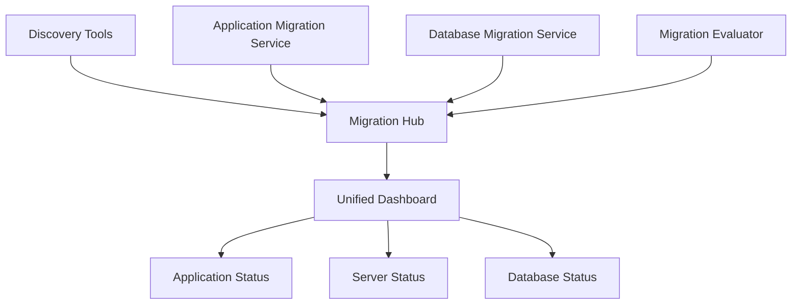

# How to Use AWS Migration Hub for Application Migration

Author: [nawazdhandala](https://github.com/nawazdhandala)

Tags: AWS, Migration Hub, Cloud Migration, DevOps

Description: Guide to using AWS Migration Hub to plan, track, and execute application migrations to AWS, covering discovery, strategy selection, and progress tracking across migration tools.

---

Migrating applications to AWS involves multiple tools, teams, and timelines. Without a central place to track everything, migrations quickly become chaotic - one team is using Application Migration Service, another is using Database Migration Service, and nobody has a clear picture of overall progress. That's the problem Migration Hub solves.

Migration Hub is a single dashboard for tracking migrations across multiple AWS and partner tools. It doesn't perform the migration itself - it aggregates status from the tools that do the actual work and gives you a unified view.

## How Migration Hub Works

Migration Hub sits at the center of your migration workflow. Discovery tools feed it information about your on-premises environment. Migration tools report progress as they move workloads. You get a single dashboard showing everything.



## Setting Up Migration Hub

Start by selecting a home region. Migration Hub data is stored in a single region, even if your migrations happen across multiple regions.

```bash
# Set the Migration Hub home region
aws migrationhub-config create-home-region-control \
    --home-region "us-east-1" \
    --target '{"Type": "ACCOUNT"}'

# Verify the home region
aws migrationhub-config get-home-region
```

You can only set the home region once, so choose carefully. Pick the region where most of your operations team is based or where most of your AWS resources will live.

## Discovery Phase

Before migrating, you need to understand what you have. Migration Hub supports two discovery approaches.

### Agentless Discovery

The Discovery Connector (a VMware appliance) scans your vCenter environment and reports server details without installing anything on the servers.

```bash
# After setting up the Discovery Connector in vCenter, start collection
aws discovery start-data-collection-by-agent-ids \
    --agent-ids "connector-123"

# Check discovery status
aws discovery describe-agents
```

### Agent-Based Discovery

For deeper insight (including network connections and running processes), install the Discovery Agent on each server.

```bash
# List discovered servers
aws discovery describe-configurations \
    --configuration-ids "d-server-abc123"

# Get server details
aws discovery list-configurations \
    --configuration-type "SERVER" \
    --filters '[{
        "name": "server.osName",
        "values": ["Linux"],
        "condition": "CONTAINS"
    }]'
```

## Grouping Applications

Once discovery is complete, group servers into applications. This is critical for tracking migration progress at the application level rather than the server level.

```bash
# Create a migration task (application grouping)
aws mgh notify-application-state \
    --application-id "app-payment-service" \
    --status "NOT_STARTED"

# Associate discovered servers with the application
aws mgh associate-discovered-resource \
    --progress-update-stream "payment-service-stream" \
    --migration-task-name "migrate-payment-service" \
    --discovered-resource '{
        "ConfigurationId": "d-server-abc123",
        "Description": "Payment API server"
    }'
```

You can also group applications through the console, which is often easier for initial setup. The console provides a drag-and-drop interface for grouping discovered servers into applications.

## Creating a Migration Strategy

For each application, define a migration strategy. The common strategies are:

- **Rehost** (lift and shift): Move the server as-is to EC2
- **Replatform**: Make minor changes (like switching to RDS)
- **Refactor**: Rewrite parts of the application for cloud-native
- **Retain**: Keep on-premises for now
- **Retire**: Decommission the application

```python
# migration_plan.py - Generate a migration plan from discovery data
import boto3

discovery = boto3.client('discovery', region_name='us-east-1')
mgh = boto3.client('mgh', region_name='us-east-1')

def create_migration_plan():
    """Create a migration plan based on discovered servers."""
    # Get all discovered servers
    servers = discovery.list_configurations(
        configurationType='SERVER'
    )

    plan = []
    for server in servers['configurations']:
        server_id = server['server.configurationId']
        os_name = server.get('server.osName', 'Unknown')
        cpu_count = int(server.get('server.cpuCount', 0))
        ram_mb = int(server.get('server.totalRamInMB', 0))

        # Simple strategy assignment based on server characteristics
        if 'Windows Server 2008' in os_name:
            strategy = 'REPLATFORM'  # Needs OS upgrade
            target = 'EC2 with Windows 2022'
        elif ram_mb < 2048:
            strategy = 'RETIRE'  # Likely not worth migrating
            target = 'Decommission'
        elif cpu_count <= 2 and ram_mb <= 8192:
            strategy = 'REHOST'  # Simple lift and shift
            target = f"EC2 t3.medium"
        else:
            strategy = 'REHOST'
            target = f"EC2 - size TBD"

        plan.append({
            'server_id': server_id,
            'os': os_name,
            'strategy': strategy,
            'target': target,
            'cpu': cpu_count,
            'ram_mb': ram_mb
        })

    return plan

plan = create_migration_plan()
for item in plan:
    print(f"{item['server_id']}: {item['strategy']} -> {item['target']} ({item['os']}, {item['cpu']} CPU, {item['ram_mb']} MB RAM)")
```

## Tracking Migration Progress

As migrations execute, update the status in Migration Hub.

```bash
# Create a progress update stream
aws mgh create-progress-update-stream \
    --progress-update-stream-name "payment-service-migration"

# Update migration task status
aws mgh notify-migration-task-state \
    --progress-update-stream "payment-service-migration" \
    --migration-task-name "migrate-payment-api" \
    --task '{"Status": "IN_PROGRESS", "StatusDetail": "Replicating server data"}'

# Mark migration complete
aws mgh notify-migration-task-state \
    --progress-update-stream "payment-service-migration" \
    --migration-task-name "migrate-payment-api" \
    --task '{"Status": "COMPLETED", "StatusDetail": "Server migrated and validated"}'
```

When you use Application Migration Service or Database Migration Service, they automatically report progress to Migration Hub. You don't need to update manually.

## Integration with Migration Tools

### Application Migration Service

When you set up replication in Application Migration Service (MGN), Migration Hub automatically picks up the status.

```bash
# Check migration status for a specific server
aws mgn describe-source-servers \
    --filters '{"sourceServerIDs": ["s-abc123"]}'
```

For a detailed walkthrough of MGN, see our guide on [using AWS Application Migration Service](https://oneuptime.com/blog/post/use-aws-application-migration-service-mgn/view).

### Database Migration Service

DMS tasks also report to Migration Hub.

```bash
# Check DMS task status
aws dms describe-replication-tasks \
    --filters "Name=replication-task-id,Values=payment-db-migration"
```

For database migration specifics, check out our guide on [using AWS Database Migration Service for schema conversion](https://oneuptime.com/blog/post/use-aws-database-migration-service-for-schema-conversion/view).

## Migration Waves

For large migrations, organize applications into waves. Each wave is a group of applications that migrate together.

```python
# waves.py - Organize migration into waves
migration_waves = {
    "Wave 1 - Low Risk": {
        "timeline": "Week 1-2",
        "applications": [
            {"name": "Internal Wiki", "strategy": "REHOST", "risk": "LOW"},
            {"name": "Dev Tools", "strategy": "REHOST", "risk": "LOW"},
        ]
    },
    "Wave 2 - Medium Risk": {
        "timeline": "Week 3-4",
        "applications": [
            {"name": "CRM System", "strategy": "REPLATFORM", "risk": "MEDIUM"},
            {"name": "Reporting", "strategy": "REHOST", "risk": "MEDIUM"},
        ]
    },
    "Wave 3 - Business Critical": {
        "timeline": "Week 5-8",
        "applications": [
            {"name": "Payment Service", "strategy": "REPLATFORM", "risk": "HIGH"},
            {"name": "Customer Portal", "strategy": "REHOST", "risk": "HIGH"},
        ]
    }
}

for wave_name, wave in migration_waves.items():
    print(f"\n{wave_name} ({wave['timeline']})")
    for app in wave['applications']:
        print(f"  - {app['name']}: {app['strategy']} (Risk: {app['risk']})")
```

Start with low-risk applications. The first wave is about building confidence and refining your migration process, not migrating your most critical workloads.

## Monitoring the Dashboard

The Migration Hub dashboard shows:

- **Application status**: How many applications are not started, in progress, and completed
- **Server status**: Individual server migration status
- **Most recent updates**: Timeline of recent migration activities

```bash
# Get overall migration progress
aws mgh list-migration-tasks \
    --progress-update-stream "payment-service-migration"

# Get application-level status
aws mgh list-discovered-resources \
    --progress-update-stream "payment-service-migration" \
    --migration-task-name "migrate-payment-service"
```

## Post-Migration Validation

After migration, validate that everything works before decommissioning the source.

```bash
# Run connectivity tests
aws ec2 describe-instances \
    --filters "Name=tag:MigrationTask,Values=migrate-payment-api" \
    --query "Reservations[].Instances[].[InstanceId,State.Name,PublicIpAddress]"
```

Keep the source environment running in parallel for a defined cutover period (typically 1-2 weeks for non-critical applications, 2-4 weeks for critical ones).

## Wrapping Up

Migration Hub doesn't replace your migration tools - it orchestrates them. The value is in having a single place to track progress across all your migration activities. Without it, you're juggling spreadsheets, Jira tickets, and multiple AWS console tabs to answer the simple question: "How's the migration going?"

Start with discovery, group your servers into applications, define your migration waves, and let Migration Hub aggregate the status as you execute. The dashboard gives stakeholders the visibility they need without you having to build custom reporting.
