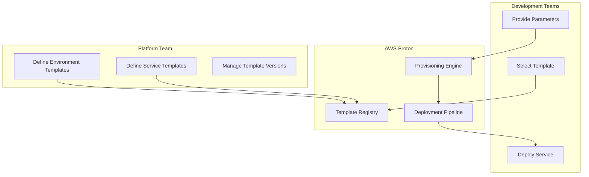

# How to Use AWS Proton for Platform Engineering Templates

Author: [nawazdhandala](https://github.com/nawazdhandala)

Tags: AWS, Proton, Platform Engineering, IaC, Templates, DevOps

Description: Use AWS Proton to create reusable infrastructure templates that let development teams self-service deploy standardized environments and services.

---

Platform engineering is about reducing the cognitive load on development teams. Instead of every team reinventing how to deploy a containerized service or set up a serverless API, you build golden paths - pre-approved, well-tested infrastructure templates that teams can use to ship faster while staying within your organization's guardrails.

AWS Proton is purpose-built for this. It lets platform teams create and manage infrastructure templates, and lets development teams self-service deploy from those templates without needing to understand the underlying CloudFormation or Terraform.

## How Proton Works

Proton separates concerns between platform teams and development teams:



**Environment templates** define shared infrastructure like VPCs, clusters, and databases. Think of these as the foundation that services run on.

**Service templates** define the application infrastructure - containers, Lambda functions, API Gateways, and the CI/CD pipelines to deploy them.

**Developers** pick a service template, fill in a few parameters (like service name and resource sizes), and Proton handles the rest.

## Step 1: Create an Environment Template

Let us build a platform template for a containerized microservices environment. Start with the environment template that sets up the shared infrastructure.

Create the template bundle directory structure:

```bash
# Environment template directory structure
mkdir -p env-template/v1/infrastructure
```

Create the CloudFormation template for the environment:

```yaml
# env-template/v1/infrastructure/cloudformation.yaml
# Shared infrastructure for containerized microservices
AWSTemplateFormatVersion: '2010-09-09'
Description: ECS Fargate environment with VPC and shared ALB

Parameters:
  EnvironmentName:
    Type: String
    Description: Name of the environment
  VpcCIDR:
    Type: String
    Default: '10.0.0.0/16'
    Description: CIDR block for the VPC

Resources:
  VPC:
    Type: AWS::EC2::VPC
    Properties:
      CidrBlock: !Ref VpcCIDR
      EnableDnsHostnames: true
      EnableDnsSupport: true
      Tags:
        - Key: Name
          Value: !Sub '${EnvironmentName}-vpc'

  PublicSubnet1:
    Type: AWS::EC2::Subnet
    Properties:
      VpcId: !Ref VPC
      CidrBlock: !Select [0, !Cidr [!Ref VpcCIDR, 4, 8]]
      AvailabilityZone: !Select [0, !GetAZs '']
      MapPublicIpOnLaunch: true

  PublicSubnet2:
    Type: AWS::EC2::Subnet
    Properties:
      VpcId: !Ref VPC
      CidrBlock: !Select [1, !Cidr [!Ref VpcCIDR, 4, 8]]
      AvailabilityZone: !Select [1, !GetAZs '']
      MapPublicIpOnLaunch: true

  ECSCluster:
    Type: AWS::ECS::Cluster
    Properties:
      ClusterName: !Sub '${EnvironmentName}-cluster'
      ClusterSettings:
        - Name: containerInsights
          Value: enabled

  SharedALB:
    Type: AWS::ElasticLoadBalancingV2::LoadBalancer
    Properties:
      Name: !Sub '${EnvironmentName}-alb'
      Scheme: internet-facing
      Subnets:
        - !Ref PublicSubnet1
        - !Ref PublicSubnet2

Outputs:
  VpcId:
    Value: !Ref VPC
  ClusterName:
    Value: !Ref ECSCluster
  ClusterArn:
    Value: !GetAtt ECSCluster.Arn
  ALBArn:
    Value: !Ref SharedALB
  Subnet1:
    Value: !Ref PublicSubnet1
  Subnet2:
    Value: !Ref PublicSubnet2
```

Create the schema file that defines what parameters users can configure:

```yaml
# env-template/v1/schema/schema.yaml
# Defines the input parameters for the environment template
schema:
  format:
    openapi: "3.0.0"
  environment_input_type: "EnvironmentInput"
  types:
    EnvironmentInput:
      type: object
      description: "Input properties for the ECS Fargate environment"
      properties:
        vpc_cidr:
          type: string
          description: "CIDR block for the VPC"
          default: "10.0.0.0/16"
      required: []
```

Create the manifest file:

```yaml
# env-template/v1/infrastructure/manifest.yaml
infrastructure:
  templates:
    - file: "cloudformation.yaml"
      rendering_engine: jinja
      template_language: cloudformation
```

Now register the template with Proton:

```bash
# Package the template
tar -czf env-template.tar.gz -C env-template/v1 .

# Upload to S3
aws s3 cp env-template.tar.gz s3://my-proton-templates/env-template.tar.gz

# Create the environment template
aws proton create-environment-template \
  --name "ecs-fargate-environment" \
  --display-name "ECS Fargate Environment" \
  --description "Shared infrastructure for containerized microservices"

# Create a template version
aws proton create-environment-template-version \
  --template-name "ecs-fargate-environment" \
  --source '{
    "s3": {
      "bucket": "my-proton-templates",
      "key": "env-template.tar.gz"
    }
  }' \
  --major-version "1"
```

## Step 2: Create a Service Template

Service templates define how individual applications are deployed into an environment. Let us create one for a Fargate service with a load balancer:

```yaml
# svc-template/v1/instance_infrastructure/cloudformation.yaml
# Deploys a Fargate service with ALB target group
AWSTemplateFormatVersion: '2010-09-09'

Parameters:
  ServiceName:
    Type: String
  ContainerPort:
    Type: Number
    Default: 8080
  DesiredCount:
    Type: Number
    Default: 2
  TaskCpu:
    Type: String
    Default: '256'
  TaskMemory:
    Type: String
    Default: '512'
  ImageUri:
    Type: String

Resources:
  TaskDefinition:
    Type: AWS::ECS::TaskDefinition
    Properties:
      Family: !Ref ServiceName
      Cpu: !Ref TaskCpu
      Memory: !Ref TaskMemory
      NetworkMode: awsvpc
      RequiresCompatibilities:
        - FARGATE
      ContainerDefinitions:
        - Name: !Ref ServiceName
          Image: !Ref ImageUri
          PortMappings:
            - ContainerPort: !Ref ContainerPort
          LogConfiguration:
            LogDriver: awslogs
            Options:
              awslogs-group: !Sub '/ecs/${ServiceName}'
              awslogs-region: !Ref AWS::Region
              awslogs-stream-prefix: ecs

  Service:
    Type: AWS::ECS::Service
    Properties:
      ServiceName: !Ref ServiceName
      Cluster: '{{environment.outputs.ClusterArn}}'
      TaskDefinition: !Ref TaskDefinition
      DesiredCount: !Ref DesiredCount
      LaunchType: FARGATE
      NetworkConfiguration:
        AwsvpcConfiguration:
          Subnets:
            - '{{environment.outputs.Subnet1}}'
            - '{{environment.outputs.Subnet2}}'
```

Notice the `{{environment.outputs.ClusterArn}}` syntax. Proton automatically resolves these references to the outputs from the environment template. This is how service templates connect to environment infrastructure without hard-coding values.

Register the service template:

```bash
# Package and upload the service template
tar -czf svc-template.tar.gz -C svc-template/v1 .
aws s3 cp svc-template.tar.gz s3://my-proton-templates/svc-template.tar.gz

# Create the service template
aws proton create-service-template \
  --name "fargate-service" \
  --display-name "Fargate Service" \
  --description "Containerized service running on ECS Fargate" \
  --pipeline-provisioning "CUSTOMER_MANAGED"

# Create a template version
aws proton create-service-template-version \
  --template-name "fargate-service" \
  --source '{
    "s3": {
      "bucket": "my-proton-templates",
      "key": "svc-template.tar.gz"
    }
  }' \
  --compatible-environment-templates '[
    {"templateName": "ecs-fargate-environment", "majorVersion": "1"}
  ]' \
  --major-version "1"
```

## Step 3: Deploy an Environment

Now a platform engineer can deploy an environment:

```bash
# Deploy a production environment from the template
aws proton create-environment \
  --name "production" \
  --template-name "ecs-fargate-environment" \
  --template-major-version "1" \
  --proton-service-role-arn "arn:aws:iam::123456789012:role/ProtonServiceRole" \
  --spec '{
    "vpc_cidr": "10.0.0.0/16"
  }'
```

## Step 4: Developers Deploy Services

With the environment running, developers can deploy their services:

```bash
# Developer deploys their service into the production environment
aws proton create-service \
  --name "payment-api" \
  --template-name "fargate-service" \
  --template-major-version "1" \
  --spec '{
    "instances": [
      {
        "name": "production",
        "environment": "production",
        "spec": {
          "container_port": 8080,
          "desired_count": 3,
          "task_cpu": "512",
          "task_memory": "1024",
          "image_uri": "123456789012.dkr.ecr.us-east-1.amazonaws.com/payment-api:latest"
        }
      }
    ]
  }'
```

The developer only needs to know their container image, port, and desired capacity. All the networking, cluster configuration, and IAM roles are handled by the template.

## Template Versioning and Updates

When you need to update templates (say, to add a WAF or change a security group), Proton's versioning system lets you roll out changes safely:

```bash
# Create a new minor version of the template
aws proton create-environment-template-version \
  --template-name "ecs-fargate-environment" \
  --source '{
    "s3": {
      "bucket": "my-proton-templates",
      "key": "env-template-v1.1.tar.gz"
    }
  }' \
  --major-version "1" \
  --description "Added WAF integration"

# Update deployed environments to the new version
aws proton update-environment \
  --name "production" \
  --template-major-version "1" \
  --template-minor-version "1" \
  --deployment-type "MINOR_VERSION"
```

## Wrapping Up

AWS Proton brings the internal developer platform concept to life without requiring you to build the platform from scratch. The template-based approach ensures consistency across your organization while giving developers enough flexibility to configure what matters to them. Start with one or two golden path templates that cover your most common deployment patterns, get feedback from development teams, and iterate from there.
