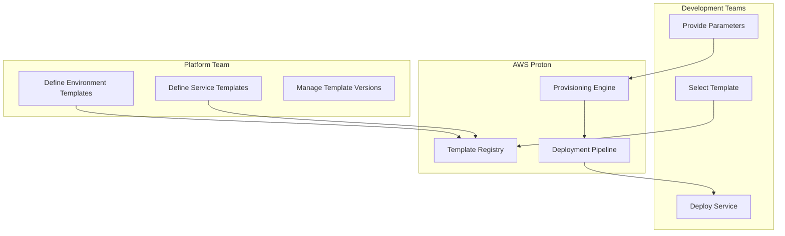

# How to Use AWS Proton for Platform Engineering Templates

Author: [nawazdhandala](https://github.com/nawazdhandala)

Tags: AWS, Proton, Platform Engineering, IaC, Template, DevOps

Description: Use AWS Proton to create reusable infrastructure templates that let development teams self-service deploy standardized environments and services.

---

Platform engineering is about reducing the cognitive load on development teams. Instead of every team reinventing how to deploy a containerized service or set up a serverless API, you build golden paths - pre-approved, well-tested infrastructure templates that teams can use to ship faster while staying within your organization's guardrails.

AWS Proton is purpose-built for this. It lets platform teams create and manage infrastructure templates, and lets development teams self-service deploy from those templates without needing to understand the underlying CloudFormation or Terraform.

Note: AWS has announced that AWS Proton support ends on October 7, 2026. Existing deployed infrastructure remains intact, but plan migrations for workloads that need long-term support.

## How Proton Works

Proton separates concerns between platform teams and development teams:


```mermaid
graph TD
    subgraph Platform Team
        A[Define Environment Templates]
        B[Define Service Templates]
        C[Manage Template Versions]
    end
    subgraph Development Teams
        D[Select Template]
        E[Provide Parameters]
        F[Deploy Service]
    end
    subgraph AWS Proton
        G[Template Registry]
        H[Provisioning Engine]
        I[Deployment Pipeline]
    end
    A --> G
    B --> G
    D --> G
    E --> H
    H --> I
    I --> F
```

**Environment templates** define shared infrastructure like VPCs, clusters, and databases. Think of these as the foundation that services run on.

**Service templates** define the application infrastructure - containers, Lambda functions, API Gateways, and the CI/CD pipelines to deploy them.

**Developers** pick a service template, fill in a few parameters (like service name and resource sizes), and Proton handles the rest.

## Step 1: Create an Environment Template

Let us build a platform template for a containerized microservices environment. Start with the environment template that sets up the shared infrastructure.

Create the template bundle directory structure:

```bash
# Environment template directory structure

mkdir -p env-template/v1/infrastructure
mkdir -p env-template/v1/schema
```

Create the CloudFormation template for the environment:

```yaml
# env-template/v1/infrastructure/cloudformation.yaml
# Shared infrastructure for containerized microservices
AWSTemplateFormatVersion: '2010-09-09'
Description: ECS Fargate environment with VPC and shared ALB

Resources:
  VPC:
    Type: AWS::EC2::VPC
    Properties:
      CidrBlock: '{{ environment.inputs.vpc_cidr }}'
      EnableDnsHostnames: true
      EnableDnsSupport: true
      Tags:
        - Key: Name
          Value: '{{ environment.name }}-vpc'

  InternetGateway:
    Type: AWS::EC2::InternetGateway

  VPCGatewayAttachment:
    Type: AWS::EC2::VPCGatewayAttachment
    Properties:
      VpcId: !Ref VPC
      InternetGatewayId: !Ref InternetGateway

  PublicRouteTable:
    Type: AWS::EC2::RouteTable
    Properties:
      VpcId: !Ref VPC

  PublicRoute:
    Type: AWS::EC2::Route
    DependsOn: VPCGatewayAttachment
    Properties:
      RouteTableId: !Ref PublicRouteTable
      DestinationCidrBlock: 0.0.0.0/0
      GatewayId: !Ref InternetGateway

  PublicSubnet1:
    Type: AWS::EC2::Subnet
    Properties:
      VpcId: !Ref VPC
      CidrBlock: !Select [0, !Cidr ['{{ environment.inputs.vpc_cidr }}', 4, 8]]
      AvailabilityZone: !Select [0, !GetAZs '']
      MapPublicIpOnLaunch: true

  PublicSubnet2:
    Type: AWS::EC2::Subnet
    Properties:
      VpcId: !Ref VPC
      CidrBlock: !Select [1, !Cidr ['{{ environment.inputs.vpc_cidr }}', 4, 8]]
      AvailabilityZone: !Select [1, !GetAZs '']
      MapPublicIpOnLaunch: true

  PublicSubnet1RouteTableAssociation:
    Type: AWS::EC2::SubnetRouteTableAssociation
    Properties:
      SubnetId: !Ref PublicSubnet1
      RouteTableId: !Ref PublicRouteTable

  PublicSubnet2RouteTableAssociation:
    Type: AWS::EC2::SubnetRouteTableAssociation
    Properties:
      SubnetId: !Ref PublicSubnet2
      RouteTableId: !Ref PublicRouteTable

  ECSCluster:
    Type: AWS::ECS::Cluster
    Properties:
      ClusterName: '{{ environment.name }}-cluster'
      ClusterSettings:
        - Name: containerInsights
          Value: enabled

  ALBSecurityGroup:
    Type: AWS::EC2::SecurityGroup
    Properties:
      GroupDescription: Allow HTTP traffic to the shared ALB
      VpcId: !Ref VPC
      SecurityGroupIngress:
        - IpProtocol: tcp
          FromPort: 80
          ToPort: 80
          CidrIp: 0.0.0.0/0

  SharedALB:
    Type: AWS::ElasticLoadBalancingV2::LoadBalancer
    Properties:
      Name: '{{ environment.name }}-alb'
      Scheme: internet-facing
      SecurityGroups:
        - !Ref ALBSecurityGroup
      Subnets:
        - !Ref PublicSubnet1
        - !Ref PublicSubnet2

  SharedALBListener:
    Type: AWS::ElasticLoadBalancingV2::Listener
    Properties:
      LoadBalancerArn: !Ref SharedALB
      Port: 80
      Protocol: HTTP
      DefaultActions:
        - Type: fixed-response
          FixedResponseConfig:
            StatusCode: '404'

Outputs:
  VpcId:
    Value: !Ref VPC
  ClusterName:
    Value: !Ref ECSCluster
  ClusterArn:
    Value: !GetAtt ECSCluster.Arn
  ALBArn:
    Value: !Ref SharedALB
  ALBListenerArn:
    Value: !Ref SharedALBListener
  ALBSecurityGroupId:
    Value: !Ref ALBSecurityGroup
  Subnet1:
    Value: !Ref PublicSubnet1
  Subnet2:
    Value: !Ref PublicSubnet2
```

Create the schema file that defines what parameters users can configure:

```yaml
# env-template/v1/schema/schema.yaml
# Defines the input parameters for the environment template
schema:
  format:
    openapi: "3.0.0"
  environment_input_type: "EnvironmentInput"
  types:
    EnvironmentInput:
      type: object
      description: "Input properties for the ECS Fargate environment"
      properties:
        vpc_cidr:
          type: string
          description: "CIDR block for the VPC"
          default: "10.0.0.0/16"
      required: []
```

Create the manifest file:

```yaml
# env-template/v1/infrastructure/manifest.yaml
infrastructure:
  templates:
    - file: "cloudformation.yaml"
      rendering_engine: jinja
      template_language: cloudformation
```

Now register the template with Proton:

```bash
# Package the template
tar -czf env-template.tar.gz -C env-template/v1 .

# Upload to S3
aws s3 cp env-template.tar.gz s3://my-proton-templates/env-template.tar.gz

# Create the environment template
aws proton create-environment-template \
  --name "ecs-fargate-environment" \
  --display-name "ECS Fargate Environment" \
  --description "Shared infrastructure for containerized microservices"

# Create a template version
aws proton create-environment-template-version \
  --template-name "ecs-fargate-environment" \
  --source '{
    "s3": {
      "bucket": "my-proton-templates",
      "key": "env-template.tar.gz"
    }
  }'

# Publish the first minor version so environments can use it
aws proton update-environment-template-version \
  --template-name "ecs-fargate-environment" \
  --major-version "1" \
  --minor-version "0" \
  --status "PUBLISHED"
```

## Step 2: Create a Service Template

Service templates define how individual applications are deployed into an environment. Let us create one for a Fargate service with a load balancer:

```bash
# Service template directory structure

mkdir -p svc-template/v1/instance_infrastructure
mkdir -p svc-template/v1/schema
```

```yaml
# svc-template/v1/instance_infrastructure/cloudformation.yaml
# Deploys a Fargate service with ALB target group
AWSTemplateFormatVersion: '2010-09-09'

Resources:
  LogGroup:
    Type: AWS::Logs::LogGroup
    Properties:
      LogGroupName: '/ecs/{{ service.name }}-{{ service_instance.name }}'
      RetentionInDays: 14

  TaskExecutionRole:
    Type: AWS::IAM::Role
    Properties:
      AssumeRolePolicyDocument:
        Version: '2012-10-17'
        Statement:
          - Effect: Allow
            Principal:
              Service: ecs-tasks.amazonaws.com
            Action: sts:AssumeRole
      ManagedPolicyArns:
        - arn:aws:iam::aws:policy/service-role/AmazonECSTaskExecutionRolePolicy

  ServiceSecurityGroup:
    Type: AWS::EC2::SecurityGroup
    Properties:
      GroupDescription: Allow traffic from the shared ALB
      VpcId: '{{ environment.outputs.VpcId }}'
      SecurityGroupIngress:
        - IpProtocol: tcp
          FromPort: '{{ service_instance.inputs.container_port }}'
          ToPort: '{{ service_instance.inputs.container_port }}'
          SourceSecurityGroupId: '{{ environment.outputs.ALBSecurityGroupId }}'

  TargetGroup:
    Type: AWS::ElasticLoadBalancingV2::TargetGroup
    Properties:
      VpcId: '{{ environment.outputs.VpcId }}'
      Port: '{{ service_instance.inputs.container_port }}'
      Protocol: HTTP
      TargetType: ip
      HealthCheckPath: '{{ service_instance.inputs.health_check_path }}'

  ListenerRule:
    Type: AWS::ElasticLoadBalancingV2::ListenerRule
    Properties:
      ListenerArn: '{{ environment.outputs.ALBListenerArn }}'
      Priority: '{{ service_instance.inputs.listener_rule_priority }}'
      Conditions:
        - Field: path-pattern
          Values:
            - '{{ service_instance.inputs.path_pattern }}'
      Actions:
        - Type: forward
          TargetGroupArn: !Ref TargetGroup

  TaskDefinition:
    Type: AWS::ECS::TaskDefinition
    Properties:
      Family: '{{ service.name }}-{{ service_instance.name }}'
      Cpu: '{{ service_instance.inputs.task_cpu }}'
      Memory: '{{ service_instance.inputs.task_memory }}'
      NetworkMode: awsvpc
      ExecutionRoleArn: !GetAtt TaskExecutionRole.Arn
      RequiresCompatibilities:
        - FARGATE
      ContainerDefinitions:
        - Name: '{{ service.name }}'
          Image: '{{ service_instance.inputs.image_uri }}'
          PortMappings:
            - ContainerPort: '{{ service_instance.inputs.container_port }}'
          LogConfiguration:
            LogDriver: awslogs
            Options:
              awslogs-group: !Ref LogGroup
              awslogs-region: !Ref AWS::Region
              awslogs-stream-prefix: ecs

  Service:
    Type: AWS::ECS::Service
    Properties:
      ServiceName: '{{ service.name }}-{{ service_instance.name }}'
      Cluster: '{{environment.outputs.ClusterArn}}'
      TaskDefinition: !Ref TaskDefinition
      DesiredCount: '{{ service_instance.inputs.desired_count }}'
      LaunchType: FARGATE
      NetworkConfiguration:
        AwsvpcConfiguration:
          AssignPublicIp: ENABLED
          SecurityGroups:
            - !Ref ServiceSecurityGroup
          Subnets:
            - '{{environment.outputs.Subnet1}}'
            - '{{environment.outputs.Subnet2}}'
      LoadBalancers:
        - ContainerName: '{{ service.name }}'
          ContainerPort: '{{ service_instance.inputs.container_port }}'
          TargetGroupArn: !Ref TargetGroup
```

Notice the `{{environment.outputs.ClusterArn}}` syntax. Proton automatically resolves these references to the outputs from the environment template. This is how service templates connect to environment infrastructure without hard-coding values.

Create the service schema:

```yaml
# svc-template/v1/schema/schema.yaml
schema:
  format:
    openapi: "3.0.0"
  service_input_type: "ServiceInput"
  types:
    ServiceInput:
      type: object
      description: "Input properties for a Fargate service"
      properties:
        container_port:
          type: number
          description: "Container port exposed by the service"
          default: 8080
          minimum: 1
          maximum: 65535
        desired_count:
          type: number
          description: "Number of Fargate tasks to run"
          default: 2
          minimum: 1
        task_cpu:
          type: string
          description: "Fargate task CPU units"
          default: "256"
        task_memory:
          type: string
          description: "Fargate task memory in MiB"
          default: "512"
        image_uri:
          type: string
          description: "Container image URI"
        health_check_path:
          type: string
          description: "Health check path for the target group"
          default: "/"
        path_pattern:
          type: string
          description: "ALB path pattern for this service"
          default: "/*"
        listener_rule_priority:
          type: number
          description: "Unique ALB listener rule priority"
          default: 100
          minimum: 1
          maximum: 50000
      required:
        - image_uri
```

Create the service manifest:

```yaml
# svc-template/v1/instance_infrastructure/manifest.yaml
infrastructure:
  templates:
    - file: "cloudformation.yaml"
      rendering_engine: jinja
      template_language: cloudformation
```

Register the service template:

```bash
# Package and upload the service template
tar -czf svc-template.tar.gz -C svc-template/v1 .
aws s3 cp svc-template.tar.gz s3://my-proton-templates/svc-template.tar.gz

# Create the service template
aws proton create-service-template \
  --name "fargate-service" \
  --display-name "Fargate Service" \
  --description "Containerized service running on ECS Fargate" \
  --pipeline-provisioning "CUSTOMER_MANAGED"

# Create a template version
aws proton create-service-template-version \
  --template-name "fargate-service" \
  --source '{
    "s3": {
      "bucket": "my-proton-templates",
      "key": "svc-template.tar.gz"
    }
  }' \
  --compatible-environment-templates '[
    {"templateName": "ecs-fargate-environment", "majorVersion": "1"}
  ]'

# Publish the first minor version so developers can use it
aws proton update-service-template-version \
  --template-name "fargate-service" \
  --major-version "1" \
  --minor-version "0" \
  --status "PUBLISHED"
```

## Step 3: Deploy an Environment

Now a platform engineer can deploy an environment:

```bash
cat > env-spec.yaml <<'EOF'
proton: EnvironmentSpec
spec:
  vpc_cidr: "10.0.0.0/16"
EOF

# Deploy a production environment from the template
aws proton create-environment \
  --name "production" \
  --template-name "ecs-fargate-environment" \
  --template-major-version "1" \
  --proton-service-role-arn "arn:aws:iam::123456789012:role/ProtonServiceRole" \
  --spec file://env-spec.yaml
```

## Step 4: Developers Deploy Services

With the environment running, developers can deploy their services:

```bash
cat > service-spec.yaml <<'EOF'
proton: ServiceSpec
instances:
  - name: "production"
    environment: "production"
    spec:
      container_port: 8080
      desired_count: 3
      task_cpu: "512"
      task_memory: "1024"
      image_uri: "123456789012.dkr.ecr.us-east-1.amazonaws.com/payment-api:latest"
      path_pattern: "/payment/*"
      listener_rule_priority: 100
EOF

# Developer deploys their service into the production environment
aws proton create-service \
  --name "payment-api" \
  --template-name "fargate-service" \
  --template-major-version "1" \
  --spec file://service-spec.yaml
```

The developer only needs to know their container image, port, desired capacity, and routing settings. All the networking, cluster configuration, and IAM roles are handled by the template.

## Template Versioning and Updates

When you need to update templates (say, to add a WAF or change a security group), Proton's versioning system lets you roll out changes safely:

```bash
# Create a new minor version of the template
aws proton create-environment-template-version \
  --template-name "ecs-fargate-environment" \
  --source '{
    "s3": {
      "bucket": "my-proton-templates",
      "key": "env-template-v1.1.tar.gz"
    }
  }' \
  --major-version "1" \
  --description "Added WAF integration"

# Update deployed environments to the new version
aws proton update-environment \
  --name "production" \
  --template-major-version "1" \
  --template-minor-version "1" \
  --deployment-type "MINOR_VERSION"
```

## Wrapping Up

AWS Proton brings the internal developer platform concept to life without requiring you to build the platform from scratch. The template-based approach ensures consistency across your organization while giving developers enough flexibility to configure what matters to them. Start with one or two golden path templates that cover your most common deployment patterns, get feedback from development teams, and iterate from there.
