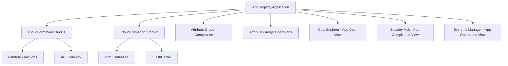

# How to Use AWS Service Catalog AppRegistry

Author: [nawazdhandala](https://github.com/nawazdhandala)

Tags: AWS, Service Catalog, AppRegistry, Application Management, Resource Organization

Description: Learn how to use AWS Service Catalog AppRegistry to organize and manage your cloud applications, track resources, and enable cost and compliance reporting.

---

As your AWS footprint grows, keeping track of which resources belong to which application becomes a real headache. An EC2 instance here, an RDS database there, a Lambda function somewhere else, and suddenly nobody knows what belongs to which project. AWS Service Catalog AppRegistry solves this by giving you a central place to define applications and associate AWS resources with them.

This guide walks through creating applications in AppRegistry, associating resources, integrating with CloudFormation, and using application metadata for cost and compliance reporting.

## What Is AppRegistry?

AppRegistry is a feature within AWS Service Catalog that lets you:

- Define logical applications
- Associate CloudFormation stacks and resources with those applications
- Add metadata (attributes) to applications
- Group related applications together
- Generate cost reports and compliance views per application

Think of it as a registry that maps the business concept of "an application" to the underlying AWS infrastructure that powers it. Instead of tracking resources by account, region, or tag (which are all imperfect), you define applications explicitly and associate their components.

## Why You Need Application-Level Visibility

Without AppRegistry, answering questions like these is surprisingly hard:

- "How much does Application X cost per month?"
- "Which resources belong to the payment processing system?"
- "Are all resources for Application Y compliant with our security standards?"
- "If we decommission Application Z, which resources can we delete?"

Tags help, but tags are inconsistent, easy to forget, and hard to enforce retroactively. AppRegistry provides a structured, intentional way to maintain this mapping.

## Prerequisites

- AWS account with Service Catalog access
- CloudFormation stacks for your applications (recommended but not required)
- IAM permissions for `servicecatalog:*` and `cloudformation:*`

## Step 1: Create an Application

Start by defining an application in AppRegistry:

```bash
# Create an application in AppRegistry
aws servicecatalog-appregistry create-application \
  --name "payment-processing" \
  --description "Payment processing microservices and infrastructure"
```

This returns an application ID and ARN that you will use in subsequent steps.

You can also create applications with tags for additional metadata:

```bash
# Create an application with tags
aws servicecatalog-appregistry create-application \
  --name "order-management" \
  --description "Order management system including API, workers, and database" \
  --tags Team=commerce,Environment=production,CostCenter=CC-5678
```

## Step 2: Associate CloudFormation Stacks

The primary way to link resources to an application is through CloudFormation stack associations. When you associate a stack, all resources in that stack are automatically linked to the application.

```bash
# Associate a CloudFormation stack with the application
aws servicecatalog-appregistry associate-resource \
  --application "payment-processing" \
  --resource-type CFN_STACK \
  --resource "arn:aws:cloudformation:us-east-1:123456789012:stack/payment-api/abc123"

# Associate another stack
aws servicecatalog-appregistry associate-resource \
  --application "payment-processing" \
  --resource-type CFN_STACK \
  --resource "arn:aws:cloudformation:us-east-1:123456789012:stack/payment-database/def456"
```

## Step 3: Add Attribute Groups

Attribute groups let you attach structured metadata to your applications. This is useful for compliance, operational, and business metadata.

```bash
# Create an attribute group for compliance metadata
aws servicecatalog-appregistry create-attribute-group \
  --name "compliance-metadata" \
  --description "Compliance and regulatory metadata" \
  --attributes '{
    "dataClassification": "PCI-DSS",
    "dataRetention": "7 years",
    "encryptionRequired": true,
    "backupFrequency": "daily",
    "rto": "4 hours",
    "rpo": "1 hour",
    "complianceFrameworks": ["PCI-DSS", "SOC2"],
    "lastAuditDate": "2026-01-15"
  }'
```

Now associate the attribute group with your application:

```bash
# Associate the attribute group with the application
aws servicecatalog-appregistry associate-attribute-group \
  --application "payment-processing" \
  --attribute-group "compliance-metadata"
```

Multiple applications can share the same attribute group, which is useful when you have common compliance requirements across applications.

## Step 4: Create an Application with CloudFormation

For infrastructure as code, define your application and associations directly in CloudFormation:

```yaml
# CloudFormation template with AppRegistry integration
AWSTemplateFormatVersion: '2010-09-09'
Description: Payment Processing Application with AppRegistry

Resources:
  # Define the application
  PaymentApp:
    Type: AWS::ServiceCatalogAppRegistry::Application
    Properties:
      Name: payment-processing
      Description: Payment processing microservices and infrastructure
      Tags:
        Team: commerce
        Environment: production

  # Create and associate an attribute group
  ComplianceAttributes:
    Type: AWS::ServiceCatalogAppRegistry::AttributeGroup
    Properties:
      Name: payment-compliance
      Description: Compliance metadata for payment processing
      Attributes:
        dataClassification: PCI-DSS
        encryptionRequired: true
        backupFrequency: daily

  AttributeGroupAssociation:
    Type: AWS::ServiceCatalogAppRegistry::AttributeGroupAssociation
    Properties:
      Application: !GetAtt PaymentApp.Id
      AttributeGroup: !GetAtt ComplianceAttributes.Id

  # Associate this stack with the application
  StackAssociation:
    Type: AWS::ServiceCatalogAppRegistry::ResourceAssociation
    Properties:
      Application: !GetAtt PaymentApp.Id
      Resource: !Ref AWS::StackId
      ResourceType: CFN_STACK

  # Your actual resources
  PaymentApiFunction:
    Type: AWS::Lambda::Function
    Properties:
      FunctionName: payment-api
      Runtime: nodejs20.x
      Handler: index.handler
      Code:
        ZipFile: |
          exports.handler = async (event) => {
            return { statusCode: 200, body: 'OK' };
          };
      Role: !GetAtt PaymentApiRole.Arn

  PaymentApiRole:
    Type: AWS::IAM::Role
    Properties:
      AssumeRolePolicyDocument:
        Version: '2012-10-17'
        Statement:
          - Effect: Allow
            Principal:
              Service: lambda.amazonaws.com
            Action: sts:AssumeRole
      ManagedPolicyArns:
        - arn:aws:iam::aws:policy/service-role/AWSLambdaBasicExecutionRole

  PaymentDatabase:
    Type: AWS::DynamoDB::Table
    Properties:
      TableName: payments
      BillingMode: PAY_PER_REQUEST
      AttributeDefinitions:
        - AttributeName: paymentId
          AttributeType: S
      KeySchema:
        - AttributeName: paymentId
          KeyType: HASH
```

By including the `ResourceAssociation` resource, the stack itself (and all its resources) gets linked to the application automatically.

## Step 5: Query Application Resources

Once you have applications set up, you can query what belongs to them:

```bash
# List all resources associated with an application
aws servicecatalog-appregistry list-associated-resources \
  --application "payment-processing"

# Get full application details
aws servicecatalog-appregistry get-application \
  --application "payment-processing"

# List all attribute groups for an application
aws servicecatalog-appregistry list-associated-attribute-groups \
  --application "payment-processing"

# List all applications
aws servicecatalog-appregistry list-applications
```

## Step 6: Enable AWS Cost Explorer Integration

One of the most valuable features of AppRegistry is application-level cost tracking. When you associate resources with applications, AWS can generate cost reports per application.

Enable this in the Service Catalog settings:

```bash
# Enable application tag propagation
# This propagates the awsApplication tag to all associated resources
aws servicecatalog-appregistry sync-resource \
  --resource-type CFN_STACK \
  --resource "arn:aws:cloudformation:us-east-1:123456789012:stack/payment-api/abc123"
```

AppRegistry automatically applies an `awsApplication` tag to associated resources. You can then use this tag in Cost Explorer to filter costs by application.

## Architecture Overview

Here is how AppRegistry fits into your application management workflow:



## Cross-Account Applications

For applications that span multiple accounts, you can share AppRegistry applications using AWS RAM (Resource Access Manager):

```bash
# Share an application with another account
aws ram create-resource-share \
  --name "payment-app-share" \
  --resource-arns "arn:aws:servicecatalog:us-east-1:123456789012:application/abc123" \
  --principals "222222222222"
```

The target account can then associate its own stacks with the shared application, giving you a unified view across accounts.

## Best Practices

1. **One application per business capability.** Map AppRegistry applications to business capabilities, not to individual microservices. This gives you the most useful cost and compliance views.

2. **Use attribute groups for shared metadata.** Create reusable attribute groups for common metadata like compliance requirements, SLA targets, and cost allocation.

3. **Associate stacks, not individual resources.** CloudFormation stack association is the cleanest way to link resources. It automatically picks up new resources when you update the stack.

4. **Integrate early.** Add AppRegistry associations to your CloudFormation templates from the start. Retrofitting is possible but more work.

5. **Leverage the awsApplication tag.** This automatically propagated tag is your bridge to Cost Explorer, Security Hub, and other AWS services that support tag-based filtering.

## Wrapping Up

AWS Service Catalog AppRegistry brings order to the chaos of cloud resource management. By defining applications explicitly and associating their infrastructure, you gain the ability to answer fundamental questions about cost, compliance, and ownership at the application level. Start by registering your most important applications, associate their CloudFormation stacks, and add compliance metadata through attribute groups. The visibility you gain is worth the modest setup effort.
