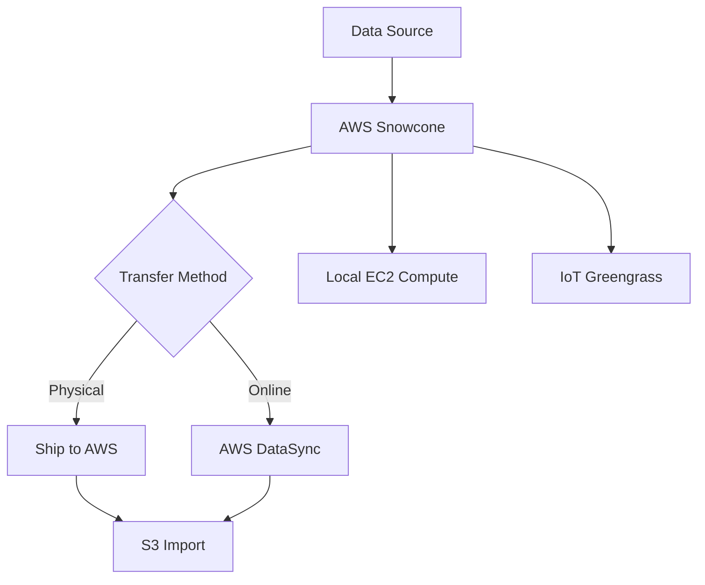

# How to Use AWS Snowcone for Edge Computing and Data Transfer

Author: [nawazdhandala](https://github.com/nawazdhandala)

Tags: AWS, Snowcone, Edge Computing, Data Transfer, IoT

Description: Learn to use AWS Snowcone for lightweight edge computing and data transfer in remote or bandwidth-constrained environments, from ordering to data collection and shipping.

---

Not every data transfer problem needs a 80 TB Snowball Edge. Sometimes you're dealing with a few terabytes at a remote location with limited network connectivity - a construction site, a ship at sea, a field research station, or a small branch office. AWS Snowcone is built for exactly these scenarios.

Snowcone is the smallest member of the AWS Snow Family. It weighs 4.5 pounds, has 14 TB of usable storage (or 14 TB SSD with Snowcone SSD), and can run EC2 instances and AWS IoT Greengrass for edge computing. You can ship it back to AWS for data import or use AWS DataSync to transfer data online when connectivity is available.

## Snowcone vs. Snowball Edge

Here's when to pick Snowcone:

- **Small data volumes** (up to 14 TB)
- **Tight spaces** where a full Snowball Edge won't fit
- **Remote or harsh environments** (it's ruggedized and can operate without a climate-controlled room)
- **Edge computing** with lightweight workloads
- **Drone or vehicle deployment** where size and weight matter



## Step 1: Order a Snowcone

Create a Snowcone job through the CLI:

```bash
# Create an import job for Snowcone
aws snowball create-job \
  --job-type IMPORT \
  --resources '{
    "S3Resources": [{
      "BucketArn": "arn:aws:s3:::field-data-bucket",
      "KeyRange": {}
    }]
  }' \
  --description "Field research station - monthly data collection" \
  --address-id "ADID-12345678-1234-1234-1234-123456789012" \
  --role-arn "arn:aws:iam::123456789012:role/SnowconeImportRole" \
  --snowball-type "SNC1_SSD" \
  --shipping-option "SECOND_DAY"
```

The `SNC1_SSD` type is the Snowcone with SSD storage. For HDD storage (cheaper but slower), use `SNC1_HDD`. The SSD variant is recommended if you're running compute workloads alongside storage.

## Step 2: Set Up the Snowcone

When the device arrives, it's surprisingly small - about the size of a tissue box. Power it using the included power adapter or a USB-C power source.

Connect it to your network via the built-in ethernet ports (10GbE RJ45 or Wi-Fi):

```bash
# Download and install the Snowball Edge client
# (same client works for Snowcone)

# Unlock the device
snowballEdge unlock-device \
  --manifest-file /path/to/manifest.bin \
  --unlock-code "12345-abcde-12345-abcde-12345" \
  --endpoint https://192.168.1.50

# Check device status
snowballEdge describe-device \
  --endpoint https://192.168.1.50 \
  --manifest-file /path/to/manifest.bin \
  --unlock-code "12345-abcde-12345-abcde-12345"
```

## Step 3: Transfer Data to Snowcone

Using the local S3 endpoint on the device:

```bash
# Get the S3 endpoint credentials
snowballEdge list-access-keys \
  --endpoint https://192.168.1.50 \
  --manifest-file manifest.bin \
  --unlock-code "12345-abcde-12345-abcde-12345"

snowballEdge get-secret-access-key \
  --access-key-id AKIA... \
  --endpoint https://192.168.1.50 \
  --manifest-file manifest.bin \
  --unlock-code "12345-abcde-12345-abcde-12345"

# Configure the CLI profile
aws configure set profile.snowcone.aws_access_key_id AKIA...
aws configure set profile.snowcone.aws_secret_access_key SECRET...
aws configure set profile.snowcone.region snow

# Copy data to the Snowcone
aws s3 sync /data/sensor-readings/ s3://field-data-bucket/readings/ \
  --profile snowcone \
  --endpoint-url https://192.168.1.50:8443
```

For automated data collection from IoT sensors or cameras, you can set up a cron job:

```bash
# Script to collect data periodically
# Save as /usr/local/bin/sync-to-snowcone.sh

#!/bin/bash
TIMESTAMP=$(date +%Y%m%d-%H%M%S)
SOURCE_DIR="/data/cameras/latest/"
DEST="s3://field-data-bucket/cameras/$TIMESTAMP/"

aws s3 sync "$SOURCE_DIR" "$DEST" \
  --profile snowcone \
  --endpoint-url https://192.168.1.50:8443 \
  --quiet

echo "$(date): Synced to Snowcone - $DEST" >> /var/log/snowcone-sync.log
```

## Step 4: Run Edge Compute (Optional)

Snowcone can run EC2 instances for local processing. This is useful for filtering or preprocessing data before storing it:

```bash
# List available AMIs on the device
snowballEdge describe-device \
  --endpoint https://192.168.1.50 \
  --manifest-file manifest.bin \
  --unlock-code "12345-abcde-12345-abcde-12345"

# Launch an EC2 instance on the Snowcone
aws ec2 run-instances \
  --image-id s.ami-0123456789abcdef0 \
  --instance-type snc1.micro \
  --profile snowcone \
  --endpoint-url https://192.168.1.50:8008

# The instance has access to the local S3 endpoint
# Your application can read sensor data, process it,
# and write results back to S3 on the device
```

Available instance types on Snowcone are limited due to the device's resources (2 vCPUs, 4 GB RAM available for compute). The `snc1.micro` type gives you 1 vCPU and 1 GB RAM, while `snc1.small` gives you 1 vCPU and 2 GB RAM.

## Step 5: Use DataSync for Online Transfer

If you have some network connectivity (even intermittent), you can use DataSync to transfer data from the Snowcone to S3 while still in the field:

```bash
# Start the DataSync agent on the Snowcone
snowballEdge start-service datasync \
  --endpoint https://192.168.1.50 \
  --manifest-file manifest.bin \
  --unlock-code "12345-abcde-12345-abcde-12345"

# Get the DataSync agent's virtual network interface
snowballEdge describe-virtual-network-interfaces \
  --endpoint https://192.168.1.50 \
  --manifest-file manifest.bin \
  --unlock-code "12345-abcde-12345-abcde-12345"

# Activate the DataSync agent (from a machine with internet access)
aws datasync create-agent \
  --activation-key "ABCDE-12345-FGHIJ-67890-KLMNO" \
  --agent-name "snowcone-field-station"
```

Then create a DataSync task to transfer data from the Snowcone's NFS endpoint to S3:

```bash
# Create the source location (Snowcone NFS)
aws datasync create-location-nfs \
  --server-hostname "192.168.1.50" \
  --subdirectory "/buckets/field-data-bucket" \
  --on-prem-config '{
    "AgentArns": ["arn:aws:datasync:us-east-1:123456789012:agent/agent-snowcone01"]
  }'

# Create the destination location (S3)
aws datasync create-location-s3 \
  --s3-bucket-arn "arn:aws:s3:::field-data-bucket" \
  --s3-config '{
    "BucketAccessRoleArn": "arn:aws:iam::123456789012:role/DataSyncS3Role"
  }'

# Create and run the task
aws datasync create-task \
  --source-location-arn "arn:aws:datasync:us-east-1:123456789012:location/loc-snowcone" \
  --destination-location-arn "arn:aws:datasync:us-east-1:123456789012:location/loc-s3dest" \
  --name "snowcone-to-s3-field-data" \
  --options '{"TransferMode": "CHANGED", "VerifyMode": "ONLY_FILES_TRANSFERRED"}'
```

This hybrid approach is great - transfer what you can online, and ship the device when it's full or when connectivity is too poor.

## Step 6: Ship the Device (or Use Online Transfer)

When you're done collecting data:

```bash
# Check how much data is on the device
aws s3 ls s3://field-data-bucket/ --recursive --summarize \
  --profile snowcone \
  --endpoint-url https://192.168.1.50:8443

# Power off the device
snowballEdge stop-service s3 \
  --endpoint https://192.168.1.50 \
  --manifest-file manifest.bin \
  --unlock-code "12345-abcde-12345-abcde-12345"
```

Ship the device back using the prepaid shipping label. Alternatively, if you used DataSync to transfer all the data online, you can return the device empty and save the import time.

## Step 7: Monitor the Import Job

```bash
# Track job progress
aws snowball describe-job \
  --job-id JID-12345678-1234-1234-1234-123456789012 \
  --query '{
    Status: JobMetadata.JobState,
    Progress: JobMetadata.DataTransferProgress
  }'
```

## Use Cases

Snowcone shines in scenarios that bigger devices can't handle:

- **Remote research**: Deploy to field stations, ships, or aircraft. Collect environmental data and ship back periodically.
- **Healthcare**: Small clinics generating imaging data without reliable internet.
- **Construction sites**: Collect drone footage and 3D scanning data.
- **Military and defense**: Ruggedized, portable, operates in extreme conditions.
- **Content creation**: Film crews in remote locations generating terabytes of footage.

## Cost

Snowcone pricing includes a per-job fee (about $60 for Snowcone SSD) plus daily usage charges ($6/day with the first 5 days included). Shipping is included. For the amount of convenience and flexibility you get in remote or disconnected environments, it's remarkably affordable.

The combination of small form factor, edge compute, and flexible data transfer options makes Snowcone a unique tool in the AWS toolkit. It's not the answer for every data transfer challenge, but for the scenarios it was designed for, there's really nothing else like it.
