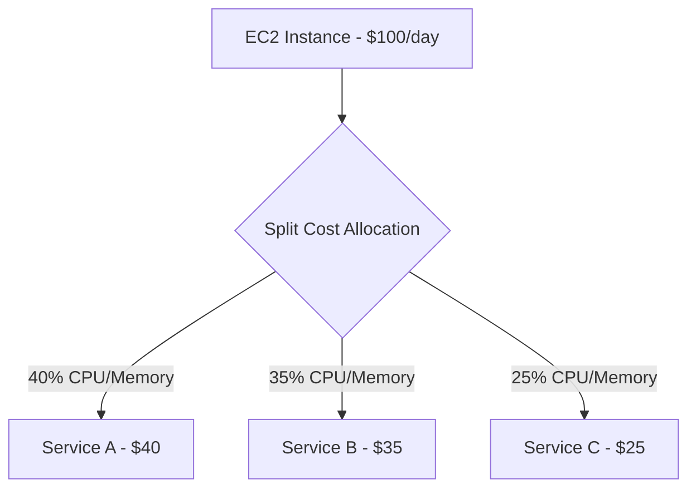

# How to Use AWS Split Cost Allocation for Containers

Author: [nawazdhandala](https://github.com/nawazdhandala)

Tags: AWS, Cost Management, Containers, ECS, EKS, FinOps, Cost Allocation

Description: Learn how to use AWS Split Cost Allocation for containers to accurately attribute costs to individual ECS tasks and EKS pods running on shared infrastructure.

---

Containers are great for efficiency because you pack multiple workloads onto shared compute. But that efficiency creates a cost attribution nightmare. When five services share an EC2 instance, how do you know which service is responsible for how much of the bill? AWS Split Cost Allocation for containers solves this by breaking down container infrastructure costs at the individual task (ECS) or pod (EKS) level.

This guide covers enabling split cost allocation, understanding how costs are divided, and using the data for accurate chargeback reporting.

## What Is Split Cost Allocation?

Split Cost Allocation is an AWS Cost Management feature that automatically divides the cost of shared container infrastructure (EC2 instances, Fargate compute) among the individual containers running on that infrastructure. Instead of seeing one line item for an EC2 instance, you see the cost attributed to each ECS task or EKS pod that ran on it.

The allocation is based on actual resource usage (CPU and memory) as a proportion of the total available resources on the host.

## How It Works



For each container host, AWS measures:
- The CPU and memory reserved or consumed by each task/pod
- The total CPU and memory available on the host
- The proportion each container uses

This proportion is then applied to the host's cost. If a task uses 40% of an instance's resources, it gets allocated 40% of the instance's cost.

## Supported Platforms

Split Cost Allocation works with:

- **Amazon ECS on EC2** - Tasks running on EC2 container instances
- **Amazon ECS on Fargate** - Fargate tasks (already per-task, but split cost adds tag-based allocation)
- **Amazon EKS on EC2** - Pods running on EC2 worker nodes
- **Amazon EKS on Fargate** - Fargate pods

## Prerequisites

- AWS Cost and Usage Report (CUR) or CUR 2.0 enabled
- Container workloads running on ECS or EKS
- Cost allocation tags activated (for tag-based attribution)

## Step 1: Enable Split Cost Allocation

Enable the feature in the AWS Billing console or via the CLI:

```bash
# Enable split cost allocation for ECS
aws ce update-cost-allocation-tags-status \
  --cost-allocation-tags-status '[
    {
      "TagKey": "aws:ecs:clusterName",
      "Status": "Active"
    },
    {
      "TagKey": "aws:ecs:serviceName",
      "Status": "Active"
    }
  ]'
```

For EKS, you need to install the AWS Split Cost Allocation Data Agent:

```bash
# Install the EKS cost allocation agent via Helm
helm repo add aws-cost-allocation https://aws.github.io/split-cost-allocation-data

helm install split-cost-allocation \
  aws-cost-allocation/split-cost-allocation-data \
  --namespace amazon-cloudwatch \
  --create-namespace \
  --set clusterName=my-eks-cluster \
  --set region=us-east-1 \
  --set serviceAccount.create=true
```

## Step 2: Configure CUR to Include Split Cost Data

If you are using CUR 2.0, include split cost allocation data in your export:

```bash
# Create a CUR 2.0 export with split cost allocation data
aws bcm-data-exports create-export \
  --export '{
    "Name": "container-cost-report",
    "DataQuery": {
      "QueryStatement": "SELECT identity_line_item_id, bill_payer_account_id, line_item_usage_account_id, line_item_product_code, line_item_resource_id, line_item_usage_amount, line_item_unblended_cost, split_line_item_task_id, split_line_item_parent_resource_id, split_line_item_public_on_demand_split_cost, split_line_item_reserved_usage_split_cost, split_line_item_actual_usage, resource_tags FROM COST_AND_USAGE_REPORT",
      "TableConfigurations": {
        "COST_AND_USAGE_REPORT": {
          "TIME_GRANULARITY": "DAILY",
          "INCLUDE_RESOURCES": "TRUE",
          "INCLUDE_SPLIT_COST_ALLOCATION_DATA": "TRUE"
        }
      }
    },
    "DestinationConfigurations": {
      "S3Destination": {
        "S3Bucket": "container-billing-123456789012",
        "S3Prefix": "split-cost/",
        "S3Region": "us-east-1",
        "S3OutputConfigurations": {
          "OutputType": "CUSTOM",
          "Format": "PARQUET",
          "Compression": "PARQUET",
          "Overwrite": "OVERWRITE_REPORT"
        }
      }
    },
    "RefreshCadence": {
      "Frequency": "SYNCHRONOUS"
    }
  }'
```

## Step 3: Understand the Split Cost Columns

The CUR with split cost allocation adds these key columns:

| Column | Description |
|--------|-------------|
| `split_line_item_task_id` | ECS task ID or EKS pod name |
| `split_line_item_parent_resource_id` | The EC2 instance hosting the container |
| `split_line_item_public_on_demand_split_cost` | On-demand cost attributed to this container |
| `split_line_item_reserved_usage_split_cost` | Reserved instance cost attributed to this container |
| `split_line_item_actual_usage` | Actual resource usage by this container |

## Step 4: Query Split Cost Data with Athena

Here are practical queries for analyzing container costs.

Cost per ECS service:

```sql
-- Cost per ECS service for the current month
SELECT
    resource_tags_aws_ecs_service_name AS service_name,
    resource_tags_aws_ecs_cluster_name AS cluster,
    ROUND(SUM(split_line_item_public_on_demand_split_cost), 2) AS total_cost,
    COUNT(DISTINCT split_line_item_task_id) AS task_count
FROM container_billing
WHERE bill_billing_period_start_date = '2026-02-01'
    AND split_line_item_task_id IS NOT NULL
GROUP BY resource_tags_aws_ecs_service_name,
         resource_tags_aws_ecs_cluster_name
ORDER BY total_cost DESC;
```

Cost per EKS namespace:

```sql
-- Cost per Kubernetes namespace
SELECT
    resource_tags_aws_eks_namespace AS namespace,
    resource_tags_aws_eks_cluster_name AS cluster,
    ROUND(SUM(split_line_item_public_on_demand_split_cost), 2) AS total_cost,
    COUNT(DISTINCT split_line_item_task_id) AS pod_count
FROM container_billing
WHERE bill_billing_period_start_date = '2026-02-01'
    AND resource_tags_aws_eks_namespace IS NOT NULL
GROUP BY resource_tags_aws_eks_namespace,
         resource_tags_aws_eks_cluster_name
ORDER BY total_cost DESC;
```

Daily container cost trend:

```sql
-- Daily cost trend per service
SELECT
    DATE(line_item_usage_start_date) AS usage_date,
    resource_tags_aws_ecs_service_name AS service_name,
    ROUND(SUM(split_line_item_public_on_demand_split_cost), 2) AS daily_cost
FROM container_billing
WHERE bill_billing_period_start_date = '2026-02-01'
    AND split_line_item_task_id IS NOT NULL
GROUP BY DATE(line_item_usage_start_date),
         resource_tags_aws_ecs_service_name
ORDER BY usage_date, daily_cost DESC;
```

## Step 5: Handle Unallocated Costs

Not all container host costs can be attributed to specific containers. Idle capacity, system overhead, and daemonsets create "unallocated" costs. Split Cost Allocation reports these separately.

```sql
-- Find unallocated costs per cluster
SELECT
    resource_tags_aws_ecs_cluster_name AS cluster,
    ROUND(SUM(CASE
        WHEN split_line_item_task_id IS NULL
        THEN line_item_unblended_cost
        ELSE 0
    END), 2) AS unallocated_cost,
    ROUND(SUM(CASE
        WHEN split_line_item_task_id IS NOT NULL
        THEN split_line_item_public_on_demand_split_cost
        ELSE 0
    END), 2) AS allocated_cost
FROM container_billing
WHERE bill_billing_period_start_date = '2026-02-01'
GROUP BY resource_tags_aws_ecs_cluster_name;
```

High unallocated costs indicate over-provisioned clusters with idle capacity. This is a signal to right-size your container hosts.

## Step 6: Build a Chargeback Dashboard

Combine the split cost data with your application metadata to create team-level chargeback:

```sql
-- Team-level chargeback report
SELECT
    resource_tags_team AS team,
    resource_tags_environment AS environment,
    resource_tags_aws_ecs_service_name AS service,
    ROUND(SUM(split_line_item_public_on_demand_split_cost), 2) AS monthly_cost,
    ROUND(SUM(split_line_item_actual_usage), 2) AS total_usage_hours
FROM container_billing
WHERE bill_billing_period_start_date = '2026-02-01'
    AND split_line_item_task_id IS NOT NULL
GROUP BY resource_tags_team,
         resource_tags_environment,
         resource_tags_aws_ecs_service_name
ORDER BY team, monthly_cost DESC;
```

## Best Practices

1. **Tag your containers consistently.** Split cost allocation leverages tags for grouping. Make sure every ECS service and EKS deployment has team, application, and environment tags.

2. **Monitor unallocated costs.** High unallocated percentages mean wasted capacity. Use this signal to optimize cluster sizing.

3. **Combine with Savings Plans data.** Split cost allocation shows how Reserved Instance and Savings Plans discounts are distributed across containers, giving you accurate effective costs.

4. **Use namespace-based allocation for EKS.** Kubernetes namespaces map well to cost centers. Structure your namespaces to align with your billing structure.

5. **Review weekly, not just monthly.** Container workloads are dynamic. Weekly reviews help you catch cost anomalies before they become big surprises.

For more on building custom billing reports, check out our guide on [creating custom AWS billing reports with CUR 2.0](https://oneuptime.com/blog/post/2026-02-12-create-custom-aws-billing-reports-with-cur-20/view).

## Wrapping Up

AWS Split Cost Allocation for containers brings transparency to the previously opaque world of shared container infrastructure costs. By automatically dividing host costs among individual tasks and pods based on actual resource usage, it gives you the data you need for accurate chargeback, capacity optimization, and cost anomaly detection. Enable it in your CUR, install the EKS agent if needed, and start querying. The insights you gain will change how your teams think about container resource usage.
