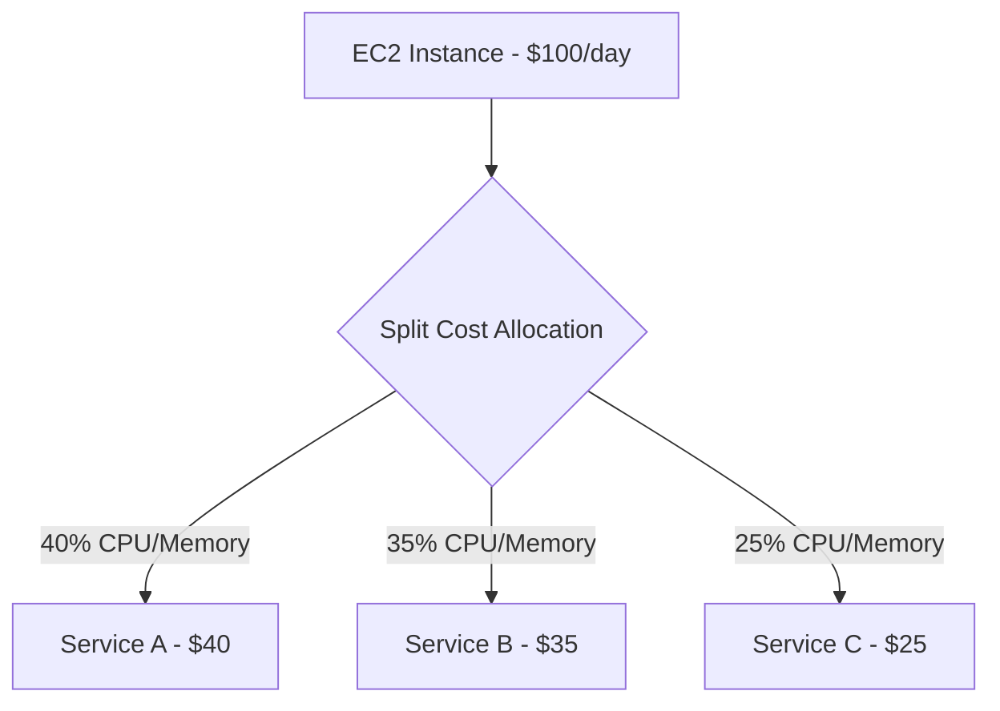

# How to Use AWS Split Cost Allocation for Containers

Author: [nawazdhandala](https://github.com/nawazdhandala)

Tags: AWS, Cost Management, Container, ECS, EKS, FinOps, Cost Allocation

Description: Learn how to use AWS Split Cost Allocation for containers to accurately attribute costs to individual ECS tasks and EKS pods running on shared infrastructure.

---

Containers are great for efficiency because you pack multiple workloads onto shared compute. But that efficiency creates a cost attribution nightmare. When five services share an EC2 instance, how do you know which service is responsible for how much of the bill? AWS Split Cost Allocation for containers solves this by breaking down container infrastructure costs at the individual task (ECS) or pod (EKS) level.

This guide covers enabling split cost allocation, understanding how costs are divided, and using the data for accurate chargeback reporting.

## What Is Split Cost Allocation?

Split Cost Allocation is an AWS Cost Management feature that automatically divides the cost of shared container infrastructure among the individual containers running on that infrastructure. Instead of seeing only the EC2 instance-level cost, you get additional cost and usage records for each ECS task or EKS pod.

The allocation is based on CPU and memory usage, reservations, or Kubernetes requests, depending on the platform and the measurement option you choose.

## How It Works


```mermaid
graph TD
    A[EC2 Instance - $100/day] --> B{Split Cost Allocation}
    B -->|40% CPU/Memory| C[Service A - $40]
    B -->|35% CPU/Memory| D[Service B - $35]
    B -->|25% CPU/Memory| E[Service C - $25]
```

For each container host, AWS measures:
- The CPU and memory reserved, requested, or consumed by each task/pod
- The total CPU and memory available on the host
- The proportion each container uses

This proportion is then applied to the host's cost. If a task is allocated 40% of an instance's resources for the billing period, it gets allocated 40% of the applicable instance cost.

## Supported Platforms

Split Cost Allocation works with:

- **Amazon ECS on EC2** - Tasks running on EC2 container instances
- **Amazon ECS on Fargate** - Fargate tasks
- **AWS Batch** - Batch jobs
- **Amazon EKS on EC2** - Pods running on EC2 worker nodes

## Prerequisites

- AWS Cost and Usage Report (CUR) or CUR 2.0 enabled
- Container workloads running on ECS, EKS, or AWS Batch
- Cost allocation tags activated (for tag-based attribution)

## Step 1: Enable Split Cost Allocation

Enable the feature in the AWS Billing and Cost Management console under **Cost Management preferences**. In the **Split cost allocation data** section, opt in to Amazon ECS, Amazon EKS, or both.

For EKS, choose one of the available measurement options:

- **Resource requests** - Allocates EC2 costs by Kubernetes pod CPU and memory requests.
- **Amazon Managed Service for Prometheus** - Allocates EC2 costs by the higher of pod requests and actual utilization.
- **Amazon CloudWatch Container Insights** - Uses EKS observability metrics such as pod CPU and memory usage.

Activating cost allocation tags is still useful for reporting, but it does not enable split cost allocation by itself.

## Step 2: Configure CUR to Include Split Cost Data

If you are using CUR 2.0, include split cost allocation data in your export:

```bash
# Create a CUR 2.0 export with split cost allocation data
aws bcm-data-exports create-export \
  --export '{
    "Name": "container-cost-report",
    "DataQuery": {
      "QueryStatement": "SELECT identity_line_item_id, bill_payer_account_id, line_item_usage_account_id, line_item_product_code, line_item_resource_id, line_item_usage_amount, line_item_unblended_cost, split_line_item_parent_resource_id, split_line_item_public_on_demand_split_cost, split_line_item_split_cost, split_line_item_unused_cost, split_line_item_actual_usage, split_line_item_split_usage, resource_tags FROM COST_AND_USAGE_REPORT",
      "TableConfigurations": {
        "COST_AND_USAGE_REPORT": {
          "TIME_GRANULARITY": "DAILY",
          "INCLUDE_RESOURCES": "TRUE",
          "INCLUDE_SPLIT_COST_ALLOCATION_DATA": "TRUE"
        }
      }
    },
    "DestinationConfigurations": {
      "S3Destination": {
        "S3Bucket": "container-billing-123456789012",
        "S3Prefix": "split-cost/",
        "S3Region": "us-east-1",
        "S3OutputConfigurations": {
          "OutputType": "CUSTOM",
          "Format": "PARQUET",
          "Compression": "PARQUET",
          "Overwrite": "OVERWRITE_REPORT"
        }
      }
    },
    "RefreshCadence": {
      "Frequency": "SYNCHRONOUS"
    }
  }'
```

## Step 3: Understand the Split Cost Columns

The CUR with split cost allocation adds these key columns:

| Column | Description |
|--------|-------------|
| `line_item_resource_id` | ECS task ID, EKS pod resource ID, or other resource ID for the split line item |
| `split_line_item_parent_resource_id` | The EC2 instance hosting the container |
| `split_line_item_public_on_demand_split_cost` | On-demand cost attributed to this container |
| `split_line_item_split_cost` | Cost attributed to this container, including amortized reservations or Savings Plans where applicable |
| `split_line_item_unused_cost` | Unused cost attributed to this container |
| `split_line_item_actual_usage` | Actual resource usage by this container |
| `split_line_item_split_usage` | Allocated usage, defined as the maximum of reserved usage and actual usage |

## Step 4: Query Split Cost Data with Athena

Here are practical queries for analyzing container costs.

Cost per ECS service:

```sql
-- Cost per ECS service for the current month
SELECT
    resource_tags['aws:ecs:serviceName'] AS service_name,
    resource_tags['aws:ecs:clusterName'] AS cluster,
    ROUND(SUM(split_line_item_split_cost), 2) AS total_cost,
    COUNT(DISTINCT line_item_resource_id) AS task_count
FROM container_billing
WHERE bill_billing_period_start_date = '2026-02-01'
    AND split_line_item_split_cost IS NOT NULL
GROUP BY resource_tags['aws:ecs:serviceName'],
         resource_tags['aws:ecs:clusterName']
ORDER BY total_cost DESC;
```

Cost per EKS namespace:

```sql
-- Cost per Kubernetes namespace
SELECT
    resource_tags['aws:eks:namespace'] AS namespace,
    resource_tags['aws:eks:cluster-name'] AS cluster,
    ROUND(SUM(split_line_item_split_cost), 2) AS total_cost,
    COUNT(DISTINCT line_item_resource_id) AS pod_count
FROM container_billing
WHERE bill_billing_period_start_date = '2026-02-01'
    AND resource_tags['aws:eks:namespace'] IS NOT NULL
GROUP BY resource_tags['aws:eks:namespace'],
         resource_tags['aws:eks:cluster-name']
ORDER BY total_cost DESC;
```

Daily container cost trend:

```sql
-- Daily cost trend per service
SELECT
    DATE(line_item_usage_start_date) AS usage_date,
    resource_tags['aws:ecs:serviceName'] AS service_name,
    ROUND(SUM(split_line_item_split_cost), 2) AS daily_cost
FROM container_billing
WHERE bill_billing_period_start_date = '2026-02-01'
    AND split_line_item_split_cost IS NOT NULL
GROUP BY DATE(line_item_usage_start_date),
         resource_tags['aws:ecs:serviceName']
ORDER BY usage_date, daily_cost DESC;
```

## Step 5: Handle Unused Costs

Not all container host capacity is used by application workloads. Split Cost Allocation exposes this as unused cost columns, such as `split_line_item_unused_cost`, and applies unused costs proportionately to tasks or pods based on split usage.

```sql
-- Find unused costs per ECS cluster
SELECT
    resource_tags['aws:ecs:clusterName'] AS cluster,
    ROUND(SUM(split_line_item_unused_cost), 2) AS unused_cost,
    ROUND(SUM(split_line_item_split_cost), 2) AS allocated_cost
FROM container_billing
WHERE bill_billing_period_start_date = '2026-02-01'
    AND split_line_item_split_cost IS NOT NULL
GROUP BY resource_tags['aws:ecs:clusterName'];
```

High unused costs indicate over-provisioned clusters with idle capacity. This is a signal to right-size your container hosts.

## Step 6: Build a Chargeback Dashboard

Combine the split cost data with your application metadata to create team-level chargeback:

```sql
-- Team-level chargeback report
SELECT
    resource_tags['team'] AS team,
    resource_tags['environment'] AS environment,
    resource_tags['aws:ecs:serviceName'] AS service,
    ROUND(SUM(split_line_item_split_cost), 2) AS monthly_cost,
    ROUND(SUM(split_line_item_actual_usage), 2) AS total_usage
FROM container_billing
WHERE bill_billing_period_start_date = '2026-02-01'
    AND split_line_item_split_cost IS NOT NULL
GROUP BY resource_tags['team'],
         resource_tags['environment'],
         resource_tags['aws:ecs:serviceName']
ORDER BY team, monthly_cost DESC;
```

## Best Practices

1. **Tag and label your workloads consistently.** Split cost allocation leverages tags for grouping. Make sure every ECS service and EKS workload has consistent team, application, and environment metadata.

2. **Monitor unused costs.** High unused percentages mean wasted capacity. Use this signal to optimize cluster sizing.

3. **Use split cost and net split cost for effective costs.** `split_line_item_split_cost` includes amortized reservations and Savings Plans where applicable, and `split_line_item_net_split_cost` shows effective cost after discounts when that column is present.

4. **Use namespace-based allocation for EKS.** Kubernetes namespaces map well to cost centers. Structure your namespaces to align with your billing structure.

5. **Review weekly, not just monthly.** Container workloads are dynamic. Weekly reviews help you catch cost anomalies before they become big surprises.

For more on building custom billing reports, check out our guide on [creating custom AWS billing reports with CUR 2.0](https://oneuptime.com/blog/post/2026-02-12-create-custom-aws-billing-reports-with-cur-20/view).

## Wrapping Up

AWS Split Cost Allocation for containers brings transparency to the previously opaque world of shared container infrastructure costs. By dividing host costs among individual tasks and pods based on resource usage, reservations, or requests, it gives you the data you need for accurate chargeback, capacity optimization, and cost anomaly detection. Opt in through Cost Management preferences, include split cost allocation data in your CUR, and start querying. The insights you gain will change how your teams think about container resource usage.
