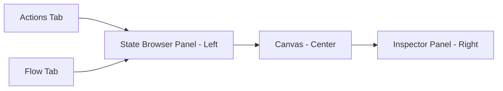
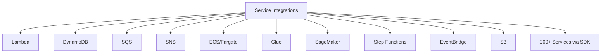

# How to Use AWS Step Functions Workflow Studio

Author: [nawazdhandala](https://github.com/nawazdhandala)

Tags: AWS, Step Functions, Workflow Studio, Serverless, Orchestration, State Machines

Description: Build and visualize AWS Step Functions state machines using Workflow Studio's drag-and-drop interface to orchestrate complex workflows without writing JSON.

---

Step Functions is one of the most powerful AWS services for orchestrating multi-step workflows. But writing Amazon States Language (ASL) JSON by hand is painful. The syntax is verbose, references between states are easy to get wrong, and debugging a malformed state machine definition by staring at hundreds of lines of JSON is nobody's idea of a good time.

Workflow Studio changes this by giving you a visual, drag-and-drop interface for building state machines. You compose workflows by dragging states onto a canvas, configuring them with forms, and connecting them together. Workflow Studio generates the ASL JSON behind the scenes, and you can switch between the visual editor and the code editor at any time.

## Accessing Workflow Studio

Workflow Studio is built into the Step Functions console. When you create or edit a state machine, you get both the visual editor and the code editor:

```bash
# Create a new state machine - this opens Workflow Studio in the console
aws stepfunctions create-state-machine \
  --name "order-processing-workflow" \
  --role-arn "arn:aws:iam::123456789012:role/StepFunctionsRole" \
  --definition '{"StartAt": "Start", "States": {"Start": {"Type": "Pass", "End": true}}}' \
  --type "STANDARD"
```

But the real power is in the console's visual editor. Navigate to Step Functions in the AWS Console, click "Create state machine," and you land in Workflow Studio.

## Understanding the Workflow Studio Interface

The interface has three main areas:



**State Browser (left)** - all available state types and AWS service integrations, organized by category. Drag states from here to the canvas.

**Canvas (center)** - the visual representation of your state machine. States appear as blocks connected by arrows showing the flow.

**Inspector (right)** - configuration panel for the selected state. This is where you set parameters, input/output processing, error handling, and retry logic.

## Building an Order Processing Workflow

Let us build a realistic workflow that processes an order through multiple steps: validation, payment, inventory check, shipment, and notification.

### Step 1: Define the Workflow Flow

Start by dragging the flow control states onto the canvas:

1. **Pass state** (Start) - entry point
2. **Lambda Invoke** (Validate Order) - check order data
3. **Choice state** (Is Valid?) - branch based on validation result
4. **Parallel state** (Process Order) - run payment and inventory in parallel
5. **Lambda Invoke** (Create Shipment) - create shipping label
6. **Lambda Invoke** (Send Notification) - notify the customer
7. **Fail state** (Order Failed) - handle failures

### Step 2: Configure Each State

Click on each state in the canvas to configure it in the Inspector panel.

**Validate Order (Lambda Invoke):**
- Function name: `validate-order`
- Payload: use state input

**Is Valid? (Choice):**
- Rule 1: `$.validation.isValid` equals `true` -> Process Order
- Default: -> Order Failed

**Process Order (Parallel):**
- Branch 1: Process Payment (Lambda)
- Branch 2: Check Inventory (Lambda)

**Create Shipment (Lambda Invoke):**
- Function name: `create-shipment`
- Input: merge results from parallel branches

### Step 3: Add Error Handling

For each Lambda state, add retry and catch configurations:

In the Inspector panel for the Payment Lambda:
- **Retry:** on `ServiceException` and `Lambda.TooManyRequestsException`, retry 3 times with exponential backoff
- **Catch:** on all errors, transition to a `HandlePaymentError` state

### The Generated ASL

Workflow Studio generates this ASL definition as you build:

```json
{
  "Comment": "Order processing workflow",
  "StartAt": "Validate Order",
  "States": {
    "Validate Order": {
      "Type": "Task",
      "Resource": "arn:aws:lambda:us-east-1:123456789012:function:validate-order",
      "ResultPath": "$.validation",
      "Next": "Is Valid?",
      "Retry": [
        {
          "ErrorEquals": ["Lambda.ServiceException"],
          "IntervalSeconds": 2,
          "MaxAttempts": 3,
          "BackoffRate": 2.0
        }
      ]
    },
    "Is Valid?": {
      "Type": "Choice",
      "Choices": [
        {
          "Variable": "$.validation.isValid",
          "BooleanEquals": true,
          "Next": "Process Order"
        }
      ],
      "Default": "Order Failed"
    },
    "Process Order": {
      "Type": "Parallel",
      "Branches": [
        {
          "StartAt": "Process Payment",
          "States": {
            "Process Payment": {
              "Type": "Task",
              "Resource": "arn:aws:lambda:us-east-1:123456789012:function:process-payment",
              "Retry": [
                {
                  "ErrorEquals": ["States.ALL"],
                  "IntervalSeconds": 5,
                  "MaxAttempts": 3,
                  "BackoffRate": 2.0
                }
              ],
              "End": true
            }
          }
        },
        {
          "StartAt": "Check Inventory",
          "States": {
            "Check Inventory": {
              "Type": "Task",
              "Resource": "arn:aws:lambda:us-east-1:123456789012:function:check-inventory",
              "End": true
            }
          }
        }
      ],
      "ResultPath": "$.processingResults",
      "Next": "Create Shipment",
      "Catch": [
        {
          "ErrorEquals": ["States.ALL"],
          "ResultPath": "$.error",
          "Next": "Handle Processing Error"
        }
      ]
    },
    "Create Shipment": {
      "Type": "Task",
      "Resource": "arn:aws:lambda:us-east-1:123456789012:function:create-shipment",
      "ResultPath": "$.shipment",
      "Next": "Send Notification"
    },
    "Send Notification": {
      "Type": "Task",
      "Resource": "arn:aws:states:::sns:publish",
      "Parameters": {
        "TopicArn": "arn:aws:sns:us-east-1:123456789012:OrderNotifications",
        "Message.$": "States.Format('Order {} has been shipped. Tracking: {}', $.orderId, $.shipment.trackingNumber)"
      },
      "End": true
    },
    "Order Failed": {
      "Type": "Fail",
      "Error": "OrderValidationFailed",
      "Cause": "Order did not pass validation"
    },
    "Handle Processing Error": {
      "Type": "Task",
      "Resource": "arn:aws:lambda:us-east-1:123456789012:function:handle-error",
      "End": true
    }
  }
}
```

## Direct Service Integrations

One of the most powerful features visible in Workflow Studio is the direct AWS service integrations. Instead of writing Lambda functions to call AWS services, you can invoke them directly from Step Functions.

Workflow Studio's State Browser shows integrations for:



### DynamoDB Integration Example

Drag a "DynamoDB PutItem" action onto the canvas and configure it:

```json
// This is configured through the Inspector panel forms
{
  "Type": "Task",
  "Resource": "arn:aws:states:::dynamodb:putItem",
  "Parameters": {
    "TableName": "Orders",
    "Item": {
      "orderId": { "S.$": "$.orderId" },
      "status": { "S": "processing" },
      "createdAt": { "S.$": "$$.State.EnteredTime" },
      "customerEmail": { "S.$": "$.customerEmail" }
    }
  },
  "ResultPath": "$.dynamoResult",
  "Next": "NextState"
}
```

In Workflow Studio, you do not write this JSON. You fill in form fields for the table name, item attributes, and their types. The JSON is generated automatically.

### SQS Integration Example

Drag "SQS SendMessage" to send a message without Lambda:

Configure in the Inspector:
- Queue URL: your queue URL
- Message body: use JSONPath to reference state input
- Delay seconds: optional

## Working with the Map State

The Map state is one of the trickiest states to configure in raw ASL, but Workflow Studio makes it straightforward. Map iterates over an array in your input and runs a sub-workflow for each element.

Drag a "Map" state onto the canvas. Inside the Map, you get a nested canvas where you design the per-item workflow. Workflow Studio handles the iterator configuration automatically.

Use cases for Map:
- Process each line item in an order
- Run a data transformation on each file in a list
- Send personalized notifications to a list of users

## Testing in Workflow Studio

Workflow Studio includes a test feature where you can run your state machine with sample input and watch the execution flow visually:

```bash
# Start an execution from the CLI
aws stepfunctions start-execution \
  --state-machine-arn "arn:aws:stepfunctions:us-east-1:123456789012:stateMachine:order-processing-workflow" \
  --input '{
    "orderId": "ORD-12345",
    "customerEmail": "customer@example.com",
    "items": [
      {"productId": "PROD-1", "quantity": 2, "price": 29.99},
      {"productId": "PROD-2", "quantity": 1, "price": 49.99}
    ],
    "paymentMethod": "credit_card",
    "shippingAddress": {
      "street": "123 Main St",
      "city": "Seattle",
      "state": "WA",
      "zip": "98101"
    }
  }'
```

In the console, you can watch the execution progress through the visual graph. Each state changes color:
- **Blue** - currently executing
- **Green** - succeeded
- **Red** - failed
- **Gray** - not yet reached

Click on any state to see its input, output, and any error details.

## Express vs Standard Workflows

When creating a state machine in Workflow Studio, you choose between:

**Standard Workflows:**
- Can run for up to one year
- Exactly-once execution
- Full execution history
- Higher cost per state transition
- Best for: long-running processes, workflows that need audit trails

**Express Workflows:**
- Maximum 5-minute duration
- At-least-once execution
- No execution history (use CloudWatch Logs)
- Much cheaper for high-volume
- Best for: real-time data processing, API backends, high-throughput workloads

```bash
# Create an Express workflow
aws stepfunctions create-state-machine \
  --name "realtime-data-processor" \
  --role-arn "arn:aws:iam::123456789012:role/StepFunctionsRole" \
  --definition file://workflow.json \
  --type "EXPRESS" \
  --logging-configuration '{
    "level": "ALL",
    "includeExecutionData": true,
    "destinations": [
      {
        "cloudWatchLogsLogGroup": {
          "logGroupArn": "arn:aws:logs:us-east-1:123456789012:log-group:/aws/stepfunctions/express:*"
        }
      }
    ]
  }'
```

## Exporting and Version Control

Export your workflow for use in CI/CD pipelines:

```bash
# Export the state machine definition
aws stepfunctions describe-state-machine \
  --state-machine-arn "arn:aws:stepfunctions:us-east-1:123456789012:stateMachine:order-processing-workflow" \
  --query "definition" \
  --output text > workflow.json

# Deploy with CloudFormation or SAM
```

Store the ASL JSON in version control alongside your application code. Use Workflow Studio for design and debugging, and your CI/CD pipeline for deployments.

## Wrapping Up

Workflow Studio transforms Step Functions from a service you need to learn a custom JSON language for into something you can build visually and intuitively. The drag-and-drop interface handles the tedious parts - state transitions, IAM permissions for service integrations, error handling configuration - while still giving you full control through the code editor. Start with Workflow Studio for new workflows, and use it as a visualization tool for existing ones that need debugging or modification. For designing the serverless applications that Step Functions orchestrate, check out our guide on [setting up AWS Application Composer for visual design](https://oneuptime.com/blog/post/2026-02-12-set-up-aws-application-composer-for-visual-design/view).
