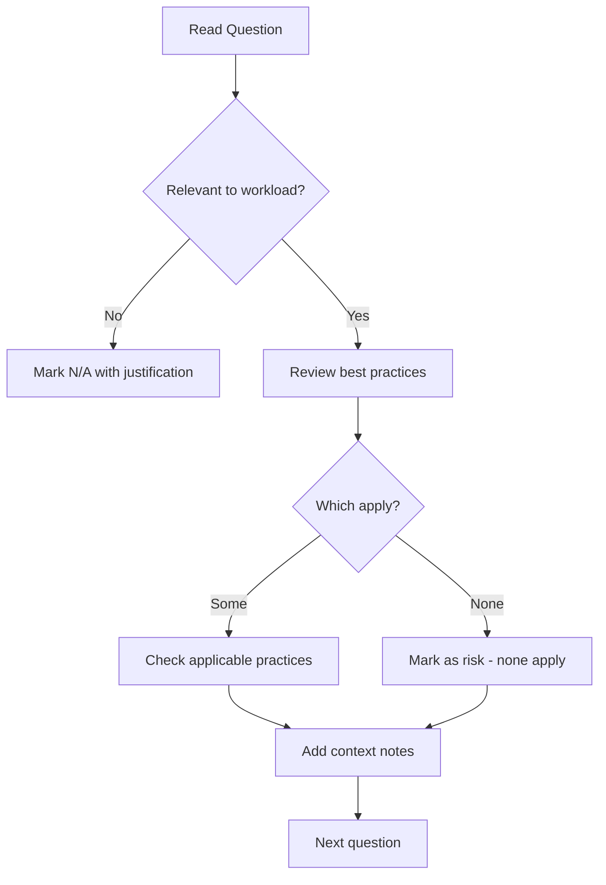

# How to Use AWS Well-Architected Tool for Assessments

Author: [nawazdhandala](https://github.com/nawazdhandala)

Tags: AWS, Well-Architected Tool, Architecture Review, Cloud Governance

Description: A hands-on guide to using the AWS Well-Architected Tool for workload assessments, covering workload definition, lens selection, question workflows, and reporting.

---

The AWS Well-Architected Tool is a free service in the AWS console that helps you review your workloads against the Well-Architected Framework. It provides a structured questionnaire, tracks your progress over time, and generates improvement plans with links to relevant AWS documentation. Think of it as a guided architecture assessment that anyone on your team can run.

This post walks through the tool step by step, from creating your first workload to generating reports and tracking milestones.

## Accessing the Tool

The Well-Architected Tool is available in the AWS console under the "AWS Well-Architected Tool" service. It's free - there's no charge for defining workloads, answering questions, or generating reports.

You need IAM permissions to use it. Here's a policy that grants access:

```hcl
# IAM policy for Well-Architected Tool access
resource "aws_iam_policy" "well_architected" {
  name = "well-architected-tool-access"

  policy = jsonencode({
    Version = "2012-10-17"
    Statement = [
      {
        Effect = "Allow"
        Action = [
          "wellarchitected:*"
        ]
        Resource = "*"
      }
    ]
  })
}

# Attach to a role or group
resource "aws_iam_role_policy_attachment" "architects" {
  role       = aws_iam_role.architects.name
  policy_arn = aws_iam_policy.well_architected.arn
}
```

For read-only access (viewing reviews but not modifying them), restrict to:

```hcl
resource "aws_iam_policy" "well_architected_readonly" {
  name = "well-architected-readonly"

  policy = jsonencode({
    Version = "2012-10-17"
    Statement = [
      {
        Effect = "Allow"
        Action = [
          "wellarchitected:Get*",
          "wellarchitected:List*",
        ]
        Resource = "*"
      }
    ]
  })
}
```

## Step 1: Define a Workload

A workload in the tool represents a specific application or system you want to review. Click "Define workload" and fill in:

- **Workload name**: Something descriptive like "E-commerce Platform" or "Data Analytics Pipeline"
- **Description**: What the workload does and why it matters
- **Environment**: Production, Pre-production, or Non-production
- **Regions**: Which AWS regions the workload runs in
- **Account IDs**: The AWS accounts involved
- **Architecture diagram**: Upload a diagram if you have one

You can also manage workloads programmatically with the AWS CLI or SDK:

```bash
# Create a workload via CLI
aws wellarchitected create-workload \
  --workload-name "E-commerce Platform" \
  --description "Customer-facing shopping and checkout system" \
  --environment PRODUCTION \
  --aws-regions us-east-1 us-west-2 \
  --lenses wellarchitected \
  --review-owner "platform-team@company.com"
```

Or with Terraform:

```hcl
resource "aws_wellarchitected_workload" "ecommerce" {
  workload_name = "E-commerce Platform"
  description   = "Customer-facing shopping and checkout system"
  environment   = "PRODUCTION"
  aws_regions   = ["us-east-1", "us-west-2"]
  lenses        = ["wellarchitected"]
  review_owner  = "platform-team@company.com"

  tags = {
    Team    = "platform"
    Service = "ecommerce"
  }
}
```

## Step 2: Select Lenses

Lenses are specialized questionnaires. The default "AWS Well-Architected Framework" lens covers the six pillars. Additional lenses are available for specific workload types:

- **Serverless Applications Lens** - for Lambda, API Gateway, Step Functions workloads
- **SaaS Lens** - for multi-tenant SaaS applications
- **Machine Learning Lens** - for ML training and inference workloads
- **Data Analytics Lens** - for data lake and analytics architectures
- **Container Build Lens** - for containerized applications
- **Financial Services Lens** - for financial industry compliance
- **Gaming Lens** - for game backend architectures

Select the lenses that match your workload. You can always add more later.

## Step 3: Answer Questions

Each lens contains questions organized by pillar. For each question:

1. **Read the question** and the associated best practices
2. **Select which best practices you've implemented** - check the ones that apply
3. **Add notes** - explain your reasoning, document any tradeoffs
4. **Mark "None of these"** if no best practices apply (this flags a high-risk issue)
5. **Mark "Question does not apply"** if the question isn't relevant to your workload

Here's what the question flow looks like:



### Tips for Answering

**Be honest, not aspirational.** Check a best practice only if it's currently implemented, not if you plan to implement it. The tool is designed to show you where you are today.

**Add notes generously.** Future reviewers (including future you) will appreciate context. Why did you choose single-AZ deployment? What's the plan for adding encryption? Notes make the review valuable beyond the checklist.

**Don't rush.** Each question deserves a real discussion, especially for production workloads. If you're spending less than a minute per question, you're probably not digging deep enough.

## Step 4: Review Results

After answering questions, the tool generates a dashboard showing:

- **Risk count by pillar** - how many high-risk and medium-risk issues per pillar
- **Improvement items** - specific best practices you haven't implemented
- **Improvement plan** - prioritized list of remediation actions

The risk levels are:

- **High Risk** - a significant gap that should be addressed urgently
- **Medium Risk** - an area for improvement that should be planned
- **No Risk** - best practices are in place

## Step 5: Create an Improvement Plan

The tool generates an improvement plan based on your answers. Each improvement item includes:

- The question that flagged the risk
- The best practices that aren't implemented
- Links to AWS documentation and implementation guides
- Risk level

Export the improvement plan to track it in your project management tool:

```bash
# Export the improvement plan
aws wellarchitected list-lens-review-improvements \
  --workload-id "abc123" \
  --lens-alias "wellarchitected" \
  --pillar-id "security" \
  --output json > security_improvements.json
```

## Step 6: Save Milestones

Milestones capture the state of your review at a point in time. After completing a review, save a milestone:

```bash
# Save a milestone
aws wellarchitected create-milestone \
  --workload-id "abc123" \
  --milestone-name "Initial Review - Q1 2026"
```

Milestones let you compare reviews over time. After implementing improvements, run the review again and compare against the previous milestone to see progress.

## Step 7: Generate Reports

The tool can generate PDF reports for stakeholders. Reports show the overall risk profile, identified issues, and improvement recommendations. They're useful for:

- Executive summaries
- Compliance documentation
- Architecture review records
- Team planning discussions

## Automating Assessments

You can automate parts of the assessment using AWS Config and custom rules:

```hcl
# AWS Config rules that map to Well-Architected best practices

# Security Pillar - encryption at rest
resource "aws_config_config_rule" "ebs_encrypted" {
  name = "ebs-encrypted-volumes"

  source {
    owner             = "AWS"
    source_identifier = "ENCRYPTED_VOLUMES"
  }
}

# Reliability Pillar - Multi-AZ RDS
resource "aws_config_config_rule" "rds_multi_az" {
  name = "rds-multi-az"

  source {
    owner             = "AWS"
    source_identifier = "RDS_MULTI_AZ_SUPPORT"
  }
}

# Security Pillar - S3 bucket encryption
resource "aws_config_config_rule" "s3_encryption" {
  name = "s3-default-encryption"

  source {
    owner             = "AWS"
    source_identifier = "S3_DEFAULT_ENCRYPTION_KMS"
  }
}

# Reliability Pillar - backup enabled
resource "aws_config_config_rule" "backup_enabled" {
  name = "backup-plan-min-frequency"

  source {
    owner             = "AWS"
    source_identifier = "BACKUP_PLAN_MIN_FREQUENCY_AND_MIN_RETENTION_CHECK"
  }

  input_parameters = jsonencode({
    requiredFrequencyUnit  = "hours"
    requiredFrequencyValue = 24
    requiredRetentionDays  = 7
  })
}
```

These Config rules continuously monitor specific best practices, supplementing the manual review process.

## Sharing Reviews

You can share workloads with other AWS accounts:

```bash
# Share a workload with another account
aws wellarchitected create-workload-share \
  --workload-id "abc123" \
  --shared-with "987654321012" \
  --permission-type "CONTRIBUTOR"
```

Permission types are:
- **READONLY** - can view the review but not modify it
- **CONTRIBUTOR** - can answer questions and add notes

This is useful when an architecture team wants to review workloads across multiple account teams.

## Best Practices for Using the Tool

1. **Review quarterly** for critical workloads, semi-annually for others
2. **Always save milestones** after completing a review
3. **Assign owners** to improvement items
4. **Track remediation** in your regular sprint planning
5. **Use custom lenses** for organization-specific standards
6. **Share across teams** so everyone learns from each review

## Summary

The AWS Well-Architected Tool turns the framework's best practices into an actionable assessment process. Define your workload, answer the questions honestly, save a milestone, and work through the improvement plan. Repeat quarterly. Over time, you'll see your risk count decrease and your architecture mature. It's the simplest way to systematically improve your AWS workloads.

For monitoring the health of the workloads you're reviewing, check out our guide on [AWS infrastructure monitoring](https://oneuptime.com/blog/post/2026-02-02-pulumi-aws-infrastructure/view).
