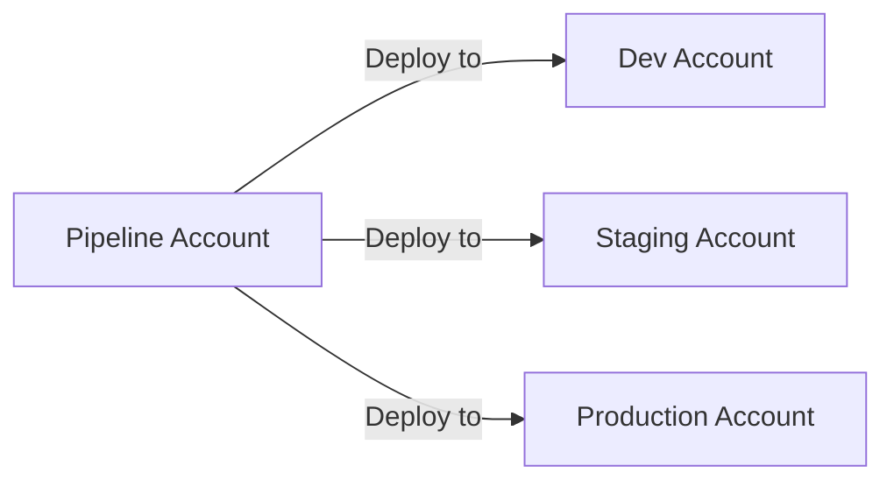

# How to Use CDK Bootstrap for Account Preparation

Author: [nawazdhandala](https://github.com/nawazdhandala)

Tags: AWS, CDK, DevOps, Infrastructure

Description: Understand and configure CDK bootstrap to prepare your AWS accounts for CDK deployments, including cross-account setups, custom permissions, and bootstrap versioning.

---

Before you can deploy anything with CDK, your AWS account needs some plumbing. CDK Bootstrap creates the resources that CDK itself needs to function - an S3 bucket for assets, an ECR repository for Docker images, IAM roles for deployment, and a few other pieces. It's a one-time setup per account/region combination, and getting it right saves you headaches down the road.

## What Bootstrap Creates

When you run `cdk bootstrap`, it creates a CloudFormation stack called `CDKToolkit` in your account. This stack contains:

- **S3 bucket** - Stores CloudFormation templates and file assets (Lambda code, etc.)
- **ECR repository** - Stores Docker image assets
- **IAM roles** - Deployment role, file publishing role, image publishing role, CloudFormation execution role, and lookup role
- **SSM parameter** - Stores the bootstrap version number

These resources are shared across all CDK apps in that account/region. You don't get a separate set for each app.

## Basic Bootstrap

The simplest bootstrap command targets your default account and region.

```bash
# Bootstrap using default credentials and region
cdk bootstrap

# Or be explicit about account and region
cdk bootstrap aws://123456789012/us-east-1

# Bootstrap multiple regions at once
cdk bootstrap aws://123456789012/us-east-1 aws://123456789012/eu-west-1
```

The command is idempotent - running it multiple times won't cause problems. If the bootstrap stack already exists, it updates it to the latest version.

## Checking Your Bootstrap Version

CDK periodically requires new bootstrap versions as features are added. You can check your current version.

```bash
# Check the bootstrap version via SSM Parameter Store
aws ssm get-parameter --name /cdk-bootstrap/hnb659fds/version --query "Parameter.Value" --output text
```

If you get "version not found" errors during deployment, your bootstrap is outdated. Just run `cdk bootstrap` again to update it.

## Customizing the Bootstrap Template

The default bootstrap template works for most cases, but you may need to customize it for security requirements or organizational policies.

Generate the default template first.

```bash
# Output the bootstrap template for review
cdk bootstrap --show-template > bootstrap-template.yaml
```

Then modify and deploy your customized version.

```bash
# Deploy a customized bootstrap template
cdk bootstrap --template bootstrap-template.yaml
```

Common customizations include:

### Restricting the S3 Bucket Policy

```yaml
# In the bootstrap template, modify the bucket policy
StagingBucket:
  Type: AWS::S3::Bucket
  Properties:
    BucketEncryption:
      ServerSideEncryptionConfiguration:
        - ServerSideEncryptionByDefault:
            SSEAlgorithm: aws:kms
            KMSMasterKeyID: !Ref FileAssetsBucketKmsKey
    # Add lifecycle rules to clean up old assets
    LifecycleConfiguration:
      Rules:
        - Id: CleanupOldAssets
          Status: Enabled
          ExpirationInDays: 90
```

### Using a Custom KMS Key

```bash
# Bootstrap with a customer-managed KMS key
cdk bootstrap --cloudformation-execution-policies "arn:aws:iam::aws:policy/AdministratorAccess" \
  --bootstrap-kms-key-id "arn:aws:kms:us-east-1:123456789012:key/my-key-id"
```

## Restricting CloudFormation Execution Permissions

By default, CDK's CloudFormation execution role has `AdministratorAccess`. That's too broad for many organizations. You can scope it down.

```bash
# Bootstrap with restricted permissions
cdk bootstrap \
  --cloudformation-execution-policies "arn:aws:iam::aws:policy/PowerUserAccess"

# Or use a custom policy
cdk bootstrap \
  --cloudformation-execution-policies "arn:aws:iam::123456789012:policy/CDKDeploymentPolicy"
```

Here's an example custom policy that limits what CDK can create.

```json
{
  "Version": "2012-10-17",
  "Statement": [
    {
      "Effect": "Allow",
      "Action": [
        "s3:*",
        "lambda:*",
        "dynamodb:*",
        "apigateway:*",
        "ecs:*",
        "ecr:*",
        "ec2:*",
        "elasticloadbalancing:*",
        "logs:*",
        "cloudwatch:*",
        "iam:GetRole",
        "iam:CreateRole",
        "iam:DeleteRole",
        "iam:AttachRolePolicy",
        "iam:DetachRolePolicy",
        "iam:PutRolePolicy",
        "iam:DeleteRolePolicy",
        "iam:PassRole"
      ],
      "Resource": "*"
    },
    {
      "Effect": "Deny",
      "Action": [
        "iam:CreateUser",
        "iam:CreateGroup",
        "organizations:*",
        "account:*"
      ],
      "Resource": "*"
    }
  ]
}
```

## Cross-Account Bootstrap

In a multi-account setup (which is the standard for serious AWS usage), you need to bootstrap each account and set up trust relationships between them.

The typical pattern is a pipeline account that deploys to target accounts.



Bootstrap the pipeline account normally.

```bash
# Bootstrap the pipeline account
cdk bootstrap aws://111111111111/us-east-1
```

Bootstrap target accounts with a trust relationship back to the pipeline account.

```bash
# Bootstrap the dev account, trusting the pipeline account
cdk bootstrap aws://222222222222/us-east-1 \
  --trust 111111111111 \
  --cloudformation-execution-policies "arn:aws:iam::aws:policy/AdministratorAccess"

# Same for staging
cdk bootstrap aws://333333333333/us-east-1 \
  --trust 111111111111 \
  --cloudformation-execution-policies "arn:aws:iam::aws:policy/AdministratorAccess"

# And production, with more restrictive policies
cdk bootstrap aws://444444444444/us-east-1 \
  --trust 111111111111 \
  --cloudformation-execution-policies "arn:aws:iam::444444444444:policy/ProdDeploymentPolicy"
```

The `--trust` flag tells the target account to allow the pipeline account's CDK roles to assume roles in the target account.

## Qualifier for Multiple Bootstraps

If you need separate bootstrap environments in the same account (maybe for different teams or applications), use qualifiers.

```bash
# Bootstrap with a custom qualifier
cdk bootstrap --qualifier team-alpha aws://123456789012/us-east-1

# Your CDK app needs to reference the same qualifier
```

In your CDK app:

```typescript
import { App, DefaultStackSynthesizer } from 'aws-cdk-lib';

const app = new App();
new MyStack(app, 'MyStack', {
  synthesizer: new DefaultStackSynthesizer({
    qualifier: 'team-alpha', // Must match the bootstrap qualifier
  }),
});
```

## Bootstrap Tags

You can tag the bootstrap resources for cost tracking and organizational purposes.

```bash
# Bootstrap with tags
cdk bootstrap --tags Team=Platform --tags Environment=Shared
```

## Troubleshooting Bootstrap Issues

The most common bootstrap problem is permission errors. You need `cloudformation:*`, `s3:*`, `ecr:*`, `iam:*`, and `ssm:*` permissions to run bootstrap.

```bash
# If bootstrap fails, check what's deployed
aws cloudformation describe-stacks --stack-name CDKToolkit

# Check the bootstrap stack's events for error details
aws cloudformation describe-stack-events --stack-name CDKToolkit \
  --query "StackEvents[?ResourceStatus=='CREATE_FAILED']"
```

If the bootstrap stack is in a broken state, you can delete and recreate it.

```bash
# Delete the broken bootstrap stack (be careful in shared accounts!)
aws cloudformation delete-stack --stack-name CDKToolkit
# Wait for deletion
aws cloudformation wait stack-delete-complete --stack-name CDKToolkit
# Re-bootstrap
cdk bootstrap
```

## Keeping Bootstrap Updated

When you update CDK versions, check if a new bootstrap version is required.

```bash
# Check current CDK version
cdk --version

# Update bootstrap to match
cdk bootstrap
```

CDK will tell you during deployment if your bootstrap version is too old. The error message looks like:

```
This CDK deployment requires bootstrap stack version '21', found '20'.
Please run 'cdk bootstrap'.
```

## Wrapping Up

Bootstrap is the foundation of your CDK deployment setup. Get it right once, and you won't think about it again - until you add a new account or region. Use custom execution policies to limit what CDK can do, set up cross-account trust for multi-account deployments, and keep the bootstrap version up to date.

For what comes after bootstrap, check out our guides on [synthesizing and diffing changes](https://oneuptime.com/blog/post/2026-02-12-synthesize-and-diff-cdk-changes-before-deployment/view) and [troubleshooting deployment failures](https://oneuptime.com/blog/post/2026-02-12-troubleshoot-cdk-deployment-failures/view).
