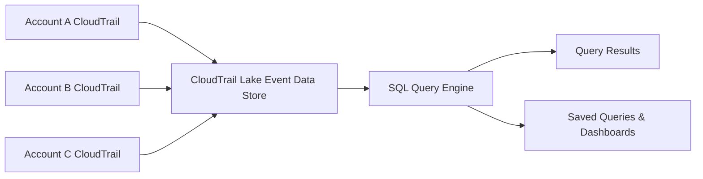

# How to Use CloudTrail Lake for Advanced Event Analysis

Author: [nawazdhandala](https://github.com/nawazdhandala)

Tags: AWS, CloudTrail, CloudTrail Lake, Security, Event Analysis, SQL

Description: Use CloudTrail Lake to run SQL queries against your AWS API activity logs for advanced security analysis and compliance investigation.

---

CloudTrail is the standard way to log API activity in your AWS account. Every API call, console login, and SDK operation gets recorded. But querying those logs has traditionally been painful. You either download JSON files from S3 and parse them manually, or set up Athena tables with proper partitioning. CloudTrail Lake simplifies this by providing a managed event data store with a built-in SQL query engine.

You can run queries like "show me all IAM policy changes in the last 90 days" or "which principal made the most S3 API calls last week" without any ETL pipeline.

## What Is CloudTrail Lake?

CloudTrail Lake is a managed, immutable data store for CloudTrail events. It ingests events from one or more AWS accounts and regions, stores them in a columnar format optimized for querying, and lets you run SQL queries directly through the console or API.



The key advantages over the traditional S3-plus-Athena approach:

- No S3 buckets to manage
- No table partitioning to configure
- Built-in retention management (up to 7 years)
- Supports organization-wide event collection
- Immutable storage for compliance

## Prerequisites

- An AWS account with CloudTrail enabled
- IAM permissions for CloudTrail Lake operations
- AWS CLI v2 or the AWS Console

## Step 1: Create an Event Data Store

The event data store is where your events live. You configure what types of events it collects and how long to retain them.

```bash
# Create a CloudTrail Lake event data store
aws cloudtrail create-event-data-store \
  --name "security-analysis-store" \
  --retention-period 365 \
  --multi-region-enabled \
  --organization-enabled \
  --advanced-event-selectors '[
    {
      "Name": "Management events",
      "FieldSelectors": [
        {"Field": "eventCategory", "Equals": ["Management"]}
      ]
    }
  ]'
```

Let's break down the options:

- **retention-period**: How many days to keep events (1 to 2557, which is 7 years)
- **multi-region-enabled**: Collect events from all regions, not just the current one
- **organization-enabled**: Collect events from all accounts in your AWS Organization
- **advanced-event-selectors**: Control which event types to include

The command returns an event data store ARN and ID. Save the ID because you need it for queries.

## Step 2: Configure Event Selectors for Data Events

Management events (like CreateBucket, RunInstances) are collected by default. If you also want data events (like GetObject, PutItem), add them to the selectors:

```bash
# Update the event data store to include S3 data events
aws cloudtrail update-event-data-store \
  --event-data-store "arn:aws:cloudtrail:us-east-1:123456789012:eventdatastore/abc-123" \
  --advanced-event-selectors '[
    {
      "Name": "Management events",
      "FieldSelectors": [
        {"Field": "eventCategory", "Equals": ["Management"]}
      ]
    },
    {
      "Name": "S3 data events",
      "FieldSelectors": [
        {"Field": "eventCategory", "Equals": ["Data"]},
        {"Field": "resources.type", "Equals": ["AWS::S3::Object"]}
      ]
    }
  ]'
```

Be thoughtful about data events. S3 and Lambda data events can generate a massive volume and significantly increase costs.

## Step 3: Wait for Ingestion

After creating the event data store, CloudTrail Lake starts ingesting events. It takes some time (usually 15-30 minutes) for the first events to appear. You can check the status:

```bash
# Check event data store status
aws cloudtrail get-event-data-store \
  --event-data-store "arn:aws:cloudtrail:us-east-1:123456789012:eventdatastore/abc-123"
```

The status should show `ENABLED` when ready for queries.

## Step 4: Run Your First Query

Now the fun part. CloudTrail Lake uses standard SQL with some CloudTrail-specific columns. Here are some useful queries to get started.

### Find All IAM Policy Changes

```sql
-- Find all IAM policy modifications in the last 30 days
SELECT
    eventTime,
    userIdentity.principalId,
    userIdentity.arn,
    eventName,
    requestParameters
FROM
    abc123_event_data_store
WHERE
    eventTime > '2026-01-13 00:00:00'
    AND eventSource = 'iam.amazonaws.com'
    AND eventName IN ('CreatePolicy', 'DeletePolicy', 'AttachRolePolicy',
                       'DetachRolePolicy', 'PutRolePolicy', 'DeleteRolePolicy')
ORDER BY
    eventTime DESC
```

### Find Console Logins Without MFA

```sql
-- Identify console logins that did not use MFA
SELECT
    eventTime,
    userIdentity.arn,
    sourceIPAddress,
    responseElements
FROM
    abc123_event_data_store
WHERE
    eventName = 'ConsoleLogin'
    AND additionalEventData LIKE '%"MFAUsed":"No"%'
    AND eventTime > '2026-01-13 00:00:00'
ORDER BY
    eventTime DESC
```

### Find the Top API Callers

```sql
-- Top 20 principals by API call volume in the last 7 days
SELECT
    userIdentity.arn AS principal,
    COUNT(*) AS api_call_count
FROM
    abc123_event_data_store
WHERE
    eventTime > '2026-02-05 00:00:00'
GROUP BY
    userIdentity.arn
ORDER BY
    api_call_count DESC
LIMIT 20
```

### Detect Unauthorized Access Attempts

```sql
-- Find all access denied errors in the last 24 hours
SELECT
    eventTime,
    userIdentity.arn,
    eventSource,
    eventName,
    errorCode,
    errorMessage,
    sourceIPAddress
FROM
    abc123_event_data_store
WHERE
    eventTime > '2026-02-11 00:00:00'
    AND errorCode IN ('AccessDenied', 'UnauthorizedAccess', 'Client.UnauthorizedAccess')
ORDER BY
    eventTime DESC
```

## Step 5: Run Queries via the CLI

You can execute queries programmatically:

```bash
# Start a query
QUERY_ID=$(aws cloudtrail start-query \
  --query-statement "SELECT eventTime, eventName, userIdentity.arn FROM abc123_event_data_store WHERE eventSource = 'ec2.amazonaws.com' AND eventTime > '2026-02-11' LIMIT 100" \
  --query "QueryId" \
  --output text)

echo "Query ID: $QUERY_ID"

# Check query status (queries run asynchronously)
aws cloudtrail describe-query \
  --query-id "$QUERY_ID"

# Get results once the query completes
aws cloudtrail get-query-results \
  --query-id "$QUERY_ID"
```

Queries run asynchronously. For large datasets, they can take seconds to minutes depending on the time range and complexity.

## Step 6: Save Queries for Reuse

CloudTrail Lake lets you save queries so your team can reuse them without rewriting SQL each time.

```bash
# Save a query for reuse
aws cloudtrail create-saved-query \
  --name "daily-iam-changes" \
  --query-statement "SELECT eventTime, userIdentity.arn, eventName FROM abc123_event_data_store WHERE eventSource = 'iam.amazonaws.com' AND eventTime > '2026-02-11' ORDER BY eventTime DESC"
```

Saved queries show up in the CloudTrail Lake console and can be run by any team member with the right permissions.

## Step 7: Set Up Scheduled Queries

For regular reporting, you can schedule queries using EventBridge and Lambda:

```python
# Lambda function to run a CloudTrail Lake query on schedule
import boto3

cloudtrail = boto3.client('cloudtrail')

def handler(event, context):
    # Run the daily security audit query
    response = cloudtrail.start_query(
        QueryStatement="""
            SELECT eventTime, userIdentity.arn, eventName, sourceIPAddress
            FROM abc123_event_data_store
            WHERE errorCode = 'AccessDenied'
            AND eventTime > DATEADD(DAY, -1, CURRENT_TIMESTAMP)
            ORDER BY eventTime DESC
        """
    )

    query_id = response['QueryId']
    print(f"Started query: {query_id}")

    return {'queryId': query_id}
```

Pair this with a second Lambda that checks query status and sends results to Slack or email.

## Cost Considerations

CloudTrail Lake pricing is based on two factors:

- **Ingestion**: You pay per GB of data ingested
- **Scanning**: You pay per GB of data scanned by queries

To control costs:

- Use narrow time ranges in your WHERE clauses
- Be selective about which event types you ingest (skip high-volume data events unless needed)
- Use the `LIMIT` clause during exploratory queries

## CloudTrail Lake vs Athena

Both can query CloudTrail logs, but they serve different needs:

| Feature | CloudTrail Lake | Athena with S3 |
|---|---|---|
| Setup complexity | Low | Medium (partitioning, Glue) |
| Query latency | Seconds to minutes | Seconds to minutes |
| Retention | Built-in (up to 7 years) | Manual (S3 lifecycle policies) |
| Cross-account | Built-in with Organizations | Requires cross-account S3 access |
| Cost model | Ingestion + scan | Storage + scan |
| Immutability | Built-in | Depends on S3 configuration |

For security and compliance use cases, CloudTrail Lake's immutability and built-in retention make it the better choice. For cost-optimized analytics on very large datasets, Athena might be cheaper.

## Wrapping Up

CloudTrail Lake turns your audit logs into a queryable database. No more downloading JSON files, no more Athena table management. Just write SQL and get answers. It is particularly powerful for security investigations, compliance audits, and operational troubleshooting.

For related security monitoring, check out our posts on [detecting unauthorized API calls with CloudTrail and EventBridge](https://oneuptime.com/blog/post/2026-02-12-detect-unauthorized-api-calls-with-cloudtrail-and-eventbridge/view) and [monitoring API call patterns with CloudTrail Insights](https://oneuptime.com/blog/post/2026-02-12-monitor-aws-api-call-patterns-with-cloudtrail-insights/view). For multi-account setups, see [CloudTrail Organization Trail for multi-account](https://oneuptime.com/blog/post/2026-02-12-set-up-cloudtrail-organization-trail-for-multi-account/view).
