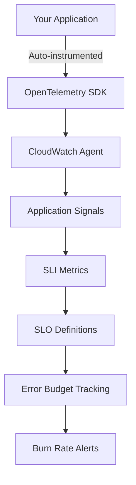

# How to Use CloudWatch Application Signals for SLO Monitoring

Author: [nawazdhandala](https://github.com/nawazdhandala)

Tags: AWS, CloudWatch, Application Signals, SLO, SLI, Monitoring, Observability

Description: Set up CloudWatch Application Signals to define and track service level objectives with automated SLI collection and burn rate alerts.

---

Service level objectives (SLOs) are the backbone of reliability engineering. They quantify how reliable your service needs to be and give you a framework for making trade-offs between velocity and stability. AWS CloudWatch Application Signals is a relatively new feature that bakes SLO monitoring directly into CloudWatch, using automatically collected service level indicators (SLIs) from your applications.

Instead of building custom metric pipelines to track error rates and latency percentiles, Application Signals collects these SLIs automatically from instrumented applications and lets you define SLOs on top of them. When your error budget starts burning too fast, you get an alert.

## What Are Application Signals?

Application Signals is a CloudWatch capability that auto-discovers your services and their dependencies, collects key metrics (latency, availability, errors), and provides a unified view of application health. It integrates with the CloudWatch agent and the OpenTelemetry SDK to automatically instrument your applications.



The key SLIs that Application Signals tracks are:

- **Availability**: The percentage of requests that succeed (no 5xx errors)
- **Latency**: Response time at various percentiles (p50, p90, p99)
- **Fault rate**: The percentage of requests that result in errors

## Prerequisites

- An application running on ECS, EKS, or EC2
- The CloudWatch agent installed and configured with Application Signals enabled
- AWS CLI and permissions to manage CloudWatch resources

## Step 1: Enable Application Signals in the CloudWatch Agent

The CloudWatch agent needs to be configured to collect Application Signals data. Here is the relevant section of the agent configuration:

```json
// CloudWatch Agent configuration with Application Signals
{
  "logs": {
    "metrics_collected": {
      "application_signals": {
        "enabled": true
      }
    }
  },
  "traces": {
    "traces_collected": {
      "application_signals": {
        "enabled": true
      }
    }
  }
}
```

If you are running on EKS, you can enable Application Signals through the EKS add-on:

```bash
# Enable CloudWatch Application Signals add-on on EKS
aws eks create-addon \
  --cluster-name my-cluster \
  --addon-name amazon-cloudwatch-observability \
  --configuration-values '{
    "agent": {
      "config": {
        "traces": {
          "traces_collected": {
            "application_signals": {}
          }
        },
        "logs": {
          "metrics_collected": {
            "application_signals": {}
          }
        }
      }
    }
  }'
```

## Step 2: Instrument Your Application

Application Signals works with OpenTelemetry auto-instrumentation. For Java applications, this means adding the OpenTelemetry Java agent. For Python, Node.js, and .NET, similar auto-instrumentation libraries are available.

For a Java application on EKS:

```yaml
# Kubernetes pod annotation to enable auto-instrumentation
apiVersion: apps/v1
kind: Deployment
metadata:
  name: order-service
spec:
  template:
    metadata:
      annotations:
        # This annotation enables OpenTelemetry auto-instrumentation
        instrumentation.opentelemetry.io/inject-java: "true"
    spec:
      containers:
        - name: order-service
          image: 123456789012.dkr.ecr.us-east-1.amazonaws.com/order-service:latest
          ports:
            - containerPort: 8080
```

For an ECS service, set environment variables in the task definition:

```json
// Environment variables for OpenTelemetry auto-instrumentation on ECS
{
  "name": "OTEL_RESOURCE_ATTRIBUTES",
  "value": "service.name=order-service"
},
{
  "name": "OTEL_EXPORTER_OTLP_ENDPOINT",
  "value": "http://localhost:4317"
},
{
  "name": "OTEL_METRICS_EXPORTER",
  "value": "none"
},
{
  "name": "OTEL_TRACES_EXPORTER",
  "value": "otlp"
}
```

## Step 3: Verify Service Discovery

After deploying your instrumented application, wait a few minutes and check the Application Signals console. Navigate to CloudWatch > Application Signals > Services. You should see your service listed with automatically collected metrics.

```bash
# List discovered services via CLI
aws cloudwatch list-services \
  --region us-east-1
```

The console shows each service with its current availability, latency percentiles, and throughput. This is your starting point for defining SLOs.

## Step 4: Define an SLO

Now create an SLO on top of the automatically collected SLIs. For example, let's say your order service needs to maintain 99.9% availability measured over a rolling 30-day window.

```bash
# Create an availability SLO for the order service
aws cloudwatch create-service-level-objective \
  --name "order-service-availability" \
  --description "99.9% availability over 30 days" \
  --sli-config '{
    "SliMetricConfig": {
      "KeyAttributes": {
        "Type": "Service",
        "Name": "order-service",
        "Environment": "production"
      },
      "MetricType": "AVAILABILITY"
    },
    "MetricThreshold": 99.9,
    "ComparisonOperator": "GreaterThanOrEqualTo"
  }' \
  --goal '{
    "Interval": {
      "RollingInterval": {
        "DurationUnit": "DAY",
        "Duration": 30
      }
    },
    "AttainmentGoal": 99.9
  }'
```

You can also create latency-based SLOs:

```bash
# Create a latency SLO: p99 latency must be under 500ms
aws cloudwatch create-service-level-objective \
  --name "order-service-latency-p99" \
  --description "p99 latency under 500ms" \
  --sli-config '{
    "SliMetricConfig": {
      "KeyAttributes": {
        "Type": "Service",
        "Name": "order-service",
        "Environment": "production"
      },
      "MetricType": "LATENCY",
      "Statistic": "p99"
    },
    "MetricThreshold": 500,
    "ComparisonOperator": "LessThanOrEqualTo"
  }' \
  --goal '{
    "Interval": {
      "RollingInterval": {
        "DurationUnit": "DAY",
        "Duration": 30
      }
    },
    "AttainmentGoal": 99.0
  }'
```

## Step 5: Monitor Error Budgets

Once your SLOs are defined, Application Signals automatically tracks your error budget. The error budget is the allowed amount of downtime or errors within your SLO window.

For a 99.9% availability SLO over 30 days:
- Total minutes in 30 days: 43,200
- Allowed downtime: 43.2 minutes
- That is your error budget

The Application Signals console shows a burn rate chart and remaining error budget percentage. When the budget is being consumed faster than expected, you know your team needs to focus on reliability instead of shipping new features.

## Step 6: Set Up Burn Rate Alerts

The SLO is only useful if you get alerted when the error budget is burning too fast. Application Signals supports burn rate alerting through CloudWatch Alarms.

```bash
# Create a burn rate alarm
# This alerts when the error budget burn rate exceeds 10x normal
aws cloudwatch put-metric-alarm \
  --alarm-name "order-service-high-burn-rate" \
  --metric-name "SloAttainment" \
  --namespace "AWS/ApplicationSignals" \
  --dimensions Name=SloName,Value=order-service-availability \
  --statistic Average \
  --period 300 \
  --evaluation-periods 3 \
  --threshold 99.9 \
  --comparison-operator LessThanThreshold \
  --alarm-actions "arn:aws:sns:us-east-1:123456789012:slo-alerts"
```

A common pattern is to set up multiple alert tiers:

- **Fast burn**: Alert immediately if the burn rate is 14.4x normal (consuming the entire budget in 2 days)
- **Slow burn**: Alert after an hour if the burn rate is 6x normal (consuming the entire budget in 5 days)

This approach is borrowed from Google's SRE book and prevents both alert fatigue and missed incidents.

## Step 7: Build an SLO Dashboard

Create a CloudWatch dashboard that shows all your SLOs in one place:

```json
// Dashboard widget showing SLO attainment
{
  "type": "metric",
  "properties": {
    "metrics": [
      ["AWS/ApplicationSignals", "SloAttainment", "SloName", "order-service-availability"],
      ["AWS/ApplicationSignals", "SloAttainment", "SloName", "order-service-latency-p99"],
      ["AWS/ApplicationSignals", "SloAttainment", "SloName", "payment-service-availability"]
    ],
    "view": "singleValue",
    "title": "SLO Attainment - Current",
    "period": 86400
  }
}
```

The single-value view gives you an at-a-glance status of each SLO. Green means you are within budget, yellow means the budget is getting low, and red means you are out of budget.

## Best Practices

**Start with a few critical SLOs**: Do not define SLOs for every service on day one. Pick your 3-5 most important user-facing services and establish SLOs for them first. Expand once you have the operational muscle.

**Use meaningful time windows**: A 30-day rolling window is common for production SLOs. Shorter windows (7 days) work well for staging or less critical services.

**Tie SLOs to user experience**: Your SLOs should reflect what users care about. If your checkout flow has a 5-second timeout, your latency SLO should be well below that.

**Review SLOs quarterly**: As your system evolves, your SLOs should too. A 99.9% target might be too ambitious or too loose depending on your architecture changes.

## Wrapping Up

CloudWatch Application Signals removes a lot of the manual work in SLO monitoring. The auto-instrumentation collects SLIs without code changes, the SLO definitions are declarative, and the error budget tracking is built in. It is not a replacement for a full SRE practice, but it is a solid foundation.

For the tracing side of observability, check out [X-Ray Insights for automated analysis](https://oneuptime.com/blog/post/2026-02-12-use-x-ray-insights-for-automated-analysis/view). And for alerting on specific AWS resources, see our guides on [CloudWatch alarms for Lambda error rates](https://oneuptime.com/blog/post/2026-02-12-create-cloudwatch-alarms-for-lambda-error-rates/view) and [CloudWatch alarms for ECS service health](https://oneuptime.com/blog/post/2026-02-12-create-cloudwatch-alarms-for-ecs-service-health/view).
