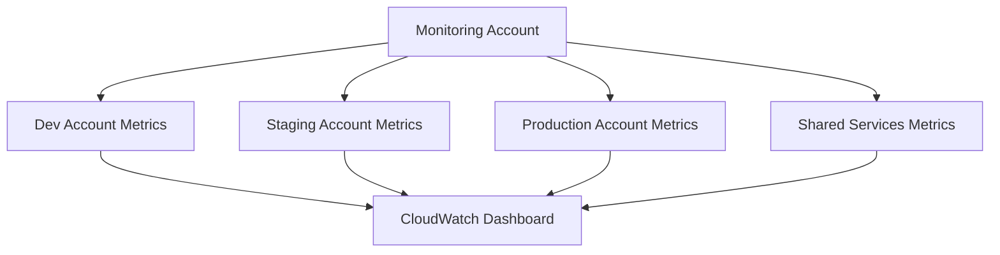

# How to Use CloudWatch Cross-Account Dashboards

Author: [nawazdhandala](https://github.com/nawazdhandala)

Tags: AWS, CloudWatch, Monitoring, Multi-Account, Dashboards

Description: Learn how to build CloudWatch cross-account dashboards that give you unified visibility across multiple AWS accounts from a single pane of glass.

---

Managing multiple AWS accounts is common in enterprises. You might have separate accounts for development, staging, production, and shared services. The challenge is that each account has its own CloudWatch metrics, and jumping between consoles to check health is painful. CloudWatch cross-account dashboards solve this problem by letting you visualize metrics from multiple accounts on a single dashboard.

This guide walks you through setting up cross-account observability and building dashboards that pull metrics from every account you care about.

## Why Cross-Account Dashboards Matter

In a multi-account setup, you typically have an operations or monitoring account that acts as a central hub. Without cross-account dashboards, your team has to sign into each account individually, check metrics, and mentally piece together the overall health of your system. That is slow and error-prone.

Cross-account dashboards let you:

- View metrics from all accounts in one place
- Compare resource utilization across environments
- Spot anomalies faster by seeing the full picture
- Reduce context switching for on-call engineers



## Prerequisites

Before you begin, make sure you have:

- At least two AWS accounts (one monitoring account and one or more source accounts)
- Administrator access to both the monitoring and source accounts
- AWS Organizations set up (recommended but not strictly required)

## Step 1: Enable Cross-Account Observability in the Monitoring Account

In your monitoring account, you need to create a monitoring account sink. This is the receiving end that accepts telemetry from other accounts.

Navigate to the CloudWatch console in your monitoring account.

```bash
# Using AWS CLI to create an OAM (Observability Access Manager) sink
aws oam create-sink \
  --name "central-monitoring-sink" \
  --region us-east-1
```

The sink generates an ARN you will need when configuring the source accounts. Copy that ARN.

## Step 2: Create Links from Source Accounts

In each source account, you create a link to the monitoring account sink. This authorizes the source account to share its telemetry data.

```bash
# Run this in each source account
# Replace the sink ARN with the one from Step 1
aws oam create-link \
  --label-template "AccountName" \
  --resource-types '["AWS::CloudWatch::Metric", "AWS::Logs::LogGroup", "AWS::XRay::Trace"]' \
  --sink-identifier "arn:aws:oam:us-east-1:123456789012:sink/abc123-def456" \
  --region us-east-1
```

The `resource-types` parameter controls what data is shared. You can share metrics, log groups, and X-Ray traces. For dashboards, you need at least `AWS::CloudWatch::Metric`.

## Step 3: Accept the Link in the Monitoring Account

If you are not using AWS Organizations with automatic acceptance, you need to manually accept each link in the monitoring account. Check the OAM console or use the CLI.

```bash
# List pending links in the monitoring account
aws oam list-links --region us-east-1
```

When using AWS Organizations, you can configure a policy to auto-accept links from accounts in your organization. This saves manual steps when you add new accounts.

## Step 4: Build Your Cross-Account Dashboard

Now for the fun part. In the monitoring account, go to CloudWatch and create a new dashboard. When adding widgets, you will notice a new account selector that lets you pick metrics from any linked account.

Here is a CloudFormation snippet that creates a cross-account dashboard programmatically:

```yaml
# CloudFormation template for a cross-account dashboard
Resources:
  CrossAccountDashboard:
    Type: AWS::CloudWatch::Dashboard
    Properties:
      DashboardName: cross-account-overview
      DashboardBody: !Sub |
        {
          "widgets": [
            {
              "type": "metric",
              "x": 0,
              "y": 0,
              "width": 12,
              "height": 6,
              "properties": {
                "metrics": [
                  [{"expression": "SEARCH('{AWS/EC2,InstanceId} MetricName=\"CPUUtilization\"', 'Average', 300)", "id": "e1", "accountId": "111111111111"}],
                  [{"expression": "SEARCH('{AWS/EC2,InstanceId} MetricName=\"CPUUtilization\"', 'Average', 300)", "id": "e2", "accountId": "222222222222"}]
                ],
                "view": "timeSeries",
                "region": "${AWS::Region}",
                "title": "EC2 CPU - All Accounts",
                "period": 300
              }
            },
            {
              "type": "metric",
              "x": 0,
              "y": 6,
              "width": 12,
              "height": 6,
              "properties": {
                "metrics": [
                  ["AWS/Lambda", "Errors", "FunctionName", "my-function", {"accountId": "111111111111"}],
                  ["AWS/Lambda", "Errors", "FunctionName", "my-function", {"accountId": "222222222222"}]
                ],
                "view": "timeSeries",
                "region": "${AWS::Region}",
                "title": "Lambda Errors - All Accounts",
                "period": 300
              }
            }
          ]
        }
```

The key parameter is `accountId` on each metric. This tells CloudWatch which source account to pull the metric from.

## Step 5: Use SEARCH Expressions for Dynamic Discovery

Instead of hardcoding metric names, use CloudWatch SEARCH expressions to dynamically find metrics across accounts. This is especially useful when new resources are spun up and you want them to appear on the dashboard automatically.

```json
// SEARCH expression example that finds all Lambda duration metrics
// across all linked accounts
{
  "expression": "SEARCH('{AWS/Lambda,FunctionName} MetricName=\"Duration\"', 'Average', 300)",
  "id": "e1",
  "accountId": "111111111111"
}
```

You can combine SEARCH with METRICS to build powerful aggregation views that summarize data across accounts without needing to update the dashboard every time a new resource appears.

## Step 6: Add Alarms from Multiple Accounts

Your cross-account dashboard can also display alarm states from linked accounts. Add an alarm status widget and configure it with alarm ARNs from the source accounts.

```json
// Alarm status widget configuration
{
  "type": "alarm",
  "x": 12,
  "y": 0,
  "width": 12,
  "height": 6,
  "properties": {
    "title": "Critical Alarms - All Accounts",
    "alarms": [
      "arn:aws:cloudwatch:us-east-1:111111111111:alarm:prod-high-cpu",
      "arn:aws:cloudwatch:us-east-1:222222222222:alarm:staging-high-cpu"
    ]
  }
}
```

This gives your operations team a single view of alarm states across the entire organization.

## Best Practices

**Naming conventions**: Use consistent naming across accounts. If your production Lambda functions follow a naming pattern, keep it the same in staging and dev. This makes SEARCH expressions much more effective.

**Dashboard organization**: Group widgets by service rather than by account. Your team wants to know "how are all our Lambda functions doing?" not "what is happening in account 222222222222?"

**Access control**: Limit who can modify the monitoring account sink. Use IAM policies to restrict access to the OAM configuration.

**Cost awareness**: Cross-account metric retrieval has no additional charge beyond the standard CloudWatch pricing. However, dashboards with many widgets and short refresh intervals will increase your API call volume.

## Troubleshooting Common Issues

If metrics from a source account are not appearing, check:

1. The OAM link is in an active state (not pending)
2. The correct resource types are shared (must include `AWS::CloudWatch::Metric`)
3. Both the sink and link are in the same region
4. IAM permissions allow the monitoring account to read the source account metrics

For deeper troubleshooting, check CloudTrail logs in both accounts for any denied API calls.

## Wrapping Up

CloudWatch cross-account dashboards turn what used to be a multi-tab, multi-login ordeal into a clean, single-pane-of-glass experience. The setup through Observability Access Manager is straightforward, and once the plumbing is in place, building dashboards is the same experience you already know - just with an account picker added.

If you are already using CloudWatch alarms across your accounts, consider pairing dashboards with cross-account alarm forwarding. For more on setting up alarms, check out our post on [creating CloudWatch alarms for Lambda error rates](https://oneuptime.com/blog/post/2026-02-12-create-cloudwatch-alarms-for-lambda-error-rates/view). And for centralizing monitoring even further, take a look at our guide on [centralized monitoring for multi-account AWS](https://oneuptime.com/blog/post/2026-02-12-set-up-centralized-monitoring-for-multi-account-aws/view).
