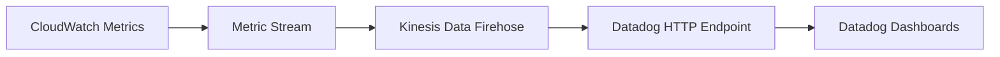

# How to Use CloudWatch Metric Streams to Datadog

Author: [nawazdhandala](https://github.com/nawazdhandala)

Tags: AWS, CloudWatch, Datadog, Metric Streams, Monitoring, Observability

Description: Set up CloudWatch Metric Streams to pipe AWS metrics directly into Datadog for near real-time observability without polling delays.

---

If you have ever used the Datadog AWS integration, you know it works by polling CloudWatch APIs at regular intervals. That approach works, but it introduces latency (usually 5 to 10 minutes) and can rack up significant CloudWatch API costs at scale. CloudWatch Metric Streams offer a better path: they push metrics to a destination in near real-time, cutting both latency and API costs.

In this guide, you will set up a CloudWatch Metric Stream that sends your AWS metrics to Datadog through Amazon Kinesis Data Firehose. The result is fresher data in your Datadog dashboards and lower CloudWatch API bills.

## How Metric Streams Work

Instead of Datadog repeatedly calling `GetMetricData` or `GetMetricStatistics`, a Metric Stream continuously exports metrics as they arrive. The stream delivers data to a Kinesis Data Firehose delivery stream, which then forwards it to an HTTP endpoint (in this case, Datadog's intake).



The latency drops from minutes to roughly 2-3 minutes for most metrics. That might not sound like a massive improvement, but during an incident, every minute of data freshness counts.

## Prerequisites

- An active Datadog account with an API key
- AWS account with permissions to create Metric Streams, Kinesis Firehose delivery streams, IAM roles, and S3 buckets
- AWS CLI configured or access to the AWS Console

## Step 1: Get Your Datadog API Key and Endpoint

Log into Datadog and grab your API key from the Organization Settings page. You also need to know which Datadog site you are on, because the intake endpoint differs by region.

| Datadog Site | Endpoint URL |
|---|---|
| US1 (datadoghq.com) | `https://awsmetrics-intake.datadoghq.com/v1/input` |
| US3 (us3.datadoghq.com) | `https://awsmetrics-intake.us3.datadoghq.com/v1/input` |
| US5 (us5.datadoghq.com) | `https://awsmetrics-intake.us5.datadoghq.com/v1/input` |
| EU (datadoghq.eu) | `https://awsmetrics-intake.datadoghq.eu/v1/input` |

You will append `?dd-api-key=YOUR_API_KEY` to the endpoint URL when configuring Firehose.

## Step 2: Create an S3 Bucket for Failed Deliveries

Firehose needs a backup S3 bucket for any records that fail to deliver to the HTTP endpoint. This is a safety net.

```bash
# Create a backup bucket for failed metric deliveries
aws s3 mb s3://my-datadog-metric-stream-backup \
  --region us-east-1
```

## Step 3: Create the IAM Role for Firehose

Firehose needs an IAM role that allows it to write to S3 and deliver to the HTTP endpoint.

```json
// Trust policy - allows Firehose to assume this role
{
  "Version": "2012-10-17",
  "Statement": [
    {
      "Effect": "Allow",
      "Principal": {
        "Service": "firehose.amazonaws.com"
      },
      "Action": "sts:AssumeRole"
    }
  ]
}
```

```bash
# Create the IAM role
aws iam create-role \
  --role-name DatadogMetricStreamFirehoseRole \
  --assume-role-policy-document file://firehose-trust-policy.json

# Attach the policy granting S3 access
aws iam put-role-policy \
  --role-name DatadogMetricStreamFirehoseRole \
  --policy-name FirehoseS3Access \
  --policy-document '{
    "Version": "2012-10-17",
    "Statement": [
      {
        "Effect": "Allow",
        "Action": [
          "s3:AbortMultipartUpload",
          "s3:GetBucketLocation",
          "s3:GetObject",
          "s3:ListBucket",
          "s3:PutObject"
        ],
        "Resource": [
          "arn:aws:s3:::my-datadog-metric-stream-backup",
          "arn:aws:s3:::my-datadog-metric-stream-backup/*"
        ]
      }
    ]
  }'
```

## Step 4: Create the Kinesis Data Firehose Delivery Stream

This delivery stream acts as the bridge between CloudWatch and Datadog. It receives the metric data and pushes it to Datadog's HTTP endpoint.

```bash
# Create the Firehose delivery stream pointing to Datadog
aws firehose create-delivery-stream \
  --delivery-stream-name datadog-metric-stream \
  --delivery-stream-type DirectPut \
  --http-endpoint-destination-configuration '{
    "EndpointConfiguration": {
      "Url": "https://awsmetrics-intake.datadoghq.com/v1/input",
      "AccessKey": "YOUR_DATADOG_API_KEY",
      "Name": "Datadog"
    },
    "RequestConfiguration": {
      "ContentEncoding": "GZIP"
    },
    "BufferingHints": {
      "IntervalInSeconds": 60,
      "SizeInMBs": 1
    },
    "S3BackupMode": "FailedDataOnly",
    "S3Configuration": {
      "RoleARN": "arn:aws:iam::123456789012:role/DatadogMetricStreamFirehoseRole",
      "BucketARN": "arn:aws:s3:::my-datadog-metric-stream-backup"
    },
    "RoleARN": "arn:aws:iam::123456789012:role/DatadogMetricStreamFirehoseRole"
  }'
```

A few things to note about the configuration:

- **ContentEncoding**: Use GZIP to reduce data transfer costs
- **BufferingHints**: A 60-second interval with 1MB buffer size is a good balance between latency and efficiency
- **S3BackupMode**: Set to FailedDataOnly so you only store records that could not be delivered

## Step 5: Create the IAM Role for CloudWatch Metric Stream

CloudWatch also needs a role to write to the Firehose delivery stream.

```bash
# Create the CloudWatch Metric Stream role
aws iam create-role \
  --role-name CloudWatchMetricStreamRole \
  --assume-role-policy-document '{
    "Version": "2012-10-17",
    "Statement": [
      {
        "Effect": "Allow",
        "Principal": {
          "Service": "streams.metrics.cloudwatch.amazonaws.com"
        },
        "Action": "sts:AssumeRole"
      }
    ]
  }'

# Grant permission to write to Firehose
aws iam put-role-policy \
  --role-name CloudWatchMetricStreamRole \
  --policy-name MetricStreamFirehoseAccess \
  --policy-document '{
    "Version": "2012-10-17",
    "Statement": [
      {
        "Effect": "Allow",
        "Action": [
          "firehose:PutRecord",
          "firehose:PutRecordBatch"
        ],
        "Resource": "arn:aws:firehose:us-east-1:123456789012:deliverystream/datadog-metric-stream"
      }
    ]
  }'
```

## Step 6: Create the CloudWatch Metric Stream

Now tie it all together by creating the actual Metric Stream.

```bash
# Create the CloudWatch Metric Stream
aws cloudwatch put-metric-stream \
  --name datadog-metric-stream \
  --firehose-arn "arn:aws:firehose:us-east-1:123456789012:deliverystream/datadog-metric-stream" \
  --role-arn "arn:aws:iam::123456789012:role/CloudWatchMetricStreamRole" \
  --output-format "opentelemetry1.0"
```

The `output-format` should be `opentelemetry1.0` for Datadog. This is the format Datadog's intake endpoint expects.

## Step 7: Filter Namespaces (Optional but Recommended)

By default, Metric Streams export all CloudWatch metrics. That can get expensive if you have hundreds of services. Use include or exclude filters to control what gets streamed.

```bash
# Only stream EC2, Lambda, and RDS metrics
aws cloudwatch put-metric-stream \
  --name datadog-metric-stream \
  --firehose-arn "arn:aws:firehose:us-east-1:123456789012:deliverystream/datadog-metric-stream" \
  --role-arn "arn:aws:iam::123456789012:role/CloudWatchMetricStreamRole" \
  --output-format "opentelemetry1.0" \
  --include-filters '[
    {"Namespace": "AWS/EC2"},
    {"Namespace": "AWS/Lambda"},
    {"Namespace": "AWS/RDS"}
  ]'
```

This keeps your Datadog bill in check too, since you are only sending the metrics you actually need.

## Step 8: Disable the Polling Integration in Datadog

After your Metric Stream is running, go to Datadog and disable the CloudWatch polling for the same namespaces. Running both simultaneously means duplicate data and unnecessary costs.

In Datadog, navigate to the AWS integration tile, find your account, and uncheck the namespaces you are now streaming.

## Verifying the Setup

After 5-10 minutes, check your Datadog metrics explorer. Search for an AWS metric like `aws.ec2.cpuutilization`. You should see data flowing in. If not, check:

1. The Firehose delivery stream metrics in CloudWatch (look for `DeliveryToHttpEndpoint.Success`)
2. The S3 backup bucket for any failed records
3. IAM role permissions are correct
4. The Datadog API key is valid

## Cost Considerations

CloudWatch Metric Streams charge based on the number of metric updates streamed. As of writing, the cost is roughly $0.003 per 1,000 metric updates. For most workloads, this is cheaper than the API polling approach, which incurs costs on both the CloudWatch API side and the Datadog side.

However, if you stream everything without filters, the costs can add up for large accounts with hundreds of custom metrics.

## Wrapping Up

CloudWatch Metric Streams to Datadog is a cleaner architecture than API polling. You get lower latency, lower API costs, and a push-based model that scales naturally. The setup involves a few AWS resources, but once configured, it runs hands-off.

If you are also interested in streaming to other platforms, check out our guide on [CloudWatch Metric Streams to New Relic](https://oneuptime.com/blog/post/use-cloudwatch-metric-streams-to-new-relic/view). And for a broader look at centralized monitoring across multiple accounts, see [centralized monitoring for multi-account AWS](https://oneuptime.com/blog/post/set-up-centralized-monitoring-for-multi-account-aws/view).
