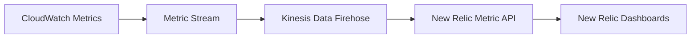

# How to Use CloudWatch Metric Streams to New Relic

Author: [nawazdhandala](https://github.com/nawazdhandala)

Tags: AWS, CloudWatch, New Relic, Metric Streams, Monitoring, Observability

Description: Configure CloudWatch Metric Streams to send AWS metrics directly to New Relic for near real-time monitoring with lower latency and cost.

---

The traditional way to get AWS metrics into New Relic involves their AWS integration polling CloudWatch APIs every few minutes. It works, but the polling delay means you are always looking at stale data during incidents. CloudWatch Metric Streams flip this model on its head by pushing metrics out continuously, cutting the delay down to about 2 minutes and often reducing costs in the process.

This guide covers how to set up CloudWatch Metric Streams with Kinesis Data Firehose to deliver your AWS metrics to New Relic.

## Architecture Overview

The data flow is straightforward. CloudWatch exports metrics to a Metric Stream, which feeds into a Kinesis Data Firehose delivery stream. Firehose then forwards the data to New Relic's HTTP endpoint.



Compared to the poll-based approach, this architecture eliminates the need for New Relic to repeatedly call CloudWatch APIs. You pay for the Metric Stream and Firehose usage, but you save on CloudWatch API call costs.

## Prerequisites

- An active New Relic account with an Ingest License key
- AWS account with admin-level permissions
- AWS CLI installed and configured

## Step 1: Get Your New Relic License Key and Endpoint

Your New Relic license key is in the API Keys section of the New Relic UI. The Firehose endpoint depends on your New Relic data center region.

| New Relic Region | Firehose Endpoint |
|---|---|
| US | `https://aws-api.newrelic.com/cloudwatch-metrics/v1` |
| EU | `https://aws-api.eu01.nr-data.net/cloudwatch-metrics/v1` |

You will use the license key as the access key when configuring the Firehose HTTP endpoint.

## Step 2: Create the S3 Backup Bucket

Firehose requires an S3 bucket for records that fail to reach the destination. This is a hard requirement even if you expect zero failures.

```bash
# Create S3 bucket for failed delivery backup
aws s3 mb s3://newrelic-metric-stream-backup \
  --region us-east-1
```

## Step 3: Create IAM Roles

You need two IAM roles: one for Firehose to deliver data and write to S3, and one for CloudWatch to write to Firehose.

```bash
# Create the Firehose role
aws iam create-role \
  --role-name NewRelicFirehoseRole \
  --assume-role-policy-document '{
    "Version": "2012-10-17",
    "Statement": [{
      "Effect": "Allow",
      "Principal": {"Service": "firehose.amazonaws.com"},
      "Action": "sts:AssumeRole"
    }]
  }'

# Attach S3 permissions to the Firehose role
aws iam put-role-policy \
  --role-name NewRelicFirehoseRole \
  --policy-name S3BackupAccess \
  --policy-document '{
    "Version": "2012-10-17",
    "Statement": [{
      "Effect": "Allow",
      "Action": [
        "s3:AbortMultipartUpload",
        "s3:GetBucketLocation",
        "s3:GetObject",
        "s3:ListBucket",
        "s3:PutObject"
      ],
      "Resource": [
        "arn:aws:s3:::newrelic-metric-stream-backup",
        "arn:aws:s3:::newrelic-metric-stream-backup/*"
      ]
    }]
  }'
```

Now create the CloudWatch Metric Stream role:

```bash
# Create the CloudWatch role for Metric Stream
aws iam create-role \
  --role-name CloudWatchMetricStreamToFirehose \
  --assume-role-policy-document '{
    "Version": "2012-10-17",
    "Statement": [{
      "Effect": "Allow",
      "Principal": {"Service": "streams.metrics.cloudwatch.amazonaws.com"},
      "Action": "sts:AssumeRole"
    }]
  }'

# Allow the role to put records into Firehose
aws iam put-role-policy \
  --role-name CloudWatchMetricStreamToFirehose \
  --policy-name FirehosePutAccess \
  --policy-document '{
    "Version": "2012-10-17",
    "Statement": [{
      "Effect": "Allow",
      "Action": ["firehose:PutRecord", "firehose:PutRecordBatch"],
      "Resource": "arn:aws:firehose:us-east-1:123456789012:deliverystream/newrelic-metric-stream"
    }]
  }'
```

## Step 4: Create the Kinesis Data Firehose Delivery Stream

This is where you point to New Relic's intake endpoint. The access key here is your New Relic license key.

```bash
# Create the Firehose delivery stream for New Relic
aws firehose create-delivery-stream \
  --delivery-stream-name newrelic-metric-stream \
  --delivery-stream-type DirectPut \
  --http-endpoint-destination-configuration '{
    "EndpointConfiguration": {
      "Url": "https://aws-api.newrelic.com/cloudwatch-metrics/v1",
      "AccessKey": "YOUR_NEW_RELIC_LICENSE_KEY",
      "Name": "New Relic"
    },
    "RequestConfiguration": {
      "ContentEncoding": "GZIP"
    },
    "BufferingHints": {
      "IntervalInSeconds": 60,
      "SizeInMBs": 1
    },
    "S3BackupMode": "FailedDataOnly",
    "S3Configuration": {
      "RoleARN": "arn:aws:iam::123456789012:role/NewRelicFirehoseRole",
      "BucketARN": "arn:aws:s3:::newrelic-metric-stream-backup"
    },
    "RoleARN": "arn:aws:iam::123456789012:role/NewRelicFirehoseRole"
  }'
```

Set `ContentEncoding` to GZIP. This compresses the payload and reduces data transfer costs.

## Step 5: Create the CloudWatch Metric Stream

With the Firehose delivery stream ready, create the Metric Stream that feeds it.

```bash
# Create the Metric Stream with OpenTelemetry format
aws cloudwatch put-metric-stream \
  --name newrelic-metric-stream \
  --firehose-arn "arn:aws:firehose:us-east-1:123456789012:deliverystream/newrelic-metric-stream" \
  --role-arn "arn:aws:iam::123456789012:role/CloudWatchMetricStreamToFirehose" \
  --output-format "opentelemetry1.0"
```

New Relic supports the `opentelemetry1.0` output format. This is the recommended format because it includes richer metadata like dimensions and units.

## Step 6: Apply Namespace Filters

Streaming every namespace can get expensive. Apply include filters to only stream what you need.

```bash
# Stream only the most important namespaces
aws cloudwatch put-metric-stream \
  --name newrelic-metric-stream \
  --firehose-arn "arn:aws:firehose:us-east-1:123456789012:deliverystream/newrelic-metric-stream" \
  --role-arn "arn:aws:iam::123456789012:role/CloudWatchMetricStreamToFirehose" \
  --output-format "opentelemetry1.0" \
  --include-filters '[
    {"Namespace": "AWS/EC2"},
    {"Namespace": "AWS/Lambda"},
    {"Namespace": "AWS/RDS"},
    {"Namespace": "AWS/ELB"},
    {"Namespace": "AWS/SQS"},
    {"Namespace": "AWS/DynamoDB"}
  ]'
```

Start with the core namespaces and expand as needed. You can update the filters at any time without recreating the stream.

## Step 7: Disable Polling in New Relic

This step is critical. If you leave the polling integration running alongside the Metric Stream, you get duplicate data and double costs.

In the New Relic UI, go to Infrastructure > AWS > Manage services. Disable polling for the namespaces you are now streaming. The New Relic docs recommend keeping polling enabled for a few services that are not supported by Metric Streams, like AWS Health events and Trusted Advisor.

## Using a CloudFormation Template

If you prefer infrastructure as code, here is a condensed CloudFormation template that creates the full pipeline:

```yaml
# CloudFormation template for New Relic Metric Stream pipeline
AWSTemplateFormatVersion: '2010-09-09'
Description: CloudWatch Metric Stream to New Relic

Parameters:
  NewRelicLicenseKey:
    Type: String
    NoEcho: true
    Description: Your New Relic Ingest License Key

Resources:
  BackupBucket:
    Type: AWS::S3::Bucket
    Properties:
      BucketName: !Sub "nr-metric-backup-${AWS::AccountId}"

  FirehoseRole:
    Type: AWS::IAM::Role
    Properties:
      AssumeRolePolicyDocument:
        Version: '2012-10-17'
        Statement:
          - Effect: Allow
            Principal:
              Service: firehose.amazonaws.com
            Action: sts:AssumeRole
      Policies:
        - PolicyName: S3Access
          PolicyDocument:
            Version: '2012-10-17'
            Statement:
              - Effect: Allow
                Action: ["s3:PutObject", "s3:GetObject", "s3:ListBucket"]
                Resource: !Sub "${BackupBucket.Arn}/*"

  DeliveryStream:
    Type: AWS::KinesisFirehose::DeliveryStream
    Properties:
      DeliveryStreamName: newrelic-metric-stream
      DeliveryStreamType: DirectPut
      HttpEndpointDestinationConfiguration:
        EndpointConfiguration:
          Url: https://aws-api.newrelic.com/cloudwatch-metrics/v1
          AccessKey: !Ref NewRelicLicenseKey
        BufferingHints:
          IntervalInSeconds: 60
          SizeInMBs: 1
        S3Configuration:
          RoleARN: !GetAtt FirehoseRole.Arn
          BucketARN: !GetAtt BackupBucket.Arn
```

## Verifying Data in New Relic

After setup, wait about 5 minutes and then query metrics in New Relic using NRQL:

```sql
-- Check if EC2 metrics are arriving via the stream
SELECT average(aws.ec2.CPUUtilization)
FROM Metric
WHERE collector.name = 'cloudwatch-metric-streams'
SINCE 30 minutes ago
```

The `collector.name` dimension lets you filter specifically for data coming through the stream versus the old polling integration.

## Troubleshooting

If metrics are not showing up in New Relic:

- Check the Firehose delivery stream metrics in CloudWatch for `DeliveryToHttpEndpoint.Success` and `DeliveryToHttpEndpoint.Failures`
- Look in the S3 backup bucket for failed records
- Verify your New Relic license key is an Ingest key, not a User key
- Confirm the Metric Stream state is `running` using `aws cloudwatch list-metric-streams`

## Wrapping Up

CloudWatch Metric Streams to New Relic is the modern way to get AWS metrics into your observability platform. Lower latency, lower cost, and no polling infrastructure to manage. If you are setting this up for a Datadog environment instead, check our guide on [CloudWatch Metric Streams to Datadog](https://oneuptime.com/blog/post/use-cloudwatch-metric-streams-to-datadog/view). For multi-account setups, take a look at [CloudWatch cross-account dashboards](https://oneuptime.com/blog/post/use-cloudwatch-cross-account-dashboards/view) to see how you can consolidate visibility across your AWS organization.
