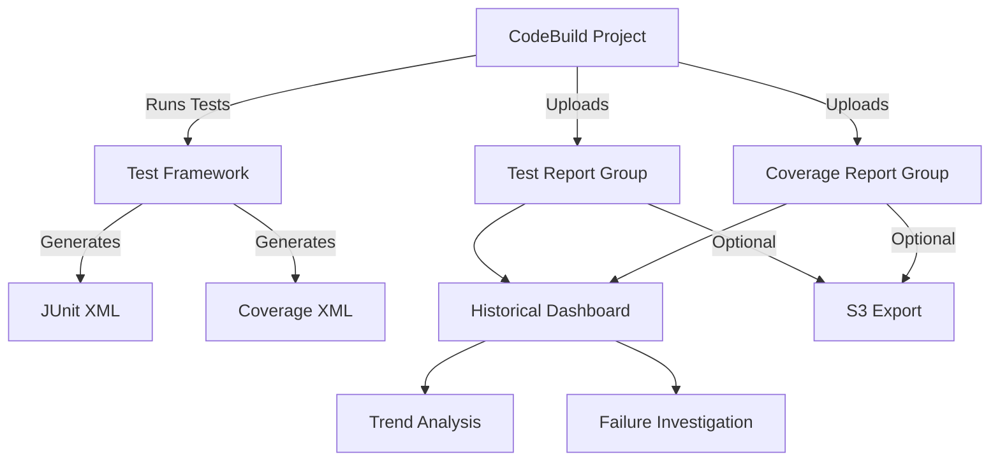

# How to Use CodeBuild Report Groups for Test Results

Author: [nawazdhandala](https://github.com/nawazdhandala)

Tags: AWS, CodeBuild, Testing, CI/CD, DevOps, Test Reports

Description: Learn how to use AWS CodeBuild Report Groups to collect, visualize, and track test results and code coverage across your CI/CD pipeline builds.

---

Running tests in CI is only half the battle. The other half is making test results visible, trackable, and actionable. AWS CodeBuild Report Groups let you collect test results and code coverage reports from your builds and display them in a unified dashboard. Instead of digging through build logs to find which tests failed, you get a structured view with pass/fail counts, duration trends, and historical comparisons.

This guide covers setting up report groups, configuring your buildspec to export test results, tracking code coverage, and using the reports for build quality insights.

## What Are CodeBuild Report Groups?

A Report Group is a collection of reports generated by CodeBuild builds. Each time a build runs and exports test results, a new report is added to the group. Over time, the report group builds up a history that shows:

- Test pass/fail rates over time
- Test duration trends
- Individual test case results
- Code coverage percentages
- Flaky test detection

Report Groups support two types of reports:
1. **Test reports** - JUnit XML, NUnit XML, Cucumber JSON, TestNG XML, Visual Studio TRX
2. **Code coverage reports** - JaCoCo XML, SimpleCov JSON, Clover XML, Cobertura XML

## Prerequisites

- An AWS account with CodeBuild configured
- A CodeBuild project with tests
- Test framework configured to output results in a supported format

## Step 1: Configure Your Test Framework for Report Output

First, make sure your test framework outputs results in a format CodeBuild understands.

For Jest (JavaScript/TypeScript):

```bash
# Install the JUnit reporter for Jest
npm install --save-dev jest-junit
```

```json
{
  "scripts": {
    "test": "jest --ci --reporters=default --reporters=jest-junit",
    "test:coverage": "jest --ci --coverage --reporters=default --reporters=jest-junit"
  },
  "jest-junit": {
    "outputDirectory": "test-reports",
    "outputName": "junit.xml"
  }
}
```

For pytest (Python):

```bash
# Install the JUnit XML plugin
pip install pytest-cov
```

```bash
# Run tests with JUnit XML output and coverage
pytest --junitxml=test-reports/junit.xml --cov=src --cov-report=xml:test-reports/coverage.xml
```

For Java (Maven with Surefire):

```xml
<!-- Maven Surefire automatically generates JUnit XML reports -->
<!-- They go to target/surefire-reports/ by default -->
<plugin>
    <groupId>org.apache.maven.plugins</groupId>
    <artifactId>maven-surefire-plugin</artifactId>
    <version>3.2.5</version>
    <configuration>
        <reportsDirectory>${project.build.directory}/test-reports</reportsDirectory>
    </configuration>
</plugin>
```

## Step 2: Create Report Groups

You can create report groups ahead of time or let CodeBuild create them automatically from the buildspec:

```bash
# Create a test report group
aws codebuild create-report-group \
  --name "payment-service-tests" \
  --type TEST \
  --export-config '{
    "exportConfigType": "S3",
    "s3Destination": {
      "bucket": "my-build-reports-123456789012",
      "path": "test-reports",
      "packaging": "NONE",
      "encryptionKey": "arn:aws:kms:us-east-1:123456789012:alias/aws/s3"
    }
  }'

# Create a code coverage report group
aws codebuild create-report-group \
  --name "payment-service-coverage" \
  --type CODE_COVERAGE \
  --export-config '{
    "exportConfigType": "S3",
    "s3Destination": {
      "bucket": "my-build-reports-123456789012",
      "path": "coverage-reports",
      "packaging": "NONE",
      "encryptionKey": "arn:aws:kms:us-east-1:123456789012:alias/aws/s3"
    }
  }'
```

## Step 3: Configure the Buildspec

The buildspec is where you tell CodeBuild to collect test results and push them to report groups:

```yaml
# buildspec.yml
version: 0.2

phases:
  install:
    runtime-versions:
      nodejs: 20
    commands:
      - npm ci

  build:
    commands:
      - echo "Running linting..."
      - npm run lint
      - echo "Running tests with coverage..."
      - npm run test:coverage

  post_build:
    commands:
      - echo "Build and tests completed"

reports:
  # Test results report
  payment-service-tests:
    files:
      - "junit.xml"
    base-directory: "test-reports"
    file-format: JUNITXML

  # Code coverage report
  payment-service-coverage:
    files:
      - "coverage/clover.xml"
    file-format: CLOVERXML
```

The `reports` section maps report group names to the output files from your test framework. CodeBuild automatically uploads these after each build.

## Step 4: Set Up a Complete Build with Multiple Test Stages

Here is a more comprehensive buildspec that runs different test types and reports them separately:

```yaml
# buildspec.yml - Comprehensive test reporting
version: 0.2

env:
  variables:
    NODE_ENV: "test"

phases:
  install:
    runtime-versions:
      nodejs: 20
    commands:
      - npm ci

  pre_build:
    commands:
      # Create output directories
      - mkdir -p test-reports/unit
      - mkdir -p test-reports/integration
      - mkdir -p coverage

  build:
    commands:
      # Run unit tests
      - echo "Running unit tests..."
      - npx jest --testPathPattern='tests/unit' --ci
          --reporters=default
          --reporters=jest-junit
          --coverage
          --coverageReporters=clover
          --coverageDirectory=coverage/unit
        env:
          JEST_JUNIT_OUTPUT_DIR: test-reports/unit
          JEST_JUNIT_OUTPUT_NAME: junit.xml

      # Run integration tests
      - echo "Running integration tests..."
      - npx jest --testPathPattern='tests/integration' --ci
          --reporters=default
          --reporters=jest-junit
        env:
          JEST_JUNIT_OUTPUT_DIR: test-reports/integration
          JEST_JUNIT_OUTPUT_NAME: junit.xml

reports:
  # Unit test results
  unit-tests:
    files:
      - "junit.xml"
    base-directory: "test-reports/unit"
    file-format: JUNITXML

  # Integration test results
  integration-tests:
    files:
      - "junit.xml"
    base-directory: "test-reports/integration"
    file-format: JUNITXML

  # Code coverage from unit tests
  code-coverage:
    files:
      - "clover.xml"
    base-directory: "coverage/unit"
    file-format: CLOVERXML
```

## Step 5: View Reports in the Console

After a build completes, you can view reports in the CodeBuild console:

1. Go to CodeBuild > Report groups
2. Click on a report group
3. You will see a list of reports, one per build
4. Click on a specific report to see details

The test report view shows:
- Total tests, passed, failed, skipped, errored
- Duration of each test
- Test case details with failure messages
- Trend charts over the last 30 reports

The coverage report view shows:
- Line coverage percentage
- Branch coverage percentage
- Per-file coverage breakdown
- Coverage trend over time

## Step 6: Set Up Report Group Thresholds

You can configure build actions based on report results. For example, fail the build if coverage drops below a threshold:

```bash
# Update the report group with a threshold
aws codebuild update-report-group \
  --arn "arn:aws:codebuild:us-east-1:123456789012:report-group/code-coverage" \
  --export-config '{
    "exportConfigType": "S3",
    "s3Destination": {
      "bucket": "my-build-reports-123456789012",
      "path": "coverage-reports",
      "packaging": "NONE"
    }
  }'
```

For threshold enforcement, add it to your buildspec:

```yaml
# Add coverage threshold check in the build phase
phases:
  build:
    commands:
      - npm run test:coverage
      - |
        # Check coverage threshold
        COVERAGE=$(npx istanbul-coverage-check coverage/coverage-summary.json --lines 80 2>&1)
        if [ $? -ne 0 ]; then
          echo "Coverage below threshold: $COVERAGE"
          exit 1
        fi
```

## Reporting Architecture



## Step 7: Query Reports Programmatically

Use the API to build custom dashboards or alerts:

```python
# Python script to check recent test results
import boto3

codebuild = boto3.client('codebuild')

# List recent reports in a report group
reports = codebuild.list_reports_for_report_group(
    reportGroupArn='arn:aws:codebuild:us-east-1:123456789012:report-group/unit-tests',
    sortOrder='DESCENDING',
    maxResults=10
)

# Get details of each report
for report_arn in reports['reports']:
    report = codebuild.batch_get_reports(reportArns=[report_arn])
    detail = report['reports'][0]

    print(f"Report: {detail['arn'].split('/')[-1]}")
    print(f"  Status: {detail['status']}")
    print(f"  Tests: {detail['testSummary']['total']}")
    print(f"  Passed: {detail['testSummary']['statusCounts'].get('SUCCEEDED', 0)}")
    print(f"  Failed: {detail['testSummary']['statusCounts'].get('FAILED', 0)}")
    print(f"  Duration: {detail['testSummary']['durationInNanoSeconds'] / 1e9:.2f}s")
    print()
```

## Best Practices

1. **Use separate report groups for different test types.** Unit tests, integration tests, and end-to-end tests should each have their own report group. This makes trend analysis more meaningful.

2. **Export to S3 for long-term retention.** CodeBuild retains reports for 30 days by default. Export to S3 for longer retention.

3. **Track code coverage trends.** A single coverage number is less useful than the trend. Watch for coverage decreasing over time, which indicates that new code is not being tested.

4. **Set up notifications for test failures.** Use EventBridge to trigger notifications when a report contains failures.

5. **Identify flaky tests.** If a test passes on most builds but fails occasionally, it is flaky. The report history makes these easy to spot.

6. **Do not game coverage numbers.** High coverage with low-quality tests is worse than moderate coverage with meaningful tests. Use coverage as a guide, not a target.

## Wrapping Up

CodeBuild Report Groups bring visibility to your test results that build logs alone cannot provide. The structured view of test outcomes, the historical trends, and the code coverage tracking give your team the data it needs to maintain and improve code quality over time. Set up report groups for your critical projects, configure your test frameworks to output in supported formats, and start watching the trends. The insight you gain into test reliability and code coverage will make your CI/CD pipeline a more effective quality gate.
