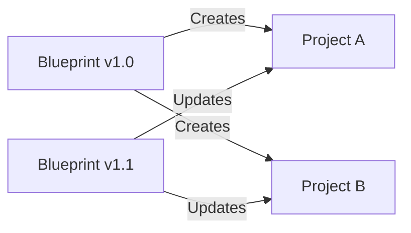

# How to Use CodeCatalyst Blueprints for Project Templates

Author: [nawazdhandala](https://github.com/nawazdhandala)

Tags: AWS, CodeCatalyst, Blueprints, Project Templates, DevOps, Automation

Description: Learn how to use and create CodeCatalyst Blueprints to standardize project setup with pre-configured source code, CI/CD workflows, and infrastructure templates.

---

Starting a new project from scratch is slow. You need to set up the repository structure, configure CI/CD, write infrastructure code, add linting and testing configs, and a dozen other things before you write a single line of business logic. CodeCatalyst Blueprints eliminate this startup cost by providing project templates that include everything a new project needs right from the start.

This guide covers using built-in blueprints, customizing them, and creating your own custom blueprints for your organization.

## What Are CodeCatalyst Blueprints?

A Blueprint is a project template that generates a complete, working project in CodeCatalyst. When you create a project from a blueprint, you get:

- Source code with a standard directory structure
- Pre-configured CI/CD workflows
- Infrastructure as code templates (CDK, CloudFormation, or Terraform)
- Dev Environment configuration (devfile)
- Testing setup and sample tests
- Documentation templates

Blueprints are parameterized, so you can customize things like programming language, framework, deployment target, and AWS region during project creation.

## Built-In Blueprints

CodeCatalyst comes with several official blueprints:

| Blueprint | Description |
|-----------|-------------|
| Single-page Application | React/Angular app with S3/CloudFront hosting |
| Serverless API | Lambda + API Gateway with SAM or CDK |
| Modern Web Application | Full-stack app with frontend and backend |
| DevOps Pipeline | CI/CD pipeline for existing applications |
| .NET Serverless | .NET Lambda functions with CDK |
| Data Pipeline | ETL pipeline with Step Functions and Glue |

## Step 1: Create a Project from a Blueprint

Using the CodeCatalyst console:

1. Navigate to your space
2. Click "Create project"
3. Select "Start with a blueprint"
4. Browse or search for a blueprint
5. Configure the blueprint parameters
6. Click "Create project"

The console walks you through each parameter with descriptions and sensible defaults.

You can also create projects from blueprints via the API:

```bash
# Create a project from the Serverless API blueprint
aws codecatalyst create-project \
  --space-name "my-company" \
  --display-name "Order API" \
  --description "Serverless order management API" \
  --blueprint '{
    "blueprintName": "serverless-api",
    "parameters": {
      "language": "TypeScript",
      "framework": "Express",
      "deploymentTarget": "Lambda",
      "region": "us-east-1",
      "stagingAccount": "123456789012",
      "productionAccount": "987654321098"
    }
  }'
```

## Step 2: Explore What a Blueprint Generates

When you create a project from the Serverless API blueprint with TypeScript, you get a repository with this structure:

```
order-api/
  .codecatalyst/
    workflows/
      build-deploy.yaml        # CI/CD pipeline
  .devfile.yaml                # Dev Environment config
  src/
    handlers/
      create-order.ts          # Sample Lambda handler
      get-order.ts
      list-orders.ts
    models/
      order.ts                 # TypeScript interfaces
    utils/
      response.ts              # API response helpers
  infrastructure/
    lib/
      api-stack.ts             # CDK stack for Lambda + API Gateway
    bin/
      app.ts                   # CDK app entry point
    cdk.json
  tests/
    unit/
      create-order.test.ts     # Sample unit tests
    integration/
      api.test.ts              # Sample integration tests
  package.json
  tsconfig.json
  .eslintrc.js
  .prettierrc
  README.md
```

Everything is wired together. Push to main and the workflow builds, tests, and deploys automatically.

## Step 3: Customize Blueprint Parameters

Each blueprint has configurable parameters. Here is how the Serverless API blueprint parameters work:

```yaml
# Blueprint parameter definitions (internal structure)
parameters:
  language:
    type: string
    enum: [TypeScript, Python, Java]
    default: TypeScript
    description: Programming language for Lambda functions

  framework:
    type: string
    enum: [Express, FastAPI, SpringBoot]
    default: Express
    description: Web framework (varies by language)

  deploymentTarget:
    type: string
    enum: [Lambda, ECS]
    default: Lambda
    description: Where to deploy the API

  databaseType:
    type: string
    enum: [DynamoDB, Aurora, None]
    default: DynamoDB
    description: Database backend

  region:
    type: string
    default: us-east-1
    description: AWS region for deployment

  includeAuth:
    type: boolean
    default: true
    description: Include Cognito authentication
```

Different parameter combinations produce different project structures. Choosing Python with FastAPI gives you a completely different codebase than TypeScript with Express, but both follow the same architectural patterns.

## Step 4: Create a Custom Blueprint

When the built-in blueprints do not match your organization's standards, create your own. Custom blueprints are TypeScript projects that use the CodeCatalyst Blueprint SDK.

Initialize a new blueprint project:

```bash
# Install the blueprint CLI
npm install -g @amazon-codecatalyst/blueprint-util.cli

# Create a new blueprint project
npx create-blueprint my-company-api-blueprint
cd my-company-api-blueprint
```

The blueprint project structure looks like this:

```
my-company-api-blueprint/
  src/
    blueprint.ts              # Main blueprint logic
    defaults.json             # Default parameter values
  static-assets/
    source-repo/              # Template files for the generated project
      src/
        index.ts.hbs          # Handlebars templates
      package.json.hbs
      tsconfig.json
    workflows/
      pipeline.yaml.hbs       # CI/CD workflow template
  package.json
  projen.ts                   # Blueprint configuration
```

Here is the core blueprint definition:

```typescript
// src/blueprint.ts
import {
  Blueprint,
  Options,
  SourceRepository,
  Workflow,
  Environment,
} from '@amazon-codecatalyst/blueprints.blueprint';
import { ProjenBlueprint } from '@amazon-codecatalyst/blueprint-util.projen-blueprint';

export interface MyBlueprintOptions extends Options {
  /**
   * The name of the service
   */
  serviceName: string;

  /**
   * The programming language
   * @validationRegex /^(typescript|python)$/
   */
  language: 'typescript' | 'python';

  /**
   * Include monitoring setup
   * @default true
   */
  includeMonitoring: boolean;

  /**
   * AWS account ID for staging
   */
  stagingAccountId: string;

  /**
   * AWS account ID for production
   */
  productionAccountId: string;
}

export class MyCompanyApiBlueprint extends Blueprint {
  constructor(options: MyBlueprintOptions) {
    super(options);

    // Create the source repository with generated files
    const repo = new SourceRepository(this, {
      title: options.serviceName,
    });

    // Add source files based on parameters
    if (options.language === 'typescript') {
      this.addTypeScriptFiles(repo, options);
    } else {
      this.addPythonFiles(repo, options);
    }

    // Add the CI/CD workflow
    this.addWorkflow(repo, options);

    // Add environments
    new Environment(this, {
      name: 'staging',
      environmentType: 'NON_PRODUCTION',
      awsAccountConnection: {
        id: options.stagingAccountId,
        name: options.stagingAccountId,
      },
    });

    new Environment(this, {
      name: 'production',
      environmentType: 'PRODUCTION',
      awsAccountConnection: {
        id: options.productionAccountId,
        name: options.productionAccountId,
      },
    });
  }

  private addTypeScriptFiles(repo: SourceRepository, options: MyBlueprintOptions) {
    // Use Handlebars templates from static-assets
    repo.copyStaticFiles({
      from: 'static-assets/source-repo',
      context: {
        serviceName: options.serviceName,
        includeMonitoring: options.includeMonitoring,
      },
    });
  }

  private addPythonFiles(repo: SourceRepository, options: MyBlueprintOptions) {
    // Python-specific file generation
    repo.copyStaticFiles({
      from: 'static-assets/python-source',
      context: {
        serviceName: options.serviceName,
      },
    });
  }

  private addWorkflow(repo: SourceRepository, options: MyBlueprintOptions) {
    new Workflow(this, repo, {
      name: 'BuildAndDeploy',
      definition: {
        SchemaVersion: '1.0',
        Triggers: [{ Type: 'Push', Branches: ['main'] }],
        Actions: {
          Build: {
            Identifier: 'aws/build@v1',
            Configuration: {
              Steps: [
                { Run: 'npm ci' },
                { Run: 'npm test' },
                { Run: 'npm run build' },
              ],
            },
          },
        },
      },
    });
  }
}
```

## Step 5: Publish Your Custom Blueprint

Once your blueprint is ready, publish it to your CodeCatalyst space:

```bash
# Build the blueprint
npm run build

# Publish to your space
npx publish-blueprint \
  --space "my-company" \
  --blueprint-name "my-company-api" \
  --version "1.0.0"
```

After publishing, team members can find your blueprint when creating new projects. It appears alongside the built-in blueprints.

## Step 6: Update Projects with Blueprint Changes

One powerful feature of CodeCatalyst Blueprints is the ability to push updates to existing projects. When you publish a new version of your blueprint, projects created from it can receive the updates:



This means when you update your organization's standard CI/CD pipeline or add a new monitoring configuration to the blueprint, all projects based on that blueprint can pull in the changes.

## Blueprint Design Patterns

### The Layered Blueprint

Create blueprints at different layers:

```
Base Blueprint (security, logging, monitoring)
  + API Blueprint (API Gateway, Lambda, database)
    = Complete Service Blueprint
```

### The Feature Toggle Blueprint

Use boolean parameters to include/exclude features:

```typescript
// Toggle monitoring, authentication, database, etc.
if (options.includeMonitoring) {
  this.addMonitoringStack(repo);
  this.addDashboardConfig(repo);
}

if (options.includeAuth) {
  this.addCognitoSetup(repo);
  this.addAuthMiddleware(repo);
}
```

### The Multi-Language Blueprint

Support multiple languages with the same architecture:

```typescript
// Same API structure, different implementations
switch (options.language) {
  case 'typescript':
    this.generateTypeScript(repo, options);
    break;
  case 'python':
    this.generatePython(repo, options);
    break;
  case 'go':
    this.generateGo(repo, options);
    break;
}
```

## Best Practices

1. **Start with built-in blueprints.** Use official blueprints to get familiar with the pattern before building custom ones.

2. **Design blueprints around your org's golden path.** Your blueprint should represent your organization's recommended way to build a service - the "golden path."

3. **Keep blueprints focused.** One blueprint per application type. Do not try to create a single blueprint that does everything.

4. **Version your blueprints carefully.** Blueprint updates can affect all projects based on them. Test thoroughly before publishing.

5. **Include everything a project needs.** CI/CD, infrastructure, testing, linting, devfiles - the more complete the blueprint, the faster teams get to production.

6. **Document your blueprints.** Each parameter should have a clear description. Include a README that explains the architecture and how to customize beyond the parameters.

## Wrapping Up

CodeCatalyst Blueprints are the fastest path from "we need a new service" to "it is deployed and running." Built-in blueprints get you started immediately, and custom blueprints let you encode your organization's best practices into a reusable template. The ability to push updates to existing projects means your blueprints are not just a starting point but an ongoing governance tool. Invest the time to build blueprints that represent your golden path, and watch how much faster your teams ship.
