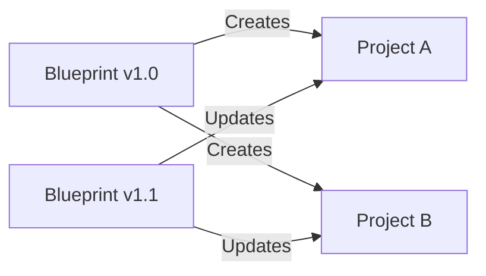

# How to Use CodeCatalyst Blueprints for Project Templates

Author: [nawazdhandala](https://github.com/nawazdhandala)

Tags: AWS, CodeCatalyst, Blueprints, Project Templates, DevOps, Automation

Description: Learn how to use and create CodeCatalyst Blueprints to standardize project setup with pre-configured source code, CI/CD workflows, and infrastructure templates.

---

Starting a new project from scratch is slow. You need to set up the repository structure, configure CI/CD, write infrastructure code, add linting and testing configs, and a dozen other things before you write a single line of business logic. CodeCatalyst Blueprints eliminate this startup cost by providing project templates that include everything a new project needs right from the start.

Note: AWS closed Amazon CodeCatalyst access to new customers on November 7, 2025. Existing customers can continue using existing spaces, but AWS does not plan to introduce new CodeCatalyst features beyond security, availability, and performance improvements.

This guide covers using built-in blueprints, customizing them, and creating your own custom blueprints for your organization.

## What Are CodeCatalyst Blueprints?

A Blueprint is a project template that generates a complete, working project in CodeCatalyst. When you create a project from a blueprint, you get:

- Source code with a standard directory structure
- Pre-configured CI/CD workflows
- Infrastructure as code templates, depending on the blueprint (for example, AWS CDK or AWS SAM)
- Dev Environment configuration (devfile)
- Testing setup and sample tests
- Documentation templates

Blueprints are parameterized, so you can customize things like programming language, framework, deployment target, and AWS region during project creation.

## Built-In Blueprints

CodeCatalyst comes with several official blueprints:

| Blueprint | Description |
|-----------|-------------|
| Single-page application | React, Vue, or Angular SPA with AWS Amplify Hosting or S3/CloudFront hosting |
| Serverless Application Model (SAM) | Serverless API project using AWS SAM |
| Serverless RESTful microservice | REST API with Lambda and API Gateway |
| Modern three-tier web application | Python application layer with a Vue frontend |
| DevOps deployment pipeline | Deployment pipeline based on the AWS Deployment Pipeline Reference Architecture |
| AWS Glue ETL | ETL reference implementation using AWS CDK, AWS Glue, AWS Lambda, and Amazon Athena |

## Step 1: Create a Project from a Blueprint

Using the CodeCatalyst console as a Space administrator:

1. Navigate to your space
2. Click "Create project"
3. Select "Start with a blueprint"
4. Browse or search for a blueprint
5. Configure the blueprint parameters
6. Click "Create project"

The console walks you through each parameter with descriptions and sensible defaults. The AWS CLI `codecatalyst create-project` command creates a project in a space, but it does not accept a `--blueprint` option. Blueprint selection and configuration are handled through the CodeCatalyst console.

```bash
# Create an empty CodeCatalyst project
aws codecatalyst create-project \
  --space-name "my-company" \
  --display-name "Order API" \
  --description "Serverless order management API"
```

## Step 2: Explore What a Blueprint Generates

When you create a project from a serverless blueprint with TypeScript, you get a repository with generated source code, workflow definitions, and infrastructure files. The exact files depend on the blueprint and options you choose, but the structure commonly looks like this:

```text
order-api/
  .codecatalyst/
    workflows/
      build-deploy.yaml        # CI/CD pipeline
  .devfile.yaml                # Dev Environment config
  src/
    handlers/
      create-order.ts          # Sample Lambda handler
      get-order.ts
      list-orders.ts
    models/
      order.ts                 # TypeScript interfaces
    utils/
      response.ts              # API response helpers
  infrastructure/
    lib/
      api-stack.ts             # CDK stack for Lambda + API Gateway
    bin/
      app.ts                   # CDK app entry point
    cdk.json
  tests/
    unit/
      create-order.test.ts     # Sample unit tests
    integration/
      api.test.ts              # Sample integration tests
  package.json
  tsconfig.json
  .eslintrc.js
  .prettierrc
  README.md
```

Everything is wired together. Push to main and the workflow builds, tests, and deploys according to the selected blueprint.

## Step 3: Customize Blueprint Parameters

Each blueprint has configurable parameters. For custom blueprints, the CodeCatalyst wizard is generated from the TypeScript `Options` interface in `src/blueprint.ts`:

```typescript
import { Options as ParentOptions } from '@amazon-codecatalyst/blueprints.blueprint';

export interface Options extends ParentOptions {
  /**
   * The name of the service
   */
  serviceName: string;

  /**
   * The programming language
   */
  language: 'typescript' | 'python' | 'java';

  /**
   * Include Cognito authentication
   */
  includeAuth: boolean;
}
```

Different parameter combinations can produce different project structures. Choosing a different language can generate a different codebase while still following the same architectural patterns.

## Step 4: Create a Custom Blueprint

When the built-in blueprints do not match your organization's standards, create your own. Custom blueprints are TypeScript projects that use the CodeCatalyst Blueprint SDK.

Create a new custom blueprint from your space's settings in the CodeCatalyst console. CodeCatalyst creates a blueprint project and repository for you. If you need the local blueprint tooling in a Dev Environment, install the CLI:

```bash
# Install the blueprint CLI
npm install -g @amazon-codecatalyst/blueprint-util.cli
```

The blueprint project structure looks like this:

```text
my-company-api-blueprint/
  src/
    blueprint.ts              # Main blueprint logic
    defaults.json             # Default parameter values
  static-assets/
    source-repo/              # Template files for the generated project
      src/
        index.ts              # Static or generated source files
      package.json
      tsconfig.json
  package.json
  projen.ts                   # Blueprint configuration
```

Here is the core blueprint definition:

```typescript
// src/blueprint.ts
import {
  Blueprint,
  Options as ParentOptions,
} from '@amazon-codecatalyst/blueprints.blueprint';
import {
  SourceFile,
  SourceRepository,
} from '@amazon-codecatalyst/codecatalyst-source-repositories';
import { Workflow } from '@amazon-codecatalyst/codecatalyst-workflows';

export interface MyBlueprintOptions extends ParentOptions {
  /**
   * The name of the service
   */
  serviceName: string;

  /**
   * The programming language
   * @validationRegex /^(typescript|python)$/
   */
  language: 'typescript' | 'python';

  /**
   * Include monitoring setup
   * @default true
   */
  includeMonitoring: boolean;
}

export class MyCompanyApiBlueprint extends Blueprint {
  constructor(options: MyBlueprintOptions) {
    super(options);

    // Create the source repository with generated files
    const repo = new SourceRepository(this, {
      title: options.serviceName,
    });

    // Add source files based on parameters
    if (options.language === 'typescript') {
      this.addTypeScriptFiles(repo, options);
    } else {
      this.addPythonFiles(repo, options);
    }

    // Add the CI/CD workflow
    this.addWorkflow(repo);
  }

  private addTypeScriptFiles(repo: SourceRepository, options: MyBlueprintOptions) {
    new SourceFile(repo, 'README.md', `# ${options.serviceName}`);
    new SourceFile(repo, 'src/index.ts', 'export const handler = async () => ({ statusCode: 200 });');
  }

  private addPythonFiles(repo: SourceRepository, options: MyBlueprintOptions) {
    new SourceFile(repo, 'README.md', `# ${options.serviceName}`);
    new SourceFile(repo, 'src/index.py', 'def handler(event, context):\n    return {"statusCode": 200}\n');
  }

  private addWorkflow(repo: SourceRepository) {
    new Workflow(this, repo, {
      Name: 'BuildAndDeploy',
      SchemaVersion: '1.0',
      Triggers: [{ Type: 'PUSH', Branches: ['main'] }],
      Actions: {
        Build: {
          Identifier: 'aws/build@v1',
          Inputs: {
            Sources: ['WorkflowSource'],
          },
          Configuration: {
            Steps: [
              { Run: 'npm ci' },
              { Run: 'npm test' },
              { Run: 'npm run build' },
            ],
          },
        },
      },
    });
  }
}
```

## Step 5: Publish Your Custom Blueprint

Once your blueprint is ready, publish it to your CodeCatalyst space:

```bash
# Install dependencies
yarn

# Preview the blueprint
yarn blueprint:preview

# Publish a normal version if you opted out of release workflow generation
yarn blueprint:release
```

After publishing, add the blueprint to your space's blueprints catalog. Team members can then find your blueprint when creating new projects or adding blueprints to existing projects.

## Step 6: Update Projects with Blueprint Changes

One powerful feature of CodeCatalyst Blueprints is the ability to push updates to existing projects. When you publish a new version of your blueprint, projects created from it can receive the updates:


```mermaid
graph LR
    A[Blueprint v1.0] -->|Creates| B[Project A]
    A -->|Creates| C[Project B]
    D[Blueprint v1.1] -->|Updates| B
    D -->|Updates| C
```

This means when you update your organization's standard CI/CD pipeline or add a new monitoring configuration to the blueprint, all projects based on that blueprint can pull in the changes.

## Blueprint Design Patterns

### The Layered Blueprint

Create blueprints at different layers:

```text
Base Blueprint (security, logging, monitoring)
  + API Blueprint (API Gateway, Lambda, database)
    = Complete Service Blueprint
```

### The Feature Toggle Blueprint

Use boolean parameters to include/exclude features:

```typescript
// Toggle monitoring, authentication, database, etc.
if (options.includeMonitoring) {
  this.addMonitoringStack(repo);
  this.addDashboardConfig(repo);
}

if (options.includeAuth) {
  this.addCognitoSetup(repo);
  this.addAuthMiddleware(repo);
}
```

### The Multi-Language Blueprint

Support multiple languages with the same architecture:

```typescript
// Same API structure, different implementations
switch (options.language) {
  case 'typescript':
    this.generateTypeScript(repo, options);
    break;
  case 'python':
    this.generatePython(repo, options);
    break;
  case 'go':
    this.generateGo(repo, options);
    break;
}
```

## Best Practices

1. **Start with built-in blueprints.** Use official blueprints to get familiar with the pattern before building custom ones.

2. **Design blueprints around your org's golden path.** Your blueprint should represent your organization's recommended way to build a service - the "golden path."

3. **Keep blueprints focused.** One blueprint per application type. Do not try to create a single blueprint that does everything.

4. **Version your blueprints carefully.** Blueprint updates can affect all projects based on them. Test thoroughly before publishing.

5. **Include everything a project needs.** CI/CD, infrastructure, testing, linting, devfiles - the more complete the blueprint, the faster teams get to production.

6. **Document your blueprints.** Each parameter should have a clear description. Include a README that explains the architecture and how to customize beyond the parameters.

## Wrapping Up

CodeCatalyst Blueprints are the fastest path from "we need a new service" to "it is deployed and running." Built-in blueprints get you started immediately, and custom blueprints let you encode your organization's best practices into a reusable template. The ability to push updates to existing projects means your blueprints are not just a starting point but an ongoing governance tool. Invest the time to build blueprints that represent your golden path, and watch how much faster your teams ship.
