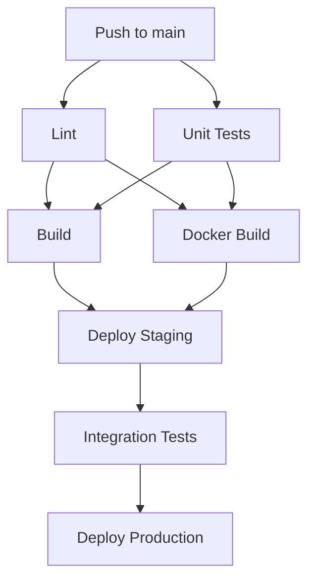

# How to Use CodeCatalyst Workflows for CI/CD

Author: [nawazdhandala](https://github.com/nawazdhandala)

Tags: AWS, CodeCatalyst, CI/CD, Workflows, DevOps, Automation

Description: Learn how to create and configure CodeCatalyst Workflows for continuous integration and continuous deployment with build, test, and deploy actions.

---

CodeCatalyst Workflows are the CI/CD engine of AWS CodeCatalyst. If you have used GitHub Actions, GitLab CI, or Jenkins pipelines, the concept is familiar: you define your build, test, and deploy steps in a YAML file, and the system executes them automatically when triggered. But CodeCatalyst Workflows have some unique features, including native AWS service integration, managed compute environments, and built-in support for CDK and CloudFormation deployments.

This guide dives deep into creating workflows, configuring triggers, chaining actions, managing secrets, and deploying to multiple environments.

## Workflow Basics

A CodeCatalyst Workflow is a YAML file stored in `.codecatalyst/workflows/` in your source repository. Each workflow consists of:

- **Name** - A human-readable identifier
- **Triggers** - Events that start the workflow (push, pull request, schedule)
- **Actions** - Individual steps that execute in sequence or parallel

Here is the simplest possible workflow:

```yaml
# .codecatalyst/workflows/simple-build.yaml
Name: SimpleBuild
SchemaVersion: "1.0"

Triggers:
  - Type: Push
    Branches:
      - main

Actions:
  Build:
    Identifier: aws/build@v1
    Inputs:
      Sources:
        - WorkflowSource
    Configuration:
      Steps:
        - Run: echo "Hello from CodeCatalyst Workflows!"
        - Run: node --version
```

## Trigger Types

CodeCatalyst supports several trigger types:

### Push Trigger

Runs when code is pushed to specified branches:

```yaml
Triggers:
  - Type: Push
    Branches:
      - main
      - "release/*"
    FilesChanged:
      - "src/**"
      - "package.json"
```

### Pull Request Trigger

Runs when a pull request is opened or updated:

```yaml
Triggers:
  - Type: PullRequest
    Branches:
      - main
    Events:
      - OPEN
      - REVISION
```

### Schedule Trigger

Runs on a cron schedule:

```yaml
Triggers:
  - Type: Schedule
    Expression: "cron(0 6 * * ? *)"
```

### Manual Trigger

Allows manual execution from the console:

```yaml
Triggers:
  - Type: Manual
```

## Building a Complete CI/CD Pipeline

Let us build a realistic workflow for a Node.js application with build, test, staging deployment, and production deployment.

```yaml
# .codecatalyst/workflows/full-pipeline.yaml
Name: FullPipeline
SchemaVersion: "1.0"

Triggers:
  - Type: Push
    Branches:
      - main

Actions:
  # Step 1: Install dependencies and run linting
  Lint:
    Identifier: aws/build@v1
    Inputs:
      Sources:
        - WorkflowSource
    Configuration:
      Steps:
        - Run: npm ci
        - Run: npm run lint
    Compute:
      Type: EC2
      Fleet: Linux.x86-64.Large

  # Step 2: Run unit tests in parallel with linting
  UnitTests:
    Identifier: aws/build@v1
    Inputs:
      Sources:
        - WorkflowSource
    Configuration:
      Steps:
        - Run: npm ci
        - Run: npm test -- --coverage
        - Run: |
            # Upload coverage report as artifact
            mkdir -p coverage-output
            cp -r coverage/* coverage-output/
    Outputs:
      Artifacts:
        - Name: CoverageReport
          Files:
            - "coverage-output/**/*"
    Compute:
      Type: EC2
      Fleet: Linux.x86-64.Large

  # Step 3: Build the application
  Build:
    Identifier: aws/build@v1
    DependsOn:
      - Lint
      - UnitTests
    Inputs:
      Sources:
        - WorkflowSource
    Configuration:
      Steps:
        - Run: npm ci
        - Run: npm run build
        - Run: |
            # Package for deployment
            cp -r dist/ deploy-package/
            cp package.json deploy-package/
            cp package-lock.json deploy-package/
            cd deploy-package && npm ci --production
    Outputs:
      Artifacts:
        - Name: DeployPackage
          Files:
            - "deploy-package/**/*"

  # Step 4: Build Docker image
  DockerBuild:
    Identifier: aws/build@v1
    DependsOn:
      - Lint
      - UnitTests
    Inputs:
      Sources:
        - WorkflowSource
    Configuration:
      Steps:
        - Run: |
            # Build and push Docker image to ECR
            aws ecr get-login-password --region us-east-1 | \
              docker login --username AWS --password-stdin 123456789012.dkr.ecr.us-east-1.amazonaws.com
            docker build -t payment-service:${WorkflowSource.CommitId} .
            docker tag payment-service:${WorkflowSource.CommitId} \
              123456789012.dkr.ecr.us-east-1.amazonaws.com/payment-service:${WorkflowSource.CommitId}
            docker push 123456789012.dkr.ecr.us-east-1.amazonaws.com/payment-service:${WorkflowSource.CommitId}
    Environment:
      Name: staging
      Connections:
        - Name: "123456789012"
          Role: CodeCatalystWorkflowDevelopmentRole

  # Step 5: Deploy to staging
  DeployStaging:
    Identifier: aws/cdk-deploy@v1
    DependsOn:
      - Build
      - DockerBuild
    Inputs:
      Sources:
        - WorkflowSource
      Artifacts:
        - DeployPackage
    Environment:
      Name: staging
      Connections:
        - Name: "123456789012"
          Role: CodeCatalystWorkflowDevelopmentRole
    Configuration:
      StackName: payment-service-staging
      Region: us-east-1
      Context: '{"imageTag": "${WorkflowSource.CommitId}", "environment": "staging"}'

  # Step 6: Run integration tests against staging
  IntegrationTests:
    Identifier: aws/build@v1
    DependsOn:
      - DeployStaging
    Inputs:
      Sources:
        - WorkflowSource
    Configuration:
      Steps:
        - Run: npm ci
        - Run: |
            # Run integration tests against the staging endpoint
            STAGING_URL="https://staging-api.example.com"
            npm run test:integration -- --base-url=$STAGING_URL
    Environment:
      Name: staging
      Connections:
        - Name: "123456789012"
          Role: CodeCatalystWorkflowDevelopmentRole

  # Step 7: Deploy to production
  DeployProduction:
    Identifier: aws/cdk-deploy@v1
    DependsOn:
      - IntegrationTests
    Inputs:
      Sources:
        - WorkflowSource
      Artifacts:
        - DeployPackage
    Environment:
      Name: production
      Connections:
        - Name: "987654321098"
          Role: CodeCatalystProductionDeployRole
    Configuration:
      StackName: payment-service-prod
      Region: us-east-1
      Context: '{"imageTag": "${WorkflowSource.CommitId}", "environment": "production"}'
```

## Pipeline Flow



## Managing Secrets and Environment Variables

Store sensitive values as secrets in CodeCatalyst:

```yaml
# Reference secrets in your workflow
Actions:
  Deploy:
    Identifier: aws/build@v1
    Configuration:
      Steps:
        - Run: |
            # Secrets are available as environment variables
            echo "Deploying with API key..."
            curl -X POST https://api.example.com/deploy \
              -H "Authorization: Bearer ${Secrets.API_KEY}"
    Inputs:
      Sources:
        - WorkflowSource
```

You can also set environment variables directly:

```yaml
Actions:
  Build:
    Identifier: aws/build@v1
    Configuration:
      Steps:
        - Run: npm run build
    Environment:
      Name: staging
    Inputs:
      Variables:
        - Name: NODE_ENV
          Value: production
        - Name: API_URL
          Value: https://api.staging.example.com
```

## Custom Compute Configuration

Control the compute resources for each action:

```yaml
Actions:
  HeavyBuild:
    Identifier: aws/build@v1
    Compute:
      Type: EC2
      Fleet: Linux.x86-64.2XLarge
    Configuration:
      Container:
        Registry: DockerHub
        Image: node:20-bullseye
      Steps:
        - Run: npm ci
        - Run: npm run build
```

Available fleet sizes:
- `Linux.x86-64.Small` - 2 vCPU, 3 GB RAM
- `Linux.x86-64.Medium` - 4 vCPU, 7 GB RAM
- `Linux.x86-64.Large` - 8 vCPU, 15 GB RAM
- `Linux.x86-64.2XLarge` - 16 vCPU, 32 GB RAM

## Passing Artifacts Between Actions

Actions can produce and consume artifacts:

```yaml
Actions:
  Build:
    Identifier: aws/build@v1
    Inputs:
      Sources:
        - WorkflowSource
    Configuration:
      Steps:
        - Run: npm ci && npm run build
    Outputs:
      Artifacts:
        - Name: BuildArtifact
          Files:
            - "dist/**/*"
            - "node_modules/**/*"

  Deploy:
    Identifier: aws/build@v1
    DependsOn:
      - Build
    Inputs:
      Artifacts:
        - BuildArtifact
    Configuration:
      Steps:
        - Run: ls -la  # BuildArtifact contents are in the working directory
        - Run: ./deploy.sh
```

## Pull Request Workflows

Create a separate workflow for pull request validation:

```yaml
# .codecatalyst/workflows/pr-validation.yaml
Name: PRValidation
SchemaVersion: "1.0"

Triggers:
  - Type: PullRequest
    Branches:
      - main
    Events:
      - OPEN
      - REVISION

Actions:
  Validate:
    Identifier: aws/build@v1
    Inputs:
      Sources:
        - WorkflowSource
    Configuration:
      Steps:
        - Run: npm ci
        - Run: npm run lint
        - Run: npm test
        - Run: npm run build
    Compute:
      Type: EC2
      Fleet: Linux.x86-64.Large
```

## Reusable Action Groups

For common patterns, you can extract reusable configurations. While CodeCatalyst does not have a native "reusable workflow" feature like GitHub Actions, you can use scripts and shared configurations:

```yaml
# Use a shared setup script across multiple actions
Actions:
  Setup:
    Identifier: aws/build@v1
    Configuration:
      Steps:
        - Run: |
            # Shared setup script from your repo
            chmod +x scripts/ci-setup.sh
            ./scripts/ci-setup.sh
    Outputs:
      Artifacts:
        - Name: SetupArtifact
          Files:
            - "**/*"
```

## Best Practices

1. **Keep workflows in version control.** Since workflows live in `.codecatalyst/workflows/`, they are versioned alongside your code. This means workflow changes go through code review.

2. **Use DependsOn for ordering.** Explicitly define dependencies between actions rather than relying on implicit ordering.

3. **Parallelize where possible.** Actions without dependencies run in parallel by default. Structure your pipeline to take advantage of this.

4. **Use appropriate fleet sizes.** Do not use 2XLarge for a simple lint check. Match compute to workload.

5. **Separate PR and deployment workflows.** Keep validation workflows (triggered by PRs) separate from deployment workflows (triggered by pushes to main).

6. **Test your workflows.** Use the manual trigger to test new workflows without pushing to main.

## Wrapping Up

CodeCatalyst Workflows provide a powerful, AWS-native CI/CD system that integrates tightly with your AWS accounts and services. The YAML-based configuration is familiar if you have used other CI/CD platforms, and the native support for CDK deployments, ECR, and other AWS services eliminates the boilerplate of setting up service connections. Start with a simple build workflow, add tests, then layer in staging and production deployments as your confidence grows.
