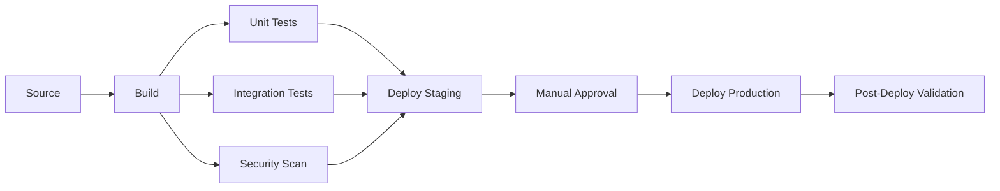

# How to Use CodePipeline V2 for Advanced Pipeline Features

Author: [nawazdhandala](https://github.com/nawazdhandala)

Tags: AWS, CodePipeline, CI/CD, DevOps, Pipeline, Automation

Description: Learn how to use AWS CodePipeline V2 advanced features including pipeline triggers, variables, parallel stages, and rollback configurations.

---

AWS CodePipeline has been a solid CI/CD orchestration tool for years, but the V1 pipeline type had limitations that frustrated teams building complex deployment workflows. CodePipeline V2 addresses these with significant improvements: git-based triggers with filtering, pipeline-level variables, parallel execution within stages, rollback capabilities, and a fundamentally different execution model. If you are still using V1 pipelines, it is time to upgrade.

This guide covers the key V2 features, how to configure them, and practical examples of advanced pipeline patterns.

## What Changed in V2?

Here are the headline differences:

| Feature | V1 | V2 |
|---------|----|----|
| Trigger filtering | Basic (branch only) | Git tags, file paths, PR events |
| Variables | Limited | Pipeline, stage, and action variables |
| Stage execution | Sequential only | Parallel actions within stages |
| Rollback | Manual | Automated with conditions |
| Execution mode | Superseded | Queued, Superseded, or Parallel |
| Pipeline type | Standard | V2 type |
| Pricing | Per pipeline/month | Per execution minute |

## Prerequisites

- AWS account with CodePipeline permissions
- Source code in CodeCommit, GitHub, or S3
- Build and deployment targets (CodeBuild, CodeDeploy, ECS, etc.)

## Step 1: Create a V2 Pipeline

You specify the V2 type when creating a pipeline:

```bash
# Create a V2 pipeline
aws codepipeline create-pipeline \
  --pipeline '{
    "name": "my-service-pipeline",
    "pipelineType": "V2",
    "roleArn": "arn:aws:iam::123456789012:role/CodePipelineServiceRole",
    "artifactStore": {
      "type": "S3",
      "location": "my-pipeline-artifacts-123456789012"
    },
    "stages": [
      {
        "name": "Source",
        "actions": [
          {
            "name": "SourceAction",
            "actionTypeId": {
              "category": "Source",
              "owner": "AWS",
              "provider": "CodeStarSourceConnection",
              "version": "1"
            },
            "configuration": {
              "ConnectionArn": "arn:aws:codestar-connections:us-east-1:123456789012:connection/abc123",
              "FullRepositoryId": "my-org/my-service",
              "BranchName": "main",
              "OutputArtifactFormat": "CODE_ZIP"
            },
            "outputArtifacts": [{"name": "SourceOutput"}]
          }
        ]
      },
      {
        "name": "Build",
        "actions": [
          {
            "name": "BuildAction",
            "actionTypeId": {
              "category": "Build",
              "owner": "AWS",
              "provider": "CodeBuild",
              "version": "1"
            },
            "configuration": {
              "ProjectName": "my-service-build"
            },
            "inputArtifacts": [{"name": "SourceOutput"}],
            "outputArtifacts": [{"name": "BuildOutput"}]
          }
        ]
      },
      {
        "name": "Deploy",
        "actions": [
          {
            "name": "DeployAction",
            "actionTypeId": {
              "category": "Deploy",
              "owner": "AWS",
              "provider": "ECS",
              "version": "1"
            },
            "configuration": {
              "ClusterName": "my-cluster",
              "ServiceName": "my-service"
            },
            "inputArtifacts": [{"name": "BuildOutput"}]
          }
        ]
      }
    ]
  }'
```

## Step 2: Configure Advanced Triggers

V2 pipelines support sophisticated trigger conditions:

```bash
# Update pipeline with git tag triggers and file path filters
aws codepipeline update-pipeline \
  --pipeline '{
    "name": "my-service-pipeline",
    "pipelineType": "V2",
    "triggers": [
      {
        "providerType": "CodeStarSourceConnection",
        "gitConfiguration": {
          "sourceActionName": "SourceAction",
          "push": [
            {
              "branches": {
                "includes": ["main", "release/*"],
                "excludes": ["release/beta-*"]
              },
              "filePaths": {
                "includes": ["src/**", "package.json"],
                "excludes": ["docs/**", "*.md"]
              }
            }
          ],
          "tags": {
            "includes": ["v*"],
            "excludes": ["v*-rc*"]
          }
        }
      }
    ]
  }'
```

This trigger configuration means:
- The pipeline runs on pushes to `main` or `release/*` branches (except `release/beta-*`)
- Only if files in `src/` or `package.json` changed (ignoring docs and markdown changes)
- Also runs when a tag matching `v*` is pushed (excluding release candidates)

### Pull Request Triggers

V2 also supports pull request triggers:

```json
{
  "providerType": "CodeStarSourceConnection",
  "gitConfiguration": {
    "sourceActionName": "SourceAction",
    "pullRequest": [
      {
        "events": ["OPEN", "UPDATED"],
        "branches": {
          "includes": ["main"],
          "excludes": []
        },
        "filePaths": {
          "includes": ["src/**"]
        }
      }
    ]
  }
}
```

## Step 3: Use Pipeline Variables

V2 introduces pipeline-level variables that you can reference across stages:

```json
{
  "name": "my-service-pipeline",
  "pipelineType": "V2",
  "variables": [
    {
      "name": "DEPLOY_ENVIRONMENT",
      "defaultValue": "staging",
      "description": "Target deployment environment"
    },
    {
      "name": "IMAGE_TAG",
      "defaultValue": "latest",
      "description": "Docker image tag to deploy"
    }
  ]
}
```

Reference variables in action configurations:

```json
{
  "name": "BuildAction",
  "actionTypeId": {
    "category": "Build",
    "owner": "AWS",
    "provider": "CodeBuild",
    "version": "1"
  },
  "configuration": {
    "ProjectName": "my-service-build",
    "EnvironmentVariables": "[{\"name\":\"DEPLOY_ENV\",\"value\":\"#{variables.DEPLOY_ENVIRONMENT}\",\"type\":\"PLAINTEXT\"},{\"name\":\"IMAGE_TAG\",\"value\":\"#{variables.IMAGE_TAG}\",\"type\":\"PLAINTEXT\"}]"
  }
}
```

You can also use output variables from actions. For example, a CodeBuild action can export variables that later stages consume:

```yaml
# buildspec.yml - Export variables for use in later pipeline stages
version: 0.2

env:
  exported-variables:
    - IMAGE_URI
    - BUILD_VERSION

phases:
  build:
    commands:
      - BUILD_VERSION=$(cat version.txt)
      - IMAGE_URI="${AWS_ACCOUNT_ID}.dkr.ecr.${AWS_REGION}.amazonaws.com/my-service:${BUILD_VERSION}"
      - docker build -t $IMAGE_URI .
      - docker push $IMAGE_URI
```

Reference the exported variable in a later action:

```json
{
  "name": "DeployAction",
  "configuration": {
    "FileName": "imagedefinitions.json"
  },
  "namespace": "BuildVariables"
}
```

Then use `#{BuildVariables.IMAGE_URI}` in subsequent actions.

## Step 4: Configure Parallel Actions

V2 pipelines support running actions in parallel within a stage using run orders:

```json
{
  "name": "Test",
  "actions": [
    {
      "name": "UnitTests",
      "runOrder": 1,
      "actionTypeId": {
        "category": "Build",
        "owner": "AWS",
        "provider": "CodeBuild",
        "version": "1"
      },
      "configuration": {
        "ProjectName": "my-service-unit-tests"
      },
      "inputArtifacts": [{"name": "SourceOutput"}]
    },
    {
      "name": "IntegrationTests",
      "runOrder": 1,
      "actionTypeId": {
        "category": "Build",
        "owner": "AWS",
        "provider": "CodeBuild",
        "version": "1"
      },
      "configuration": {
        "ProjectName": "my-service-integration-tests"
      },
      "inputArtifacts": [{"name": "SourceOutput"}]
    },
    {
      "name": "SecurityScan",
      "runOrder": 1,
      "actionTypeId": {
        "category": "Build",
        "owner": "AWS",
        "provider": "CodeBuild",
        "version": "1"
      },
      "configuration": {
        "ProjectName": "my-service-security-scan"
      },
      "inputArtifacts": [{"name": "SourceOutput"}]
    },
    {
      "name": "MergeResults",
      "runOrder": 2,
      "actionTypeId": {
        "category": "Build",
        "owner": "AWS",
        "provider": "CodeBuild",
        "version": "1"
      },
      "configuration": {
        "ProjectName": "my-service-merge-test-results"
      },
      "inputArtifacts": [{"name": "SourceOutput"}]
    }
  ]
}
```

Actions with `runOrder: 1` run in parallel. `MergeResults` with `runOrder: 2` runs after all parallel actions complete.

## Pipeline Architecture



## Step 5: Set Up Rollback Configuration

V2 pipelines support automatic rollback based on conditions:

```json
{
  "name": "Deploy",
  "actions": [
    {
      "name": "DeployToECS",
      "actionTypeId": {
        "category": "Deploy",
        "owner": "AWS",
        "provider": "ECS",
        "version": "1"
      },
      "configuration": {
        "ClusterName": "production",
        "ServiceName": "my-service"
      }
    }
  ],
  "onFailure": {
    "result": "ROLLBACK",
    "conditions": [
      {
        "result": "ROLLBACK",
        "rules": [
          {
            "name": "CloudWatchAlarmRule",
            "ruleTypeId": {
              "category": "Rule",
              "owner": "AWS",
              "provider": "CloudWatchAlarm",
              "version": "1"
            },
            "configuration": {
              "AlarmName": "my-service-error-rate-high",
              "WaitTime": "5"
            }
          }
        ]
      }
    ]
  }
}
```

This monitors a CloudWatch alarm after deployment. If the error rate goes high within 5 minutes, the pipeline automatically rolls back.

## Step 6: Configure Execution Modes

V2 pipelines offer three execution modes:

**SUPERSEDED** (default) - New executions replace in-progress ones:
```json
{
  "executionMode": "SUPERSEDED"
}
```

**QUEUED** - Executions queue up and run in order:
```json
{
  "executionMode": "QUEUED"
}
```

**PARALLEL** - Multiple executions run simultaneously (useful for multi-branch workflows):
```json
{
  "executionMode": "PARALLEL"
}
```

## Step 7: CloudFormation Template for a Complete V2 Pipeline

```yaml
# CloudFormation template for a V2 pipeline
AWSTemplateFormatVersion: '2010-09-09'
Description: CodePipeline V2 with advanced features

Parameters:
  GitHubConnectionArn:
    Type: String
  RepositoryId:
    Type: String
  BranchName:
    Type: String
    Default: main

Resources:
  Pipeline:
    Type: AWS::CodePipeline::Pipeline
    Properties:
      Name: my-service-pipeline-v2
      PipelineType: V2
      ExecutionMode: QUEUED
      RoleArn: !GetAtt PipelineRole.Arn
      ArtifactStore:
        Type: S3
        Location: !Ref ArtifactBucket

      Variables:
        - Name: DEPLOY_ENV
          DefaultValue: staging
        - Name: IMAGE_TAG
          DefaultValue: latest

      Triggers:
        - ProviderType: CodeStarSourceConnection
          GitConfiguration:
            SourceActionName: Source
            Push:
              - Branches:
                  Includes:
                    - main
                    - "release/*"
                FilePaths:
                  Includes:
                    - "src/**"
                    - "infrastructure/**"
                  Excludes:
                    - "**/*.md"

      Stages:
        - Name: Source
          Actions:
            - Name: Source
              ActionTypeId:
                Category: Source
                Owner: AWS
                Provider: CodeStarSourceConnection
                Version: "1"
              Configuration:
                ConnectionArn: !Ref GitHubConnectionArn
                FullRepositoryId: !Ref RepositoryId
                BranchName: !Ref BranchName
              OutputArtifacts:
                - Name: SourceOutput

        - Name: Build
          Actions:
            - Name: Build
              ActionTypeId:
                Category: Build
                Owner: AWS
                Provider: CodeBuild
                Version: "1"
              Configuration:
                ProjectName: !Ref BuildProject
              InputArtifacts:
                - Name: SourceOutput
              OutputArtifacts:
                - Name: BuildOutput
              Namespace: BuildVars

        - Name: DeployStaging
          Actions:
            - Name: Deploy
              ActionTypeId:
                Category: Deploy
                Owner: AWS
                Provider: ECS
                Version: "1"
              Configuration:
                ClusterName: staging-cluster
                ServiceName: my-service
                FileName: imagedefinitions.json
              InputArtifacts:
                - Name: BuildOutput

        - Name: Approval
          Actions:
            - Name: ManualApproval
              ActionTypeId:
                Category: Approval
                Owner: AWS
                Provider: Manual
                Version: "1"
              Configuration:
                NotificationArn: !Ref ApprovalTopic
                CustomData: "Review staging deployment and approve for production"

        - Name: DeployProduction
          Actions:
            - Name: Deploy
              ActionTypeId:
                Category: Deploy
                Owner: AWS
                Provider: ECS
                Version: "1"
              Configuration:
                ClusterName: production-cluster
                ServiceName: my-service
                FileName: imagedefinitions.json
              InputArtifacts:
                - Name: BuildOutput

  ArtifactBucket:
    Type: AWS::S3::Bucket
    Properties:
      BucketEncryption:
        ServerSideEncryptionConfiguration:
          - ServerSideEncryptionByDefault:
              SSEAlgorithm: aws:kms

  ApprovalTopic:
    Type: AWS::SNS::Topic
    Properties:
      TopicName: pipeline-approvals

  BuildProject:
    Type: AWS::CodeBuild::Project
    Properties:
      Name: my-service-build
      ServiceRole: !GetAtt BuildRole.Arn
      Artifacts:
        Type: CODEPIPELINE
      Environment:
        Type: LINUX_CONTAINER
        ComputeType: BUILD_GENERAL1_MEDIUM
        Image: aws/codebuild/amazonlinux2-x86_64-standard:5.0
        PrivilegedMode: true
      Source:
        Type: CODEPIPELINE
        BuildSpec: buildspec.yml

  PipelineRole:
    Type: AWS::IAM::Role
    Properties:
      AssumeRolePolicyDocument:
        Version: '2012-10-17'
        Statement:
          - Effect: Allow
            Principal:
              Service: codepipeline.amazonaws.com
            Action: sts:AssumeRole
      ManagedPolicyArns:
        - arn:aws:iam::aws:policy/AWSCodePipeline_FullAccess

  BuildRole:
    Type: AWS::IAM::Role
    Properties:
      AssumeRolePolicyDocument:
        Version: '2012-10-17'
        Statement:
          - Effect: Allow
            Principal:
              Service: codebuild.amazonaws.com
            Action: sts:AssumeRole
      ManagedPolicyArns:
        - arn:aws:iam::aws:policy/AWSCodeBuildAdminAccess
```

## Best Practices

1. **Use V2 for all new pipelines.** The pricing model (per execution minute) is usually cheaper than V1 (per pipeline per month), and you get all the advanced features.

2. **Filter triggers aggressively.** Use file path filters to avoid running pipelines when only documentation changes. This saves time and money.

3. **Parallelize test stages.** Run unit tests, integration tests, and security scans in parallel to reduce pipeline duration.

4. **Use variables for environment configuration.** Pipeline variables make it easy to pass configuration between stages without hardcoding values.

5. **Set up automatic rollback.** Configure CloudWatch alarm-based rollback for production deployments. Catching issues automatically is faster than waiting for a human to notice.

6. **Choose the right execution mode.** Use QUEUED for production pipelines (ensures ordered deployments) and SUPERSEDED for development (always deploys the latest).

## Wrapping Up

CodePipeline V2 is a substantial upgrade that addresses the most common pain points teams had with V1. Git trigger filtering alone saves countless unnecessary pipeline runs, and pipeline variables eliminate the awkward workarounds teams used to pass data between stages. If you are running V1 pipelines today, plan your migration to V2. The new features and the execution-based pricing model make it a straightforward improvement.
