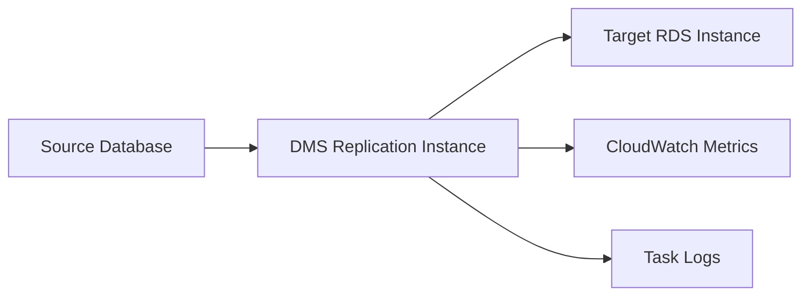

# How to Use DMS to Migrate Databases to RDS

Author: [nawazdhandala](https://github.com/nawazdhandala)

Tags: AWS, RDS, DMS, Migration, Database

Description: Complete guide to using AWS Database Migration Service to migrate databases to RDS with continuous replication, schema conversion, and minimal downtime.

---

AWS Database Migration Service (DMS) is a managed service that handles the heavy lifting of database migrations. Instead of dealing with native replication protocols, dump files, and manual synchronization, DMS gives you a unified migration framework that works across database engines.

DMS is particularly useful when you're migrating between different database engines (Oracle to PostgreSQL, SQL Server to MySQL), but it works just as well for same-engine migrations. It handles the initial data load, ongoing change replication, and provides monitoring throughout the process.

## How DMS Works

At a high level, DMS involves three components:

1. **Replication instance**: An EC2 instance managed by AWS that does the actual data migration work. You pick the size based on the volume of data and change rate.

2. **Source and target endpoints**: Connection configurations for your source database and the target RDS instance.

3. **Migration task**: Defines what gets migrated, how, and when. Can be full-load only, CDC (change data capture) only, or full-load plus CDC.



## Setting Up the Replication Instance

Create a replication instance in the same VPC as your target RDS instance for best performance:

```bash
# Create a DMS replication instance
aws dms create-replication-instance \
  --replication-instance-identifier my-migration-instance \
  --replication-instance-class dms.r6i.large \
  --allocated-storage 100 \
  --vpc-security-group-ids sg-0123456789abcdef0 \
  --replication-subnet-group-id my-dms-subnet-group \
  --multi-az \
  --publicly-accessible false
```

Size the replication instance based on your needs:
- **dms.t3.medium**: Good for small databases (< 10 GB) or testing
- **dms.r6i.large**: Suitable for most production migrations (10-100 GB)
- **dms.r6i.xlarge or larger**: For large databases (100+ GB) or high change rates

Before creating the replication instance, you need a subnet group:

```bash
# Create a DMS replication subnet group
aws dms create-replication-subnet-group \
  --replication-subnet-group-identifier my-dms-subnet-group \
  --replication-subnet-group-description "Subnet group for DMS migration" \
  --subnet-ids subnet-abc123 subnet-def456
```

## Creating Source and Target Endpoints

### Source Endpoint (Self-Managed MySQL Example)

```bash
# Create a source endpoint for your existing MySQL database
aws dms create-endpoint \
  --endpoint-identifier source-mysql \
  --endpoint-type source \
  --engine-name mysql \
  --server-name source-mysql-server.example.com \
  --port 3306 \
  --username dms_user \
  --password "$SOURCE_DB_PASSWORD" \
  --database-name myapp_production
```

### Target Endpoint (RDS)

```bash
# Create a target endpoint for the RDS instance
aws dms create-endpoint \
  --endpoint-identifier target-rds-mysql \
  --endpoint-type target \
  --engine-name mysql \
  --server-name my-mysql-rds.abc123.us-east-1.rds.amazonaws.com \
  --port 3306 \
  --username admin \
  --password "$TARGET_DB_PASSWORD" \
  --database-name myapp_production
```

### Testing Connections

Always test endpoint connectivity before creating a migration task:

```bash
# Test the source endpoint connection
aws dms test-connection \
  --replication-instance-arn arn:aws:dms:us-east-1:123456789012:rep:my-migration-instance \
  --endpoint-arn arn:aws:dms:us-east-1:123456789012:endpoint:source-mysql

# Test the target endpoint connection
aws dms test-connection \
  --replication-instance-arn arn:aws:dms:us-east-1:123456789012:rep:my-migration-instance \
  --endpoint-arn arn:aws:dms:us-east-1:123456789012:endpoint:target-rds-mysql
```

Check the results:

```bash
# Verify connection test results
aws dms describe-connections \
  --filter "Name=endpoint-arn,Values=arn:aws:dms:us-east-1:123456789012:endpoint:source-mysql"
```

## Preparing the Source Database

DMS needs certain configurations on the source database to capture changes.

For MySQL sources, enable binary logging:

```sql
-- Verify binary logging is enabled
SHOW VARIABLES LIKE 'log_bin';
SHOW VARIABLES LIKE 'binlog_format';  -- Should be ROW
SHOW VARIABLES LIKE 'binlog_row_image';  -- Should be FULL

-- Create a DMS user with required permissions
CREATE USER 'dms_user'@'%' IDENTIFIED BY 'strong_password';
GRANT SELECT, REPLICATION CLIENT, REPLICATION SLAVE ON *.* TO 'dms_user'@'%';
FLUSH PRIVILEGES;
```

For PostgreSQL sources:

```sql
-- Set wal_level to logical (requires restart)
ALTER SYSTEM SET wal_level = 'logical';
ALTER SYSTEM SET max_replication_slots = 5;
ALTER SYSTEM SET max_wal_senders = 5;

-- Create a DMS user
CREATE USER dms_user WITH PASSWORD 'strong_password';
GRANT rds_replication TO dms_user;  -- For RDS sources
-- OR for self-managed:
ALTER USER dms_user WITH REPLICATION;
GRANT SELECT ON ALL TABLES IN SCHEMA public TO dms_user;
```

## Creating the Migration Task

### Full Load + CDC (Most Common for Production)

This approach does an initial bulk copy of all data, then continuously replicates changes until you cut over:

```bash
# Create a migration task with full load and ongoing replication
aws dms create-replication-task \
  --replication-task-identifier my-migration-task \
  --source-endpoint-arn arn:aws:dms:us-east-1:123456789012:endpoint:source-mysql \
  --target-endpoint-arn arn:aws:dms:us-east-1:123456789012:endpoint:target-rds-mysql \
  --replication-instance-arn arn:aws:dms:us-east-1:123456789012:rep:my-migration-instance \
  --migration-type full-load-and-cdc \
  --table-mappings file:///tmp/table-mappings.json \
  --replication-task-settings file:///tmp/task-settings.json
```

The table mappings file defines which tables to migrate:

```json
{
  "rules": [
    {
      "rule-type": "selection",
      "rule-id": "1",
      "rule-name": "migrate-all-tables",
      "object-locator": {
        "schema-name": "myapp_production",
        "table-name": "%"
      },
      "rule-action": "include"
    },
    {
      "rule-type": "selection",
      "rule-id": "2",
      "rule-name": "exclude-temp-tables",
      "object-locator": {
        "schema-name": "myapp_production",
        "table-name": "tmp_%"
      },
      "rule-action": "exclude"
    }
  ]
}
```

The task settings file controls migration behavior:

```json
{
  "TargetMetadata": {
    "TargetSchema": "",
    "SupportLobs": true,
    "FullLobMode": false,
    "LobChunkSize": 64,
    "LimitedSizeLobMode": true,
    "LobMaxSize": 32768
  },
  "Logging": {
    "EnableLogging": true,
    "LogComponents": [
      {"Id": "SOURCE_UNLOAD", "Severity": "LOGGER_SEVERITY_DEFAULT"},
      {"Id": "TARGET_LOAD", "Severity": "LOGGER_SEVERITY_DEFAULT"},
      {"Id": "SOURCE_CAPTURE", "Severity": "LOGGER_SEVERITY_DEFAULT"},
      {"Id": "TARGET_APPLY", "Severity": "LOGGER_SEVERITY_DEFAULT"}
    ]
  },
  "ErrorBehavior": {
    "DataErrorPolicy": "LOG_ERROR",
    "TableErrorPolicy": "SUSPEND_TABLE"
  }
}
```

## Starting and Monitoring the Task

```bash
# Start the migration task
aws dms start-replication-task \
  --replication-task-arn arn:aws:dms:us-east-1:123456789012:task:my-migration-task \
  --start-replication-task-type start-replication

# Monitor task progress
aws dms describe-replication-tasks \
  --filters "Name=replication-task-arn,Values=arn:aws:dms:us-east-1:123456789012:task:my-migration-task" \
  --query 'ReplicationTasks[0].{Status:Status,Progress:ReplicationTaskStats}'
```

For detailed table-level progress:

```bash
# Check table-level statistics
aws dms describe-table-statistics \
  --replication-task-arn arn:aws:dms:us-east-1:123456789012:task:my-migration-task \
  --query 'TableStatistics[*].{Table:TableName,Inserts:Inserts,Deletes:Deletes,Updates:Updates,State:TableState}'
```

## Performing the Cutover

When the full load is complete and CDC is keeping the target in sync:

1. Stop writes to the source database
2. Wait for DMS to apply all pending changes (CDCLatencyTarget metric should drop to 0)
3. Validate data consistency
4. Update your application connection string to point to RDS
5. Stop the DMS task

```bash
# Stop the migration task
aws dms stop-replication-task \
  --replication-task-arn arn:aws:dms:us-east-1:123456789012:task:my-migration-task
```

## Validation

DMS includes a data validation feature that compares source and target:

Add this to your task settings:

```json
{
  "ValidationSettings": {
    "EnableValidation": true,
    "ThreadCount": 5,
    "ValidationOnly": false
  }
}
```

Check validation results:

```bash
# Check validation status
aws dms describe-table-statistics \
  --replication-task-arn arn:aws:dms:us-east-1:123456789012:task:my-migration-task \
  --query 'TableStatistics[*].{Table:TableName,ValidationState:ValidationState,ValidationPending:ValidationPendingRecords,ValidationFailed:ValidationFailedRecords}'
```

## Cleaning Up

After a successful migration, clean up DMS resources to stop incurring charges:

```bash
# Delete in order: task, endpoints, replication instance
aws dms delete-replication-task \
  --replication-task-arn arn:aws:dms:us-east-1:123456789012:task:my-migration-task

# Wait for task deletion, then delete endpoints
aws dms delete-endpoint --endpoint-arn arn:aws:dms:us-east-1:123456789012:endpoint:source-mysql
aws dms delete-endpoint --endpoint-arn arn:aws:dms:us-east-1:123456789012:endpoint:target-rds-mysql

# Finally, delete the replication instance
aws dms delete-replication-instance \
  --replication-instance-arn arn:aws:dms:us-east-1:123456789012:rep:my-migration-instance
```

After migration, set up proper monitoring on your new RDS instance. Check our guides on [Performance Insights](https://oneuptime.com/blog/post/monitor-rds-with-performance-insights/view) and [CloudWatch alarms](https://oneuptime.com/blog/post/set-up-cloudwatch-alarms-for-rds-metrics/view) to get started.
