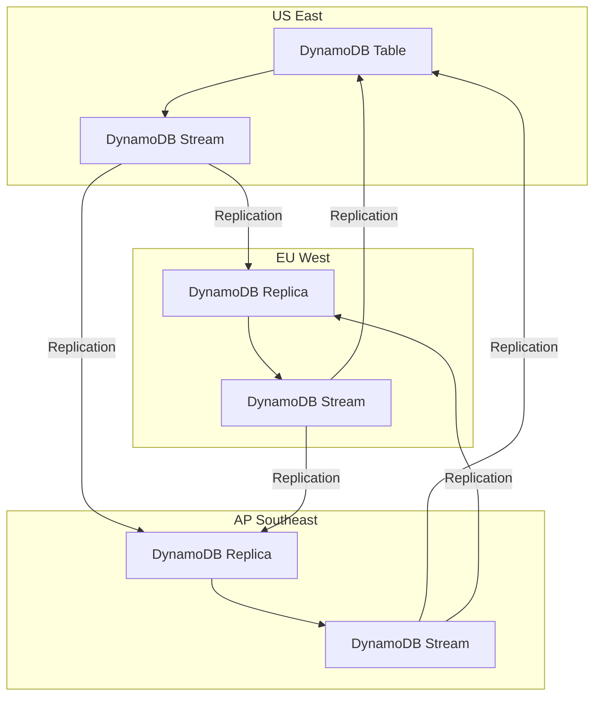

# How to Use DynamoDB Global Tables for Multi-Region

Author: [nawazdhandala](https://github.com/nawazdhandala)

Tags: AWS, DynamoDB, Multi-Region, Disaster Recovery, High Availability

Description: Learn how to set up DynamoDB Global Tables for multi-region replication, handle conflict resolution, and build globally distributed applications.

---

If your application serves users across the globe, a single-region DynamoDB table means someone is always far from the data. Global Tables solve this by automatically replicating your DynamoDB data across multiple AWS regions. Writes in any region propagate to all other regions within about a second. Reads are always local, so latency stays low everywhere.

Let's walk through setting this up properly.

## How Global Tables Work

Global Tables use DynamoDB Streams under the hood to replicate changes between regions. Every write in one region gets picked up by the replication process and applied to all replica tables. It's all managed by AWS - you don't need to run anything yourself.



Important: Global Tables use version 2019.11.21 by default now. The older version (2017.11.29) had some limitations and required more manual setup. Make sure you're using the current version.

## Prerequisites

Before creating a Global Table, your source table needs to meet these requirements:

- DynamoDB Streams must be enabled with `NEW_AND_OLD_IMAGES` stream view type
- The table must use on-demand billing or have auto-scaling configured (recommended)
- The table name must not already exist in the target regions
- No existing replica tables in the target regions

## Creating a Global Table

Start by creating your table in the primary region with streams enabled.

```bash
# Create the base table in us-east-1 with streams enabled
aws dynamodb create-table \
  --table-name UserProfiles \
  --attribute-definitions AttributeName=user_id,AttributeType=S \
  --key-schema AttributeName=user_id,KeyType=HASH \
  --billing-mode PAY_PER_REQUEST \
  --stream-specification StreamEnabled=true,StreamViewType=NEW_AND_OLD_IMAGES \
  --region us-east-1

# Wait for the table to be active
aws dynamodb wait table-exists --table-name UserProfiles --region us-east-1
```

Now add replicas in other regions.

```bash
# Add a replica in EU (Ireland)
aws dynamodb update-table \
  --table-name UserProfiles \
  --replica-updates '[{"Create": {"RegionName": "eu-west-1"}}]' \
  --region us-east-1

# Wait for the replica to become active - this can take a few minutes
aws dynamodb wait table-exists --table-name UserProfiles --region eu-west-1

# Add another replica in Asia Pacific (Singapore)
aws dynamodb update-table \
  --table-name UserProfiles \
  --replica-updates '[{"Create": {"RegionName": "ap-southeast-1"}}]' \
  --region us-east-1
```

Verify the setup.

```bash
# Check the table description to see all replicas
aws dynamodb describe-table --table-name UserProfiles --region us-east-1 \
  --query 'Table.Replicas'
```

## Setting Up with CDK

Infrastructure as code makes this much more maintainable, especially for multi-region setups.

```typescript
import * as cdk from 'aws-cdk-lib';
import * as dynamodb from 'aws-cdk-lib/aws-dynamodb';

const stack = new cdk.Stack(app, 'GlobalTableStack', {
  env: { region: 'us-east-1' },
});

// Create a global table with replicas in multiple regions
const globalTable = new dynamodb.TableV2(stack, 'UserProfiles', {
  tableName: 'UserProfiles',
  partitionKey: { name: 'user_id', type: dynamodb.AttributeType.STRING },
  billing: dynamodb.Billing.onDemand(),
  // Replicas are defined here - CDK handles the multi-region setup
  replicas: [
    { region: 'eu-west-1' },
    { region: 'ap-southeast-1' },
  ],
  // DynamoDB Streams are automatically enabled for global tables
  dynamoStream: dynamodb.StreamViewType.NEW_AND_OLD_IMAGES,
});
```

## Writing to Global Tables

Your application code doesn't change much when using Global Tables. Just make sure you're writing to the closest region.

```python
import boto3

# Connect to the nearest DynamoDB region
# In practice, this is determined by your deployment region
dynamodb = boto3.resource('dynamodb', region_name='us-east-1')
table = dynamodb.Table('UserProfiles')

# Writes work exactly the same as a regular table
table.put_item(Item={
    'user_id': 'u-12345',
    'name': 'Alice Johnson',
    'email': 'alice@example.com',
    'region': 'us-east-1',
    'last_login': '2026-02-12T10:30:00Z'
})

# This write will automatically replicate to eu-west-1 and ap-southeast-1
# Typical replication latency is under 1 second
```

## Handling Conflict Resolution

What happens when two regions write to the same item at the same time? Global Tables use a "last writer wins" strategy based on timestamps. The write with the latest timestamp takes precedence.

This is mostly fine for typical workloads, but you need to be careful with certain patterns.

```python
# DANGEROUS: read-modify-write across regions can cause lost updates
# Region A reads item, modifies it, writes it back
# Region B does the same thing at the same time
# One update will be lost

# SAFER: use atomic counters or conditional writes
dynamodb = boto3.resource('dynamodb', region_name='us-east-1')
table = dynamodb.Table('UserProfiles')

# Atomic counter - safe across regions
table.update_item(
    Key={'user_id': 'u-12345'},
    UpdateExpression='SET login_count = login_count + :inc',
    ExpressionAttributeValues={':inc': 1}
)

# Conditional write - only succeeds if version matches
table.update_item(
    Key={'user_id': 'u-12345'},
    UpdateExpression='SET email = :email, version = :new_version',
    ConditionExpression='version = :current_version',
    ExpressionAttributeValues={
        ':email': 'newemail@example.com',
        ':new_version': 6,
        ':current_version': 5
    }
)
```

## Routing Clients to the Nearest Region

For the lowest latency, route each client to the closest DynamoDB region. You can do this with Route 53 latency-based routing or at the application layer.

```python
import boto3
import os

# Set the region based on environment variable or configuration
# Your deployment pipeline sets this per region
DYNAMODB_REGION = os.environ.get('AWS_REGION', 'us-east-1')

def get_table():
    """Get the DynamoDB table resource for the current region."""
    dynamodb = boto3.resource('dynamodb', region_name=DYNAMODB_REGION)
    return dynamodb.Table('UserProfiles')

# All operations use the local replica
table = get_table()
response = table.get_item(Key={'user_id': 'u-12345'})
```

## Monitoring Replication Lag

You should monitor replication lag to ensure data is propagating quickly. DynamoDB publishes the `ReplicationLatency` metric to CloudWatch.

```bash
# Create an alarm for high replication lag
aws cloudwatch put-metric-alarm \
  --alarm-name "GlobalTable-UserProfiles-ReplicationLag-eu-west-1" \
  --alarm-description "Replication lag from us-east-1 to eu-west-1 exceeds 5 seconds" \
  --namespace "AWS/DynamoDB" \
  --metric-name "ReplicationLatency" \
  --dimensions Name=TableName,Value=UserProfiles Name=ReceivingRegion,Value=eu-west-1 \
  --statistic Average \
  --period 300 \
  --threshold 5000 \
  --comparison-operator GreaterThanThreshold \
  --evaluation-periods 3 \
  --alarm-actions arn:aws:sns:us-east-1:123456789012:global-table-alerts \
  --region us-east-1
```

For more detailed monitoring, see our guide on [monitoring DynamoDB with CloudWatch alarms](https://oneuptime.com/blog/post/monitor-dynamodb-with-cloudwatch-alarms/view).

## Removing a Replica

If you need to remove a region from the Global Table, use the delete replica update.

```bash
# Remove the ap-southeast-1 replica
aws dynamodb update-table \
  --table-name UserProfiles \
  --replica-updates '[{"Delete": {"RegionName": "ap-southeast-1"}}]' \
  --region us-east-1
```

This deletes the replica table in that region but doesn't affect the source table or other replicas.

## Cost Considerations

Global Tables aren't cheap. You pay for:

- **Replicated write capacity** in each replica region (replicated WCUs cost more than standard WCUs)
- **Storage** in each region (data is stored separately in each replica)
- **Data transfer** between regions for replication

For a table with 1000 writes/second replicated across 3 regions, you're paying for the writes 3 times plus cross-region data transfer. Make sure the latency benefits justify the cost.

Tips for managing costs:
- Only replicate to regions where you have active users
- Use on-demand billing to avoid over-provisioning replicas
- Consider whether you really need global writes or just global reads (read replicas might be cheaper for read-heavy workloads)

Global Tables are the right choice when you genuinely need low-latency access from multiple regions. For disaster recovery without the multi-region write requirement, consider [on-demand backup and restore](https://oneuptime.com/blog/post/use-dynamodb-on-demand-backup-and-restore/view) as a cheaper alternative.
