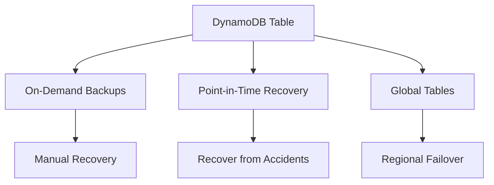

# How to Use DynamoDB On-Demand Backup and Restore

Author: [nawazdhandala](https://github.com/nawazdhandala)

Tags: AWS, DynamoDB, Backup, Disaster Recovery

Description: Learn how to create on-demand backups for DynamoDB tables, restore them to new tables, and automate backup strategies for production environments.

---

Backing up your DynamoDB tables isn't optional - it's one of those things you absolutely need in place before something goes wrong. DynamoDB offers two backup mechanisms: on-demand backups and point-in-time recovery (PITR). On-demand backups give you full table snapshots that you can restore at any time, and they don't affect table performance or consume any read/write capacity.

Let's cover how to set up both, automate them, and handle restores when things go sideways.

## Creating On-Demand Backups

On-demand backups capture the full contents of a DynamoDB table - all items, provisioned capacity settings, GSIs, LSIs, encryption settings, and DynamoDB Streams configuration. They're consistent to within seconds of the backup request.

Here's how to create one via the CLI.

```bash
# Create an on-demand backup of the Users table
# The backup-name should be descriptive so you can find it later
aws dynamodb create-backup \
  --table-name Users \
  --backup-name Users-backup-2026-02-12
```

The response includes a BackupArn that you'll need for restores.

```json
{
  "BackupDetails": {
    "BackupArn": "arn:aws:dynamodb:us-east-1:123456789012:table/Users/backup/01707744000000",
    "BackupName": "Users-backup-2026-02-12",
    "BackupSizeBytes": 524288,
    "BackupStatus": "CREATING",
    "BackupType": "USER",
    "BackupCreationDateTime": "2026-02-12T10:00:00Z"
  }
}
```

You can list existing backups for a table.

```bash
# List all backups for the Users table
aws dynamodb list-backups --table-name Users

# List only backups created within a time range
aws dynamodb list-backups \
  --table-name Users \
  --time-range-lower-bound 2026-01-01T00:00:00Z \
  --time-range-upper-bound 2026-02-12T23:59:59Z
```

## Restoring from a Backup

Restores always create a new table - you can't overwrite an existing one. The restored table gets the same data content and key schema, but some settings like auto-scaling policies, IAM policies, CloudWatch alarms, and tags aren't carried over. You'll need to reconfigure those.

```bash
# Restore a table from a backup
# You must provide a new table name - it can't match an existing table
aws dynamodb restore-table-from-backup \
  --target-table-name Users-restored \
  --backup-arn arn:aws:dynamodb:us-east-1:123456789012:table/Users/backup/01707744000000
```

You can also override the billing mode during restore.

```bash
# Restore with on-demand billing instead of the original provisioned mode
aws dynamodb restore-table-from-backup \
  --target-table-name Users-restored \
  --backup-arn arn:aws:dynamodb:us-east-1:123456789012:table/Users/backup/01707744000000 \
  --billing-mode-override PAY_PER_REQUEST
```

Wait for the restore to complete before using the new table.

```bash
# Wait for the restored table to become active
aws dynamodb wait table-exists --table-name Users-restored

# Verify the table status
aws dynamodb describe-table --table-name Users-restored \
  --query 'Table.TableStatus'
```

## Enabling Point-in-Time Recovery

PITR gives you continuous backups with the ability to restore to any second within the last 35 days. It's more flexible than on-demand backups for accidental data deletion scenarios.

```bash
# Enable PITR on the Users table
aws dynamodb update-continuous-backups \
  --table-name Users \
  --point-in-time-recovery-specification PointInTimeRecoveryEnabled=true
```

Check that it's enabled.

```bash
# Verify PITR status
aws dynamodb describe-continuous-backups --table-name Users
```

Restoring from PITR works similarly, but you specify a timestamp instead of a backup ARN.

```bash
# Restore to a specific point in time
# Useful when you know exactly when bad data was written
aws dynamodb restore-table-to-point-in-time \
  --source-table-name Users \
  --target-table-name Users-restored-pitr \
  --restore-date-time 2026-02-12T09:30:00Z
```

## Automating Backups with Lambda

For production tables, you should automate backups. Here's a Lambda function that creates daily backups and cleans up backups older than 30 days.

```python
import boto3
from datetime import datetime, timedelta

dynamodb = boto3.client('dynamodb')

# Tables to back up - add all your production tables here
TABLES_TO_BACKUP = ['Users', 'Orders', 'Products', 'Sessions']
RETENTION_DAYS = 30

def handler(event, context):
    today = datetime.utcnow().strftime('%Y-%m-%d')

    for table_name in TABLES_TO_BACKUP:
        # Create today's backup
        backup_name = f'{table_name}-daily-{today}'
        try:
            response = dynamodb.create_backup(
                TableName=table_name,
                BackupName=backup_name
            )
            print(f'Created backup: {backup_name}')
        except dynamodb.exceptions.TableNotFoundException:
            print(f'Table {table_name} not found, skipping')
            continue
        except Exception as e:
            print(f'Error backing up {table_name}: {e}')
            continue

        # Clean up old backups beyond the retention period
        cleanup_old_backups(table_name)

def cleanup_old_backups(table_name):
    """Delete backups older than the retention period."""
    cutoff = datetime.utcnow() - timedelta(days=RETENTION_DAYS)

    # List all user-created backups for this table
    response = dynamodb.list_backups(
        TableName=table_name,
        BackupType='USER',
        TimeRangeUpperBound=cutoff
    )

    for backup in response.get('BackupSummaries', []):
        backup_arn = backup['BackupArn']
        backup_name = backup['BackupName']

        # Only delete our automated daily backups
        if '-daily-' in backup_name:
            try:
                dynamodb.delete_backup(BackupArn=backup_arn)
                print(f'Deleted old backup: {backup_name}')
            except Exception as e:
                print(f'Error deleting backup {backup_name}: {e}')
```

Schedule this with EventBridge to run daily.

```bash
# Create an EventBridge rule that triggers daily at 2 AM UTC
aws events put-rule \
  --name DynamoDB-Daily-Backup \
  --schedule-expression "cron(0 2 * * ? *)" \
  --state ENABLED

# Add the Lambda function as the target
aws events put-targets \
  --rule DynamoDB-Daily-Backup \
  --targets "Id"="1","Arn"="arn:aws:lambda:us-east-1:123456789012:function:DynamoDBBackup"
```

## Using AWS Backup for Centralized Management

AWS Backup provides a unified interface for managing backups across multiple AWS services, including DynamoDB. It's particularly useful when you want consistent backup policies across your entire infrastructure.

```bash
# Create a backup plan with AWS Backup
aws backup create-backup-plan --backup-plan '{
  "BackupPlanName": "DynamoDB-Daily-Plan",
  "Rules": [
    {
      "RuleName": "DailyBackup",
      "TargetBackupVaultName": "Default",
      "ScheduleExpression": "cron(0 2 * * ? *)",
      "StartWindowMinutes": 60,
      "CompletionWindowMinutes": 180,
      "Lifecycle": {
        "DeleteAfterDays": 30
      }
    }
  ]
}'
```

Then assign your DynamoDB tables to the plan.

```bash
# Assign resources to the backup plan using tags
# Any DynamoDB table tagged with backup=daily will be included
aws backup create-backup-selection \
  --backup-plan-id YOUR_PLAN_ID \
  --backup-selection '{
    "SelectionName": "DynamoDB-Tables",
    "IamRoleArn": "arn:aws:iam::123456789012:role/AWSBackupRole",
    "ListOfTags": [
      {
        "ConditionType": "STRINGEQUALS",
        "ConditionKey": "backup",
        "ConditionValue": "daily"
      }
    ]
  }'
```

## Disaster Recovery Strategy

A solid DR strategy for DynamoDB typically combines multiple approaches.



- **On-demand backups**: For major milestones like before deployments or schema changes
- **PITR**: For accidental data corruption or deletion within 35 days
- **Global Tables**: For cross-region redundancy and failover

For multi-region disaster recovery with Global Tables, check out [using DynamoDB Global Tables for multi-region](https://oneuptime.com/blog/post/use-dynamodb-global-tables-for-multi-region/view).

## Cost Considerations

On-demand backups are charged per GB stored. PITR has an additional cost per GB of table size, charged hourly. Here are some tips to manage costs:

- Use PITR for your most critical tables and on-demand backups for less critical ones
- Set up retention policies to automatically delete old backups
- Review backup sizes periodically since table growth directly affects backup costs
- Consider exporting to S3 for long-term archival (cheaper storage)

The bottom line: enable PITR on any table where data loss would be a problem, set up automated on-demand backups for everything else, and always test your restore process before you actually need it.
