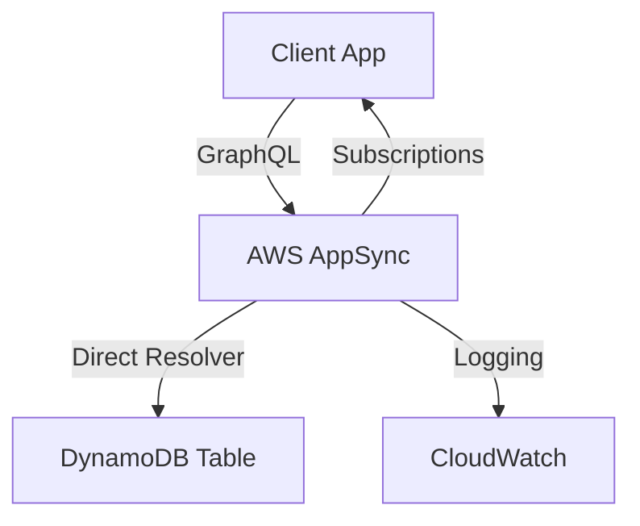

# How to Use DynamoDB with AWS AppSync

Author: [nawazdhandala](https://github.com/nawazdhandala)

Tags: AWS, DynamoDB, AppSync, GraphQL, Serverless

Description: Learn how to connect DynamoDB to AWS AppSync to build real-time GraphQL APIs with automatic CRUD operations, resolvers, and subscriptions.

---

AWS AppSync lets you build GraphQL APIs that connect directly to DynamoDB - no Lambda function in between. This direct integration is surprisingly powerful and cuts down on latency and complexity. You define your schema, wire up resolvers, and AppSync handles the translation between GraphQL operations and DynamoDB queries.

Let's build a complete example from scratch.

## The Architecture

Here's what we're building: a GraphQL API backed by DynamoDB that supports creating, reading, updating, and deleting items, plus real-time subscriptions.



## Setting Up the GraphQL Schema

First, define your GraphQL schema. This tells AppSync what types of data your API works with and what operations clients can perform.

```graphql
# AppSync schema defining a simple Task management API
# Types, queries, mutations, and subscriptions

type Task {
  id: ID!
  title: String!
  description: String
  status: TaskStatus!
  assignee: String
  createdAt: AWSDateTime!
  updatedAt: AWSDateTime
}

enum TaskStatus {
  TODO
  IN_PROGRESS
  DONE
}

input CreateTaskInput {
  title: String!
  description: String
  status: TaskStatus
  assignee: String
}

input UpdateTaskInput {
  id: ID!
  title: String
  description: String
  status: TaskStatus
  assignee: String
}

type Query {
  getTask(id: ID!): Task
  listTasks(status: TaskStatus, limit: Int, nextToken: String): TaskConnection
}

type Mutation {
  createTask(input: CreateTaskInput!): Task
  updateTask(input: UpdateTaskInput!): Task
  deleteTask(id: ID!): Task
}

type Subscription {
  onCreateTask: Task @aws_subscribe(mutations: ["createTask"])
  onUpdateTask: Task @aws_subscribe(mutations: ["updateTask"])
}

type TaskConnection {
  items: [Task]
  nextToken: String
}
```

## Creating the DynamoDB Table

The DynamoDB table needs to match your schema's key structure. For this example, we're using a simple partition key on `id`.

```bash
# Create the DynamoDB table for tasks
aws dynamodb create-table \
  --table-name Tasks \
  --attribute-definitions AttributeName=id,AttributeType=S \
  --key-schema AttributeName=id,KeyType=HASH \
  --billing-mode PAY_PER_REQUEST
```

If you want to query tasks by status efficiently, add a Global Secondary Index.

```bash
# Add a GSI to query tasks by status
aws dynamodb update-table \
  --table-name Tasks \
  --attribute-definitions \
    AttributeName=id,AttributeType=S \
    AttributeName=status,AttributeType=S \
  --global-secondary-index-updates '[{
    "Create": {
      "IndexName": "status-index",
      "KeySchema": [{"AttributeName": "status", "KeyType": "HASH"}],
      "Projection": {"ProjectionType": "ALL"}
    }
  }]'
```

## Writing DynamoDB Resolvers

AppSync uses VTL (Velocity Template Language) resolvers to translate GraphQL requests into DynamoDB operations. Let's write the key resolvers.

### Create Task Resolver (Request Mapping)

This resolver handles the `createTask` mutation. It generates a UUID, sets timestamps, and puts the item into DynamoDB.

```json
{
  "version": "2018-05-29",
  "operation": "PutItem",
  "key": {
    "id": { "S": "$util.autoId()" }
  },
  "attributeValues": {
    "title": { "S": "$ctx.args.input.title" },
    "description": $util.dynamodb.toDynamoDBJson($ctx.args.input.description),
    "status": { "S": "$util.defaultIfNull($ctx.args.input.status, 'TODO')" },
    "assignee": $util.dynamodb.toDynamoDBJson($ctx.args.input.assignee),
    "createdAt": { "S": "$util.time.nowISO8601()" },
    "updatedAt": { "S": "$util.time.nowISO8601()" }
  }
}
```

### Create Task Resolver (Response Mapping)

The response mapping is straightforward - just pass through the result.

```json
$util.toJson($ctx.result)
```

### Get Task Resolver (Request Mapping)

This handles the `getTask` query by performing a GetItem operation.

```json
{
  "version": "2018-05-29",
  "operation": "GetItem",
  "key": {
    "id": { "S": "$ctx.args.id" }
  }
}
```

### List Tasks Resolver with Filtering

For listing tasks, we use a Scan or Query operation depending on whether a status filter is provided.

```json
#if($ctx.args.status)
{
  "version": "2018-05-29",
  "operation": "Query",
  "index": "status-index",
  "query": {
    "expression": "#status = :status",
    "expressionNames": {
      "#status": "status"
    },
    "expressionValues": {
      ":status": { "S": "$ctx.args.status" }
    }
  },
  "limit": $util.defaultIfNull($ctx.args.limit, 20),
  "nextToken": $util.toJson($ctx.args.nextToken)
}
#else
{
  "version": "2018-05-29",
  "operation": "Scan",
  "limit": $util.defaultIfNull($ctx.args.limit, 20),
  "nextToken": $util.toJson($ctx.args.nextToken)
}
#end
```

### Update Task Resolver

The update resolver uses DynamoDB's UpdateItem with expression-based updates, so only the fields provided get changed.

```json
{
  "version": "2018-05-29",
  "operation": "UpdateItem",
  "key": {
    "id": { "S": "$ctx.args.input.id" }
  },
  "update": {
    "expression": "SET #updatedAt = :updatedAt #titleSet #descSet #statusSet #assigneeSet",
    "expressionNames": {
      "#updatedAt": "updatedAt"
      #if($ctx.args.input.title), "#title": "title" #end
      #if($ctx.args.input.description), "#description": "description" #end
      #if($ctx.args.input.status), "#status": "status" #end
      #if($ctx.args.input.assignee), "#assignee": "assignee" #end
    },
    "expressionValues": {
      ":updatedAt": { "S": "$util.time.nowISO8601()" }
      #if($ctx.args.input.title), ":title": { "S": "$ctx.args.input.title" } #end
      #if($ctx.args.input.description), ":description": { "S": "$ctx.args.input.description" } #end
      #if($ctx.args.input.status), ":status": { "S": "$ctx.args.input.status" } #end
      #if($ctx.args.input.assignee), ":assignee": { "S": "$ctx.args.input.assignee" } #end
    }
  }
}
```

## Using JavaScript Resolvers (The Modern Approach)

VTL resolvers work fine, but AppSync now supports JavaScript resolvers through the APPSYNC_JS runtime. These are easier to write and debug. Here's the same createTask resolver in JavaScript.

```javascript
// AppSync JS resolver for creating a task
// This runs in the APPSYNC_JS runtime, not Node.js
import { util } from '@aws-appsync/utils';

export function request(ctx) {
  const id = util.autoId();
  const now = util.time.nowISO8601();

  return {
    operation: 'PutItem',
    key: util.dynamodb.toMapValues({ id }),
    attributeValues: util.dynamodb.toMapValues({
      title: ctx.args.input.title,
      description: ctx.args.input.description || null,
      status: ctx.args.input.status || 'TODO',
      assignee: ctx.args.input.assignee || null,
      createdAt: now,
      updatedAt: now,
    }),
  };
}

export function response(ctx) {
  if (ctx.error) {
    util.error(ctx.error.message, ctx.error.type);
  }
  return ctx.result;
}
```

And the listTasks resolver in JavaScript.

```javascript
// AppSync JS resolver for listing tasks with optional status filter
import { util } from '@aws-appsync/utils';

export function request(ctx) {
  const { status, limit = 20, nextToken } = ctx.args;

  if (status) {
    // Query the GSI when filtering by status
    return {
      operation: 'Query',
      index: 'status-index',
      query: {
        expression: '#status = :status',
        expressionNames: { '#status': 'status' },
        expressionValues: util.dynamodb.toMapValues({ ':status': status }),
      },
      limit,
      nextToken,
    };
  }

  // Default to a scan when no filter is applied
  return {
    operation: 'Scan',
    limit,
    nextToken,
  };
}

export function response(ctx) {
  if (ctx.error) {
    util.error(ctx.error.message, ctx.error.type);
  }
  return {
    items: ctx.result.items,
    nextToken: ctx.result.nextToken,
  };
}
```

## Setting Up with CDK

If you're using Infrastructure as Code (and you should be), here's how to set this up with CDK.

```typescript
import * as cdk from 'aws-cdk-lib';
import * as appsync from 'aws-cdk-lib/aws-appsync';
import * as dynamodb from 'aws-cdk-lib/aws-dynamodb';

const stack = new cdk.Stack();

// Create the DynamoDB table
const tasksTable = new dynamodb.Table(stack, 'TasksTable', {
  tableName: 'Tasks',
  partitionKey: { name: 'id', type: dynamodb.AttributeType.STRING },
  billingMode: dynamodb.BillingMode.PAY_PER_REQUEST,
  removalPolicy: cdk.RemovalPolicy.DESTROY,
});

// Add GSI for status queries
tasksTable.addGlobalSecondaryIndex({
  indexName: 'status-index',
  partitionKey: { name: 'status', type: dynamodb.AttributeType.STRING },
  projectionType: dynamodb.ProjectionType.ALL,
});

// Create the AppSync API
const api = new appsync.GraphqlApi(stack, 'TasksApi', {
  name: 'TasksGraphQLApi',
  schema: appsync.SchemaFile.fromAsset('schema.graphql'),
  authorizationConfig: {
    defaultAuthorization: {
      authorizationType: appsync.AuthorizationType.API_KEY,
    },
  },
});

// Connect DynamoDB as a data source
const dataSource = api.addDynamoDbDataSource('TasksDataSource', tasksTable);

// Wire up resolvers
dataSource.createResolver('GetTaskResolver', {
  typeName: 'Query',
  fieldName: 'getTask',
  runtime: appsync.FunctionRuntime.JS_1_0_0,
  code: appsync.Code.fromAsset('resolvers/getTask.js'),
});
```

## Real-Time Subscriptions

One of AppSync's best features is built-in WebSocket subscriptions. Clients automatically receive updates when mutations happen. No extra infrastructure needed.

On the client side, using the AWS Amplify library makes this trivial.

```javascript
// Subscribe to new tasks in a React component
import { generateClient } from 'aws-amplify/api';
import { onCreateTask } from './graphql/subscriptions';

const client = generateClient();

// This sets up a WebSocket connection to AppSync
const subscription = client.graphql({
  query: onCreateTask
}).subscribe({
  next: ({ data }) => {
    console.log('New task created:', data.onCreateTask);
    // Update your UI here
  },
  error: (err) => console.error('Subscription error:', err),
});

// Clean up when component unmounts
// subscription.unsubscribe();
```

## Monitoring Your AppSync API

Don't forget to set up monitoring. AppSync publishes metrics to CloudWatch, and you should watch for errors, latency spikes, and throttling. For a broader monitoring strategy, see our guide on [monitoring DynamoDB with CloudWatch alarms](https://oneuptime.com/blog/post/monitor-dynamodb-with-cloudwatch-alarms/view).

The combination of AppSync and DynamoDB gives you a serverless, scalable GraphQL API with real-time capabilities and zero server management. Start with the JS resolvers - they're much easier to work with than VTL - and use CDK to keep your infrastructure reproducible.
