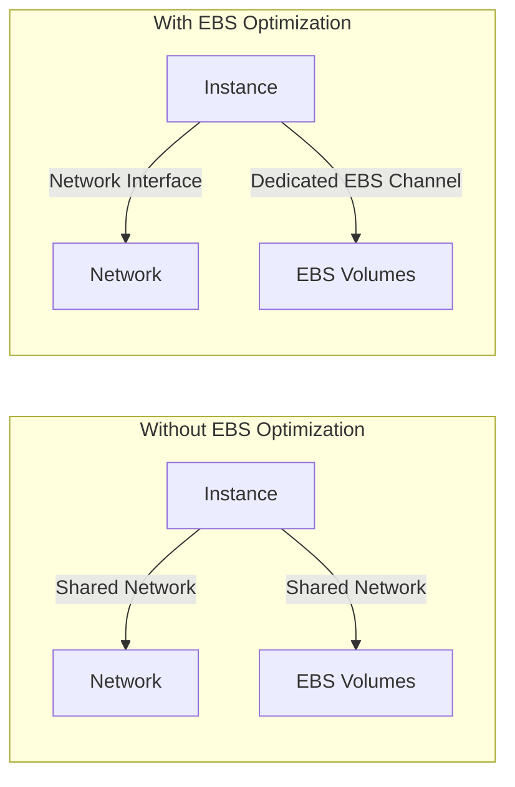
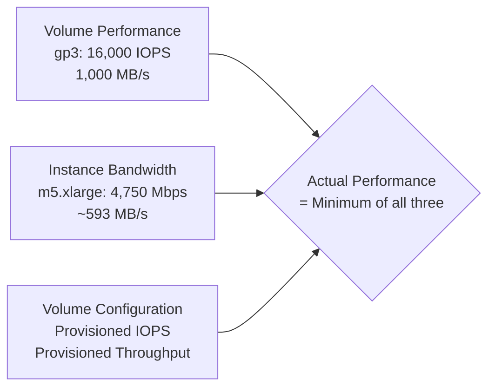

# How to Use EBS-Optimized Instances for Better I/O Performance

Author: [nawazdhandala](https://github.com/nawazdhandala)

Tags: AWS, EC2, EBS, Performance, I/O Optimization

Description: Understanding EBS-optimized instances, how dedicated bandwidth improves storage performance, and how to configure instances for optimal I/O throughput.

---

When your EC2 instance communicates with its EBS volumes, that traffic shares the same network connection as everything else - your application traffic, metadata calls, and any other network activity. EBS-optimized instances solve this by providing dedicated bandwidth between the instance and its EBS volumes, ensuring consistent storage performance regardless of network load.

This guide explains how EBS optimization works, which instances support it, and how to make sure you're getting the best storage performance.

## What EBS Optimization Does

An EBS-optimized instance has a dedicated network connection between the instance and EBS storage. This means:

- **Consistent I/O performance** - EBS traffic doesn't compete with network traffic
- **Predictable latency** - Storage operations aren't affected by network congestion
- **Higher throughput** - Dedicated bandwidth can be substantial (up to 19,000 Mbps on large instances)



## Which Instances Are EBS-Optimized?

Here's the good news: most modern instance types are EBS-optimized by default with no additional cost.

**EBS-optimized by default (no action needed):**
- All Nitro-based instances: m5, m6i, m7g, c5, c6i, c7g, r5, r6i, r7g, t3, t3a, t4g, and most others launched after 2018
- All Graviton instances

**EBS optimization available but not default (older types):**
- m4, c4, r4, d2, i3 - You need to explicitly enable it (small hourly charge)

**No EBS optimization available:**
- Very old instance types like t1, m1, m2, c1 - These share bandwidth for everything

To check if your instance is EBS-optimized:

```bash
# Check EBS optimization status for a running instance
aws ec2 describe-instances \
    --instance-ids i-0123456789abcdef0 \
    --query 'Reservations[0].Instances[0].EbsOptimized'
```

## Enabling EBS Optimization

For instance types where it's optional:

### At Launch Time

```bash
# Launch with EBS optimization enabled
aws ec2 run-instances \
    --image-id ami-0123456789abcdef0 \
    --instance-type m4.large \
    --ebs-optimized \
    --key-name my-key
```

### On a Running Instance

```bash
# Stop the instance first
aws ec2 stop-instances --instance-ids i-0123456789abcdef0
aws ec2 wait instance-stopped --instance-ids i-0123456789abcdef0

# Enable EBS optimization
aws ec2 modify-instance-attribute \
    --instance-id i-0123456789abcdef0 \
    --ebs-optimized

# Start the instance
aws ec2 start-instances --instance-ids i-0123456789abcdef0
```

For modern Nitro instances, you don't need to do anything - it's always on.

## EBS Bandwidth by Instance Type

The maximum EBS bandwidth varies significantly by instance type. Here's a comparison:

| Instance Type | EBS Bandwidth (Mbps) | EBS IOPS | Baseline/Burst |
|--------------|---------------------|----------|----------------|
| t3.micro | Up to 2,085 | Up to 11,800 | Burstable |
| t3.medium | Up to 2,085 | Up to 11,800 | Burstable |
| m5.large | Up to 4,750 | Up to 18,750 | Burstable |
| m5.xlarge | Up to 4,750 | Up to 18,750 | Burstable |
| m5.2xlarge | Up to 4,750 | Up to 18,750 | Burstable |
| m5.4xlarge | 4,750 | 18,750 | Dedicated |
| m5.8xlarge | 6,800 | 30,000 | Dedicated |
| m5.16xlarge | 13,600 | 60,000 | Dedicated |
| i3.16xlarge | 14,000 | 65,000 | Dedicated |

Note the "burstable" vs "dedicated" distinction. Smaller instances can burst to their listed bandwidth but have a lower baseline. If you're consistently hitting the burst limit, you'll get throttled.

## Understanding Bottlenecks

EBS performance is determined by the minimum of three factors:

1. **Volume performance** - Each volume type has maximum IOPS and throughput
2. **Instance EBS bandwidth** - The dedicated channel has a maximum
3. **Volume size** - For some types (like gp2), performance scales with size



If your volume can do 16,000 IOPS but your instance only supports 18,750 IOPS, you're fine. But if you attach three such volumes, you'll hit the instance limit.

## Monitoring EBS Performance

### From Inside the Instance

```bash
# Install and use iostat for real-time I/O monitoring
sudo yum install -y sysstat  # or apt install sysstat

# Show I/O statistics every 5 seconds
iostat -x 5

# Key metrics to watch:
# %util   - How busy the device is (100% = saturated)
# await   - Average I/O wait time in ms (high = bottleneck)
# r/s     - Read operations per second
# w/s     - Write operations per second
# rMB/s   - Read throughput
# wMB/s   - Write throughput
```

### CloudWatch Metrics

```bash
# Check volume IOPS consumption
aws cloudwatch get-metric-statistics \
    --namespace AWS/EBS \
    --metric-name VolumeReadOps \
    --dimensions Name=VolumeId,Value=vol-0123456789abcdef0 \
    --start-time 2026-02-12T00:00:00Z \
    --end-time 2026-02-12T12:00:00Z \
    --period 300 \
    --statistics Sum

# Check if you're hitting the volume throughput limit
aws cloudwatch get-metric-statistics \
    --namespace AWS/EBS \
    --metric-name VolumeThroughputPercentage \
    --dimensions Name=VolumeId,Value=vol-0123456789abcdef0 \
    --start-time 2026-02-12T00:00:00Z \
    --end-time 2026-02-12T12:00:00Z \
    --period 300 \
    --statistics Average
```

Set up [monitoring with OneUptime](https://oneuptime.com) to get a unified view of I/O performance across all your instances and get alerted when performance degrades.

## Tuning Tips

### Choose the Right Volume Type

Match your volume type to your workload. See our guide on [choosing between EBS volume types](https://oneuptime.com/blog/post/choose-between-ebs-volume-types/view) for detailed comparisons. Quick summary:

- **gp3**: Best default. 3,000 baseline IOPS, independently configurable.
- **io2**: For latency-sensitive workloads needing guaranteed IOPS.
- **st1**: For sequential read/write (logs, data processing).
- **sc1**: For infrequent access, lowest cost.

### Use gp3 Instead of gp2

gp3 decouples IOPS and throughput from volume size. A 100 GB gp3 volume can have 16,000 IOPS and 1,000 MB/s throughput. A 100 GB gp2 volume is limited to 300 IOPS.

```bash
# Migrate a gp2 volume to gp3 online (no downtime)
aws ec2 modify-volume \
    --volume-id vol-0123456789abcdef0 \
    --volume-type gp3 \
    --iops 6000 \
    --throughput 400
```

This is one of the easiest performance and cost improvements you can make. For more details, see our guide on [resizing EBS volumes without downtime](https://oneuptime.com/blog/post/resize-ebs-volume-without-downtime/view).

### Tune Linux I/O Scheduler

For most EBS workloads, the `none` or `noop` scheduler is best because EBS handles its own scheduling:

```bash
# Check current I/O scheduler
cat /sys/block/nvme0n1/queue/scheduler

# Set to none (recommended for EBS)
echo none | sudo tee /sys/block/nvme0n1/queue/scheduler

# Make it persistent across reboots
echo 'ACTION=="add|change", KERNEL=="nvme*", ATTR{queue/scheduler}="none"' | \
    sudo tee /etc/udev/rules.d/60-scheduler.rules
```

### Increase Read-Ahead for Sequential Workloads

```bash
# Check current read-ahead setting (in 512-byte sectors)
blockdev --getra /dev/nvme0n1

# Increase read-ahead for sequential read workloads
sudo blockdev --setra 4096 /dev/nvme0n1
```

### Stripe Multiple Volumes with RAID 0

For workloads needing more throughput than a single volume can provide:

```bash
# Create a RAID 0 array from 4 EBS volumes for 4x throughput
sudo mdadm --create /dev/md0 --level=0 --raid-devices=4 \
    /dev/nvme1n1 /dev/nvme2n1 /dev/nvme3n1 /dev/nvme4n1

# Format and mount
sudo mkfs.xfs /dev/md0
sudo mkdir -p /data
sudo mount /dev/md0 /data
```

RAID 0 multiplies throughput and IOPS across volumes but provides no redundancy. Since EBS volumes are already redundant within their AZ, this is acceptable for most workloads.

## Common Performance Issues

**High await times in iostat.** This usually means you're exceeding the volume's IOPS or throughput limits. Check CloudWatch for throttling metrics and consider upgrading the volume type or increasing provisioned IOPS.

**Burst credit depletion (gp2 and t-series EBS bandwidth).** Small gp2 volumes run out of burst credits under sustained load. Switch to gp3 where performance is consistent.

**Instance bandwidth bottleneck.** If you have multiple high-performance volumes, the instance's EBS bandwidth might be the limit. Upgrade to a larger instance type with more EBS bandwidth.

**First-access latency on restored volumes.** Volumes created from snapshots load data lazily - the first read of each block has higher latency. For databases, initialize the volume by reading all blocks before going to production:

```bash
# Pre-warm a volume restored from a snapshot (reads every block)
sudo fio --filename=/dev/nvme1n1 --rw=read --bs=1M --iodepth=32 \
    --ioengine=libaio --direct=1 --name=volume-init
```

EBS-optimized instances are one of those things that "just work" on modern AWS. If you're using any instance type from the last several years, you already have it. The real performance gains come from choosing the right volume type, sizing things correctly, and monitoring to catch bottlenecks before they affect your users.
