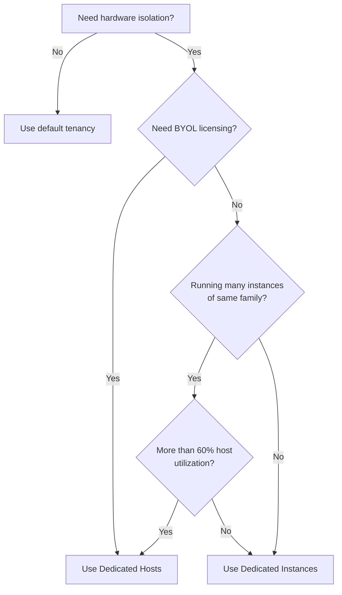

# How to Use EC2 Dedicated Instances vs Dedicated Hosts

Author: [nawazdhandala](https://github.com/nawazdhandala)

Tags: AWS, EC2, Dedicated Instances, Dedicated Hosts, Tenancy, Compliance

Description: Understand the differences between EC2 Dedicated Instances and Dedicated Hosts, when to use each, and how to configure them for your workloads.

---

AWS gives you two ways to get hardware that isn't shared with other AWS customers: Dedicated Instances and Dedicated Hosts. They sound similar but they solve different problems, cost different amounts, and give you different levels of control. Choosing wrong can mean overpaying for features you don't need or missing out on ones you do.

## The Quick Difference

**Dedicated Instances** guarantee your instances run on hardware not shared with other AWS accounts. But you don't control which specific physical server your instance lands on, and you can't see hardware details.

**Dedicated Hosts** give you an entire physical server. You control instance placement, see the socket and core count, and can use the host for bring-your-own-license (BYOL) scenarios.

Think of it this way: Dedicated Instances give you isolation. Dedicated Hosts give you isolation plus visibility and control.

## When to Use Dedicated Instances

Dedicated Instances make sense when you need hardware isolation for compliance or security reasons but don't care about the specifics of the physical server. Common scenarios:

- **Regulatory compliance**: Some regulations require that your data doesn't share physical hardware with other tenants
- **Security policies**: Your organization's security team mandates physical isolation
- **Simple setup**: You want isolation without managing hosts manually

Setting up Dedicated Instances is straightforward. You just set the tenancy on your VPC or on individual instances:

```bash
# Create a VPC with dedicated tenancy - ALL instances in this VPC will be dedicated
aws ec2 create-vpc \
  --cidr-block 10.0.0.0/16 \
  --instance-tenancy dedicated
```

Or you can set tenancy per-instance while keeping the VPC on default tenancy:

```bash
# Launch a single instance with dedicated tenancy
aws ec2 run-instances \
  --image-id ami-0abc123 \
  --instance-type m5.xlarge \
  --placement "Tenancy=dedicated" \
  --subnet-id subnet-abc123 \
  --security-group-ids sg-abc123
```

In Terraform, it looks like this:

```hcl
# Launch a dedicated instance using Terraform
resource "aws_instance" "dedicated" {
  ami           = "ami-0abc123"
  instance_type = "m5.xlarge"
  subnet_id     = aws_subnet.main.id
  tenancy       = "dedicated"

  tags = {
    Name = "dedicated-instance"
  }
}
```

## When to Use Dedicated Hosts

Dedicated Hosts are the right choice when you need:

- **BYOL licensing**: Software licenses tied to physical cores or sockets (Windows Server, SQL Server, Oracle, RHEL with custom agreements)
- **Hardware visibility**: You need to report on physical server details for audits
- **Placement control**: You want specific instances on specific physical servers
- **Cost optimization**: You have enough instances to fill a host and want to avoid per-instance dedicated pricing

Allocating and using a Dedicated Host requires more steps:

```bash
# Allocate a dedicated host
HOST_ID=$(aws ec2 allocate-hosts \
  --instance-type m5.xlarge \
  --quantity 1 \
  --availability-zone us-east-1a \
  --auto-placement on \
  --query 'HostIds[0]' \
  --output text)

# Launch an instance on that specific host
aws ec2 run-instances \
  --image-id ami-0abc123 \
  --instance-type m5.xlarge \
  --placement "HostId=$HOST_ID,Tenancy=host" \
  --subnet-id subnet-abc123
```

## Feature Comparison

Here's a detailed breakdown of what each option gives you:

| Feature | Dedicated Instances | Dedicated Hosts |
|---------|-------------------|-----------------|
| Hardware isolation | Yes | Yes |
| Per-instance billing | Yes | No (per-host billing) |
| Socket/core visibility | No | Yes |
| Instance placement control | No | Yes |
| BYOL licensing support | No | Yes |
| Automatic instance placement | Yes | Optional |
| Host affinity | No | Yes |
| Can mix instance sizes | Yes (any size) | Yes (within family) |
| AWS License Manager integration | Limited | Full |
| Host recovery | N/A | Yes |

## Cost Comparison

Pricing is where things get interesting. Let's compare the costs for running 8 m5.xlarge instances in us-east-1:

**Dedicated Instances:**

```
Per-instance cost: ~$0.232/hr per m5.xlarge (dedicated pricing)
Region fee:        $2.00/hr (one-time per region, per account)
Total:             (8 x $0.232) + $2.00 = $3.856/hr
```

**Dedicated Hosts:**

```
m5 host cost:      ~$4.788/hr (hosts up to 48 vCPUs, fits 12 x m5.xlarge)
Total for 8:       $4.788/hr (same host, still has room for 4 more)
```

At 8 instances, Dedicated Instances are cheaper. But if you're running 12 m5.xlarge instances, the Dedicated Host wins because you're paying the same flat rate regardless of how many instances you pack onto it.

The breakeven point depends on the instance family and region, but generally: if you're filling more than 60-70% of a host's capacity, Dedicated Hosts become more cost-effective.

## Mixing Instance Sizes on Dedicated Hosts

One underappreciated feature of Dedicated Hosts is that you can mix instance sizes within the same family. An m5 host doesn't have to run only m5.xlarge - it can run a mix:

```bash
# An m5 dedicated host with 48 vCPUs could run:
# - 2 x m5.4xlarge  (16 vCPUs each = 32 vCPUs)
# - 4 x m5.xlarge   (4 vCPUs each = 16 vCPUs)
# Total: 48 vCPUs fully utilized

# Launch a large instance on the host
aws ec2 run-instances \
  --image-id ami-0abc123 \
  --instance-type m5.4xlarge \
  --placement "HostId=h-0abc123def456,Tenancy=host" \
  --count 2

# Launch smaller instances on the same host
aws ec2 run-instances \
  --image-id ami-0abc123 \
  --instance-type m5.xlarge \
  --placement "HostId=h-0abc123def456,Tenancy=host" \
  --count 4
```

This flexibility lets you optimize host utilization and get more value out of each host.

## VPC-Level vs Instance-Level Tenancy

If you set the VPC tenancy to `dedicated`, every instance launched in that VPC automatically uses Dedicated Instances. This is the simplest approach if all your workloads need isolation.

But there's a catch: you can't change a VPC's tenancy from `dedicated` back to `default`. And not all instance types support dedicated tenancy, so you might hit issues with certain instance families.

A more flexible approach is to keep the VPC on default tenancy and set tenancy at the instance level:

```hcl
# Terraform: VPC with default tenancy, instances choose their own tenancy
resource "aws_vpc" "main" {
  cidr_block       = "10.0.0.0/16"
  instance_tenancy = "default"  # Keep default, set per-instance
}

# This instance runs on shared hardware
resource "aws_instance" "shared" {
  ami           = "ami-0abc123"
  instance_type = "t3.micro"
  subnet_id     = aws_subnet.main.id
  tenancy       = "default"
}

# This instance runs on dedicated hardware
resource "aws_instance" "isolated" {
  ami           = "ami-0abc123"
  instance_type = "m5.xlarge"
  subnet_id     = aws_subnet.main.id
  tenancy       = "dedicated"
}
```

## Converting Between Tenancy Types

You can change an instance's tenancy between `dedicated` and `host`, but only when it's stopped:

```bash
# Stop the instance first
aws ec2 stop-instances --instance-ids i-0abc123

# Change from dedicated instance to dedicated host placement
aws ec2 modify-instance-placement \
  --instance-id i-0abc123 \
  --tenancy host \
  --host-id h-0abc123def456

# Start the instance on its new host
aws ec2 start-instances --instance-ids i-0abc123
```

You can also move from `host` to `dedicated`, but you can't go from either back to `default` shared tenancy.

## Making the Decision

Here's a simple flowchart for choosing:



In practice, most teams that just need isolation go with Dedicated Instances because they're simpler. Teams with licensing requirements or enough workloads to fill hosts go with Dedicated Hosts.

If you're running workloads that need careful cost management alongside dedicated hardware, consider pairing this with [AWS Compute Optimizer](https://oneuptime.com/blog/post/use-aws-compute-optimizer-to-right-size-ec2-instances/view) to make sure you're using the right instance sizes. And if you need to understand how Dedicated Hosts work specifically for licensing, check out the companion post on [using EC2 Dedicated Hosts for licensing compliance](https://oneuptime.com/blog/post/use-ec2-dedicated-hosts-for-licensing-compliance/view).

Both options give you the isolation you need. The question is how much control and visibility you need on top of that.
