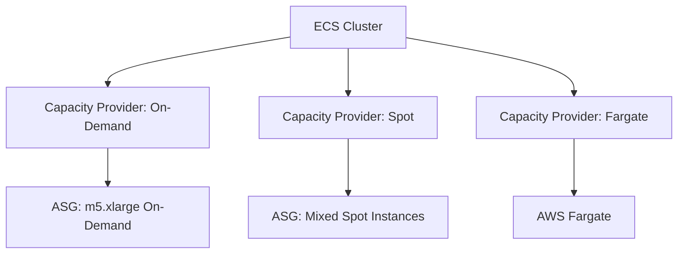
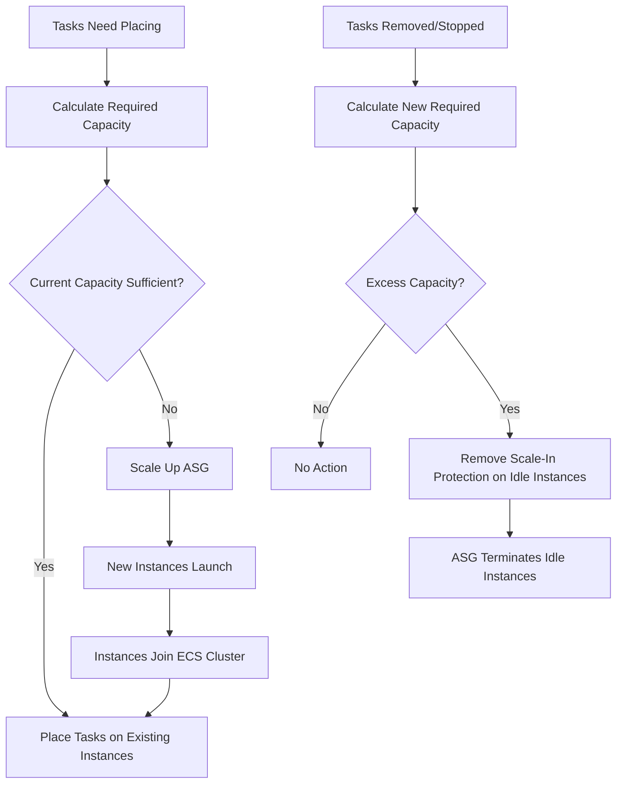

# How to Use ECS Capacity Provider Auto Scaling

Author: [nawazdhandala](https://github.com/nawazdhandala)

Tags: AWS, ECS, Capacity Provider, Auto Scaling, EC2, Container Orchestration, Cost Optimization

Description: Learn how to configure ECS capacity providers with managed auto scaling to automatically adjust EC2 instance capacity based on your container workload demands.

---

Running an ECS cluster on EC2 instances means you need to manage the underlying capacity. Too few instances and tasks cannot be placed. Too many and you waste money on idle compute. ECS capacity providers solve this by connecting your ECS services to Auto Scaling Groups and letting ECS manage the scaling automatically.

Instead of you deciding when to add or remove instances, ECS calculates how much capacity it needs based on pending tasks and current utilization, then adjusts the ASG accordingly.

## What Are Capacity Providers?

A capacity provider is the link between an ECS cluster and an Auto Scaling Group. It tells ECS "here is a pool of EC2 instances you can use, and here is how to grow or shrink it." You can have multiple capacity providers on a single cluster, mixing different instance types, Spot and On-Demand, or even Fargate.



## Step 1: Create an Auto Scaling Group

The capacity provider wraps an ASG, so start there.

```bash
# Create a launch template for ECS instances
aws ec2 create-launch-template \
  --launch-template-name ecs-instance-template \
  --launch-template-data '{
    "ImageId": "ami-0abc123-ecs-optimized",
    "InstanceType": "m5.xlarge",
    "IamInstanceProfile": {
      "Name": "ecsInstanceRole"
    },
    "UserData": "'$(echo '#!/bin/bash
echo ECS_CLUSTER=my-cluster >> /etc/ecs/ecs.config
echo ECS_ENABLE_SPOT_INSTANCE_DRAINING=true >> /etc/ecs/ecs.config' | base64)'"
  }'

# Create the Auto Scaling Group
aws autoscaling create-auto-scaling-group \
  --auto-scaling-group-name ecs-asg-ondemand \
  --launch-template LaunchTemplateName=ecs-instance-template,Version='$Latest' \
  --min-size 0 \
  --max-size 20 \
  --vpc-zone-identifier "subnet-0abc123,subnet-0def456,subnet-0ghi789" \
  --new-instances-protected-from-scale-in \
  --tags '[
    {"Key": "Name", "Value": "ecs-instance", "PropagateAtLaunch": true},
    {"Key": "AmazonECSManaged", "Value": "true", "PropagateAtLaunch": true}
  ]'
```

Two important settings:

- **new-instances-protected-from-scale-in** - Prevents the ASG from terminating instances that are running ECS tasks. The capacity provider manages scale-in protection itself.
- **ECS_ENABLE_SPOT_INSTANCE_DRAINING** - If using Spot Instances, this tells the ECS agent to drain tasks when a Spot interruption is detected.

## Step 2: Create the Capacity Provider

```bash
# Create a capacity provider linked to the ASG
aws ecs create-capacity-provider \
  --name ondemand-provider \
  --auto-scaling-group-provider '{
    "autoScalingGroupArn": "arn:aws:autoscaling:us-east-1:123456789012:autoScalingGroup:abc-123:autoScalingGroupName/ecs-asg-ondemand",
    "managedScaling": {
      "status": "ENABLED",
      "targetCapacity": 80,
      "minimumScalingStepSize": 1,
      "maximumScalingStepSize": 10,
      "instanceWarmupPeriod": 300
    },
    "managedTerminationProtection": "ENABLED"
  }'
```

Key parameters:

- **targetCapacity: 80** - ECS tries to keep cluster utilization at 80%. This leaves 20% headroom for new tasks to be placed immediately without waiting for new instances to launch.
- **minimumScalingStepSize** - Minimum number of instances to add or remove at once.
- **maximumScalingStepSize** - Maximum instances to add or remove at once.
- **instanceWarmupPeriod** - How long to wait after launching an instance before it counts toward capacity calculations.
- **managedTerminationProtection** - ECS prevents the ASG from terminating instances with running tasks.

## Step 3: Attach Capacity Provider to the Cluster

```bash
# Update the cluster to use the capacity provider
aws ecs put-cluster-capacity-providers \
  --cluster my-cluster \
  --capacity-providers ondemand-provider \
  --default-capacity-provider-strategy '[
    {
      "capacityProvider": "ondemand-provider",
      "weight": 1,
      "base": 2
    }
  ]'
```

The **base** parameter guarantees that at least 2 tasks use this capacity provider before weight-based distribution kicks in. The **weight** determines relative proportions when multiple providers are used.

## Step 4: Create a Service with Capacity Provider Strategy

```bash
# Create a service that uses the capacity provider
aws ecs create-service \
  --cluster my-cluster \
  --service-name web-api \
  --task-definition web-api:5 \
  --desired-count 10 \
  --capacity-provider-strategy '[
    {
      "capacityProvider": "ondemand-provider",
      "weight": 1,
      "base": 0
    }
  ]'
```

When you set a desired count of 10, ECS calculates the total resources needed, compares with available cluster capacity, and if the ASG needs more instances, it scales up automatically.

## Mixing Spot and On-Demand

This is where capacity providers really shine. Create two providers and split traffic between them.

```bash
# Create a Spot ASG
aws autoscaling create-auto-scaling-group \
  --auto-scaling-group-name ecs-asg-spot \
  --mixed-instances-policy '{
    "LaunchTemplate": {
      "LaunchTemplateSpecification": {
        "LaunchTemplateName": "ecs-instance-template",
        "Version": "$Latest"
      },
      "Overrides": [
        {"InstanceType": "m5.xlarge"},
        {"InstanceType": "m5a.xlarge"},
        {"InstanceType": "m5d.xlarge"},
        {"InstanceType": "m4.xlarge"},
        {"InstanceType": "c5.xlarge"},
        {"InstanceType": "c5a.xlarge"}
      ]
    },
    "InstancesDistribution": {
      "OnDemandBaseCapacity": 0,
      "OnDemandPercentageAboveBaseCapacity": 0,
      "SpotAllocationStrategy": "capacity-optimized"
    }
  }' \
  --min-size 0 \
  --max-size 50 \
  --vpc-zone-identifier "subnet-0abc123,subnet-0def456" \
  --new-instances-protected-from-scale-in

# Create a Spot capacity provider
aws ecs create-capacity-provider \
  --name spot-provider \
  --auto-scaling-group-provider '{
    "autoScalingGroupArn": "arn:aws:autoscaling:us-east-1:123456789012:autoScalingGroup:def-456:autoScalingGroupName/ecs-asg-spot",
    "managedScaling": {
      "status": "ENABLED",
      "targetCapacity": 100,
      "minimumScalingStepSize": 1,
      "maximumScalingStepSize": 10
    },
    "managedTerminationProtection": "ENABLED"
  }'

# Update cluster with both providers
aws ecs put-cluster-capacity-providers \
  --cluster my-cluster \
  --capacity-providers ondemand-provider spot-provider \
  --default-capacity-provider-strategy '[
    {
      "capacityProvider": "ondemand-provider",
      "weight": 1,
      "base": 2
    },
    {
      "capacityProvider": "spot-provider",
      "weight": 3,
      "base": 0
    }
  ]'
```

This setup:
- Guarantees 2 tasks always run on On-Demand instances (base: 2)
- Distributes remaining tasks 25% On-Demand, 75% Spot (weight 1 vs weight 3)
- Uses capacity-optimized Spot allocation to minimize interruptions

## How Managed Scaling Works



The managed scaling controller runs continuously and adjusts the ASG's desired capacity based on:

1. How many tasks need to be placed (pending tasks)
2. How much capacity is currently available (running instances)
3. The target capacity percentage

## Target Capacity Explained

The target capacity percentage controls how aggressively ECS packs instances.

- **100%** - ECS tries to use all available capacity. Minimum waste, but new tasks might wait for instances to launch.
- **80%** (recommended) - Keeps 20% headroom. Tasks usually place immediately.
- **50%** - Very generous headroom. Expensive but responsive.

```bash
# Update the target capacity
aws ecs update-capacity-provider \
  --name ondemand-provider \
  --auto-scaling-group-provider '{
    "managedScaling": {
      "status": "ENABLED",
      "targetCapacity": 85
    }
  }'
```

## Monitoring Capacity Provider Scaling

```bash
# Check capacity provider status
aws ecs describe-capacity-providers \
  --capacity-providers ondemand-provider spot-provider \
  --query 'capacityProviders[*].{
    Name:name,
    Status:status,
    Scaling:autoScalingGroupProvider.managedScaling.status,
    Target:autoScalingGroupProvider.managedScaling.targetCapacity
  }'

# Check ASG current state
aws autoscaling describe-auto-scaling-groups \
  --auto-scaling-group-names ecs-asg-ondemand ecs-asg-spot \
  --query 'AutoScalingGroups[*].{
    Name:AutoScalingGroupName,
    Min:MinSize,
    Max:MaxSize,
    Desired:DesiredCapacity,
    InService:length(Instances[?LifecycleState==`InService`])
  }'
```

## Troubleshooting

### Tasks Stuck in PROVISIONING

The capacity provider is trying to launch instances but cannot. Check:
- ASG max size is not reached
- EC2 service quotas have capacity
- Subnets have available IPs
- Launch template is valid

### Instances Not Terminating When Idle

Check that managed termination protection is working:
```bash
# Verify instances that should be terminated
aws ecs list-container-instances \
  --cluster my-cluster \
  --query 'containerInstanceArns'

# Check if tasks are still running on seemingly idle instances
aws ecs describe-container-instances \
  --cluster my-cluster \
  --container-instances <arn> \
  --query 'containerInstances[0].{RunningTasks:runningTasksCount,PendingTasks:pendingTasksCount}'
```

For more on ECS cluster scaling with EC2, see our guide on [setting up ECS cluster auto scaling with EC2](https://oneuptime.com/blog/post/set-up-ecs-cluster-auto-scaling-with-ec2/view).

## Wrapping Up

ECS capacity providers are the recommended way to manage EC2 instance scaling for your ECS clusters. They remove the guesswork from capacity planning by letting ECS itself decide when to add or remove instances based on actual workload demand. The combination of On-Demand and Spot capacity providers gives you both reliability and cost savings. Set the target capacity to around 80% for a good balance between responsiveness and cost, and let the managed scaling controller do the rest.
