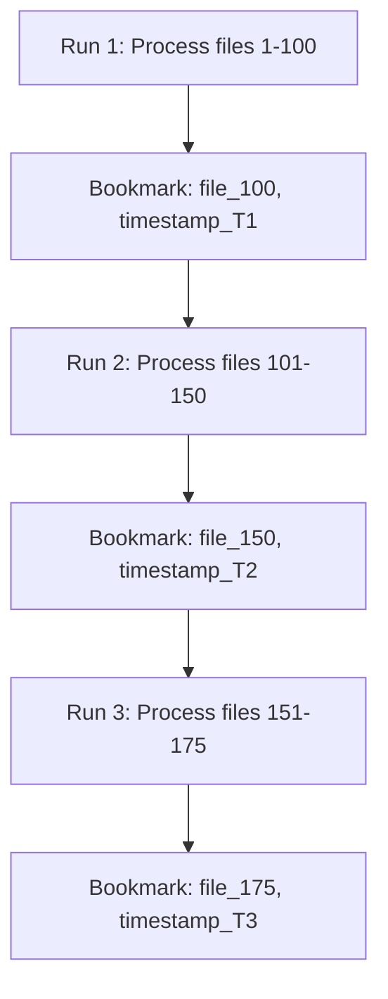

# How to Use Glue Job Bookmarks for Incremental Data Processing

Author: [nawazdhandala](https://github.com/nawazdhandala)

Tags: AWS, Glue, ETL, Job Bookmarks, Incremental Processing

Description: Learn how to use AWS Glue Job Bookmarks to process only new or changed data, avoiding expensive full reprocessing on every job run.

---

Imagine you have a daily ETL job that processes event data from S3. On day one, you process 1 million records. On day two, there are 1.1 million records. Do you reprocess all 1.1 million, or just the 100,000 new ones? Without bookmarks, Glue processes everything every time. With bookmarks, it picks up where it left off.

Glue Job Bookmarks track what data has already been processed and ensure your jobs only handle new or changed data on subsequent runs. This saves compute time, reduces costs, and prevents duplicate processing.

## How Job Bookmarks Work

When you enable bookmarks, Glue tracks the "high-water mark" of processed data:

**For S3 sources**: It tracks file timestamps and paths. On the next run, only files added since the last successful run are processed.

**For JDBC sources**: It tracks the maximum value of a specified column (like an auto-incrementing ID or timestamp). On the next run, only rows with values above the previous maximum are processed.



## Enabling Job Bookmarks

Enable bookmarks when creating or updating a job:

```python
# Create a job with bookmarks enabled
import boto3

glue = boto3.client('glue', region_name='us-east-1')

glue.create_job(
    Name='incremental-event-processor',
    Role='arn:aws:iam::YOUR_ACCOUNT_ID:role/GlueETLRole',
    Command={
        'Name': 'glueetl',
        'ScriptLocation': 's3://my-scripts/incremental_transform.py',
        'PythonVersion': '3'
    },
    DefaultArguments={
        '--job-bookmark-option': 'job-bookmark-enable',
        '--job-language': 'python',
        '--TempDir': 's3://my-glue-temp/temp/'
    },
    GlueVersion='4.0',
    WorkerType='G.1X',
    NumberOfWorkers=5
)
```

The `--job-bookmark-option` has three possible values:

| Option | Behavior |
|--------|----------|
| `job-bookmark-enable` | Track processed data, process only new data |
| `job-bookmark-disable` | Process everything on every run |
| `job-bookmark-pause` | Don't update the bookmark, but still use the current one |

The `pause` option is useful for testing. It lets you reprocess the same data repeatedly without advancing the bookmark.

## S3 Source with Bookmarks

Here's a complete ETL script that uses bookmarks with S3 data:

```python
# Glue ETL script with job bookmarks for incremental S3 processing
import sys
from awsglue.transforms import *
from awsglue.utils import getResolvedOptions
from awsglue.context import GlueContext
from awsglue.job import Job
from pyspark.context import SparkContext

args = getResolvedOptions(sys.argv, ['JOB_NAME'])

sc = SparkContext()
glueContext = GlueContext(sc)
spark = glueContext.spark_session
job = Job(glueContext)
job.init(args['JOB_NAME'], args)

# Read from S3 - bookmarks will automatically filter to only new files
source = glueContext.create_dynamic_frame.from_options(
    connection_type="s3",
    connection_options={
        "paths": ["s3://my-data-lake/raw/events/"],
        "recurse": True
    },
    format="json",
    transformation_ctx="source"  # This is required for bookmarks to work
)

record_count = source.count()
print(f"New records to process: {record_count}")

if record_count > 0:
    # Apply transformations
    from pyspark.sql.functions import col, lower, current_timestamp

    df = source.toDF()
    transformed = df \
        .withColumn("event_type", lower(col("event_type"))) \
        .withColumn("processed_at", current_timestamp())

    from awsglue.dynamicframe import DynamicFrame
    output = DynamicFrame.fromDF(transformed, glueContext, "output")

    # Write the new/changed data
    glueContext.write_dynamic_frame.from_options(
        frame=output,
        connection_type="s3",
        connection_options={
            "path": "s3://my-data-lake/processed/events/",
            "partitionKeys": ["year", "month", "day"]
        },
        format="parquet",
        transformation_ctx="output"  # Also needed for bookmark tracking on write
    )

    print(f"Wrote {record_count} records")
else:
    print("No new data to process")

# CRITICAL: job.commit() advances the bookmark
job.commit()
```

The `transformation_ctx` parameter is the key to making bookmarks work. It must be unique for each source and target in your job. Glue uses this context to track the bookmark state for each data node.

**If you forget `transformation_ctx`, bookmarks won't work and you'll reprocess everything every time.**

## JDBC Source with Bookmarks

For database sources, bookmarks track the maximum value of a specified column:

```python
# Read from a JDBC source with bookmark tracking
source = glueContext.create_dynamic_frame.from_catalog(
    database="production_db",
    table_name="orders",
    transformation_ctx="jdbc_source",
    additional_options={
        "jobBookmarkKeys": ["order_id"],  # Column to track
        "jobBookmarkKeysSortOrder": "asc"  # Ascending order
    }
)

print(f"New orders to process: {source.count()}")
```

The `jobBookmarkKeys` specifies which column to use as the bookmark. This should be a monotonically increasing column like an auto-increment ID or a timestamp. On each run, Glue remembers the maximum value and only reads rows with higher values next time.

You can use multiple bookmark keys for composite tracking:

```python
# Multiple bookmark keys for more precise tracking
source = glueContext.create_dynamic_frame.from_catalog(
    database="production_db",
    table_name="events",
    transformation_ctx="jdbc_events",
    additional_options={
        "jobBookmarkKeys": ["event_date", "event_id"],
        "jobBookmarkKeysSortOrder": "asc"
    }
)
```

## Data Catalog Source with Bookmarks

When reading from the Glue Data Catalog, bookmarks work the same way:

```python
# Read from Data Catalog with bookmarks
source = glueContext.create_dynamic_frame.from_catalog(
    database="raw_data",
    table_name="events",
    transformation_ctx="catalog_source",
    push_down_predicate="year='2025'"
)
```

The push-down predicate filters partitions before bookmarks are applied, which is more efficient.

## Bookmark Behavior Details

Understanding how bookmarks interact with your data is important:

### S3 Bookmark Tracking

For S3 sources, Glue tracks files based on:
- File modification timestamp
- File path

New files (newer timestamp or previously unseen path) are included in the next run. Modified files with an updated timestamp are also included. Deleted files don't cause reprocessing.

### Important: File Naming Matters

If you overwrite an existing file with the same name and path, the bookmark may or may not pick it up depending on whether the modification timestamp changed. To be safe, always write new data as new files rather than overwriting existing ones.

### Bookmark State Storage

Bookmark state is stored internally by Glue. You can view and manage it through the API:

```python
# Reset the bookmark to reprocess everything
glue.reset_job_bookmark(JobName='incremental-event-processor')
print("Bookmark reset - next run will process all data")
```

```python
# Get bookmark details
bookmark = glue.get_job_bookmark(JobName='incremental-event-processor')
print(f"Bookmark: {bookmark['JobBookmarkEntry']}")
```

## Handling Failures

What happens when a job fails midway through processing?

**With bookmarks enabled**: The bookmark only advances when `job.commit()` is called successfully. If the job fails before commit, the bookmark stays at its previous position and the next run reprocesses the same data. This gives you at-least-once processing semantics.

**Potential for duplicates**: If your job writes some data before failing, and then reruns and writes the same data again, you might get duplicates in your target. Handle this by:

1. Writing to a temporary location first, then moving on success
2. Using deduplication in downstream processing
3. Using idempotent writes (overwrite partition instead of append)

```python
# Pattern: Write to temp location, move on success
import boto3

temp_path = "s3://my-data-lake/temp/events/"
final_path = "s3://my-data-lake/processed/events/"

# Write to temp
glueContext.write_dynamic_frame.from_options(
    frame=output,
    connection_type="s3",
    connection_options={"path": temp_path},
    format="parquet",
    transformation_ctx="temp_output"
)

# If we get here, the write succeeded
# Move files from temp to final (using S3 copy + delete)
s3 = boto3.client('s3')
# ... copy and delete logic ...

job.commit()
```

## Monitoring Bookmark Progress

Track how much data each run processes:

```python
# Log bookmark metrics within your ETL job
import json
import boto3

cloudwatch = boto3.client('cloudwatch')

def publish_metrics(job_name, records_processed, run_duration):
    """Publish custom metrics for bookmark-enabled job runs."""
    cloudwatch.put_metric_data(
        Namespace='GlueETL/Custom',
        MetricData=[
            {
                'MetricName': 'RecordsProcessed',
                'Dimensions': [{'Name': 'JobName', 'Value': job_name}],
                'Value': records_processed,
                'Unit': 'Count'
            },
            {
                'MetricName': 'RunDuration',
                'Dimensions': [{'Name': 'JobName', 'Value': job_name}],
                'Value': run_duration,
                'Unit': 'Seconds'
            }
        ]
    )
```

## Bookmarks in Workflows

When using bookmarks within [Glue Workflows](https://oneuptime.com/blog/post/2026-02-12-schedule-glue-etl-jobs-with-workflows/view), each job in the workflow maintains its own bookmark independently. This means:

- Job A's bookmark tracks its own source
- Job B's bookmark tracks its own source
- They don't interfere with each other

This is exactly what you want for multi-stage pipelines. The first job picks up new raw data, transforms it, and writes to a staging area. The second job picks up new staging data (tracked by its own bookmark) and loads it to the final destination.

## Common Issues and Fixes

**Bookmark not working**: Check that `transformation_ctx` is set on both source and target operations. Without it, Glue can't track what was processed.

**Reprocessing old data**: The bookmark might have been reset accidentally. Check the bookmark state with `get_job_bookmark`.

**Not picking up new files**: Make sure new files have a modification timestamp newer than the last bookmark. Some file copy operations preserve the original timestamp.

**Processing too much data**: If you have many small files, consider consolidating them before the bookmark-enabled job runs. Bookmarks track individual files, and processing thousands of tiny files is inefficient.

## Best Practices

1. **Always use `transformation_ctx`** on every `create_dynamic_frame` and `write_dynamic_frame` call
2. **Always call `job.commit()`** at the end of successful runs
3. **Use monotonically increasing keys** for JDBC bookmarks
4. **Handle duplicates** in your target since at-least-once is the guarantee
5. **Monitor bookmark progress** with custom CloudWatch metrics
6. **Test with `job-bookmark-pause`** before going to production

For more on building efficient Glue jobs, check out our guide on [configuring Glue ETL jobs for performance](https://oneuptime.com/blog/post/2026-02-12-configure-glue-etl-jobs-for-performance/view).

## Wrapping Up

Job bookmarks turn your Glue ETL jobs from full-reprocess-every-time to efficient incremental processors. The setup is minimal - enable the bookmark option and add `transformation_ctx` parameters - but the impact on cost and performance is significant. A job that processed 10 million records in an hour now processes only the 100,000 new records in a few minutes.
