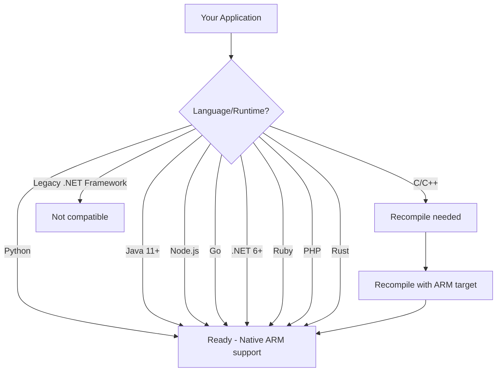

# How to Use Graviton Instances to Reduce Energy Consumption

Author: [nawazdhandala](https://github.com/nawazdhandala)

Tags: AWS, Graviton, ARM, Sustainability, Cost Optimization, EC2, Energy Efficiency

Description: A practical guide to migrating your AWS workloads to Graviton ARM-based instances for lower energy consumption, better performance, and reduced costs.

---

AWS Graviton processors are ARM-based chips designed by AWS from the ground up for cloud workloads. They deliver up to 40% better price-performance than comparable x86 instances, and they do it while consuming significantly less energy per unit of compute.

If you are looking for a single change that improves performance, reduces costs, and lowers your carbon footprint simultaneously, migrating to Graviton is it. This guide walks you through the migration process for common workload types.

## Why Graviton Uses Less Energy

ARM architecture inherently requires fewer transistors to execute instructions compared to x86. This translates directly to lower power consumption. AWS Graviton3 processors specifically deliver:

- Up to 60% less energy for the same performance compared to comparable EC2 instances
- Up to 40% better price-performance than x86-based instances
- Up to 25% better raw compute performance than Graviton2

The energy savings are not theoretical. They show up in your AWS Customer Carbon Footprint Tool data when you migrate workloads. For details on tracking your emissions, see our guide on [using the AWS Customer Carbon Footprint Tool](https://oneuptime.com/blog/post/2026-02-12-use-aws-customer-carbon-footprint-tool/view).

## Graviton Instance Families

Graviton instances are available across multiple instance families. The "g" in the instance name indicates Graviton:

| Instance Family | Use Case | x86 Equivalent |
|----------------|----------|----------------|
| m7g / m6g | General purpose | m7i / m6i |
| c7g / c6g | Compute optimized | c7i / c6i |
| r7g / r6g | Memory optimized | r7i / r6i |
| t4g | Burstable | t3 |
| im4gn | Storage optimized | i3en |
| x2gd | Memory intensive | x2idn |
| hpc7g | High performance compute | hpc7a |

There are also Graviton options for managed services:

- **Amazon RDS** - db.m6g, db.r6g, db.t4g instance classes
- **Amazon ElastiCache** - cache.m6g, cache.r6g
- **Amazon OpenSearch** - m6g, c6g, r6g
- **AWS Lambda** - ARM architecture option
- **Amazon EKS/ECS** - Run ARM containers on Graviton nodes

## Assessing Migration Readiness

Before migrating, you need to know which workloads can move and which need code changes.

### Check 1: Language and Runtime Compatibility

Most modern languages and runtimes support ARM natively:



If your application runs on Python, Java, Node.js, Go, .NET 6+, Ruby, or PHP, it almost certainly works on Graviton without any code changes.

### Check 2: Dependencies and Libraries

Some native libraries may not have ARM builds. Check your dependencies:

```bash
# For Python - check if all dependencies have ARM wheels
pip install --dry-run --platform manylinux2014_aarch64 \
  --only-binary=:all: -r requirements.txt

# For Node.js - check for native add-ons that need ARM builds
npm ls | grep -i "native\|binding\|gyp"

# For Java - check for JNI libraries
find . -name "*.so" -o -name "*.dll" | head -20
```

Common libraries that need attention:

- **OpenSSL** - Available on ARM, may need to be recompiled
- **NumPy/SciPy** - ARM-optimized builds available via conda or pip
- **TensorFlow** - ARM builds available since 2.4
- **PyTorch** - ARM support since 1.9

### Check 3: Container Base Images

If you use Docker, make sure your base images support ARM:

```dockerfile
# Multi-architecture Dockerfile that works on both x86 and ARM
# Use official images that support multi-arch
FROM --platform=$TARGETPLATFORM python:3.11-slim

WORKDIR /app
COPY requirements.txt .
RUN pip install --no-cache-dir -r requirements.txt
COPY . .

CMD ["python", "app.py"]
```

Build multi-architecture images:

```bash
# Build and push multi-arch Docker image supporting both amd64 and arm64
docker buildx create --use
docker buildx build \
  --platform linux/amd64,linux/arm64 \
  -t myregistry/myapp:latest \
  --push .
```

## Migration Strategy: Start Small

Do not migrate everything at once. Follow this progression:

### Phase 1: Non-Production Environments

Start with dev and staging environments. This gives you a safety net while you identify compatibility issues:

```bash
# Launch a Graviton instance for your staging environment
aws ec2 run-instances \
  --instance-type m7g.xlarge \
  --image-id resolve:ssm:/aws/service/ami-amazon-linux-latest/al2023-ami-kernel-default-arm64 \
  --key-name my-key \
  --subnet-id $SUBNET_ID \
  --security-group-ids $SG_ID \
  --tag-specifications 'ResourceType=instance,Tags=[{Key=Name,Value=staging-graviton},{Key=Environment,Value=staging}]'
```

Run your full test suite against the Graviton instance. Most compatibility issues surface here.

### Phase 2: Stateless Services

Web servers, API servers, and microservices are ideal candidates because you can easily roll back:

```yaml
# Auto Scaling Group with Graviton instances
# Gradually shift traffic using a mixed instances policy
Resources:
  GravitonASG:
    Type: AWS::AutoScaling::AutoScalingGroup
    Properties:
      MixedInstancesPolicy:
        InstancesDistribution:
          OnDemandPercentageAboveBaseCapacity: 100
        LaunchTemplate:
          LaunchTemplateSpecification:
            LaunchTemplateId: !Ref GravitonLaunchTemplate
            Version: !GetAtt GravitonLaunchTemplate.LatestVersionNumber
          Overrides:
            - InstanceType: m7g.xlarge  # Primary - Graviton
            - InstanceType: m7i.xlarge  # Fallback - x86
      MinSize: 2
      MaxSize: 10
      DesiredCapacity: 4
```

### Phase 3: Databases and Stateful Services

RDS makes this particularly easy with a simple instance class change:

```bash
# Modify an RDS instance to use Graviton
aws rds modify-db-instance \
  --db-instance-identifier my-production-db \
  --db-instance-class db.m6g.xlarge \
  --apply-immediately
```

This triggers a short downtime for the instance modification. Schedule it during a maintenance window.

### Phase 4: Containers and Kubernetes

If you run EKS, add a Graviton node group alongside your existing x86 nodes:

```bash
# Add a Graviton managed node group to your EKS cluster
aws eks create-nodegroup \
  --cluster-name my-cluster \
  --nodegroup-name graviton-workers \
  --instance-types m7g.xlarge m7g.2xlarge \
  --ami-type AL2_ARM_64 \
  --scaling-config minSize=2,maxSize=10,desiredSize=4 \
  --subnets $SUBNET_1 $SUBNET_2 \
  --node-role $NODE_ROLE_ARN
```

Use node affinity or taints to control which pods schedule on Graviton nodes:

```yaml
# Kubernetes pod spec with ARM node affinity
apiVersion: v1
kind: Pod
metadata:
  name: my-app
spec:
  affinity:
    nodeAffinity:
      requiredDuringSchedulingIgnoredDuringExecution:
        nodeSelectorTerms:
          - matchExpressions:
              - key: kubernetes.io/arch
                operator: In
                values:
                  - arm64
  containers:
    - name: my-app
      image: myregistry/myapp:latest
      resources:
        requests:
          cpu: "500m"
          memory: "512Mi"
```

### Phase 5: Lambda Functions

AWS Lambda supports ARM architecture with a simple configuration change:

```bash
# Update a Lambda function to run on ARM (Graviton2)
aws lambda update-function-configuration \
  --function-name my-function \
  --architectures arm64
```

Lambda on ARM is up to 34% cheaper and uses less energy. If your function does not use native compiled dependencies, this is a one-line change.

## Benchmarking: Prove the Gains

Always benchmark before and after migration. Here is a simple approach:

```bash
# Install benchmarking tools on both x86 and Graviton instances
sudo yum install -y stress-ng sysbench

# CPU benchmark - compare single-threaded and multi-threaded performance
sysbench cpu --cpu-max-prime=20000 --threads=1 run
sysbench cpu --cpu-max-prime=20000 --threads=$(nproc) run

# Memory benchmark
sysbench memory --memory-total-size=10G run

# For web applications, use wrk or hey from an external client
# Install hey for HTTP benchmarking
go install github.com/rakyll/hey@latest

# Benchmark your API endpoint
hey -n 10000 -c 100 https://staging-graviton.example.com/api/health
```

Track these metrics:

- Requests per second (throughput)
- P50/P95/P99 latency
- CPU utilization under load
- Memory usage patterns

In most cases, you will see equal or better performance on Graviton at a lower cost.

## Monitoring the Migration

Set up CloudWatch dashboards to compare x86 and Graviton performance side by side:

```python
# Create a CloudWatch dashboard comparing x86 vs Graviton metrics
import boto3
import json

cloudwatch = boto3.client('cloudwatch')

dashboard_body = {
    "widgets": [
        {
            "type": "metric",
            "properties": {
                "title": "CPU Utilization: x86 vs Graviton",
                "metrics": [
                    ["AWS/EC2", "CPUUtilization", "AutoScalingGroupName", "x86-asg"],
                    ["AWS/EC2", "CPUUtilization", "AutoScalingGroupName", "graviton-asg"]
                ],
                "period": 300,
                "stat": "Average"
            }
        },
        {
            "type": "metric",
            "properties": {
                "title": "Network Throughput Comparison",
                "metrics": [
                    ["AWS/EC2", "NetworkIn", "AutoScalingGroupName", "x86-asg"],
                    ["AWS/EC2", "NetworkIn", "AutoScalingGroupName", "graviton-asg"]
                ],
                "period": 300,
                "stat": "Sum"
            }
        }
    ]
}

cloudwatch.put_dashboard(
    DashboardName='GravitonMigration',
    DashboardBody=json.dumps(dashboard_body)
)
```

For comprehensive observability during and after migration, [OneUptime](https://oneuptime.com) can correlate application metrics, infrastructure performance, and custom sustainability KPIs in a single dashboard.

## Common Migration Issues and Fixes

**Issue: Python package fails to install**
Fix: Use `pip install` with `--prefer-binary` flag, or install build tools (`gcc`, `python3-devel`) for compiling from source.

**Issue: Docker image pulls wrong architecture**
Fix: Always specify `--platform linux/arm64` in your Dockerfile FROM line, or use multi-arch manifests.

**Issue: Java application slower than expected**
Fix: Use Amazon Corretto 17+ which includes ARM-specific JIT optimizations. Avoid older JDK versions.

**Issue: Terraform or CloudFormation AMI hardcoded**
Fix: Use SSM parameter references instead of hardcoded AMI IDs:

```hcl
# Terraform - use SSM parameter for architecture-appropriate AMI
data "aws_ssm_parameter" "graviton_ami" {
  name = "/aws/service/ami-amazon-linux-latest/al2023-ami-kernel-default-arm64"
}

resource "aws_instance" "graviton" {
  ami           = data.aws_ssm_parameter.graviton_ami.value
  instance_type = "m7g.xlarge"
}
```

## Calculating Your Energy Savings

Here is a rough way to estimate your energy savings from Graviton migration:

```python
# Estimate energy and cost savings from Graviton migration
current_instances = [
    {"type": "m6i.xlarge", "count": 10, "hourly_cost": 0.192},
    {"type": "c6i.2xlarge", "count": 5, "hourly_cost": 0.340},
    {"type": "r6i.xlarge", "count": 8, "hourly_cost": 0.252},
]

graviton_equivalents = {
    "m6i.xlarge": {"graviton": "m6g.xlarge", "hourly_cost": 0.154},
    "c6i.2xlarge": {"graviton": "c6g.2xlarge", "hourly_cost": 0.272},
    "r6i.xlarge": {"graviton": "r6g.xlarge", "hourly_cost": 0.201},
}

total_current_monthly = 0
total_graviton_monthly = 0

for inst in current_instances:
    current_monthly = inst["count"] * inst["hourly_cost"] * 730  # hours/month
    graviton_monthly = inst["count"] * graviton_equivalents[inst["type"]]["hourly_cost"] * 730
    savings = current_monthly - graviton_monthly

    total_current_monthly += current_monthly
    total_graviton_monthly += graviton_monthly

    print(f"{inst['type']} x{inst['count']}: "
          f"${current_monthly:.0f}/mo -> ${graviton_monthly:.0f}/mo "
          f"(save ${savings:.0f}/mo)")

print(f"\nTotal monthly savings: ${total_current_monthly - total_graviton_monthly:.0f}")
print(f"Annual savings: ${(total_current_monthly - total_graviton_monthly) * 12:.0f}")
print(f"Energy reduction: ~60% for equivalent workloads")
```

## Wrapping Up

Migrating to Graviton instances is one of the few optimizations that improves performance, reduces costs, and lowers your carbon footprint all at the same time. The ARM ecosystem has matured to the point where most workloads can migrate with minimal or zero code changes.

Start with your non-production environments, validate compatibility, benchmark performance, and progressively migrate production workloads. Use the phased approach outlined above to minimize risk. And track your progress using both cost metrics and the [AWS Customer Carbon Footprint Tool](https://oneuptime.com/blog/post/2026-02-12-use-aws-customer-carbon-footprint-tool/view) to quantify the impact.

The 20% cost reduction alone typically justifies the migration effort. The energy savings and sustainability benefits are a substantial bonus that makes the case even stronger.
