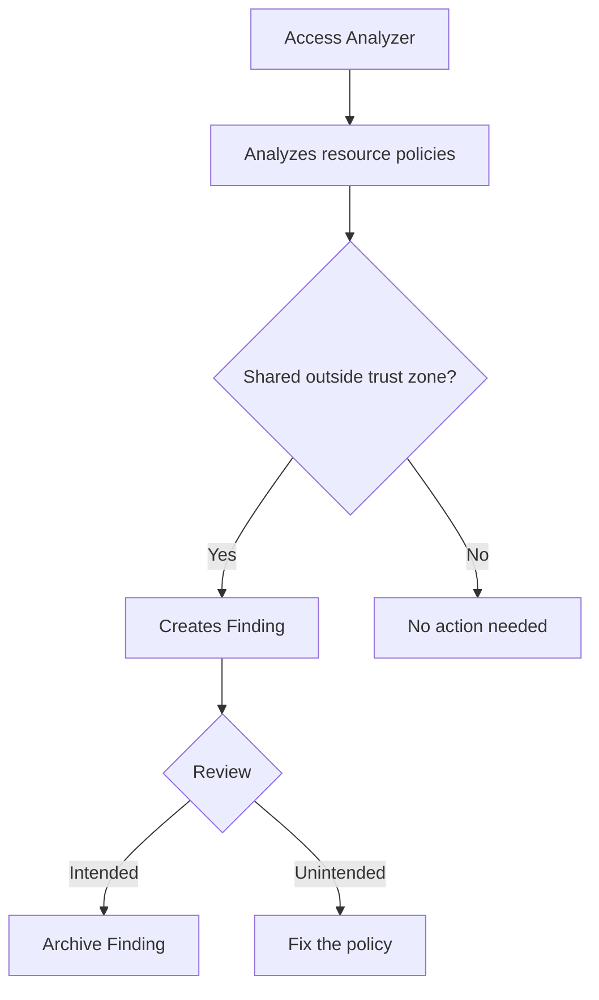

# How to Use IAM Access Analyzer to Find Unintended Access

Author: [nawazdhandala](https://github.com/nawazdhandala)

Tags: AWS, IAM, Security, Access Analyzer

Description: Learn how to use AWS IAM Access Analyzer to detect unintended resource sharing, validate policies, generate least-privilege policies, and maintain security across your AWS accounts.

---

It's surprisingly easy to accidentally share an AWS resource with the entire internet. An S3 bucket policy with a wildcard principal, a KMS key that allows cross-account access you forgot about, a Lambda function with a public resource-based policy - these misconfigurations happen all the time. IAM Access Analyzer continuously monitors your resources and alerts you when something is shared outside your account or organization.

Let's set it up, understand the findings, and use the policy generation features to tighten your permissions.

## What IAM Access Analyzer Does

Access Analyzer uses mathematical reasoning (automated formal verification) to analyze resource-based policies and identify access that goes beyond your trust zone. Your trust zone is either your AWS account or your AWS Organization, depending on how you configure it.

It monitors these resource types:
- S3 buckets and access points
- IAM roles (trust policies)
- KMS keys
- Lambda functions and layers
- SQS queues
- Secrets Manager secrets
- SNS topics
- EBS volume snapshots
- RDS DB snapshots
- ECR repositories

When it finds a resource shared outside the trust zone, it creates a "finding."



## Setting Up Access Analyzer

Create an analyzer for your account:

```bash
# Create an account-level analyzer
aws accessanalyzer create-analyzer \
  --analyzer-name my-account-analyzer \
  --type ACCOUNT \
  --tags Environment=production
```

If you're using AWS Organizations, create an organization-level analyzer in the management or delegated admin account:

```bash
# Create an organization-level analyzer
aws accessanalyzer create-analyzer \
  --analyzer-name my-org-analyzer \
  --type ORGANIZATION
```

The organization-level analyzer identifies access from outside your organization. Cross-account access within the organization won't generate findings - that's considered within the trust zone.

## Understanding Findings

Once the analyzer is running, it starts generating findings. List them:

```bash
# List all active findings
aws accessanalyzer list-findings \
  --analyzer-arn arn:aws:access-analyzer:us-east-1:123456789012:analyzer/my-account-analyzer \
  --filter '{"status": {"eq": ["ACTIVE"]}}'
```

Each finding tells you:

```json
{
    "id": "finding-123",
    "principal": {
        "AWS": "*"
    },
    "action": ["s3:GetObject"],
    "resource": "arn:aws:s3:::my-public-bucket",
    "isPublic": true,
    "resourceType": "AWS::S3::Bucket",
    "condition": {},
    "status": "ACTIVE",
    "analyzedAt": "2026-02-12T10:00:00Z"
}
```

This finding says: your S3 bucket `my-public-bucket` allows anyone (`*`) to `GetObject`. The `isPublic: true` flag is especially important - it means the resource is accessible from the public internet.

## Reviewing and Acting on Findings

For each finding, you have three options:

**Fix it** - Update the resource policy to remove the unintended access:

```bash
# If an S3 bucket is unintentionally public, fix the bucket policy
aws s3api put-bucket-policy \
  --bucket my-public-bucket \
  --policy '{
    "Version": "2012-10-17",
    "Statement": [{
      "Effect": "Allow",
      "Principal": {"AWS": "arn:aws:iam::123456789012:role/MyAppRole"},
      "Action": "s3:GetObject",
      "Resource": "arn:aws:s3:::my-public-bucket/*"
    }]
  }'
```

**Archive it** - If the access is intentional (like a public website bucket), archive the finding so it doesn't clutter your dashboard:

```bash
# Archive a finding that represents intentional access
aws accessanalyzer update-findings \
  --analyzer-arn arn:aws:access-analyzer:us-east-1:123456789012:analyzer/my-account-analyzer \
  --ids finding-123 \
  --status ARCHIVED
```

**Create an archive rule** - Automatically archive findings that match certain criteria:

```bash
# Auto-archive findings for S3 buckets in a specific account
aws accessanalyzer create-archive-rule \
  --analyzer-name my-account-analyzer \
  --rule-name ArchiveTrustedAccount \
  --filter '{
    "resourceType": {"eq": ["AWS::S3::Bucket"]},
    "principal.AWS": {"eq": ["123456789012"]}
  }'
```

## Policy Validation

Access Analyzer can validate IAM policies for errors and security warnings before you deploy them:

```bash
# Validate a policy document
aws accessanalyzer validate-policy \
  --policy-type IDENTITY_POLICY \
  --policy-document '{
    "Version": "2012-10-17",
    "Statement": [{
      "Effect": "Allow",
      "Action": "s3:*",
      "Resource": "*"
    }]
  }'
```

The response includes findings at different severity levels:

```json
{
    "findings": [
        {
            "findingType": "SECURITY_WARNING",
            "issueCode": "PASS_ROLE_WITH_STAR_IN_RESOURCE",
            "learnMoreLink": "https://docs.aws.amazon.com/...",
            "locations": [{"path": [{"value": "Statement"}, {"index": 0}]}],
            "findingDetails": "Using wildcards (*) in the action and resource can allow iam:PassRole permissions..."
        },
        {
            "findingType": "SUGGESTION",
            "issueCode": "SUGGEST_USING_SPECIFIC_RESOURCES",
            "findingDetails": "We recommend specifying resource ARNs instead of using wildcards..."
        }
    ]
}
```

You can integrate this into your CI/CD pipeline:

```bash
#!/bin/bash
# validate-policies.sh - check IAM policies before deployment

ERRORS=0

for policy_file in policies/*.json; do
  echo "Validating $policy_file..."

  result=$(aws accessanalyzer validate-policy \
    --policy-type IDENTITY_POLICY \
    --policy-document "file://$policy_file" \
    --query 'findings[?findingType==`ERROR` || findingType==`SECURITY_WARNING`]' \
    --output json)

  count=$(echo "$result" | jq length)

  if [ "$count" -gt 0 ]; then
    echo "FAIL: $policy_file has $count issues"
    echo "$result" | jq '.[].findingDetails'
    ERRORS=$((ERRORS + 1))
  else
    echo "PASS: $policy_file"
  fi
done

exit $ERRORS
```

## Policy Generation from CloudTrail

One of the most powerful features is generating least-privilege policies from actual usage data:

```bash
# Start policy generation for a specific role
JOB_ID=$(aws accessanalyzer start-policy-generation \
  --policy-generation-details '{
    "principalArn": "arn:aws:iam::123456789012:role/MyAppRole"
  }' \
  --cloud-trail-details '{
    "trails": [{
      "cloudTrailArn": "arn:aws:cloudtrail:us-east-1:123456789012:trail/management-trail",
      "regions": ["us-east-1"],
      "allRegions": false
    }],
    "accessRole": "arn:aws:iam::123456789012:role/AccessAnalyzerCloudTrailRole",
    "startTime": "2026-01-01T00:00:00Z",
    "endTime": "2026-02-01T00:00:00Z"
  }' \
  --query 'jobId' --output text)

echo "Policy generation job started: $JOB_ID"
```

Wait for it to complete, then get the generated policy:

```bash
# Check job status and retrieve the generated policy
aws accessanalyzer get-generated-policy --job-id $JOB_ID
```

The output includes a policy document that covers only the actions the role actually performed during the specified period. This is your blueprint for least-privilege access.

## Terraform Integration

```hcl
# Create IAM Access Analyzer with Terraform
resource "aws_accessanalyzer_analyzer" "account" {
  analyzer_name = "account-analyzer"
  type          = "ACCOUNT"

  tags = {
    Environment = "production"
  }
}

# Create an archive rule for trusted patterns
resource "aws_accessanalyzer_archive_rule" "trusted_account" {
  analyzer_name = aws_accessanalyzer_analyzer.account.analyzer_name
  rule_name     = "TrustedOrgAccounts"

  filter {
    criteria = "principal.AWS"
    eq       = ["arn:aws:iam::222222222222:root"]
  }

  filter {
    criteria = "resourceType"
    eq       = ["AWS::S3::Bucket"]
  }
}
```

## Setting Up Alerts

Configure EventBridge to alert you when new findings are created:

```json
{
    "source": ["aws.access-analyzer"],
    "detail-type": ["Access Analyzer Finding"],
    "detail": {
        "status": ["ACTIVE"],
        "isPublic": [true]
    }
}
```

Route this to SNS, Slack, or your incident management system:

```bash
# Create an EventBridge rule for public access findings
aws events put-rule \
  --name AccessAnalyzerPublicAccess \
  --event-pattern '{
    "source": ["aws.access-analyzer"],
    "detail-type": ["Access Analyzer Finding"],
    "detail": {"isPublic": [true]}
  }'

aws events put-targets \
  --rule AccessAnalyzerPublicAccess \
  --targets "Id=1,Arn=arn:aws:sns:us-east-1:123456789012:security-alerts"
```

For comprehensive alerting across your AWS environment, check our guide on [monitoring AWS infrastructure](https://oneuptime.com/blog/post/monitor-aws-infrastructure/view).

## Unused Access Findings

Access Analyzer can also identify unused IAM roles, access keys, and permissions:

```bash
# Create an analyzer for unused access (requires Organization)
aws accessanalyzer create-analyzer \
  --analyzer-name unused-access-analyzer \
  --type ACCOUNT_UNUSED_ACCESS \
  --configuration '{
    "unusedAccess": {
      "unusedAccessAge": 90
    }
  }'
```

This finds:
- IAM roles that haven't been used in 90 days
- Access keys that haven't been used
- Permissions that are granted but never exercised

This is gold for cleanup. Roles and credentials that haven't been used in months are attack surface you don't need.

## Multi-Region Setup

Access Analyzer is regional. For complete coverage, enable it in every region you use:

```bash
# Enable Access Analyzer in all active regions
for region in us-east-1 us-west-2 eu-west-1; do
  aws accessanalyzer create-analyzer \
    --analyzer-name account-analyzer \
    --type ACCOUNT \
    --region $region
done
```

## Wrapping Up

IAM Access Analyzer is your continuous security auditor. It catches resource sharing you didn't intend, validates policies before deployment, and generates least-privilege policies from actual usage. Set it up in every region, configure alerts for public access findings, and integrate policy validation into your CI/CD pipeline. Review findings regularly - archive what's intentional, fix what's not. Combined with regular credential reports and the strategies in our [least privilege access guide](https://oneuptime.com/blog/post/2026-02-12-implement-least-privilege-access-with-iam/view), you'll have a solid security posture for your AWS environment.
