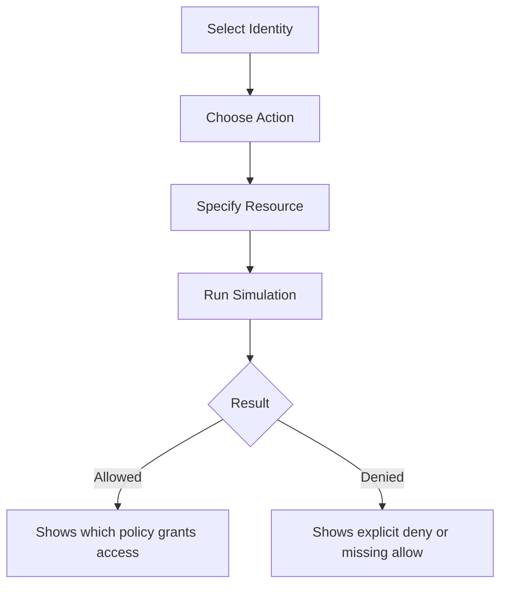

# How to Use IAM Policy Simulator to Test Permissions

Author: [nawazdhandala](https://github.com/nawazdhandala)

Tags: AWS, IAM, Security, Testing

Description: A practical guide to using the AWS IAM Policy Simulator for testing and debugging IAM permissions before deploying them to production.

---

You've written an IAM policy and you think it's correct. But how do you verify without actually running the action and potentially breaking something? The IAM Policy Simulator lets you test policies against specific actions and resources without making real API calls. It tells you whether a given action would be allowed or denied, and explains why.

It's one of the most underused tools in AWS, and it can save you hours of debugging "Access Denied" errors.

## What the Policy Simulator Does

The Policy Simulator evaluates IAM policies the same way the AWS authorization engine does. You specify a user, group, or role, choose an action, specify a resource, and the simulator tells you:

- Whether the action would be **allowed** or **denied**
- Which **specific policy statement** caused the decision
- Whether the result came from an **explicit deny**, **explicit allow**, or **implicit deny** (no matching allow)



## Accessing the Policy Simulator

There are two ways to use it:

**Console** - Go to https://policysim.aws.amazon.com or find it under IAM in the AWS console. The console version is interactive and great for exploration.

**CLI** - Use `aws iam simulate-principal-policy` or `aws iam simulate-custom-policy` for scripted testing.

## Testing an Existing User's Permissions

Let's say you want to check whether the user `jane.smith` can read objects from a specific S3 bucket.

In the console:
1. Select "jane.smith" from the Users list on the left
2. In the "Policy Simulator" section, choose "Amazon S3" as the service
3. Select "GetObject" as the action
4. Under "Simulation Settings," enter the resource ARN: `arn:aws:s3:::production-data/reports/q1.csv`
5. Click "Run Simulation"

The result will show "allowed" or "denied" along with the specific policy that caused the decision.

Using the CLI:

```bash
# Test whether jane.smith can read from a specific S3 bucket
aws iam simulate-principal-policy \
  --policy-source-arn arn:aws:iam::123456789012:user/jane.smith \
  --action-names s3:GetObject \
  --resource-arns arn:aws:s3:::production-data/reports/q1.csv
```

The response includes details about which policy matched:

```json
{
    "EvaluationResults": [
        {
            "EvalActionName": "s3:GetObject",
            "EvalResourceName": "arn:aws:s3:::production-data/reports/q1.csv",
            "EvalDecision": "allowed",
            "MatchedStatements": [
                {
                    "SourcePolicyId": "DeveloperAccess",
                    "SourcePolicyType": "IAM Policy"
                }
            ]
        }
    ]
}
```

## Testing a Custom Policy Before Creating It

You don't have to create a policy first to test it. The `simulate-custom-policy` command lets you test a policy document directly:

```bash
# Test a policy document without creating it in IAM
aws iam simulate-custom-policy \
  --policy-input-list '[
    {
      "Version": "2012-10-17",
      "Statement": [
        {
          "Effect": "Allow",
          "Action": ["s3:GetObject", "s3:PutObject"],
          "Resource": "arn:aws:s3:::my-app-data/*"
        }
      ]
    }
  ]' \
  --action-names s3:GetObject s3:DeleteObject \
  --resource-arns arn:aws:s3:::my-app-data/file.txt
```

This tells you that `s3:GetObject` would be allowed but `s3:DeleteObject` would be denied, because the policy only allows GetObject and PutObject.

## Bulk Testing Multiple Actions

You can test multiple actions in a single simulation run. This is useful for verifying a complete policy:

```bash
# Test multiple actions at once against a user's permissions
aws iam simulate-principal-policy \
  --policy-source-arn arn:aws:iam::123456789012:user/jane.smith \
  --action-names \
    s3:GetObject \
    s3:PutObject \
    s3:DeleteObject \
    s3:ListBucket \
    ec2:DescribeInstances \
    ec2:TerminateInstances \
    iam:CreateUser \
  --resource-arns \
    arn:aws:s3:::production-data/file.txt \
    arn:aws:s3:::production-data \
    arn:aws:ec2:us-east-1:123456789012:instance/* \
    arn:aws:iam::123456789012:user/*
```

The output shows the decision for each action-resource combination, making it easy to build a permission matrix.

## Testing with Context Keys

Policies with conditions depend on context keys like IP address, MFA status, or request time. The simulator lets you provide these values:

```bash
# Test a policy that requires MFA
aws iam simulate-principal-policy \
  --policy-source-arn arn:aws:iam::123456789012:user/jane.smith \
  --action-names s3:DeleteObject \
  --resource-arns arn:aws:s3:::production-data/file.txt \
  --context-entries \
    "ContextKeyName=aws:MultiFactorAuthPresent,ContextKeyType=boolean,ContextKeyValues=true"
```

Without the MFA context key set to true, the simulation might show "denied" for a policy that requires MFA. With it set to true, it shows "allowed." This lets you verify that your conditions work correctly.

You can also test IP-based conditions:

```bash
# Test a policy with IP restrictions
aws iam simulate-principal-policy \
  --policy-source-arn arn:aws:iam::123456789012:user/jane.smith \
  --action-names ec2:TerminateInstances \
  --resource-arns arn:aws:ec2:us-east-1:123456789012:instance/i-1234567890abcdef0 \
  --context-entries \
    "ContextKeyName=aws:SourceIp,ContextKeyType=ip,ContextKeyValues=203.0.113.25"
```

## Debugging Access Denied Errors

When a user reports "Access Denied," the Policy Simulator is your best friend. Here's a debugging workflow:

1. Get the exact action and resource from the CloudTrail event
2. Run the simulation for that user, action, and resource
3. Check the result

If the simulation says "allowed" but the real request fails, the problem might be:
- A **resource-based policy** (like an S3 bucket policy) that denies access
- A **service control policy** in AWS Organizations blocking the action
- A **permission boundary** restricting the user's effective permissions
- A **VPC endpoint policy** filtering the request

The console version of the simulator shows which policies were evaluated, making it easier to trace the decision chain.

## Scripting Policy Tests

For continuous validation, wrap the simulator in a test script:

```bash
#!/bin/bash
# test-developer-permissions.sh
# Verify that developers have the right permissions

USER_ARN="arn:aws:iam::123456789012:user/jane.smith"

# Actions that should be allowed
ALLOWED_ACTIONS=(
  "s3:GetObject"
  "s3:PutObject"
  "ec2:DescribeInstances"
  "cloudwatch:GetMetricData"
)

# Actions that should be denied
DENIED_ACTIONS=(
  "iam:CreateUser"
  "ec2:TerminateInstances"
  "s3:DeleteBucket"
)

echo "Testing allowed actions..."
for action in "${ALLOWED_ACTIONS[@]}"; do
  result=$(aws iam simulate-principal-policy \
    --policy-source-arn "$USER_ARN" \
    --action-names "$action" \
    --query 'EvaluationResults[0].EvalDecision' \
    --output text)

  if [ "$result" != "allowed" ]; then
    echo "FAIL: $action should be allowed but got $result"
  else
    echo "PASS: $action is allowed"
  fi
done

echo ""
echo "Testing denied actions..."
for action in "${DENIED_ACTIONS[@]}"; do
  result=$(aws iam simulate-principal-policy \
    --policy-source-arn "$USER_ARN" \
    --action-names "$action" \
    --query 'EvaluationResults[0].EvalDecision' \
    --output text)

  if [ "$result" = "allowed" ]; then
    echo "FAIL: $action should be denied but got $result"
  else
    echo "PASS: $action is denied"
  fi
done
```

Run this as part of your CI/CD pipeline whenever IAM policies change.

## Limitations

The Policy Simulator has some limitations to be aware of. It doesn't evaluate resource-based policies (S3 bucket policies, KMS key policies, etc.) - only identity-based policies. It also doesn't evaluate service control policies or VPC endpoint policies. And it can't simulate cross-account access scenarios accurately.

For comprehensive access testing, combine the Policy Simulator with IAM Access Analyzer. Our guide on [using IAM Access Analyzer to find unintended access](https://oneuptime.com/blog/post/use-iam-access-analyzer-to-find-unintended-access/view) covers the complementary approach.

## Wrapping Up

The IAM Policy Simulator removes the guesswork from permission management. Test policies before deploying them, debug access denied errors systematically, and automate permission validation in your CI/CD pipeline. It's not perfect - it can't evaluate every type of policy - but it catches the majority of issues and should be part of every AWS team's toolkit.
