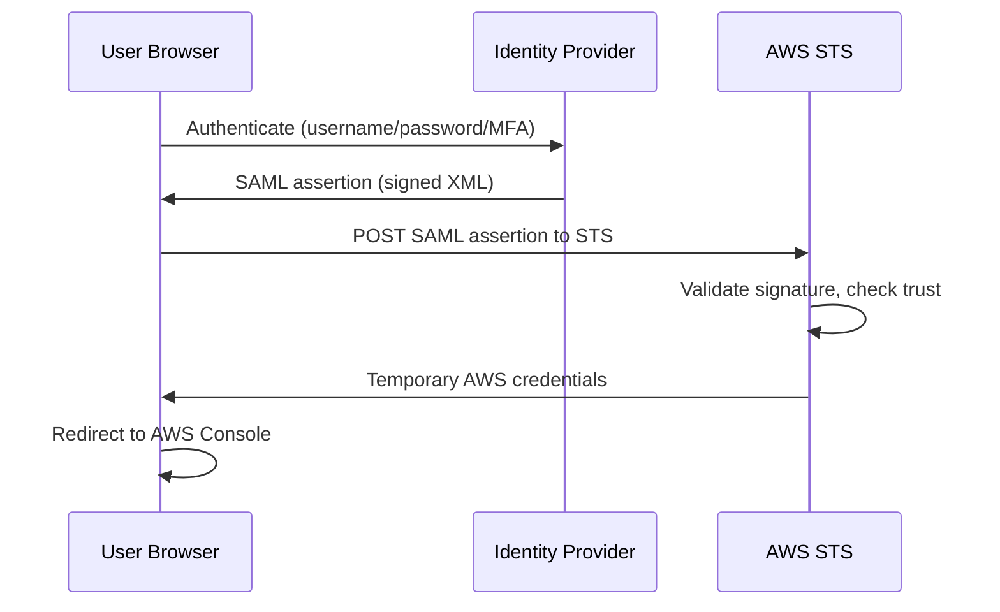

# How to Use IAM Roles with External Identity Providers (SAML)

Author: [nawazdhandala](https://github.com/nawazdhandala)

Tags: AWS, IAM, SAML, SSO, Security

Description: Learn how to configure SAML-based federation between your identity provider and AWS, enabling single sign-on access to the AWS console and CLI.

---

Managing IAM users for every employee doesn't scale, especially when your organization already has a central identity system like Active Directory, Okta, or Azure AD. SAML federation lets your existing identity provider (IdP) authenticate users and grant them access to AWS through IAM roles. Users sign in once with their corporate credentials and get access to AWS without a separate IAM user or password.

Let's walk through the complete setup, from configuring your IdP to writing the trust policies.

## How SAML Federation Works

The flow involves three parties: the user's browser, your identity provider, and AWS.



The SAML assertion is a signed XML document that says "I'm Okta (or AD FS, or Azure AD), and I've verified that this user is alice@company.com, and she should get the AdminRole." AWS validates the signature against the IdP's certificate and, if everything checks out, issues temporary credentials.

## Step 1: Create the SAML Identity Provider in AWS

First, you need your IdP's metadata XML file. Every IdP provides this - it's usually a URL you can download from. For Okta, it's in the SAML app settings. For Azure AD, it's in the Enterprise Application's SSO configuration.

Once you have the metadata file:

```bash
# Create the SAML identity provider in IAM
aws iam create-saml-provider \
  --saml-metadata-document file://idp-metadata.xml \
  --name CompanyIdP
```

This registers your IdP with AWS. The metadata contains the IdP's signing certificate, which AWS uses to verify SAML assertions.

## Step 2: Create IAM Roles for Federated Users

Create roles that federated users will assume. The trust policy references the SAML provider:

```json
{
    "Version": "2012-10-17",
    "Statement": [
        {
            "Effect": "Allow",
            "Principal": {
                "Federated": "arn:aws:iam::123456789012:saml-provider/CompanyIdP"
            },
            "Action": "sts:AssumeRoleWithSAML",
            "Condition": {
                "StringEquals": {
                    "SAML:aud": "https://signin.aws.amazon.com/saml"
                }
            }
        }
    ]
}
```

The condition checks that the SAML assertion's audience is the AWS sign-in endpoint. This prevents assertions meant for other services from being used with AWS.

Create the role:

```bash
# Create a role for SAML-federated admin access
aws iam create-role \
  --role-name SAML-AdminRole \
  --assume-role-policy-document file://saml-trust-policy.json \
  --max-session-duration 28800 \
  --description "Admin role for SAML-federated users"

# Attach permissions
aws iam attach-role-policy \
  --role-name SAML-AdminRole \
  --policy-arn arn:aws:iam::aws:policy/AdministratorAccess
```

You'll likely create multiple roles for different access levels:

```bash
# Create a read-only role for auditors
aws iam create-role \
  --role-name SAML-AuditorRole \
  --assume-role-policy-document file://saml-trust-policy.json \
  --description "Read-only role for federated auditors"

aws iam attach-role-policy \
  --role-name SAML-AuditorRole \
  --policy-arn arn:aws:iam::aws:policy/ReadOnlyAccess

# Create a developer role
aws iam create-role \
  --role-name SAML-DeveloperRole \
  --assume-role-policy-document file://saml-trust-policy.json \
  --description "Developer role for federated users"

aws iam attach-role-policy \
  --role-name SAML-DeveloperRole \
  --policy-arn arn:aws:iam::123456789012:policy/DeveloperAccess
```

## Step 3: Configure Your Identity Provider

In your IdP, create a SAML application for AWS. The key configuration values are:

**Assertion Consumer Service (ACS) URL:**
```
https://signin.aws.amazon.com/saml
```

**Audience URI (Entity ID):**
```
urn:amazon:webservices
```

**Attribute mappings** - These are critical. You need to send:

1. **Role attribute** - Tells AWS which role to assume:
   - Name: `https://aws.amazon.com/SAML/Attributes/Role`
   - Value: `arn:aws:iam::123456789012:role/SAML-AdminRole,arn:aws:iam::123456789012:saml-provider/CompanyIdP`

2. **RoleSessionName** - Identifies the user in CloudTrail:
   - Name: `https://aws.amazon.com/SAML/Attributes/RoleSessionName`
   - Value: `user.email` (or whatever attribute uniquely identifies the user)

3. **SessionDuration** (optional) - How long the session lasts:
   - Name: `https://aws.amazon.com/SAML/Attributes/SessionDuration`
   - Value: `28800` (8 hours, in seconds)

The Role attribute format is important - it's the role ARN and provider ARN separated by a comma, with no spaces.

## Mapping Groups to Roles

Most organizations want different groups to get different roles. In your IdP, configure group-to-role mappings:

- AD Group "AWS-Admins" maps to `arn:aws:iam::123456789012:role/SAML-AdminRole`
- AD Group "AWS-Developers" maps to `arn:aws:iam::123456789012:role/SAML-DeveloperRole`
- AD Group "AWS-Auditors" maps to `arn:aws:iam::123456789012:role/SAML-AuditorRole`

If a user belongs to multiple groups, the SAML assertion includes multiple Role values and the user chooses which role to use when signing in.

## SAML Federation for CLI Access

Console access works through the browser flow, but what about CLI access? You can use `aws sts assume-role-with-saml` if you have the SAML assertion, but that's cumbersome. Most teams use a helper tool.

For Okta, there's `gimme-aws-creds`. For Azure AD, there's `aws-azure-login`. These tools automate the SAML flow and configure temporary credentials in your AWS CLI profile.

Here's what the manual CLI flow looks like:

```bash
# Assume a role with a SAML assertion (usually done by a helper tool)
aws sts assume-role-with-saml \
  --role-arn arn:aws:iam::123456789012:role/SAML-DeveloperRole \
  --principal-arn arn:aws:iam::123456789012:saml-provider/CompanyIdP \
  --saml-assertion "$(cat saml-assertion.b64)" \
  --duration-seconds 3600
```

The SAML assertion is a base64-encoded XML document from your IdP.

## Terraform Setup

Here's the complete SAML federation setup in Terraform:

```hcl
# Create the SAML identity provider
resource "aws_iam_saml_provider" "company_idp" {
  name                   = "CompanyIdP"
  saml_metadata_document = file("idp-metadata.xml")
}

# Create the admin role for federated users
resource "aws_iam_role" "saml_admin" {
  name               = "SAML-AdminRole"
  max_session_duration = 28800

  assume_role_policy = jsonencode({
    Version = "2012-10-17"
    Statement = [
      {
        Effect = "Allow"
        Principal = {
          Federated = aws_iam_saml_provider.company_idp.arn
        }
        Action = "sts:AssumeRoleWithSAML"
        Condition = {
          StringEquals = {
            "SAML:aud" = "https://signin.aws.amazon.com/saml"
          }
        }
      }
    ]
  })
}

# Create the developer role
resource "aws_iam_role" "saml_developer" {
  name               = "SAML-DeveloperRole"
  max_session_duration = 28800

  assume_role_policy = jsonencode({
    Version = "2012-10-17"
    Statement = [
      {
        Effect = "Allow"
        Principal = {
          Federated = aws_iam_saml_provider.company_idp.arn
        }
        Action = "sts:AssumeRoleWithSAML"
        Condition = {
          StringEquals = {
            "SAML:aud" = "https://signin.aws.amazon.com/saml"
          }
        }
      }
    ]
  })
}

# Attach policies
resource "aws_iam_role_policy_attachment" "saml_admin_policy" {
  role       = aws_iam_role.saml_admin.name
  policy_arn = "arn:aws:iam::aws:policy/AdministratorAccess"
}

resource "aws_iam_role_policy_attachment" "saml_developer_policy" {
  role       = aws_iam_role.saml_developer.name
  policy_arn = aws_iam_policy.developer_access.arn
}
```

## Adding SAML Conditions

You can use SAML-specific condition keys for fine-grained control:

```json
{
    "Version": "2012-10-17",
    "Statement": [
        {
            "Effect": "Allow",
            "Principal": {
                "Federated": "arn:aws:iam::123456789012:saml-provider/CompanyIdP"
            },
            "Action": "sts:AssumeRoleWithSAML",
            "Condition": {
                "StringEquals": {
                    "SAML:aud": "https://signin.aws.amazon.com/saml"
                },
                "StringLike": {
                    "SAML:sub": "*@company.com"
                },
                "NumericLessThan": {
                    "SAML:authnContextClassRef": "2"
                }
            }
        }
    ]
}
```

The `SAML:sub` condition restricts access to users with company email addresses. This prevents the IdP from being misconfigured to allow external users.

## Updating the SAML Provider Certificate

IdP certificates expire. When your IdP rotates its certificate, you need to update AWS:

```bash
# Update the SAML provider with new metadata
aws iam update-saml-provider \
  --saml-provider-arn arn:aws:iam::123456789012:saml-provider/CompanyIdP \
  --saml-metadata-document file://new-idp-metadata.xml
```

Plan for this ahead of time. If the certificate expires and you haven't updated it, all federated access breaks.

## Wrapping Up

SAML federation eliminates the need for IAM users by letting your central identity provider handle authentication. Users get a single sign-on experience, you get centralized access management, and CloudTrail still records who did what (the RoleSessionName attribute identifies each user). Map your IdP groups to AWS roles, use conditions for extra security, and make sure you have a process for certificate rotation. For an alternative approach using web identity federation, see our guide on [setting up IAM roles for web identity federation](https://oneuptime.com/blog/post/2026-02-12-set-up-iam-roles-for-web-identity-federation/view).
