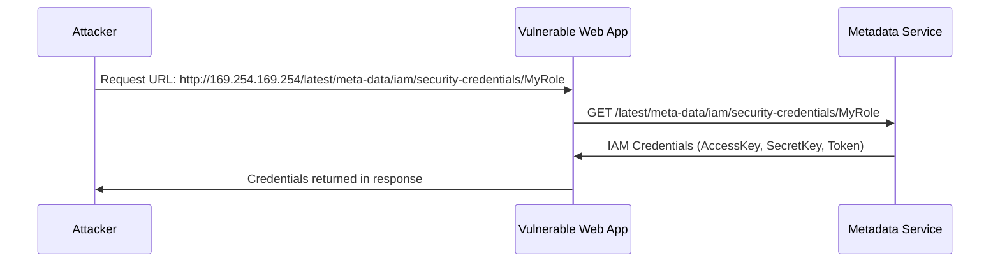

# How to Use IMDSv2 for Secure Instance Metadata Access

Author: [nawazdhandala](https://github.com/nawazdhandala)

Tags: AWS, EC2, IMDSv2, Security, Instance Metadata

Description: Learn how to enforce IMDSv2 for secure instance metadata access, preventing SSRF attacks and credential theft on your EC2 instances.

---

The Instance Metadata Service (IMDS) is incredibly useful, but the original version (IMDSv1) has a security weakness: any process on the instance can access it with a simple HTTP GET request. This makes it a prime target for Server-Side Request Forgery (SSRF) attacks, where an attacker tricks your application into making requests to the metadata endpoint and stealing IAM credentials.

IMDSv2 fixes this by requiring a session token for all metadata requests. This guide explains why IMDSv2 matters, how to enable and enforce it, and how to update your applications.

## The Problem with IMDSv1

With IMDSv1, accessing metadata is as simple as:

```bash
# IMDSv1 - simple GET request, no authentication
curl http://169.254.169.254/latest/meta-data/iam/security-credentials/MyRole
```

This simplicity is also its weakness. Consider a web application with an SSRF vulnerability:



The attacker gets temporary AWS credentials with whatever permissions the instance's IAM role has. This is one of the most common cloud security incidents and has led to major breaches.

## How IMDSv2 Prevents This

IMDSv2 requires a two-step process:

1. First, make a PUT request to get a session token
2. Then, include that token in all subsequent metadata requests

The key security improvement: the PUT request includes a custom header (`X-aws-ec2-metadata-token-ttl-seconds`) and returns a token. Most SSRF vulnerabilities only allow GET requests and can't set custom headers, which makes IMDSv2 resistant to these attacks.

```bash
# Step 1: Get a session token (PUT request with custom header)
TOKEN=$(curl -X PUT "http://169.254.169.254/latest/api/token" \
    -H "X-aws-ec2-metadata-token-ttl-seconds: 21600")

# Step 2: Use the token in metadata requests
curl -H "X-aws-ec2-metadata-token: $TOKEN" \
    http://169.254.169.254/latest/meta-data/instance-id
```

Additionally, IMDSv2 has a default hop limit of 1 for the PUT request, which means the token request can't be forwarded through network hops (preventing attacks from containers or instances behind a proxy).

## Enabling IMDSv2

### For New Instances

When launching a new instance, specify IMDSv2 as required:

```bash
# Launch an instance that requires IMDSv2
aws ec2 run-instances \
    --image-id ami-0123456789abcdef0 \
    --instance-type t3.micro \
    --metadata-options "HttpTokens=required,HttpPutResponseHopLimit=2,HttpEndpoint=enabled" \
    --key-name my-key
```

The key parameter is `HttpTokens=required`. This means only IMDSv2 requests (with a token) will work. IMDSv1 requests will be rejected.

Setting `HttpPutResponseHopLimit=2` is important if you're running containers (like Docker) on the instance. The default of 1 prevents containers from reaching the metadata service for the token request. Setting it to 2 allows one network hop, which is enough for containers.

### For Existing Instances

You can switch existing instances to IMDSv2 without stopping them:

```bash
# Enforce IMDSv2 on a running instance (no restart needed)
aws ec2 modify-instance-metadata-options \
    --instance-id i-0123456789abcdef0 \
    --http-tokens required \
    --http-put-response-hop-limit 2 \
    --http-endpoint enabled
```

### In Launch Templates

For Auto Scaling groups, set it in the launch template:

```bash
# Create a launch template that requires IMDSv2
aws ec2 create-launch-template \
    --launch-template-name secure-template \
    --launch-template-data '{
        "ImageId": "ami-0123456789abcdef0",
        "InstanceType": "t3.micro",
        "MetadataOptions": {
            "HttpTokens": "required",
            "HttpPutResponseHopLimit": 2,
            "HttpEndpoint": "enabled"
        }
    }'
```

For more on launch templates, see our guide on [using launch templates for EC2 instances](https://oneuptime.com/blog/post/use-launch-templates-for-ec2-instances/view).

## Setting Account-Level Defaults

You can set IMDSv2 as the default for all new instances in a region:

```bash
# Set IMDSv2 as the default for all new instances in this region
aws ec2 modify-instance-metadata-defaults \
    --http-tokens required \
    --http-put-response-hop-limit 2
```

This means any instance launched without explicit metadata options will default to IMDSv2-required. Existing instances aren't affected.

## Updating Your Code for IMDSv2

### Shell Scripts

Replace simple curl calls with the two-step token process:

```bash
#!/bin/bash
# Helper function for IMDSv2 metadata requests

# Get a token (valid for 6 hours)
IMDS_TOKEN=$(curl -s -X PUT "http://169.254.169.254/latest/api/token" \
    -H "X-aws-ec2-metadata-token-ttl-seconds: 21600")

# Function to fetch metadata using the token
get_metadata() {
    curl -s -H "X-aws-ec2-metadata-token: $IMDS_TOKEN" \
        "http://169.254.169.254/latest/meta-data/$1"
}

# Use it
INSTANCE_ID=$(get_metadata "instance-id")
REGION=$(get_metadata "placement/region")
PRIVATE_IP=$(get_metadata "local-ipv4")

echo "Instance: $INSTANCE_ID in $REGION at $PRIVATE_IP"
```

### Python

```python
import requests

class IMDSv2Client:
    """Client for accessing EC2 instance metadata using IMDSv2."""

    METADATA_URL = "http://169.254.169.254/latest"
    TOKEN_TTL = 21600  # 6 hours

    def __init__(self):
        self.token = self._get_token()

    def _get_token(self):
        """Get a session token for IMDSv2."""
        response = requests.put(
            f"{self.METADATA_URL}/api/token",
            headers={"X-aws-ec2-metadata-token-ttl-seconds": str(self.TOKEN_TTL)},
            timeout=2
        )
        response.raise_for_status()
        return response.text

    def get_metadata(self, path):
        """Fetch a metadata value using the session token."""
        response = requests.get(
            f"{self.METADATA_URL}/meta-data/{path}",
            headers={"X-aws-ec2-metadata-token": self.token},
            timeout=2
        )
        response.raise_for_status()
        return response.text

# Usage
imds = IMDSv2Client()
instance_id = imds.get_metadata("instance-id")
region = imds.get_metadata("placement/region")
print(f"Running on {instance_id} in {region}")
```

### AWS SDKs Handle It Automatically

If you're using the AWS SDK (boto3, aws-sdk-js, etc.), you don't need to change anything. The SDKs automatically use IMDSv2 when fetching credentials. They handle the token request transparently.

```python
import boto3

# boto3 automatically uses IMDSv2 for credential retrieval
# No code changes needed
s3 = boto3.client('s3')
buckets = s3.list_buckets()
```

## Checking IMDSv2 Status Across Your Fleet

Find all instances that still allow IMDSv1:

```bash
# List all instances and their metadata service configuration
aws ec2 describe-instances \
    --query 'Reservations[].Instances[].[InstanceId,MetadataOptions.HttpTokens,Tags[?Key==`Name`].Value | [0]]' \
    --output table
```

To find only instances that still allow IMDSv1:

```bash
# Find instances where IMDSv1 is still allowed
aws ec2 describe-instances \
    --filters "Name=metadata-options.http-tokens,Values=optional" \
    --query 'Reservations[].Instances[].[InstanceId,Tags[?Key==`Name`].Value | [0]]' \
    --output table
```

## Migration Strategy

Switching to IMDSv2 across your organization should be done carefully:

### Phase 1: Audit

Figure out what's currently using IMDSv1. AWS provides CloudWatch metrics for this:

```bash
# Check if any IMDSv1 calls are being made on an instance
# Look at the MetadataNoToken CloudWatch metric
aws cloudwatch get-metric-statistics \
    --namespace AWS/EC2 \
    --metric-name MetadataNoToken \
    --dimensions Name=InstanceId,Value=i-0123456789abcdef0 \
    --start-time 2026-02-05T00:00:00Z \
    --end-time 2026-02-12T00:00:00Z \
    --period 86400 \
    --statistics Sum
```

If `MetadataNoToken` is non-zero, something on that instance is still using IMDSv1.

### Phase 2: Update Applications

Update your scripts and applications to use IMDSv2. Test thoroughly in development.

### Phase 3: Set to Required

Once you've confirmed no IMDSv1 calls are being made, switch to `HttpTokens=required`:

```bash
#!/bin/bash
# Migrate all instances in a region to IMDSv2-required

INSTANCES=$(aws ec2 describe-instances \
    --filters "Name=metadata-options.http-tokens,Values=optional" \
    --query 'Reservations[].Instances[].InstanceId' \
    --output text)

for INSTANCE in $INSTANCES; do
    echo "Enforcing IMDSv2 on $INSTANCE..."
    aws ec2 modify-instance-metadata-options \
        --instance-id $INSTANCE \
        --http-tokens required \
        --http-put-response-hop-limit 2
done
```

### Phase 4: Prevent Regression

Set the account-level default and use AWS Config or Service Control Policies (SCPs) to prevent launching instances with IMDSv1:

```json
{
    "Version": "2012-10-17",
    "Statement": [
        {
            "Sid": "RequireIMDSv2",
            "Effect": "Deny",
            "Action": "ec2:RunInstances",
            "Resource": "arn:aws:ec2:*:*:instance/*",
            "Condition": {
                "StringNotEquals": {
                    "ec2:MetadataHttpTokens": "required"
                }
            }
        }
    ]
}
```

## Docker and Container Considerations

When running containers on EC2, there's a networking subtlety. The default hop limit of 1 means the token PUT request can't traverse the Docker bridge network. You have two options:

**Option 1: Increase the hop limit to 2**

```bash
aws ec2 modify-instance-metadata-options \
    --instance-id i-0123456789abcdef0 \
    --http-put-response-hop-limit 2
```

This allows containers to reach the metadata service. It's the simplest solution and works for most cases.

**Option 2: Block container access entirely**

If you don't want containers to access instance metadata at all (more secure), keep the hop limit at 1 and use other mechanisms for container credentials (like ECS task roles or EKS pod identity).

## Monitoring and Alerting

Set up monitoring to detect any IMDSv1 usage:

```bash
# Create a CloudWatch alarm for IMDSv1 usage
aws cloudwatch put-metric-alarm \
    --alarm-name "IMDSv1-Usage-Detected" \
    --metric-name MetadataNoToken \
    --namespace AWS/EC2 \
    --statistic Sum \
    --period 300 \
    --threshold 1 \
    --comparison-operator GreaterThanOrEqualToThreshold \
    --evaluation-periods 1 \
    --alarm-actions arn:aws:sns:us-east-1:123456789012:security-alerts
```

You can also set up [infrastructure monitoring with OneUptime](https://oneuptime.com) to track security configurations across your fleet and get alerted when instances drift from your security baseline.

## Summary

IMDSv2 is a straightforward security improvement that protects against real, frequently exploited attack vectors. The migration path is clear: audit your IMDSv1 usage, update your code, enforce IMDSv2, and prevent regression. If you haven't made the switch yet, make it a priority. It's one of the highest-impact security improvements you can make on your EC2 infrastructure.
