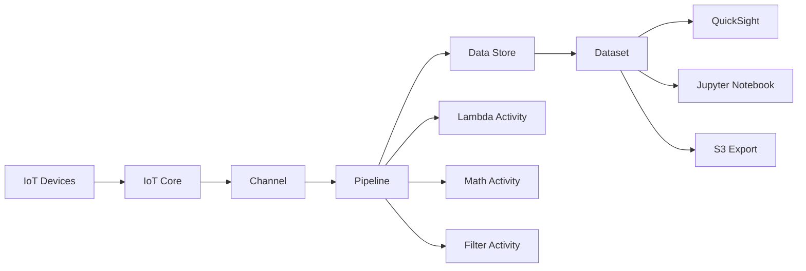

# How to Use IoT Analytics for IoT Data Processing

Author: [nawazdhandala](https://github.com/nawazdhandala)

Tags: AWS, IoT, IoT Analytics, Data Processing, Data Pipeline, Analytics

Description: A practical guide to using AWS IoT Analytics to build data pipelines that ingest, process, store, and analyze IoT device data at scale.

---

Raw IoT data is messy. Devices send data in different formats, at different intervals, sometimes with missing fields or duplicate messages. Before you can do anything useful with that data, you need to clean it, transform it, and store it somewhere queryable. AWS IoT Analytics handles all of that as a managed pipeline.

IoT Analytics gives you four main building blocks: channels for ingestion, pipelines for transformation, data stores for persistence, and datasets for querying. Together, they form a complete ETL pipeline designed specifically for IoT workloads.

## Architecture Overview

Here is how the pieces fit together:



## Step 1: Create a Channel

A channel is the entry point for your data. It receives messages either from IoT Core rules or directly via the `BatchPutMessage` API. The channel also retains raw data for a configurable period, which is handy if you need to reprocess data through an updated pipeline later.

```bash
# Create a channel that retains raw data for 30 days
aws iotanalytics create-channel \
  --channel-name "sensor_data_channel" \
  --channel-storage '{
    "serviceManagedS3": {}
  }' \
  --retention-period '{"numberOfDays": 30, "unlimited": false}'
```

Next, set up an IoT Core rule to route messages to this channel:

```bash
# Create an IoT Core rule that forwards all sensor data to the channel
aws iot create-topic-rule \
  --rule-name "RouteToAnalytics" \
  --topic-rule-payload '{
    "sql": "SELECT * FROM '\''sensors/+/data'\''",
    "actions": [
      {
        "iotAnalytics": {
          "channelName": "sensor_data_channel",
          "roleArn": "arn:aws:iam::123456789012:role/IoTAnalyticsRole"
        }
      }
    ]
  }'
```

## Step 2: Create a Data Store

The data store is where processed data lands. Think of it as your IoT data warehouse. You can use the service-managed storage or point it at your own S3 bucket with custom partitioning.

```bash
# Create a data store with custom S3 storage and Parquet format
aws iotanalytics create-datastore \
  --datastore-name "sensor_data_store" \
  --datastore-storage '{
    "customerManagedS3": {
      "bucket": "my-iot-data-lake",
      "keyPrefix": "processed/sensors/",
      "roleArn": "arn:aws:iam::123456789012:role/IoTAnalyticsS3Role"
    }
  }' \
  --file-format-configuration '{
    "parquetConfiguration": {}
  }' \
  --retention-period '{"numberOfDays": 365, "unlimited": false}'
```

Using Parquet format is a smart move for analytical workloads. It compresses well and supports columnar queries, which means tools like Athena and QuickSight can scan data much more efficiently.

## Step 3: Build a Pipeline

The pipeline connects your channel to your data store, with transformation activities in between. This is where you clean, enrich, and reshape your data.

IoT Analytics offers several built-in pipeline activities:

- **Filter** - Drop messages that do not match a condition
- **Math** - Compute derived values using mathematical expressions
- **Lambda** - Run custom transformation logic
- **AddAttributes** - Add static or computed attributes
- **RemoveAttributes** - Strip fields you do not need
- **SelectAttributes** - Keep only specified fields
- **DeviceRegistryEnrich** - Add device metadata from the IoT registry
- **DeviceShadowEnrich** - Add device shadow data

Here is a pipeline that filters out bad readings, converts temperature from Fahrenheit to Celsius, and enriches messages with device registry metadata:

```json
// pipeline-activities.json - defines the transformation chain
{
  "pipelineName": "sensor_processing_pipeline",
  "pipelineActivities": [
    {
      "channel": {
        "name": "ChannelInput",
        "channelName": "sensor_data_channel",
        "next": "FilterBadReadings"
      }
    },
    {
      "filter": {
        "name": "FilterBadReadings",
        "filter": "temperature > -50 AND temperature < 200",
        "next": "ConvertToCelsius"
      }
    },
    {
      "math": {
        "name": "ConvertToCelsius",
        "attribute": "temperature_celsius",
        "math": "(temperature - 32) * 5 / 9",
        "next": "EnrichWithRegistry"
      }
    },
    {
      "deviceRegistryEnrich": {
        "name": "EnrichWithRegistry",
        "attribute": "deviceInfo",
        "thingName": "deviceId",
        "roleArn": "arn:aws:iam::123456789012:role/IoTAnalyticsRegistryRole",
        "next": "StoreData"
      }
    },
    {
      "datastore": {
        "name": "StoreData",
        "datastoreName": "sensor_data_store"
      }
    }
  ]
}
```

```bash
# Create the pipeline from the definition
aws iotanalytics create-pipeline \
  --cli-input-json file://pipeline-activities.json
```

## Step 4: Using Lambda Activities for Custom Logic

When the built-in activities are not enough, Lambda activities let you run arbitrary code. This is useful for things like geocoding, anomaly scoring, or calling external APIs to enrich your data.

```python
# lambda_function.py - Custom pipeline activity that adds anomaly scores
import json

def lambda_handler(event, context):
    """Process a batch of IoT messages and add anomaly scores."""
    processed = []

    for message in event:
        payload = message['payload']

        # Simple anomaly scoring based on standard deviation
        temp = payload.get('temperature_celsius', 0)
        humidity = payload.get('humidity', 50)

        # Flag readings that are unusual
        anomaly_score = 0
        if temp > 40 or temp < -10:
            anomaly_score += 1
        if humidity < 20 or humidity > 90:
            anomaly_score += 1

        payload['anomaly_score'] = anomaly_score
        payload['needs_review'] = anomaly_score > 0

        processed.append(message)

    return processed
```

The Lambda function receives a batch of messages and must return the modified batch. Messages you omit from the return value are dropped from the pipeline.

## Step 5: Create Datasets for Analysis

Datasets in IoT Analytics are like saved queries. You define a SQL query against your data store, and IoT Analytics runs it on a schedule or on demand to produce a result set you can use in other tools.

```bash
# Create a dataset that computes hourly averages per device
aws iotanalytics create-dataset \
  --dataset-name "hourly_sensor_averages" \
  --actions '[
    {
      "actionName": "SqlQuery",
      "queryAction": {
        "sqlQuery": "SELECT deviceId, date_trunc('\''hour'\'', __dt) as hour, AVG(temperature_celsius) as avg_temp, AVG(humidity) as avg_humidity, COUNT(*) as reading_count FROM sensor_data_store WHERE __dt >= current_timestamp - interval '\''24'\'' hour GROUP BY deviceId, date_trunc('\''hour'\'', __dt) ORDER BY hour DESC"
      }
    }
  ]' \
  --triggers '[
    {
      "schedule": {
        "expression": "cron(0 * * * ? *)"
      }
    }
  ]'
```

This dataset runs every hour and produces a summary table of average temperature and humidity per device. You can then visualize this in QuickSight or download it for analysis. For a walkthrough on building visualizations, check out our guide on [building an IoT dashboard with QuickSight](https://oneuptime.com/blog/post/build-an-iot-dashboard-with-quicksight/view).

## Step 6: Exploring Data with Jupyter Notebooks

IoT Analytics has built-in Jupyter notebook support. You can create notebook instances that come pre-loaded with your datasets and the AWS IoT Analytics SDK.

```bash
# Create a notebook instance for interactive analysis
aws iotanalytics create-dataset-content \
  --dataset-name "hourly_sensor_averages"

# List available dataset content to use in notebooks
aws iotanalytics list-dataset-contents \
  --dataset-name "hourly_sensor_averages"
```

Inside the notebook, you can load your dataset content directly:

```python
# Jupyter notebook cell - load and analyze IoT dataset
import boto3
import pandas as pd

client = boto3.client('iotanalytics')

# Get the latest dataset content URL
response = client.get_dataset_content(datasetName='hourly_sensor_averages')
url = response['entries'][0]['dataURI']

# Load into pandas for analysis
df = pd.read_csv(url)
print(f"Total records: {len(df)}")
print(df.describe())

# Find devices with highest average temperatures
hot_devices = df.groupby('deviceId')['avg_temp'].mean().nlargest(10)
print("Top 10 hottest devices:")
print(hot_devices)
```

## Reprocessing Historical Data

One of the underrated features of IoT Analytics is reprocessing. If you update your pipeline logic, you can reprocess data that has already been through the channel. Since the channel retains raw data for the configured retention period, you do not lose anything.

```bash
# Reprocess all data from the last 7 days through the updated pipeline
aws iotanalytics start-pipeline-reprocessing \
  --pipeline-name "sensor_processing_pipeline" \
  --start-time "2026-02-05T00:00:00Z" \
  --end-time "2026-02-12T00:00:00Z"
```

## Cost Optimization Tips

IoT Analytics pricing is based on messages processed, pipeline activity executions, data stored, and queries run. Here are some ways to keep costs in check:

- Use filter activities early in the pipeline to drop irrelevant data before it reaches expensive activities
- Set appropriate retention periods on both channels and data stores
- Use Parquet format for data stores to reduce storage and query costs
- Schedule datasets to run only as frequently as you actually need the results
- Consider batching messages from devices to reduce per-message overhead

## Wrapping Up

AWS IoT Analytics removes a lot of the undifferentiated heavy lifting in IoT data processing. Instead of stitching together Kinesis, Lambda, S3, and Glue yourself, you get a purpose-built pipeline that understands IoT data patterns. The channel-pipeline-datastore-dataset model maps cleanly to how IoT data actually flows, and the built-in activities handle the most common transformations without any code.

Start with a simple pipeline that just passes data through to a data store, then gradually add activities as you understand what transformations your data needs.
