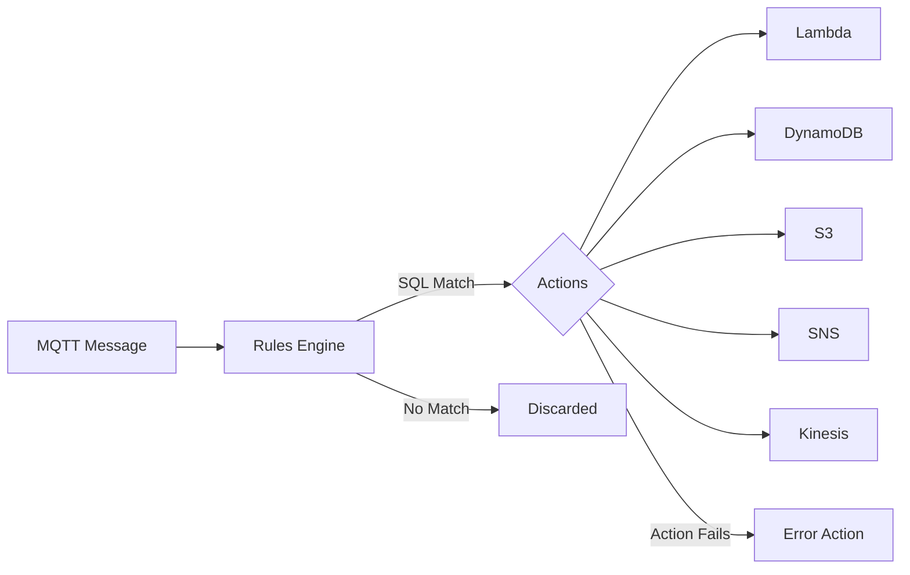

# How to Use IoT Core Rules Engine

Author: [nawazdhandala](https://github.com/nawazdhandala)

Tags: AWS, IoT Core, Rules Engine, Data Processing

Description: Learn how to use AWS IoT Core Rules Engine to route, transform, and act on device data using SQL-based rules with actions for Lambda, DynamoDB, S3, and more.

---

Every IoT device generates data. Temperature readings, status updates, error reports, location pings. The question isn't how to collect this data - MQTT handles that nicely - but what to do with it once it arrives. That's where the IoT Core Rules Engine comes in.

The Rules Engine lets you write SQL-like queries against your MQTT messages and route matching data to over 20 AWS services. Store sensor readings in DynamoDB, trigger a Lambda function when a device reports an error, push alerts to SNS, archive raw data to S3 - all without writing any backend code to poll the message broker.

## How Rules Work

A rule has three components:

1. **SQL statement**: Filters and transforms incoming MQTT messages
2. **Actions**: What to do with messages that match the SQL query
3. **Error action**: What to do when an action fails



## Creating Your First Rule

Let's start with a simple rule that stores temperature readings in DynamoDB.

```bash
# Create a DynamoDB table for sensor data
aws dynamodb create-table \
    --table-name SensorReadings \
    --attribute-definitions \
        AttributeName=device_id,AttributeType=S \
        AttributeName=timestamp,AttributeType=N \
    --key-schema \
        AttributeName=device_id,KeyType=HASH \
        AttributeName=timestamp,KeyType=RANGE \
    --billing-mode PAY_PER_REQUEST
```

Now create the IoT rule.

```json
{
    "sql": "SELECT device_id, temperature, humidity, timestamp() as timestamp FROM 'sensors/+/data'",
    "actions": [
        {
            "dynamoDBv2": {
                "roleArn": "arn:aws:iam::123456789:role/IoTRulesDynamoDBRole",
                "putItem": {
                    "tableName": "SensorReadings"
                }
            }
        }
    ],
    "errorAction": {
        "cloudwatchLogs": {
            "roleArn": "arn:aws:iam::123456789:role/IoTRulesCloudWatchRole",
            "logGroupName": "/aws/iot/rules/errors"
        }
    },
    "ruleDisabled": false,
    "awsIotSqlVersion": "2016-03-23"
}
```

```bash
# Create the rule
aws iot create-topic-rule \
    --rule-name StoreSensorData \
    --topic-rule-payload file://store-sensor-rule.json
```

## The SQL Query Language

IoT Core SQL is surprisingly powerful. It supports filtering, transformation, functions, and even nested selects.

### Basic Filtering

```sql
-- Only process readings above 30 degrees
SELECT * FROM 'sensors/+/data' WHERE temperature > 30

-- Filter by device attributes
SELECT * FROM 'sensors/+/data' WHERE device_id LIKE 'warehouse%'

-- Multiple conditions
SELECT * FROM 'sensors/+/data'
WHERE temperature > 30 AND humidity > 80
```

### Data Transformation

```sql
-- Convert Celsius to Fahrenheit and add metadata
SELECT
    device_id,
    temperature * 9/5 + 32 AS temperature_f,
    temperature AS temperature_c,
    humidity,
    timestamp() AS processed_at,
    topic(2) AS source_device
FROM 'sensors/+/data'
```

### Built-in Functions

The SQL dialect includes many useful functions.

```sql
-- Use built-in functions for data processing
SELECT
    device_id,
    round(temperature, 1) AS temperature,
    abs(altitude) AS altitude,
    lower(status) AS status,
    timestamp() AS event_time,
    topic() AS full_topic,
    topic(2) AS device_name,
    clientid() AS mqtt_client,
    newuuid() AS record_id
FROM 'sensors/+/data'
```

### Working with Nested JSON

If your devices send nested JSON, you can extract and flatten it.

```sql
-- Device sends: {"readings": {"temp": 22.5, "hum": 45}, "meta": {"battery": 85}}
SELECT
    readings.temp AS temperature,
    readings.hum AS humidity,
    meta.battery AS battery_level,
    timestamp() AS timestamp
FROM 'sensors/+/data'
WHERE readings.temp IS NOT NULL
```

## Common Rule Actions

### Lambda Function

Trigger a Lambda function for custom processing.

```json
{
    "sql": "SELECT * FROM 'devices/+/errors' WHERE severity = 'critical'",
    "actions": [
        {
            "lambda": {
                "functionArn": "arn:aws:lambda:us-east-1:123456789:function:ProcessDeviceError"
            }
        }
    ]
}
```

The Lambda function receives the matched message as its event.

```python
# lambda_function.py - Process critical device errors
import json
import boto3

sns = boto3.client('sns')

def lambda_handler(event, context):
    device_id = event.get('device_id')
    error_code = event.get('error_code')
    message = event.get('message')

    # Send alert
    sns.publish(
        TopicArn='arn:aws:sns:us-east-1:123456789:DeviceAlerts',
        Subject=f'Critical Error: {device_id}',
        Message=f'Device {device_id} reported error {error_code}: {message}'
    )

    # Log the error for investigation
    print(f"Critical error from {device_id}: {error_code} - {message}")

    return {'statusCode': 200}
```

### S3 for Data Archival

Archive raw messages to S3 for long-term storage and analytics.

```json
{
    "sql": "SELECT * FROM 'sensors/#'",
    "actions": [
        {
            "s3": {
                "roleArn": "arn:aws:iam::123456789:role/IoTRulesS3Role",
                "bucketName": "iot-sensor-archive",
                "key": "${topic()}/${timestamp()}.json",
                "cannedAcl": "private"
            }
        }
    ]
}
```

### SNS for Notifications

Send alerts when specific conditions are met.

```json
{
    "sql": "SELECT device_id, temperature, 'Temperature alert' as alert_type FROM 'sensors/+/data' WHERE temperature > 40",
    "actions": [
        {
            "sns": {
                "roleArn": "arn:aws:iam::123456789:role/IoTRulesSNSRole",
                "targetArn": "arn:aws:sns:us-east-1:123456789:TemperatureAlerts",
                "messageFormat": "JSON"
            }
        }
    ]
}
```

### Kinesis for Stream Processing

Route high-volume data to Kinesis for real-time analytics.

```json
{
    "sql": "SELECT * FROM 'sensors/+/data'",
    "actions": [
        {
            "kinesis": {
                "roleArn": "arn:aws:iam::123456789:role/IoTRulesKinesisRole",
                "streamName": "sensor-data-stream",
                "partitionKey": "${device_id}"
            }
        }
    ]
}
```

### Republish to Another Topic

Route messages between topics for fan-out or routing patterns.

```json
{
    "sql": "SELECT *, topic(2) as source FROM 'sensors/+/data' WHERE temperature > 35",
    "actions": [
        {
            "republish": {
                "roleArn": "arn:aws:iam::123456789:role/IoTRulesRepublishRole",
                "topic": "alerts/high-temperature",
                "qos": 1
            }
        }
    ]
}
```

## Multiple Actions per Rule

A single rule can trigger multiple actions. The message is sent to all actions in parallel.

```json
{
    "sql": "SELECT * FROM 'sensors/+/data'",
    "actions": [
        {
            "dynamoDBv2": {
                "roleArn": "arn:aws:iam::123456789:role/IoTRulesRole",
                "putItem": {
                    "tableName": "SensorReadings"
                }
            }
        },
        {
            "s3": {
                "roleArn": "arn:aws:iam::123456789:role/IoTRulesRole",
                "bucketName": "iot-sensor-archive",
                "key": "${topic()}/${timestamp()}.json"
            }
        },
        {
            "cloudwatchMetric": {
                "roleArn": "arn:aws:iam::123456789:role/IoTRulesRole",
                "metricNamespace": "IoT/Sensors",
                "metricName": "Temperature",
                "metricValue": "${temperature}",
                "metricUnit": "None",
                "metricTimestamp": "${timestamp()}"
            }
        }
    ]
}
```

## IAM Roles for Rules

Each rule action needs an IAM role with appropriate permissions. Here's a policy for the DynamoDB action.

```json
{
    "Version": "2012-10-17",
    "Statement": [
        {
            "Effect": "Allow",
            "Action": [
                "dynamodb:PutItem"
            ],
            "Resource": "arn:aws:dynamodb:us-east-1:123456789:table/SensorReadings"
        }
    ]
}
```

The role's trust policy must allow IoT Core to assume it.

```json
{
    "Version": "2012-10-17",
    "Statement": [
        {
            "Effect": "Allow",
            "Principal": {
                "Service": "iot.amazonaws.com"
            },
            "Action": "sts:AssumeRole"
        }
    ]
}
```

## Error Handling

Always configure an error action. Without it, you'll silently lose data when a rule action fails.

```json
{
    "errorAction": {
        "s3": {
            "roleArn": "arn:aws:iam::123456789:role/IoTRulesRole",
            "bucketName": "iot-error-logs",
            "key": "rule-errors/${timestamp()}-${newuuid()}.json"
        }
    }
}
```

## Testing Rules

Test your SQL queries before deploying them.

```bash
# Test a rule SQL query with a sample payload
aws iot test-invoke-authorizer # for auth testing

# Use the MQTT test client in the console to publish test messages
# and verify your rules trigger correctly
```

## Wrapping Up

The Rules Engine is the glue between your IoT devices and the rest of your AWS infrastructure. SQL-based filtering keeps things simple for straightforward routing, while built-in functions handle data transformation. The ability to trigger multiple actions from a single rule means you can store, alert, and process data simultaneously without writing any glue code.

Start with a simple rule that stores data in DynamoDB, then add more actions as your needs grow. For more on managing device state that rules can react to, see our guide on [IoT Core Thing Shadows](https://oneuptime.com/blog/post/create-iot-core-thing-shadows/view).
